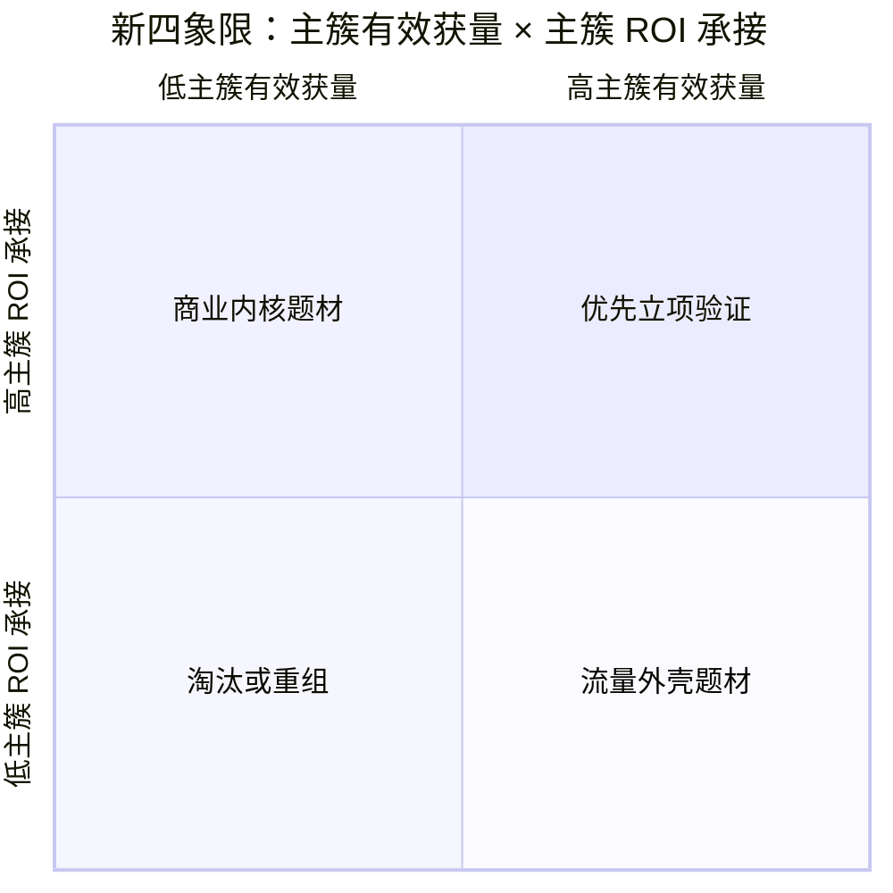

# 新四象限：主簇有效获量 × 主簇 ROI 承接

日期：2026-05-12  
状态：方法论草稿  
适用范围：买量题材选择、题材表达改写、素材小测前评审

> 来源边界：用户指定的飞书文档 `https://forever9.feishu.cn/wiki/ETRXwaFmDiCTBOkgRpocQ9uYnRb` 当前在本地 CLI 中无读取权限。本文基于本地已沉淀的 `题材评估标准.md`、`平台策略变化_应用包资产x素材_2026Q2.md`、`人群簇库/_draft/标准_v0.3_草稿.md` 生成；待飞书原文可读后需复核一次。

## 一句话定义

旧四象限评估的是：

```text
题材 → 有效获量 × ROI 承接
```

新四象限评估的是：

```text
主簇 × 题材表达 × 玩法承接 × 当前买量市场
→ 主簇有效获量 × 主簇 ROI 承接
```

它判断的不是“这个题材好不好”，而是：

```text
这个方案能不能买到对的人，并把对的人赚回来。
```

---

## 新四象限图



| 象限 | 含义 | 典型情况 | 策略 |
|---|---|---|---|
| 高主簇获量 + 高主簇 ROI | 买得到对的人，也赚得回来 | 主簇明确、素材筛人准、玩法兑现强 | 优先进入小测/立项预演 |
| 高主簇获量 + 低主簇 ROI | 素材能吸人，但产品接不住 | 高 CTR、低留存、低付费，容易变成“骗点素材” | 改玩法承接，或降级为 IAA/轻产品 |
| 低主簇获量 + 高主簇 ROI | 产品内核能赚，但当前外壳买不进人 | 仙侠、三国、SLG 等高 LTV 内核但素材红海 | 换题材表达、换素材切口、换主簇入口 |
| 低主簇获量 + 低主簇 ROI | 买不进对的人，也赚不回来 | 主簇模糊、题材表达弱、玩法不承接 | 淘汰，或回到母题/玩法重组 |

---

## 横轴：主簇有效获量能力

横轴不再问“题材热不热”，而是问：

```text
能否以可承接成本，买到目标主簇用户？
```

公式：

```text
主簇有效获量 =
主簇剩余可触达规模
× 素材筛人能力
× 题材表达差异
× 参竞单元覆盖度
÷ 竞争密度
÷ 素材疲劳
÷ CPI 压力
```

### 横轴评分项

| 维度 | 低分信号 | 高分信号 |
|---|---|---|
| 主簇剩余可触达规模 | 只有题材热度，没有明确主簇；主簇已被头部竞品反复收割 | 主簇清晰，且仍有可触达空间 |
| 素材筛人能力 | 只吸点击，无法筛出留存/付费人群 | 素材承诺能提前筛出目标主簇 |
| 题材表达差异 | 同题材、同桥段、同首帧大量重复 | 一眼能看出新表达，但目标主簇仍能理解 |
| 参竞单元覆盖度 | 只能跑单一载体、单一转化目标、单一素材钩子 | 可覆盖 ≥2 个载体 × IAP/IAA 组合，且有差异化素材产能 |
| 竞争/CPI 压力 | 同主簇、同题材表达、同素材方向高度拥挤 | 有低成本切口，或能避开最贵人群 |

---

## 纵轴：主簇 ROI 承接能力

纵轴不再问“题材商业化强不强”，而是问：

```text
产品能否兑现主簇的心理任务，并把它转成留存和付费？
```

公式：

```text
主簇 ROI 承接 =
心理任务兑现度
× 玩法承接匹配度
× 付费动机自然度
× 留存深度
× 内容/系统扩展效率
÷ 制作成本
÷ 回本压力
```

### 纵轴评分项

| 维度 | 低分信号 | 高分信号 |
|---|---|---|
| 心理任务兑现度 | 素材承诺的是 A，进游戏满足的是 B | 点击、留存、付费围绕同一主簇任务 |
| 玩法承接匹配度 | 题材只做皮，玩法无法兑现承诺 | 玩法天然服务主簇任务 |
| 付费动机自然度 | 付费点硬塞，破坏题材/心理任务承诺 | 付费服务成长、效率、身份、关系、秩序或稀缺 |
| 留存深度 | 用户只体验一次刺激，没有持续目标 | 有阶段目标、长期目标和重复行为 |
| 内容/系统扩展效率 | 内容生产重、题材边界窄、迭代慢 | 可模块化扩展，素材和内容能长期迭代 |
| 回本压力 | CPI 高于主簇 LTV 可承接范围 | LTV、回本周期和投放节奏匹配 |

---

## 泡泡大小：主簇机会体量

泡泡大小不再只表示题材市场盘子，而是：

```text
主簇剩余可触达规模
× 题材表达供给空间
× 参竞单元扩展空间
```

| 泡泡状态 | 含义 | 判断提醒 |
|---|---|---|
| 大泡泡 | 主簇大、证据多、可扩量空间大 | 往往竞争也重，必须证明差异和成本优势 |
| 小泡泡 | 主簇垂直、竞争可能低 | 可能是细分机会，也可能是伪需求 |
| 右上大泡泡 | 最大机会区 | 要防素材快速同质化 |
| 左上大泡泡 | 内核被验证但外壳老化 | 重点做题材表达迁移 |
| 右下大泡泡 | 流量强但回收弱 | 只能做轻产品、IAA 或短周期验证 |

---

## 使用流程

```text
1. 先定主簇
   从 12 类人群簇中选择 1 个主承接簇，允许 0-2 个副簇。

2. 写题材表达
   题材不是标签，要写成“这个主簇能理解的内容承诺”。

3. 写素材承诺
   明确首图/前 3 秒承诺了什么心理任务。

4. 写玩法兑现
   说明产品内哪个系统兑现素材承诺。

5. 写付费动机
   说明用户为什么愿意为这个任务付费。

6. 评分入象限
   分别计算主簇有效获量和主簇 ROI 承接。
```

### 主簇归因规则

```text
主簇按付费动机 > 留存动机 > 点击动机排序。
```

如果素材点击靠 A，但留存/付费靠 B，四象限必须按 B 作为主簇评估。  
例如 SLG 广告可能用“我是大佬”吸点击，但真实付费来自联盟责任、资源控制和服务器统治，则主簇应按系统统治/协作归属评估。

---

## 与平台参竞规则的接口

飞书策略文档强调平台会把：

```text
应用包/资产 × 素材 × 载体 × 转化目标
```

作为更核心的参竞单元。因此，新四象限的横轴必须加入“参竞单元覆盖度”：

| 判断项 | 要问的问题 |
|---|---|
| 载体覆盖 | APP / 抖音小游戏 / 微信小游戏 / 小程序是否能至少覆盖 2 类？ |
| 转化目标 | IAP 与 IAA 是否都有合理承接，还是只能跑单一目标？ |
| 素材差异度 | 6 个月内能否持续产出 ≥90% 首发级差异素材和 ≥60% 常规差异素材？ |
| 预算集中 | 是否避免同一应用包/资产 × 素材的重复广告内耗？ |

这意味着：一个题材不是“能出一条爆素材”就高获量，而是要能持续形成不同参竞单元。

---

## 典型迁移策略

| 当前象限 | 问题 | 迁移方向 |
|---|---|---|
| 高获量 + 低 ROI | 买得到人，但心理任务没被兑现 | 改玩法承接、改付费点、降级为 IAA/轻 IAP |
| 低获量 + 高 ROI | 内核能赚，但表达买不动 | 换题材外壳、换素材承诺、换主簇入口 |
| 低获量 + 低 ROI | 主簇、题材、玩法都不清 | 回到人群簇和题材母题重组 |
| 高获量 + 高 ROI | 可立项，但容易被跟进 | 建立素材差异度产能和多参竞单元覆盖 |

---

## 示例：仙侠题材的新四象限判断

旧判断容易写成：

```text
仙侠热度高，商业化强，所以右上。
```

新判断必须拆成：

```text
仙侠表达 × 主簇 × 玩法承接 × 当前买量市场
```

| 方案 | 主簇 | 可能象限 | 原因 |
|---|---|---|---|
| 传统仙侠 × 长线成长/攀比 × 放置境界成长 | 自我确认/系统流派炫耀 | 低获量 + 高 ROI | ROI 强，但素材红海、CPI 高 |
| 仙侠 × 搞笑轻放置 × 低负荷转移 | 情绪调节/低负荷转移 | 中高获量 + 中 ROI | 主簇变轻，素材语言变低成本 |
| 仙侠 × 恐怖怪谈 × 强刺激泄压 | 情绪调节/强刺激覆盖 | 高获量 + 待验证 ROI | 差异强，但玩法和付费需要补证 |
| 仙侠 × 宗门联盟 × 系统统治/协作归属 | 协作归属/系统统治 | 低获量 + 高 ROI | SLG 化可赚，但获量入口贵 |

---

## 评审输出模板

```text
题材方案：

主簇：
副簇：

题材表达：
素材承诺：
玩法兑现：
付费动机：

主簇有效获量评分：
- 主簇剩余可触达规模：
- 素材筛人能力：
- 题材表达差异：
- 参竞单元覆盖度：
- 竞争/CPI 压力：

主簇 ROI 承接评分：
- 心理任务兑现度：
- 玩法承接匹配度：
- 付费动机自然度：
- 留存深度：
- 内容/系统扩展效率：
- 回本压力：

四象限位置：
泡泡大小：
主要硬伤：
下一步动作：
```

## 待复核

- 飞书原文 `ETRXwaFmDiCTBOkgRpocQ9uYnRb` 需要在获得权限后复核，确认是否有未纳入的新变量。
- 当前人群簇 v0.3 仍是草稿；若 12 簇名称或 ID 规则调整，本文件中的“主簇”部分需要同步更新。
