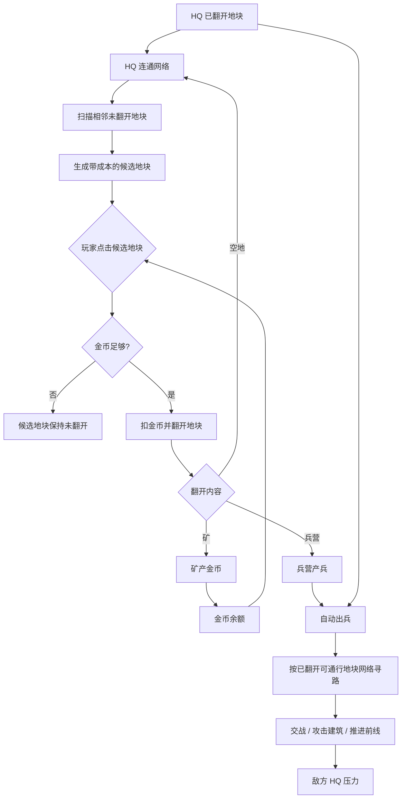

# 系统层级与接口

## 主问题

Pocket Groove Tactics 如何用“地图候选翻格 + HQ 连通网络”把经济、建筑和自动战斗绑成闭合循环？

## 层级图

## 系统接口

| 发送系统 | 接收系统 | 传递内容 | 断开后的问题 | 置信度 |
|---|---|---|---|---|
| 地图层 | HQ 连通网络 | 地块坐标、邻接关系、障碍、翻开状态、归属 | 无法判断哪些地块能接回 HQ | confirmed |
| HQ 连通网络 | 候选翻格 | 当前连通地块集合、边缘未翻开地块集合 | 可翻地块会乱生成，出现孤岛或越级翻格 | confirmed |
| 金币经济 | 候选翻格 | 当前金币、候选地块成本、是否可支付 | 翻格变成无限点击，经济约束消失 | confirmed |
| 候选翻格 | 地块状态机 | 被点击地块、支付结果、揭示内容 | 未翻开/已翻开状态无法切换 | confirmed |
| 地块状态机 | 建筑系统 | 翻开后的内容类型：空地/矿/兵营 | 矿和兵营不会产生实际收益 | confirmed |
| 建筑系统 | 金币经济 | HQ/矿的周期金币产出 | 玩家无法恢复购买力，矿没有意义 | confirmed |
| 建筑系统 | 自动出兵 | HQ/兵营的位置、阵营、产兵周期 | 翻出兵营不会改变战斗节奏 | inferred |
| 地图层 | 自动出兵 | 已翻开可通行地块图、障碍、前线位置 | 单位只能硬编码走线，无法被翻格路线塑形 | confirmed |
| 自动出兵 | 胜负结算 | HQ 受损、摧毁或占领事件 | 对局没有终点 | inferred |
| 敌方 AI | 敌方候选翻格/经济/出兵 | 敌方金币、候选地块、目标优先级 | 敌方不会翻地和出兵，对抗失效 | inferred |

## 边界说明

- 地图系统负责地块坐标、邻接、显示、点击命中、翻开状态和障碍，不负责金币产出。
- HQ 连通网络负责判断哪些已翻开地块能连回 HQ，以及哪些相邻未翻地块可成为候选，不负责决定翻出内容。
- 候选翻格负责玩家点击、金币校验、扣费和触发揭示，不负责单位移动。
- 经济系统只负责金币来源、余额和消耗校验，不决定候选生成。
- 建筑系统负责 HQ/矿/兵营的产出，不负责候选地块扫描。
- 战斗系统负责单位生成、寻路、交战和建筑受损，不负责翻开隐藏地块。

## 脆弱断点

| 断点 | 为什么脆弱 | 设计要求 |
|---|---|---|
| 地块状态 | 不区分已翻开和未翻开，翻格就没有行为意义 | 每个地块必须有明确状态 |
| HQ 连通 | 不要求连回 HQ，就会出现任意点图和孤岛 | 候选只能来自 HQ 连通网络边缘 |
| 地图点击 | 入口离开地块会偏离参考交互 | 点击对象必须是地图候选地块 |
| 金币成本 | 没有成本，矿和等待都失去意义 | 每个候选地块必须有成本和余额校验 |
| 内容差异 | 只有空地或只有建筑都会降低探索期待 | 至少包含空地、矿、兵营 |
| 网络寻路 | 单线兵轨无法体现翻格路线 | 单位必须基于已翻开可通行图寻路 |
