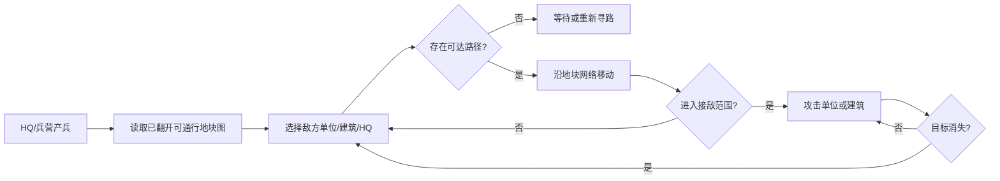

# 战斗_自动出兵与推进

## 主问题

为什么战斗移动必须由已翻开地块网络决定，而不能做成一条固定兵线？

## 机制描述

HQ 和已翻开的兵营按周期生成单位。单位生成后，系统从当前地图中构建“已翻开、可通行、可接入前线”的地块图，并在这张图上寻找敌方单位、敌方建筑或敌方 HQ。单位只能沿图上的相邻地块移动；隐藏地块、水域和未连通区域不能通行。

视频里单位在中部会收束成纵向通道，但这不是硬编码的一条线，而是因为双方已翻开区域和水域/地形共同形成了瓶颈。基地周围有多个建筑点和连接分支，随着翻开新地块，出兵点和可走路线都会变化。

## 存在理由

网络寻路让翻格路线直接影响战斗。玩家翻出兵营会增加新的出兵起点，翻出空地会改变可走边界，翻向中路会加快接敌，横向翻开则可能扩大经济面但延缓推进。若战斗只走固定中心线，翻格和战斗会脱节：无论玩家怎么扩张，单位都走同一条路。

## 推进循环

## 不负责什么

- 不负责决定哪些地块可翻；那是 HQ 连通翻格职责。
- 不负责金币产出和翻地支付；那是经济系统职责。
- 不负责翻开结果概率；那是地图内容配置职责。
- 不负责结算奖励，只传递 HQ 被攻破或占领事件。

## 可重现规则

| 规则 | If-Then 表达 |
|---|---|
| 产兵触发 | 若建筑为己方 HQ 或已翻开兵营，且产兵计时结束，则生成 1 个单位 |
| 可通行图 | 若地块已翻开、非障碍、且属于可争夺通路，则可作为寻路节点 |
| 隐藏限制 | 若路径需要经过未翻开地块，则该路径无效 |
| 障碍限制 | 若路径需要经过水域或障碍，则该路径无效 |
| 多起点 | 若存在多个己方兵营，则单位分别从各自建筑生成，并各自寻路 |
| 目标选择 | 若存在可达敌方单位，则优先攻击最近可达敌方单位 |
| 建筑目标 | 若无可达敌方单位但存在可达敌方建筑，则向最近建筑推进 |
| 路径变化 | 若新地块被翻开并接入网络，则后续单位寻路可使用该地块 |
| HQ 失败 | 若 HQ HP 小于等于 0 或被敌方占领，则通知结算系统 |

## 失效条件

- 单线硬编码：翻格路线无法改变战斗，兵营位置也没有意义。
- 允许穿隐藏地块：探索边界被绕开，翻格约束失效。
- 只从 HQ 出兵：翻出兵营没有战斗收益。
- 单位移动过快：玩家来不及通过翻格和经济调整路线。
- 单位移动过慢：经济扩张和战斗反馈脱节，玩家只剩等待。

## 证据等级

HQ/兵营产兵和单位移动来自视频抽帧与用户纠偏，证据等级 A。具体目标优先级、占领规则、HP 和伤害数值未确认，证据等级 C，demo 阶段只做可读节奏假设。
