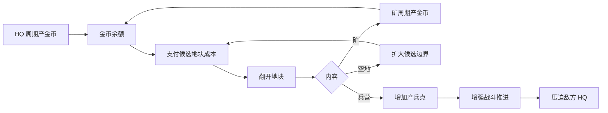

# 金币循环拆解

## 主问题

金币如何约束地块翻开，并让矿和兵营形成局内成长？

## 资源流转图

## 输入输出

| 节点 | 输入 | 输出 | 是否闭合 |
|---|---|---|---|
| HQ 产金 | 对局时间、HQ 存活 | 基础金币收入 | 是，支撑初始翻格 |
| 矿产金 | 翻出并接入 HQ 网络的矿、矿存活 | 额外金币收入 | 是，提高后续翻格频率 |
| 翻格消耗 | 金币余额、候选地块成本 | 新地块内容 | 是，可能带来矿/兵营/空地 |
| 空地收益 | 翻开空地、接入网络 | 新候选边界 | 是，扩大可购买集合 |
| 兵营收益 | 翻出并接入网络的兵营、兵营存活 | 更多单位和更多出兵点 | 是，通过战斗反压敌方 |

## 断点分析

| 断点 | 断开后表现 | 设计约束 |
|---|---|---|
| HQ 基础收入过低 | 玩家开局无法翻第一圈候选地块 | 起始收入必须保证短时间内能翻第一批低价地 |
| 矿收入过低 | 翻出矿不如直接找兵营，经济路线无意义 | 矿应明显缩短下一次翻格等待 |
| 翻格成本过低 | 经济约束失效，候选地块可以被扫空 | 中后段地块成本必须高于 HQ 单独供给能力 |
| 翻格成本过高 | 玩家长期等待，操作密度不足 | 成本曲线要允许“翻矿后变快”的感知 |
| 成本不显示在地块上 | 玩家无法判断当前能不能翻、该先翻哪块 | 候选地块必须直接显示成本或不足状态 |

## 设计判断

金币不是计分资源，而是翻开许可。它决定玩家什么时候能把 HQ 连通网络继续向外扩。矿的价值不只是“多给钱”，而是让玩家从等待进入更高频的翻格；兵营的价值则把经济选择转成战斗压力。

## 置信度

HQ 和矿产金币、翻格消耗金币来自用户明确纠偏，证据等级 A。具体产出周期、候选地块成本公式和内容概率未确认，证据等级 C。
