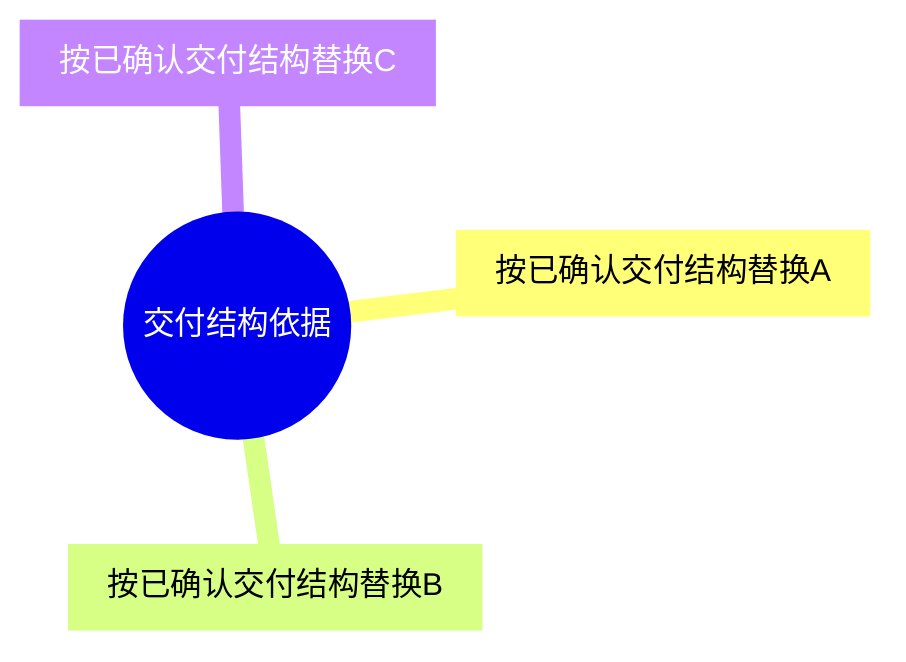

# [功能名称]

> 适用标准：`reference/部门标准/策划/gdd/GDD写作标准.md`（v28）

---

## 一、需求目的

- [功能要在游戏里形成的关系、状态或结果]
- [该结果如何影响玩家、组织、系统生态或后续玩法]

> 只写玩法目的层的目标状态，不在本节写实现手段、交付对象或正文结构。不要写统计对象、来源接入、归属互斥、积分计算、展示页、配置项或结算字段。

---

## 二、需求概述

[功能整体定义，2–3 句话：是什么、范围、主要限制]

> 需求概述可以承接已确认手段框架，但不要把“手段框架裁决”写成固定正文标题。

---

## 三、主体设计

### 3.1 脑图 / 结构图

[此处插入飞书脑图截图，或使用 Mermaid 图。图中应呈现本文档的交付结构依据、主要对象、手段框架中的转化关系、流转和关键分支。结构图不是设计推演词的展开，不能把体验强度、设计卖点或策略标签直接画成正文结构。]

### 3.2 [按交付结构命名]

[功能描述：按本文档已确认的手段框架和交付结构组织，可以使用段落、流程步骤、规则列表、表格、公式、示例或配置说明。章节标题应来自功能自身的赛程/阶段、对象构成、生成变化、资源流转、积分排名、状态关系、结算展示或调用场景等交付结构，而不是来自玩法目的、设计意图、体验强度、收益感知、风险高低或策略卖点。不要把“本节作用、适用对象、规则说明、判断方式、结果变化、玩家表现”等写作检查项机械写成固定小标题。]

[规则、边界、异常、参数、UE、奖励、状态和调用场景写在实际生效的结构节点中。不要为了模板完整，把计分维度、成员类型、状态枚举、配置项、页面、奖励表、打点指标或待确认项强行拆成独立标题。]

**交互流程**（仅交互型功能填写）

[当本段内容包含玩家连续操作、页面跳转、选择确认、按钮反馈等交互链路时，描述用户操作和系统响应的完整序列；无交互链路时删除本段。]

**配置项**（如有）

| 配置项 | 生效范围 | 默认值 | 可配置范围 | 说明 |
|---|---|---|---|---|
| [配置项名称] | 全局 / 实例 / 其他 | [默认值] | [范围] | 支持配置 |

### 3.3 [按交付结构增加正文小节]

[仅当该小节是已确认交付结构中的必要节点，且能说明如何参与手段框架，开发、UE、数值或测试能据此实现、配置、展示、结算或验证时增加；如果只是设计推演词、体验特征、属性、分类、配置、页面、奖励、状态枚举、指标或补充规则，写回其实际生效的段落或表格中。]

---

## 四、UE 交互（可选）

[界面入口、按钮状态变化、弹窗内容、页面流转等]

---

## 内容配置区（可选，在功能描述完成后追加）

> 内容配置区不替代功能描述；如保留本区，仍需按 v28 交付检查确认其出现在功能描述之后，且不承载系统规则。

| 内容项 | 参数 | 备注 |
|---|---|---|
| [内容项名称] | [参数值] | [说明] |
