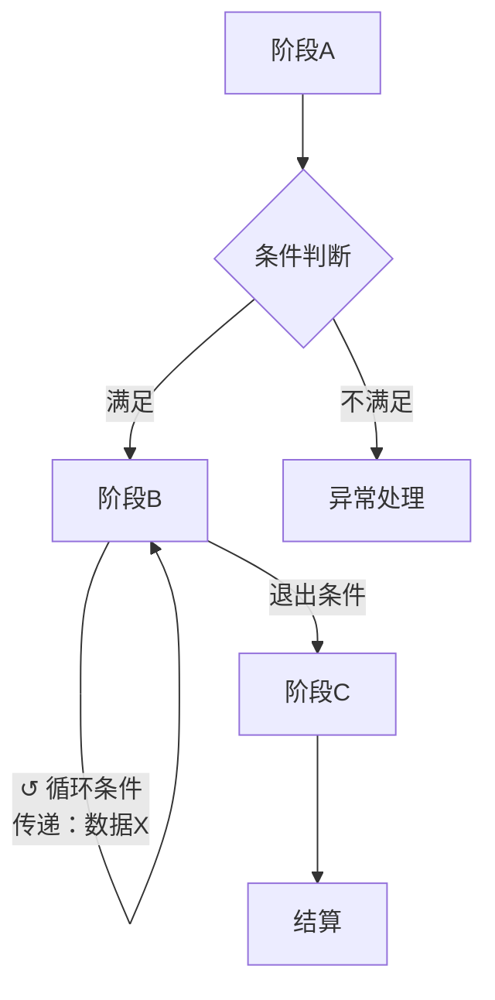
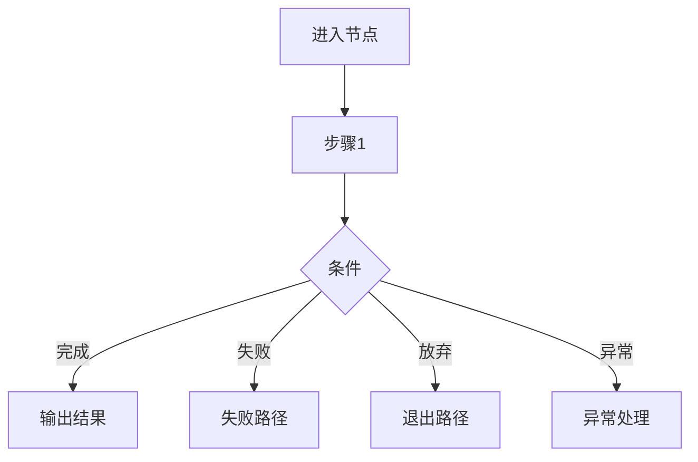

# [系统名称]

> 适用标准：`reference/部门标准/策划/gdd/GDD写作标准.md`（v12）

---

## 一、体验目标

- 玩家在 [场景] 应感受到 [具体情绪/认知状态]，因为 [设计理由]
- 玩家在 [场景] 应感受到 [具体情绪/认知状态]，因为 [设计理由]

---

## 二、系统流程与节点定义

### 2.1 流程图

**整体流程图**

**[主要阶段]子流程图**

### 2.1.5 功能模块概述

- [模块名]：[主语执行了什么]
- [模块名]：[主语执行了什么]
- [模块名]：[主语执行了什么]

### 2.2 节点定义

### [节点名]

*[谁在何时操作，频率]*

#### [配置模块名称]

| 配置项 | 推荐/默认 | 可配置范围 | 强制规则 |
|---|---|---|---|
| [配置项] | [默认值] | [范围] | 无 / 必须... |

> **系统自动执行**（策划无需配置，系统保证）：
> - [步骤1]
> - [步骤2]

### [节点名]

*[谁在何时操作，频率]*

> **系统自动执行**：
> - [步骤1]

---

## 三、规则层

### a) 操作规则

**[阶段名]阶段**

- 当 [触发条件] 时，系统必须 [行为]
- 当 [触发条件] 时，系统禁止 [行为]

**[阶段名]阶段**

- 当 [触发条件] 时，系统必须 [行为]

### b) 规则优先级

各规则独立生效，无优先级冲突。

*（或：第1优先级 > 第2优先级 > ...）*

### c) 异常处理

| 场景 | 系统响应 | 兜底行为 |
|---|---|---|
| [场景描述] | [响应方式] | [兜底处理] |

---

## 四、拼装示例

### 示例一：[体验目标名称]

体验目标：[第一层的句子]

决策理由：[为什么选这套流程结构和配置，而不选其他]

流程配置：
- [阶段A]：[配置值，循环条件]
- [阶段B]：[配置值]

预期效果：[玩家会感受到什么，对应第一层]

### 示例二：[体验目标名称]

体验目标：[第一层的句子]

决策理由：[为什么选这套流程结构和配置，而不选其他]

流程配置：
- [阶段A]：[配置值]

预期效果：[玩家会感受到什么，对应第一层]

---

## 内容配置区（可选，在规则层完成后追加）

> 内容配置区不参与 Self-Review 前四项判据审核。

| 内容项 | 参数 | 备注 |
|---|---|---|
| [内容项名称] | [参数值] | [说明] |
