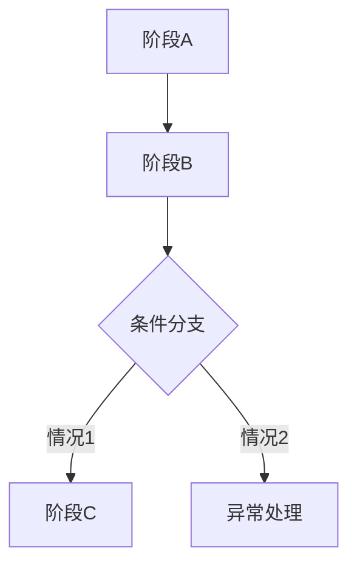

# [功能名称]

> 适用标准：`reference/部门标准/策划/gdd/GDD写作标准.md`（v19）

---

## 一、需求目的

- [解决什么问题 / 达成什么效果]
- [解决什么问题 / 达成什么效果]

---

## 二、需求概述

[功能整体定义，2–3 句话：是什么、范围、主要限制]

---

## 三、功能概述

### 3.1 脑图/流程图

[此处插入飞书脑图截图，或使用 Mermaid 流程图]

### 3.2 [子功能/阶段名称]

[功能描述：用自然文字说明这个模块是什么、在什么场景下发生、系统产生什么结果、对玩家或上下游功能造成什么影响。如有影响功能成立、结果判定、参与限制、异常处理的规则约束，写入对应描述中。不要拆成固定字段，不写设计推导或审核说明。]

**交互流程**（仅交互型功能填写）

[当本子功能包含玩家连续操作、页面跳转、选择确认、按钮反馈等交互链路时，描述用户操作和系统响应的完整序列；无交互链路时删除本段。]

**配置项**（如有）

| 配置项 | 生效范围 | 默认值 | 可配置范围 | 说明 |
|---|---|---|---|---|
| [配置项名称] | 全局 / 实例 | [默认值] | [范围] | 支持配置 |

### 3.3 [子功能/阶段名称]

[重复上述结构]

---

## 四、UE 交互（可选）

[界面入口、按钮状态变化、弹窗内容、页面流转等]

---

## 内容配置区（可选，在功能描述完成后追加）

> 内容配置区不替代功能描述；如保留本区，仍需按 Self-Review 的内容配置区合规判据检查。

| 内容项 | 参数 | 备注 |
|---|---|---|
| [内容项名称] | [参数值] | [说明] |
