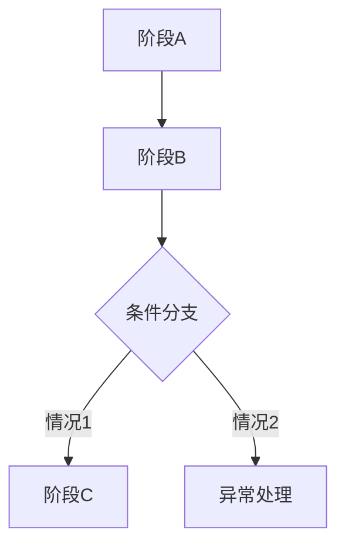

# [功能名称]

> 适用标准：`reference/部门标准/策划/gdd/GDD写作标准.md`（v17）

---

## 一、需求目的

- [解决什么问题 / 达成什么效果]
- [解决什么问题 / 达成什么效果]

---

## 二、需求概述

[功能整体定义，2–3 句话：是什么、范围、主要限制]

---

## 三、功能概述

### 3.1 脑图/流程图

[此处插入飞书脑图截图，或使用 Mermaid 流程图]

### 3.2 [子功能/阶段名称]

[功能说明：一句话说明这个模块是什么、在整体流程中的位置]

**操作流程**

[描述用户操作和系统响应的完整序列]

**配置项**（如有）

| 配置项 | 生效范围 | 默认值 | 可配置范围 | 说明 |
|---|---|---|---|---|
| [配置项名称] | 全局 / 实例 | [默认值] | [范围] | 支持配置 |

**规则/边界**（如有）

- 若 [触发条件]，则 [系统行为]
- 若 [触发条件]，则 [系统行为]

### 3.3 [子功能/阶段名称]

[重复上述结构]

---

## 四、UE 交互（可选）

[界面入口、按钮状态变化、弹窗内容、页面流转等]

---

## 内容配置区（可选，在功能描述完成后追加）

> 内容配置区不参与 Self-Review 前三项判据审核。

| 内容项 | 参数 | 备注 |
|---|---|---|
| [内容项名称] | [参数值] | [说明] |
