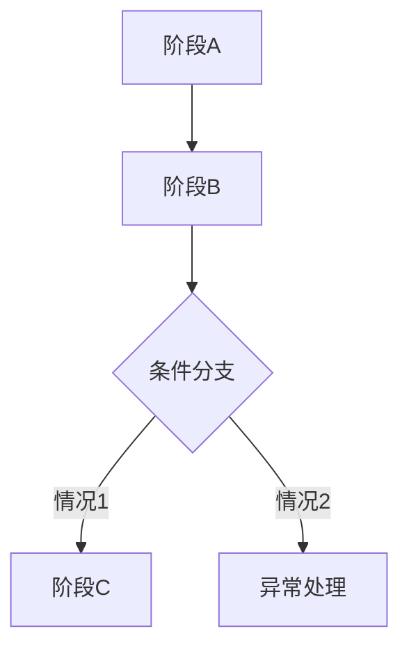

# [功能名称]

> 适用标准：`reference/部门标准/策划/gdd/GDD写作标准.md`（v25）

---

## 一、需求目的

- [解决什么问题 / 达成什么效果 / 让什么状态发生变化]
- [解决什么问题 / 达成什么效果 / 让什么状态发生变化]

> 只写目的和目标状态，不在本节写实现手段。

---

## 二、需求概述

[功能整体定义，2–3 句话：是什么、范围、主要限制]

---

## 三、功能 / 玩法设计

### 3.1 脑图/流程图

[此处插入飞书脑图截图，或使用 Mermaid 流程图]

### 3.2 [按设计对象命名]

[功能描述：按实际设计对象组织正文，可以是阶段、模块、玩家行为、资源流转、状态变化、成员关系或上下游关系。不要为了模板完整，把计分维度、成员类型、状态类型、待确认项强行拆成独立标题。规则和边界写入对应描述中，不单独集中成章。]

**交互流程**（仅交互型功能填写）

[当本段内容包含玩家连续操作、页面跳转、选择确认、按钮反馈等交互链路时，描述用户操作和系统响应的完整序列；无交互链路时删除本段。]

**配置项**（如有）

| 配置项 | 生效范围 | 默认值 | 可配置范围 | 说明 |
|---|---|---|---|---|
| [配置项名称] | 全局 / 实例 / 其他 | [默认值] | [范围] | 支持配置 |

### 3.3 [按需增加正文小节]

[仅当这个设计对象本身需要独立说明时增加；如果只是某个模块的属性、分类或补充规则，写回对应段落或表格中。]

---

## 四、UE 交互（可选）

[界面入口、按钮状态变化、弹窗内容、页面流转等]

---

## 内容配置区（可选，在功能描述完成后追加）

> 内容配置区不替代功能描述；如保留本区，仍需按 v25 交付检查确认其出现在功能描述之后，且不承载系统规则。

| 内容项 | 参数 | 备注 |
|---|---|---|
| [内容项名称] | [参数值] | [说明] |
