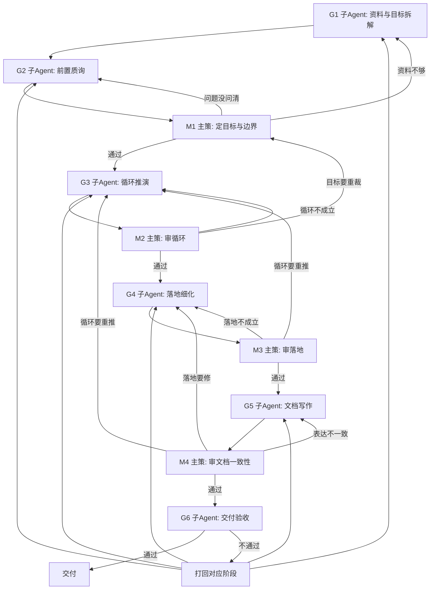

# 多Agent设计文档工作流

## 一句话

先让子 Agent 产材料，再让主策确认方向；先确认目标，再推循环；先确认循环，再拆功能；先确认功能，再写文档；最后验收交付。

本文件只说明“下一步去哪”。不说明怎么判断、怎么回滚、怎么写正文。

## 主流程

```text
G1 资料与目标拆解
  -> G2 前置质询
  -> M1 主策定目标与边界
  -> G3 循环推演
  -> M2 主策审循环
  -> G4 落地细化
  -> M3 主策审落地
  -> G5 文档写作
  -> M4 主策审文档一致性
  -> G6 交付验收
  -> 交付
```

## 流程图



## 每步做什么

| 节点 | 谁做 | 只做什么 | 通过后去哪 |
|---|---|---|---|
| G1 | 子 Agent | 把资料拆成候选问题、候选目标、候选意图 | G2 |
| G2 | 子 Agent | 提出会影响定目标的前置问题 | M1 |
| M1 | 主策 | 选择目标，确定设计意图和边界 | G3 |
| G3 | 子 Agent | 按已确认目标推玩家循环 | M2 |
| M2 | 主策 | 判断循环是否成立 | G4 |
| G4 | 子 Agent | 把循环拆成可落地功能、规则、状态、UE 要求 | M3 |
| M3 | 主策 | 判断落地是否承接循环 | G5 |
| G5 | 子 Agent | 只把已确认方案写成文档 | M4 |
| M4 | 主策 | 判断文档是否忠实表达已确认方案 | G6 |
| G6 | 子 Agent | 判断方向验证通过、正式通过或打回 | 交付 / 打回 |

## 谁有决定权

- 子 Agent 只产材料，不做选择。
- 主策负责选择、确认、打回和推进阶段。
- 写作 Agent 只写已确认方案，不重新设计。
- 交付验收 Agent 只判断交付状态，不重开方案。

## 打回怎么走

| 从哪里打回 | 回哪里 |
|---|---|
| M1 发现资料不够 | G1 |
| M1 发现问题没问清 | G2 |
| M2 发现循环不成立 | G3 |
| M2 发现目标要重裁 | M1 |
| M3 发现落地不成立 | G4 |
| M3 发现循环要重推 | G3 |
| M4 发现表达不一致 | G5 |
| M4 发现落地要修 | G4 |
| M4 发现循环要重推 | G3 |
| G6 发现交付阻塞 | 打回 G1/G2/G3/G4/G5 中对应阶段 |

打回后的回滚、计数、熔断和 checkpoint，不在本文件定义，见 `多Agent设计文档调度规则.md`。

## 每步读什么

| 节点 | 读取判断原则 |
|---|---|
| G1 | `多Agent设计文档判断原则/子Agent/目标拆解原则.md` |
| G2 | `多Agent设计文档判断原则/子Agent/前置质询原则.md` |
| M1 | `多Agent设计文档判断原则/主策/M1-目标与边界判断原则.md` |
| G3 | `多Agent设计文档判断原则/子Agent/循环推演原则.md` |
| M2 | `多Agent设计文档判断原则/主策/M2-循环闭环判断原则.md` |
| G4 | `多Agent设计文档判断原则/子Agent/落地细化原则.md` |
| M3 | `多Agent设计文档判断原则/主策/M3-落地可执行性判断原则.md` |
| G5 | `多Agent设计文档判断原则/子Agent/写作原则.md` |
| M4 | `多Agent设计文档判断原则/主策/M4-交付一致性判断原则.md` |
| G6 | `多Agent设计文档判断原则/子Agent/交付验收原则.md` |

角色卡由 `archive/skills/skills/gdd-write/role-cards/` 提供。
G5 写正文时再读取 `GDD写作标准.md` 和 `GDD输出模板.md`。
不得一次性把所有判断原则塞入任一 Agent 上下文。

## 文件边界

- 本文件：只管流程怎么走。
- `多Agent设计文档调度规则.md`：管快照、回滚、熔断、checkpoint 和上下文装配。
- `多Agent设计文档判断原则/`：管每个节点怎么判断质量。
- `archive/skills/skills/gdd-write/SKILL.md`：管如何按本流程执行。
