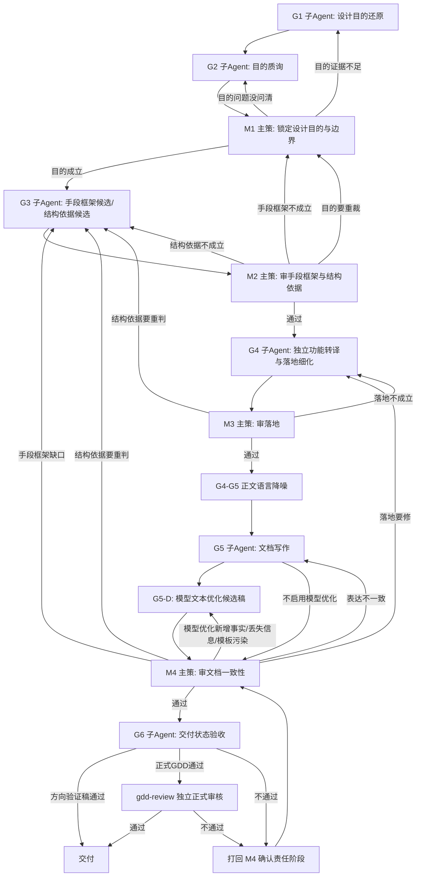

# 多Agent设计文档工作流

## 一句话

先让子 Agent 从资料中还原设计目的，再让主策只锁定目的与探索边界；目的成立后再由 G3 提出手段、对象和结构依据候选，M2 裁决；G4 确认功能归位后再写文档；最后只验收交付状态。

本文件只说明“下一步去哪”。不说明怎么判断、怎么回滚、怎么写正文。

## 启动边界

进入本流程前，主 Agent 只能读取入口规则、任务路由规则、本工作流、调度规则、目标文件路径和用户显式给出的任务描述。

一旦任务命中本流程，业务证据的首次解释权归 G1。主 Agent 不得在 G1 之前读取并综合参考 GDD、历史机制记忆、竞品资料、业务文档正文，或提前提炼设计目的、手段框架、设计对象、结构依据、独立功能、方案定位和功能结论。

主 Agent 可以把用户给出的参考路径、资料范围和约束整理成 G1 任务包，但不得把自己的业务判断写入任务包。G1 产出后，主 Agent 只在 M1 按判断原则锁定、确认、打回或补问。

## 主流程

```text
G1 设计目的还原
  -> G2 目的质询
  -> M1 主策锁定设计目的与边界
  -> G3 服务目的的手段框架候选与结构依据候选
  -> M2 主策审手段框架与结构依据
  -> G4 独立功能转译与落地细化
  -> M3 主策审落地
  -> G4-G5 正文语言降噪关口
  -> G5 文档写作
  -> G5-D 模型文本优化候选稿（启用 DeepSeek 等 LLM 时）
  -> M4 主策审文档一致性
  -> G6 交付状态验收
  -> 正式 GDD 独立 gdd-review
  -> 交付
```

## 流程图



## 每步做什么

| 节点 | 谁做 | 只做什么 | 通过后去哪 |
|---|---|---|---|
| G1 | 子 Agent | 从资料中还原目的包：上级游戏框架、核心或系统循环、当前循环缺口、设计者意图、非目的内容、证据与不确定点 | G2 |
| G2 | 子 Agent | 专门质询目的是否成立：是否来自整体循环、是否指标化、是否从功能或奖励反推、是否把手段写成目的、证据是否足够 | M1 |
| M1 | 主策 | 只锁定设计目的、循环依据、当前缺口、非目的内容和探索边界；不预选手段或功能 | G3 |
| G3 | 子 Agent | 按已锁定设计目的提出手段框架候选，并为每个候选推导设计对象、交付对象边界和结构依据 | M2 |
| M2 | 主策 | 选择服务设计目的的手段框架，并确认设计对象、交付对象边界和结构依据；不直接拆功能 | G4 |
| G4 | 子 Agent | 按已确认手段框架和结构依据识别独立功能，保持每个功能从触发到结果的完整过程，并把权限、条件、配置、反馈和异常归入实际生效节点 | M3 |
| M3 | 主策 | 判断独立功能是否成立、功能归属是否正确、功能过程是否被交付维度拆散 | G5 |
| G4-G5 正文语言降噪 | 主 Agent / 写作上下文装配 | 不改变方案，只把 G4 的内部判断语言转成策划正文语言；G5 不继承 G4 原始措辞 | G5 |
| G5 | 子 Agent | 只把已确认方案写成文档；需求目的只表达 M1 锁定的设计目的，正文围绕 M3 确认的独立功能组织并保留完整运行过程 | M4 |
| G5-D 模型文本优化候选稿 | DeepSeek 等 LLM / 主 Agent 装配 | 只基于 G5 草稿和已确认上下文优化文本；输出候选稿和差异说明，不新增设定、不替代验收、不覆盖原稿 | M4 |
| M4 | 主策 | 判断文档是否忠实表达已确认目的、手段和独立功能，是否按交付维度拆散功能过程，是否混入内部检查项、判断语言或流程产物 | G6 |
| G6 | 子 Agent | 以 GDD 为只读输入，独立输出交付验收记录；只确认阶段证据、版本一致性、阻塞项状态和产物分离，不把验收结论写回正文；正式 GDD 通过后仍需进入独立 `gdd-review` | 交付 / gdd-review / 打回 M4 |
| gdd-review | 非生产者审核 Agent | 按独立审核原则复核协作证据和正文；主 Agent、G5 写作 Agent、DeepSeek 自检都不能替代本节点 | 交付 / 打回 |

## 谁有决定权

- 子 Agent 只产材料，不做选择。
- 主策负责选择、确认、打回和推进阶段。
- 主策的确认必须引用已完成子 Agent 阶段材料，不能用主线程提前形成的业务判断替代子 Agent 证据。
- 主策未锁定设计目的前，不得进入手段框架判断、结构依据判断或正文写作。
- 目的错必须回到 G1/G2/M1；不得在 G3-G6 临时改写目的。
- 写作 Agent 只写已确认方案，不重新设计。
- 交付验收 Agent 只确认阶段证据、版本一致性、阻塞项状态和产物分离，不重开方案，也不重新判断正文质量。
- 交付验收 Agent 不修改待验收 GDD，验收结论和通过依据只能进入独立流程记录。
- DeepSeek 等 LLM 只作为文本优化工具，不拥有设计选择、阶段推进或交付验收权。
- 主 Agent 若参与上下文装配、提示词、文档修改或 blocking issue 修复，不得作为该稿件的正式通过验收者。

## 打回怎么走

| 从哪里打回 | 回哪里 |
|---|---|
| M1 发现目的证据不够 | G1 |
| M1 发现目的问题没问清 | G2 |
| M2 发现手段框架不成立 | M1 |
| M2 发现结构依据不成立 | G3 |
| M2 发现目的要重裁 | M1；必要时回 G1 |
| M3 发现落地不成立 | G4 |
| M3 发现结构依据要重判 | G3 |
| M4 发现模型优化新增事实、删失关键边界、丢失待确认项、引入模板标题或技术实现词 | G5-D；若问题来自 G5 原稿，回 G5 |
| M4 发现仅存在内部判断语言污染 | G5 |
| M4 发现表达不一致 | G5 |
| M4 发现落地要修 | G4 |
| M4 发现手段框架缺口 | G3；若暴露 M1 裁决错误，回 M1 |
| M4 发现结构依据要重判 | G3 |
| G6 发现证据缺失、版本不一致、阻塞项未关闭或产物未分离 | 回 M4 确认责任阶段；G6 不直接路由设计修改 |
| gdd-review 发现正式 GDD 阻塞 | 打回对应阶段；若仅为文本优化问题，回 G5-D 或 G5 |

打回后的回滚、计数、熔断和 checkpoint，不在本文件定义，见 `多Agent设计文档调度规则.md`。

## 每步读什么

| 节点 | 读取判断原则 |
|---|---|
| G1 | `多Agent设计文档判断原则/子Agent/设计目的还原原则.md` |
| G2 | `多Agent设计文档判断原则/子Agent/目的质询原则.md` |
| M1 | `多Agent设计文档判断原则/主策/M1-目标与边界判断原则.md` |
| G3 | `多Agent设计文档判断原则/子Agent/循环推演原则.md` |
| M2 | `多Agent设计文档判断原则/主策/M2-循环闭环判断原则.md` |
| G4 | `多Agent设计文档判断原则/子Agent/落地细化原则.md` |
| M3 | `多Agent设计文档判断原则/主策/M3-落地可执行性判断原则.md` |
| G5 | `多Agent设计文档判断原则/子Agent/写作原则.md` |
| G5-D | `多Agent设计文档调度规则.md` 的“模型文本优化与差异守门” |
| M4 | `多Agent设计文档判断原则/主策/M4-交付一致性判断原则.md` |
| G6 | `多Agent设计文档判断原则/子Agent/交付验收原则.md` |
| gdd-review | `archive/skills/skills/gdd-review/SKILL.md`、`多Agent设计文档判断原则/子Agent/独立审核原则.md`、`GDD输出模板.md` |

角色卡由 `archive/skills/skills/gdd-write/role-cards/` 提供。
G5 写正文时读取 `写作原则.md` 和 `GDD输出模板.md`。判断标准只来自节点原则，模板只提供占位结构。
不得一次性把所有判断原则塞入任一 Agent 上下文。

## 文件边界

- 本文件：只管流程怎么走。
- `多Agent设计文档调度规则.md`：管快照、回滚、熔断、checkpoint 和上下文装配。
- `多Agent设计文档判断原则/`：管每个节点怎么判断质量。
- `archive/skills/skills/gdd-write/SKILL.md`：管如何按本流程执行。
