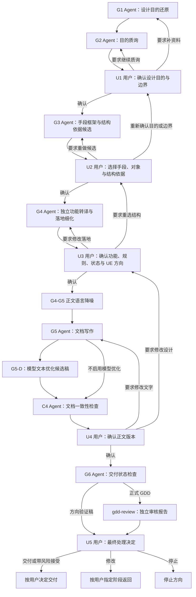

# 多 Agent 设计文档工作流

## 一句话

Agent 负责还原、质询、提案、细化、写作和检查；用户在 U1-U5 作出全部策划选择和最终交付决定。任何 Agent 的推荐、检查或审核结论都不能替代用户确认。

本文件只说明“下一步去哪”。用户决策权以 `../策划决策权规则.md` 为最高原则；状态、回滚、checkpoint 和上下文装配见 `多Agent设计文档调度规则.md`。

## 启动边界

进入本流程前，主 Agent 只能读取入口规则、任务路由规则、本工作流、调度规则、目标文件路径和用户显式给出的任务描述。

业务证据的首次解释由 G1 完成。主 Agent 可以整理参考路径、资料范围和用户约束，但不得在 G1 前形成或暗示设计结论。

## 主流程

```text
G1 设计目的还原
  -> G2 目的质询
  -> U1 用户确认设计目的与边界
  -> G3 手段框架与结构依据候选
  -> U2 用户选择手段、对象与结构依据
  -> G4 独立功能转译与落地细化
  -> U3 用户确认功能、规则、状态与 UE 方向
  -> G4-G5 正文语言降噪
  -> G5 文档写作
  -> G5-D 模型文本优化候选稿（可选）
  -> C4 Agent 文档一致性检查
  -> U4 用户确认正文版本
  -> G6 交付状态检查
  -> 正式 GDD 独立 gdd-review（正式 GDD 分支）
  -> U5 用户决定交付、打回、带风险接受或停止
```

## 流程图



## 每一步分别做什么

| 节点 | 谁做 | 只做什么 | 是否拥有策划决定权 |
|---|---|---|---|
| G1 | Agent | 从资料中还原目的候选、证据和不确定点 | 否 |
| G2 | Agent | 质询目的依据，列出必须由用户决定的问题 | 否 |
| U1 | 用户 | 确认设计目的、循环依据、当前缺口、非目的内容和探索边界 | 是 |
| G3 | Agent | 基于 U1 结论提出手段、设计对象、交付边界和结构依据候选 | 否 |
| U2 | 用户 | 选择手段框架、设计对象、交付对象边界和结构依据 | 是 |
| G4 | Agent | 基于 U1/U2 结论转译独立功能、规则、状态和 UE 材料 | 否 |
| U3 | 用户 | 确认功能结构、关键规则、状态和 UE 方向 | 是 |
| G4-G5 | 主 Agent | 只做语言降噪，不改变用户确认的设计 | 否 |
| G5 | Agent | 把 U1-U3 确认的方案写成正文 | 否 |
| G5-D | 外部模型/主 Agent | 只生成文本优化候选稿和差异说明 | 否 |
| C4 | Agent | 检查正文是否忠实表达 U1-U3 结论，报告差异与风险 | 否 |
| U4 | 用户 | 选择、修改或确认正文版本，并决定是否进入交付检查 | 是 |
| G6 | Agent | 检查阶段证据、版本、阻塞项和产物分离，输出检查报告 | 否 |
| gdd-review | 非生产者 Agent | 独立报告正文问题、证据和建议处理阶段 | 否 |
| U5 | 用户 | 决定交付、带风险接受、指定打回阶段、继续补充或停止 | 是 |

## 用户决定权

- Agent 只产材料、候选、检查结果和建议，不作策划选择。
- U1-U5 只能由用户确认。主 Agent、子 Agent、审核 Agent 和外部模型均不得代签。
- 用户要求“继续”只授权执行当前已经明确的下一步，不自动等于确认未被明确选择的策划内容。
- 用户可以一次确认多个相邻节点，但 checkpoint 必须逐项记录确认对象和用户原话。
- Agent 发现事实缺口、规则冲突或标准问题时，应报告证据、影响、选项与推荐；不得自行打回或接受风险。
- 写作和审核 Agent 不得因“更合理”而改写用户已经确认的结论，只能提出修改建议等待用户决定。

## 返回规则

Agent 只能建议返回阶段，实际返回目标由用户决定：

| 发现位置 | Agent 可建议的返回范围 | 用户决定 |
|---|---|---|
| G2 / U1 前 | G1 或 G2 | 补资料、继续质询、确认或停止 |
| G3 / U2 前 | G3 或 U1 | 重做候选、改边界、确认或停止 |
| G4 / U3 前 | G4、U2 或 U1 | 修改落地、重选结构、改目的或停止 |
| C4 / U4 前 | G5、G5-D、G4、U2 或 U1 | 修改文字、修改设计、确认风险或停止 |
| G6 / gdd-review | 任一责任阶段 | 交付、带风险接受、指定返回或停止 |

未获得用户明确选择时，流程停在当前用户确认点。

## 每步读什么

| 节点 | 读取原则 |
|---|---|
| 全流程 | `../策划决策权规则.md` |
| G1 | `多Agent设计文档判断原则/子Agent/设计目的还原原则.md` |
| G2 | `多Agent设计文档判断原则/子Agent/目的质询原则.md` |
| U1 | `多Agent设计文档判断原则/用户确认/U1-目标与边界确认原则.md` |
| G3 | `多Agent设计文档判断原则/子Agent/循环推演原则.md` |
| U2 | `多Agent设计文档判断原则/用户确认/U2-手段与结构确认原则.md` |
| G4 | `多Agent设计文档判断原则/子Agent/落地细化原则.md` |
| U3 | `多Agent设计文档判断原则/用户确认/U3-落地方向确认原则.md` |
| G5 | `多Agent设计文档判断原则/子Agent/写作原则.md` |
| G5-D | `多Agent设计文档调度规则.md` 的“模型文本优化与差异检查” |
| C4 / U4 | `多Agent设计文档判断原则/用户确认/U4-正文版本确认原则.md` |
| G6 | `多Agent设计文档判断原则/子Agent/交付验收原则.md` |
| gdd-review | `archive/skills/skills/gdd-review/SKILL.md`、`多Agent设计文档判断原则/子Agent/独立审核原则.md` |
| U5 | `多Agent设计文档判断原则/用户确认/U5-最终处理确认原则.md` |

角色卡由 `archive/skills/skills/gdd-write/role-cards/` 提供。不得一次性把全部判断原则塞入任一 Agent 上下文。

## 文件边界

- 本文件：阶段顺序和角色边界。
- `策划决策权规则.md`：用户决策权的最高策划规则。
- `多Agent设计文档调度规则.md`：状态、回滚、熔断、checkpoint 和上下文装配。
- `多Agent设计文档判断原则/`：节点检查与用户确认材料。
- `archive/skills/skills/gdd-write/SKILL.md`：执行入口。
