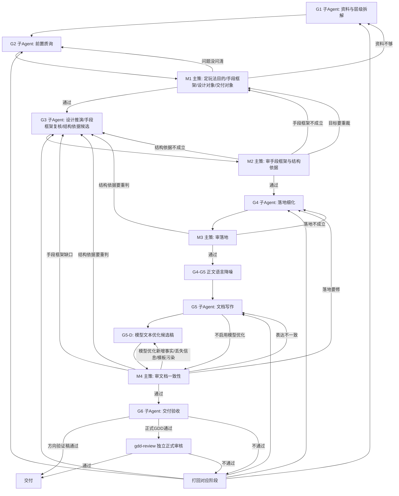

# 多Agent设计文档工作流

## 一句话

先让子 Agent 产材料，再让主策确认玩法目的、手段框架、设计对象和交付对象边界；再做设计推演、手段框架复核和结构依据判断；再把推演材料转译成交付结构；确认功能归位后再写文档；最后验收交付。

本文件只说明“下一步去哪”。不说明怎么判断、怎么回滚、怎么写正文。

## 启动边界

进入本流程前，主 Agent 只能读取入口规则、任务路由规则、本工作流、调度规则、目标文件路径和用户显式给出的任务描述。

一旦任务命中本流程，业务证据的首次解释权归 G1。主 Agent 不得在 G1 之前读取并综合参考 GDD、历史机制记忆、竞品资料、业务文档正文，或提前提炼设计目标、手段框架、设计对象、结构依据、交付结构、方案定位和功能结论。

主 Agent 可以把用户给出的参考路径、资料范围和约束整理成 G1 任务包，但不得把自己的业务判断写入任务包。G1 产出后，主 Agent 只在 M1 按判断原则选择、确认、打回或补问。

## 主流程

```text
G1 资料与层级拆解
  -> G2 前置质询
  -> M1 主策定玩法目的、手段框架、设计对象与交付对象边界
  -> G3 设计推演、手段框架复核与结构依据候选
  -> M2 主策审手段框架与结构依据
  -> G4 交付结构转译与落地细化
  -> M3 主策审落地
  -> G4-G5 正文语言降噪关口
  -> G5 文档写作
  -> G5-D 模型文本优化候选稿（启用 DeepSeek 等 LLM 时）
  -> M4 主策审文档一致性
  -> G6 交付验收
  -> 正式 GDD 独立 gdd-review
  -> 交付
```

## 流程图



## 每步做什么

| 节点 | 谁做 | 只做什么 | 通过后去哪 |
|---|---|---|---|
| G1 | 子 Agent | 把资料拆成候选玩法目的、候选手段框架、候选设计对象、候选交付对象、候选问题和设计推演材料 | G2 |
| G2 | 子 Agent | 提出会影响玩法目的、手段框架、设计对象、交付对象边界的前置问题 | M1 |
| M1 | 主策 | 先确认玩法目的，再确认手段框架，再确认设计对象，最后确认交付对象边界和范围边界 | G3 |
| G3 | 子 Agent | 按已确认玩法目的、手段框架、设计对象和交付对象边界产出设计推演材料，复核手段框架，并提出本文档可能采用的结构依据 | M2 |
| M2 | 主策 | 判断手段框架是否把目的转成可执行规则，结构依据是否匹配交付阅读方式，是否能承接设计对象和交付对象边界，且没有从交付对象反推玩法目的 | G4 |
| G4 | 子 Agent | 按已确认手段框架和结构依据，把设计推演材料转译成交付结构、功能、规则、状态、UE 要求 | M3 |
| M3 | 主策 | 判断落地是否完成转译，主体节点是否来自交付结构而不是设计推演词 | G5 |
| G4-G5 正文语言降噪 | 主 Agent / 写作上下文装配 | 不改变方案，只把 G4 的内部判断语言转成策划正文语言；G5 不继承 G4 原始措辞 | G5 |
| G5 | 子 Agent | 只把已确认方案写成文档；需求目的只使用 M1 确认的玩法目的，正文使用 M1/M2 确认的手段框架和 M3 确认的交付结构 | M4 |
| G5-D 模型文本优化候选稿 | DeepSeek 等 LLM / 主 Agent 装配 | 只基于 G5 草稿和已确认上下文优化文本；输出候选稿和差异说明，不新增设定、不替代验收、不覆盖原稿 | M4 |
| M4 | 主策 | 判断文档是否忠实表达已确认方案，是否从交付对象倒推需求目的，是否机械套用内部检查项，是否混入内部判断语言 | G6 |
| G6 | 子 Agent | 判断方向验证通过、正式通过或打回；正式 GDD 通过后仍需进入独立 `gdd-review` | 交付 / gdd-review / 打回 |
| gdd-review | 非生产者审核 Agent | 按 GDD 写作标准做正式审核；主 Agent、G5 写作 Agent、DeepSeek 自检都不能替代本节点 | 交付 / 打回 |

## 谁有决定权

- 子 Agent 只产材料，不做选择。
- 主策负责选择、确认、打回和推进阶段。
- 主策的确认必须引用已完成子 Agent 阶段材料，不能用主线程提前形成的业务判断替代子 Agent 证据。
- 主策未确认手段框架前，不得进入结构依据判断或正文写作。
- 写作 Agent 只写已确认方案，不重新设计。
- 交付验收 Agent 只判断交付状态，不重开方案。
- DeepSeek 等 LLM 只作为文本优化工具，不拥有设计选择、阶段推进或交付验收权。
- 主 Agent 若参与上下文装配、提示词、文档修改或 blocking issue 修复，不得作为该稿件的正式通过验收者。

## 打回怎么走

| 从哪里打回 | 回哪里 |
|---|---|
| M1 发现资料不够 | G1 |
| M1 发现问题没问清 | G2 |
| M2 发现手段框架不成立 | M1 |
| M2 发现结构依据不成立 | G3 |
| M2 发现目标要重裁 | M1 |
| M3 发现落地不成立 | G4 |
| M3 发现结构依据要重判 | G3 |
| M4 发现模型优化新增事实、删失关键边界、丢失待确认项、引入模板标题或技术实现词 | G5-D；若问题来自 G5 原稿，回 G5 |
| M4 发现仅存在内部判断语言污染 | G5 |
| M4 发现表达不一致 | G5 |
| M4 发现落地要修 | G4 |
| M4 发现手段框架缺口 | G3；若暴露 M1 裁决错误，回 M1 |
| M4 发现结构依据要重判 | G3 |
| G6 发现交付阻塞 | 打回 G1/G2/G3/G4/G5 中对应阶段 |
| gdd-review 发现正式 GDD 阻塞 | 打回对应阶段；若仅为文本优化问题，回 G5-D 或 G5 |

打回后的回滚、计数、熔断和 checkpoint，不在本文件定义，见 `多Agent设计文档调度规则.md`。

## 每步读什么

| 节点 | 读取判断原则 |
|---|---|
| G1 | `多Agent设计文档判断原则/子Agent/目标拆解原则.md` |
| G2 | `多Agent设计文档判断原则/子Agent/前置质询原则.md` |
| M1 | `多Agent设计文档判断原则/主策/M1-目标与边界判断原则.md` |
| G3 | `多Agent设计文档判断原则/子Agent/循环推演原则.md` |
| M2 | `多Agent设计文档判断原则/主策/M2-循环闭环判断原则.md` |
| G4 | `多Agent设计文档判断原则/子Agent/落地细化原则.md` |
| M3 | `多Agent设计文档判断原则/主策/M3-落地可执行性判断原则.md` |
| G5 | `多Agent设计文档判断原则/子Agent/写作原则.md` |
| G5-D | `多Agent设计文档调度规则.md` 的“模型文本优化与差异守门” |
| M4 | `多Agent设计文档判断原则/主策/M4-交付一致性判断原则.md` |
| G6 | `多Agent设计文档判断原则/子Agent/交付验收原则.md` |
| gdd-review | `archive/skills/skills/gdd-review/SKILL.md`、`GDD写作标准.md`、`GDD输出模板.md` |

角色卡由 `archive/skills/skills/gdd-write/role-cards/` 提供。
G5 写正文时再读取 `GDD写作标准.md` 和 `GDD输出模板.md`。
不得一次性把所有判断原则塞入任一 Agent 上下文。

## 文件边界

- 本文件：只管流程怎么走。
- `多Agent设计文档调度规则.md`：管快照、回滚、熔断、checkpoint 和上下文装配。
- `多Agent设计文档判断原则/`：管每个节点怎么判断质量。
- `archive/skills/skills/gdd-write/SKILL.md`：管如何按本流程执行。
