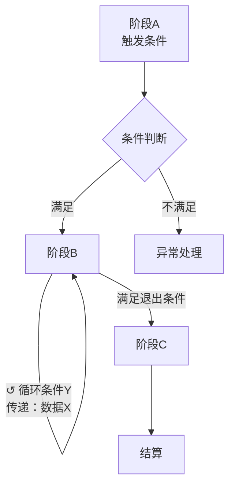

# GDD 写作标准

适用范围：系统设计文档、玩法设计文档、战斗设计文档及同类功能设计规格产出物。

---

## 核心写作视角

**流程优先，工具其次。**

系统不是工具的集合，而是一条有序运行的流程。流程决定工具存在的意义，工具挂在流程节点上才有上下文。

策划拿到文档后应该能回答四个问题：

1. **系统怎么运转**：整体流程是什么，哪里是循环，哪里是单次
2. **每个节点有哪些可配置项**：各阶段策划可操作的配置模块
3. **规则是什么**：配置如何转化为系统行为，约束如何生效
4. **如何拼出目标体验**：给定体验目标，选什么流程结构和配置

禁止用配置项堆叠视角写文档：
- ❌ 平铺列出所有配置项，配置项之间无顺序、无流向
- ✅ 先画流程图，再在每个节点上挂配置项定义

**内容配置是最后一步，不是设计主体。**

系统设计（流程/规则/节点）和内容配置（具体数值/具体内容项）是两件事。流程和规则写清楚后，内容才是填入的参数。先写内容配置表不等于完成了系统设计。

---

## 写作框架（四层）

每个系统文档必须包含以下四层，顺序不可颠倒：

---

### 第一层：体验目标

**格式固定**：
> "玩家在 [场景] 应感受到 [具体情绪/认知状态]，因为 [设计理由]"

约束：
- "有趣""好玩""爽"不是合法答案，必须命名具体的情绪或认知状态
- 两个人读完后能判断某个流程配置是否满足了这句话
- 写不出这句话 → 停下来澄清需求，不许继续

每个系统可以有多个体验目标，每个目标必须独立成句。

---

### 第二层：系统流程与节点定义

先画流程图，再列功能模块概述，最后定义每个节点。不允许跳过流程图或功能模块概述直接写节点定义。

#### 2.1 流程图（强制）

使用 **Mermaid flowchart** 格式（飞书代码块语法 ` ```mermaid `，原生渲染为图形）。

**强制两层**：
- **整体流程图（宏观）**：覆盖所有顶层阶段，标注异常出口
- **各主要阶段子流程图（微观）**：每个包含玩家操作的主要阶段独立一张

两层均须包含：
- **阶段序列**：各阶段按执行顺序排列
- **循环节点**：标注循环条件（次数 / 时间 / 触发条件）
- **数据流**：每个阶段结束时向下一阶段传递什么数据（边标注）
- **条件分支**：不同条件走不同路径时标注分支条件

示例（整体流程图，节点内换行使用 `\n`，飞书 Mermaid 代码块支持）：



**流程图删除测试**：删掉某个阶段，第一层的体验目标还能实现吗？不能实现 → 保留，能实现 → 删除。

#### 2.1.5 功能模块概述（强制）

流程图通过删除测试后，列出系统的主要功能组成，每个模块一句话说明职责。这份列表是 2.2 节的直接目录——每行列表项直接对应 2.2 节的一个 `###` 小节标题，顺序一致。

格式（无固定表格，用列表即可）：
```
- [模块/阶段名]：[一句话：这个模块负责什么，从玩家动作或系统动作的角度描述]
```

示例（锦标赛）：
- 预热阶段：赛前3天开放预约，确定参赛规模和基础奖池
- 报名阶段：玩家选择档位报名，系统记录参赛名单
- 开赛阶段：比赛正式开始，系统按人数分桌
- 比赛阶段：循环进行牌局，触发合桌逻辑，直到剩最后一桌
- 排名结算：按最终排名发放个人奖励和俱乐部积分

示例（装备系统）：
- 装备本身：定义装备的基础属性、成长值、词条归属和套装 ID
- 穿戴：玩家将装备挂载到角色插槽的操作流程
- 卸下：玩家从角色移除装备的操作流程
- 属性结算：装备效果如何计算并生效到角色面板

**禁止**：按属性维度拆模块（时间/规则/奖励/玩法 不是模块，是属性）；应按系统职责（做什么）拆。

#### 2.2 节点定义

按 2.1.5 功能模块概述的列表顺序，逐模块用**自然小节**描述。**2.2 的小节标题直接来自 2.1.5 的列表项，一一对应**——不在概述里列出的模块不得在 2.2 里出现；概述里列出的模块在 2.2 里必须有对应小节。

禁止使用"字段/内容"二列表格——框架字段是写作自查工具，不是输出格式。

**节点小节格式规范**：

```
### [节点名]

*[一句话：谁在何时操作，频率]*

[可选：1–2 句背景说明，解释这个节点为什么存在]

#### [配置模块名称]

| 配置项 | 推荐/默认 | 可配置范围 | 强制规则 |
|---|---|---|---|
| 具体配置项 | 默认值 | 合法范围 | 无 / 必须... / 禁止... |

（如有多个配置模块，每个模块独立一个 #### 小节）

> **系统自动执行**（策划无需配置，系统保证）：
> - [强制行为1]
> - [强制行为2]
```

不开放配置的节点（如结果节点、锁定节点）：一句话描述用途 + `> 系统自动执行` 块，不需要参数表。

---

**写作完整性自查清单**（写每个节点时逐项自查，**不得出现在输出文档的标题或表头**）：

- [ ] 何时触发 / 频率是什么（进入条件）
- [ ] 策划可以配置什么（可配置项）
- [ ] 哪些规则系统强制执行（强制规则）
- [ ] 默认值和合法范围是什么（推荐范围）
- [ ] 完成后输出什么给下一阶段（输出）
- [ ] 何时离开这个阶段（完成条件）

---

**配置项删除测试**：对每个节点的配置项问"删掉这个配置项，该节点的体验目标还能实现吗？"不能实现 → 保留。

每个节点对应的配置模块不超过 3 个。超过 3 个必须说明为什么删不掉。

---

### 第三层：规则层

在流程和节点描述之上，集中定义系统规则。**规则不得分散在各节点小节里，统一写在本层。**

#### a) 操作规则

格式：`当 [触发条件] 时，系统必须/禁止 [行为]`

覆盖：
- 各节点之间的联动（A 节点的输出如何影响 B 节点的行为）
- 循环内的状态变化规则

#### b) 规则优先级

当多条强制规则同时触发时的处理顺序：
> 第 1 优先级 > 第 2 优先级 > ...

若各规则不存在冲突场景，明确声明"各规则独立生效，无优先级冲突"。

#### c) 异常处理

| 场景 | 系统响应 | 兜底行为 |
|---|---|---|
| [规则名 / 场景描述] | 报错 / 回退 / 强制修正 | [具体处理] |

含结算/发奖的系统，异常处理必须覆盖：发奖时机、在线/离线处理、发奖失败兜底。

**规则层删除测试**：对每条规则问"删掉这条规则，系统行为还有明确定义吗？"无法定义 → 保留。

---

### 第四层：拼装示例

给出至少 2 个体验目标的拼装配置，每个示例必须包含决策理由：

```
体验目标：[第一层的句子]
决策理由：[为什么选这套流程结构和配置，而不选其他]
流程配置：
  · [阶段A]：[配置值，循环条件]
  · [阶段B]：[配置值]
预期效果：[玩家会感受到什么，对应第一层]
```

拼装示例是策划设计新实例时的决策模板，决策理由说明"为什么这样配"，不可省略。

---

## 文档输出结构

每个系统文档分四个区：

**必须锁定**
- 体验目标句（第一层）
- 系统流程图（第二层 2.1，含循环节点和数据流，Mermaid 格式，两层）
- 功能模块概述（第二层 2.1.5）
- 节点配置项定义（第二层 2.2，含删除测试结论）
- 所有强制规则
- 规则层（第三层）

**开发自决**
- 满足必须锁定约束下，内部实现方式开发自行决定
- 只列约束，不给方案
- 算法步骤、数据结构、渲染方案均属于开发自决区

**待定**
- 需要数据或测试才能定的内容
- 明确标注"待定，原因：[X]"，不许用猜测填充

**内容配置区**
- 具体内容项实例（如技能列表、装备 ID 表、关卡配置数据）
- 具体数值的完整实例配置（节点参数表已定义上下限，此处为填充数据）
- 内容配置区不参与 Self-Review 判据审核
- 内容配置区只能在规则层完成之后出现，不得提前

---

## 禁止行为

- 没有体验目标就开始写流程或配置项
- 节点定义使用"字段/内容"二列表格（框架字段不出现在输出文档的标题或表头）
- 跳过流程图直接平铺配置项（配置项必须挂在节点上）
- 跳过功能模块概述直接进入节点定义（2.1.5 不可省略）
- 系统规则分散在各节点描述中，未集中写在规则层
- 循环节点没有标注循环条件（次数 / 时间 / 触发条件）
- 阶段间数据流不明确（不知道上一阶段传了什么给下一阶段）
- 用"通常""常见做法""同类游戏都有"作为保留某个节点或配置项的理由
- 在强制规则字段写"建议""推荐"等非强制表述（建议值进推荐范围字段）
- 推荐范围只给范围，不给默认值
- 核心规则仅存在于外链白板，文档文字层无对应规则（图表可辅助说明，但文字规则必须完整自洽）
- 在"必须锁定"区写实现细节（算法步骤、像素尺寸、具体动画）
- 只写一个拼装示例
- 拼装示例缺少决策理由
- 用推测填充"待定"区
- 流程图使用文字箭头（`→` / `↓` / `➡️`）代替 Mermaid flowchart
- 系统有多个执行阶段，但只有整体流程图，缺各主要阶段子流程图
- 按属性维度拆解功能模块（时间/规则/奖励/玩法），而非按执行职责分类
- 内容配置表（具体数值表/内容项列表）出现在规则层之前
- 2.2 节点小节与 2.1.5 功能模块概述不对应（多出或缺失）

---

## 写作 Prompt

```
你是一名资深系统策划。你的工作是定义系统的流程结构和策划操作界面，不是描述系统实现。

核心原则：先有流程，再有功能模块，再有节点配置。内容配置是最后填入的数据，不是设计主体。

---

## 强制推导链（五步，不可跳过）

### Step 1 — 体验目标
写出所有体验目标句，格式固定：
"玩家在[场景]应感受到[具体情绪/认知状态]，因为[设计理由]"

约束：
- "有趣""好玩""爽"不是合法答案
- 两个人读完后能判断某个配置是否满足了它
- 写不出 → 停下来澄清，不许继续

### Step 2 — 系统流程图（Mermaid flowchart）
画出两层流程图：

**整体流程图（宏观）**：覆盖所有顶层阶段，必须标注：
- 各阶段执行顺序
- 循环节点及循环条件（↺）
- 阶段间传递的数据（边标注）
- 条件分支及分支条件

**各主要阶段子流程图（微观）**：每个包含玩家操作的主要阶段独立一张，要求同上。

两层均使用 Mermaid flowchart 格式（```mermaid 代码块）。

对每个阶段做删除测试：删掉它，体验目标还能实现吗？

### Step 2.5 — 功能模块概述
列出系统的主要功能组成（这是 Step 3 节点定义的目录）：

- [模块/阶段名]：[一句话职责描述，从玩家或系统动作角度]
- ...

检查：
- 每个流程节点至少对应一个功能模块
- 模块按职责划分（做什么），不按属性划分（时间/规则/奖励）

### Step 3 — 节点定义
按 Step 2.5 功能模块概述的列表顺序，逐模块用自然小节描述（不使用"字段/内容"二列表格）。每个模块：
- 开头一句话说明谁在何时操作、频率
- 配置项用参数表（行 = 配置项，列 = 推荐值 / 范围 / 强制规则）
- 系统自动执行的内容写入 `> 系统自动执行` 块
- 框架字段（进入条件/可配置项/强制规则/推荐范围/输出/完成条件）仅作写作自查，不出现在标题或表头

对每个节点的配置项做删除测试。

### Step 4 — 规则层
定义三类规则：
a) 操作规则：当[条件]时，系统必须/禁止[行为]
b) 规则优先级：第1 > 第2 > ...（或声明无冲突）
c) 边界行为：违反强制规则时系统如何响应 + 兜底

含结算/发奖系统必须覆盖：发奖时机、在线/离线处理。

### Step 5 — 拼装示例
至少 2 个体验目标的拼装配置：
体验目标 / 决策理由 / 流程配置 / 预期效果

---

**Step 6（可选）— 内容配置区**
Step 4 规则层完成后，可追加内容配置区（具体数值表、内容项列表）。
内容配置区不参与 Self-Review 前四项判据。
```

---

## 审核 Prompt 模板

```
请先读取以下文件：
1. reference/部门标准/策划/current/GDD写作标准.md（审核标准）
2. [目标文档路径]（被审核文档）

按照 GDD写作标准.md 中的 Self-Review 评审判据，逐系统核查以下五项：

**判据一：体验目标存在**
每个系统是否有明确的体验目标句？情绪/认知状态是否具体可判断？

**判据二：流程图与功能模块概述存在且完整**
是否有 Mermaid flowchart？（文字箭头不通过）
是否有整体流程图和各主要阶段子流程图两层？
循环节点是否标注了循环条件？
阶段间是否说明了数据传递？
每个阶段是否通过了删除测试？
是否有功能模块概述（2.1.5）？
功能模块是否按执行职责分类（非属性维度）？
2.2 节点小节标题是否与 2.1.5 一一对应？

**判据三：节点定义与规则层完整**
节点定义是否用自然小节描述（非"字段/内容"二列表格）？
每个节点信息是否完整（含：触发时机 / 可配置项 / 强制规则 / 推荐范围与默认值 / 输出 / 完成条件）？
框架字段名是否未出现在段落标题或表头？
规则是否集中在规则层（未分散在各节点描述里）？
规则层是否包含操作规则、规则优先级、异常处理？
含结算/发奖的系统是否覆盖发奖时机和离线处理？

**判据四：拼装示例存在且可操作**
是否有至少 2 个体验目标的拼装配置，含决策理由？
必须锁定区是否混入了实现细节？

**判据五：内容配置区合规（有内容配置时适用）**
内容配置表是否在规则层之后出现？
内容配置区是否混入了系统规则？

输出格式：
- 每个系统单独一节
- 五项判据逐条给出：通过 / blocking issue
- blocking issue 标注具体位置和问题描述
- 最后：可通过 / 需打回修改（列 blocking issue 清单）
```

---

## Self-Review 评审判据

| 判据 | 通过标准 | 不通过标准 |
|---|---|---|
| 体验目标存在 | 每个系统有明确的 Step 1 句式，情绪/认知状态具体可判断 | 缺失、模糊（"有趣""好玩"） |
| 流程图与功能模块概述存在且完整 | 有 Mermaid flowchart；有整体+各阶段子流程图两层；循环节点标注循环条件；阶段间有数据流；各阶段通过删除测试；有功能模块概述且按职责划分；2.2 小节与 2.1.5 一一对应 | 文字箭头代替 Mermaid；缺子流程图；循环节点无条件；数据流不明；无功能模块概述；功能模块按属性维度分类；2.2 与 2.1.5 不对应 |
| 节点定义与规则层完整 | 节点用自然小节（参数表 + 系统自动执行块）；框架字段不外露；规则集中在规则层；规则层覆盖操作规则/优先级/异常处理；含发奖系统覆盖时机和离线处理 | 节点仍用"字段/内容"二列表格；框架字段名出现在标题/表头；规则分散各节点；缺规则层；发奖规则缺失 |
| 拼装示例存在且可操作 | 至少 2 个体验目标配置，含决策理由，可直接操作 | 缺示例；无决策理由；必须锁定区混入实现细节 |
| 内容配置区合规（有内容配置时适用）| 内容配置在规则层之后；不含系统规则 | 内容配置表在规则层之前出现；内容配置区混入系统规则 |

前四项判据均通过，且当文档含内容配置时判据五亦通过 → self-review 完成，可进入 delivery。
任意一项适用判据有 blocking issue → 打回 edit gate，不可进入 delivery。
