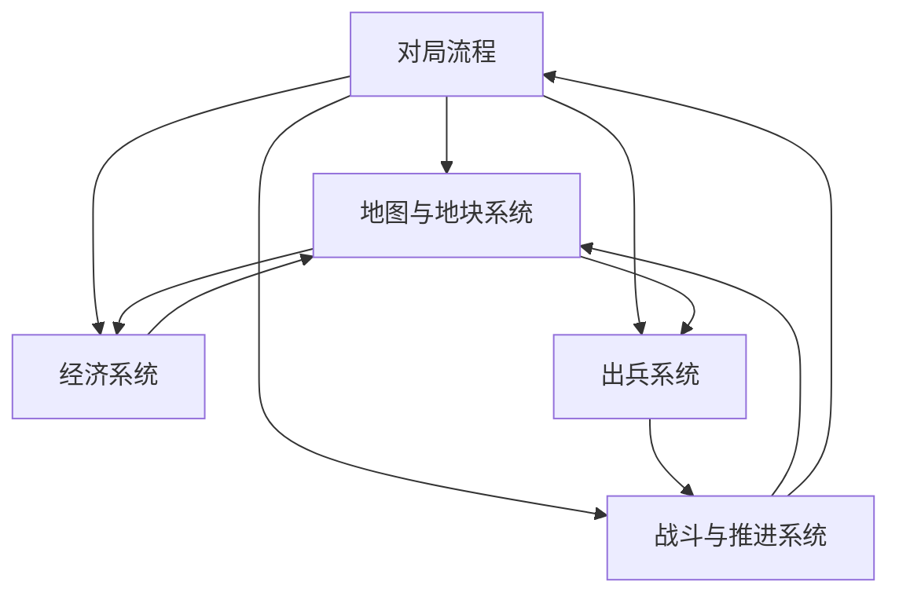

# 功能模块总览

## 模块分层

## 模块清单

| 模块 | 职责 | 输入 | 输出 | 不负责 |
|---|---|---|---|---|
| 地图与地块系统 | 管理上下结构地图、隐藏地块、翻开、归属、地块内容 | 点击、金币校验、战斗占领 | 地块状态变化、资源点/兵营暴露 | 不直接产金币、不直接生成单位 |
| 经济系统 | 计算金币产出、金币消耗、翻地成本 | HQ/矿数量、时间、翻地请求 | 当前金币、可翻状态 | 不决定翻哪块 |
| 出兵系统 | HQ/兵营按周期生成单位 | 建筑归属、建筑类型、时间 | 单位生成事件 | 不决定地块翻开 |
| 战斗与推进系统 | 单位移动、接敌、攻击、占领建筑或核心 | 单位、路径、目标建筑 | 敌我单位死亡、建筑归属改变 | 不处理金币 |
| 敌方 AI | 模拟敌方翻地、经济、出兵决策 | 敌方金币、前线、建筑状态 | 敌方翻地行为、推进方向 | 不作弊生成免费资源 |
| 对局流程 | 开局、胜负、结算、重开 | HQ 状态、时间、胜负触发 | 结算界面、下一局 | 不处理模块内部细节 |

## 主循环

1. 开局：双方拥有 HQ、少量起始地块、初始金币。
2. 经济 tick：HQ / 矿产出金币。
3. 玩家选择相邻未知地块，支付金币翻开。
4. 翻开结果：
   - 空地：扩大前线。
   - 矿：提高金币产出。
   - 兵营：提高出兵产能。
5. HQ / 兵营按周期产兵。
6. 单位向敌方方向移动，发生战斗。
7. 推进到敌方建筑或 HQ 时改变归属。
8. 一方 HQ 被占领，对局结束。

## 实现顺序

| 顺序 | 模块 | 原因 |
|---|---|---|
| 1 | 地图与地块系统 | 所有系统都依赖地块状态 |
| 2 | 经济系统 | 翻地必须先有金币约束 |
| 3 | 建筑系统 | 矿和兵营是经济 / 出兵接口 |
| 4 | 出兵系统 | 兵必须来自建筑，不来自按钮 |
| 5 | 战斗推进 | 验证兵营产出是否能改变战线 |
| 6 | 敌方 AI | 玩家闭环成立后再做对抗 |
| 7 | 结算与调参 | 最后才调节节奏 |
