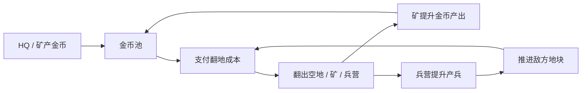

# 经济系统

## 职责

经济系统负责金币的产出、消耗、显示和可支付判断。

它的目标不是做复杂经营，而是让玩家形成“先翻矿还是先翻兵营 / 先扩经济还是先推进”的选择。

## 货币

第一版只需要一种货币：金币。

| 字段 | 含义 |
|---|---|
| coins | 玩家当前金币 |
| incomePerSecond | 当前每秒理论产出 |
| nextIncomeTick | 下次产出时间 |

## 金币来源

| 来源 | 产出 | 说明 |
|---|---|---|
| 主基地 HQ | 稳定产金币 | 保底经济，防止卡死 |
| 矿 | 更高产金币 | 翻出矿后提升经济 |
| 结算奖励 | 对局结束后奖励 | 第一版可暂不做 |

## 金币消耗

| 消耗项 | 是否必须 | 说明 |
|---|---:|---|
| 翻开隐藏地块 | 必须 | 核心消耗 |
| 攻占敌方地块 | 必须 | 应高于普通翻地 |
| Rush / 加速出兵 | 可选 | 第一版可以作为按钮技能 |
| 建筑升级 | 暂不做 | 不进入第一版 |

## 经济循环

## 成本曲线原则

成本必须让玩家感到：

- 起步能连续翻几格。
- 翻到中线后开始缺钱。
- 翻出矿后明显变顺。
- 不翻矿只翻前线会卡经济。

建议第一版参数：

| 类型 | 建议成本 |
|---|---:|
| 起始相邻隐藏地块 | 8-12 |
| 中线隐藏地块 | 14-22 |
| 敌方普通地块 | 18-28 |
| 敌方建筑地块 | 26-40 |

## 失败保护

避免玩家完全卡死：

- HQ 必须持续产金币。
- 翻地成本不能超过 HQ 长时间产出无法支付的范围。
- 如果所有前线格都买不起，等待 3-5 秒应该能继续翻至少一格。

## 验收标准

- 金币不是无限的。
- 翻地会扣金币。
- HQ 会产金币。
- 矿会提高金币产出。
- 金币不足时地块显示不可翻或成本变灰。
- 玩家能通过翻矿改变后续节奏。

