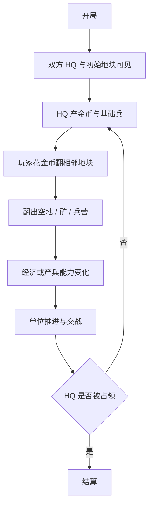

# 对局流程、敌方 AI 与验收清单

## 对局流程

## 敌方 AI

敌方 AI 第一版不需要聪明，但必须遵守同一套经济约束。

### AI 输入

- 敌方金币。
- 敌方可翻前线地块。
- 敌方已拥有矿 / 兵营数量。
- 玩家推进压力。

### AI 行为

| 行为 | 条件 | 说明 |
|---|---|---|
| 翻地 | 金币足够且存在前线格 | 默认向下靠近玩家 |
| 优先矿 | 敌方收入低时 | 补经济 |
| 优先兵营 | 敌方兵力弱时 | 补产能 |
| 攻占玩家建筑 | 单位推进到建筑 | 不消耗翻地金币，可走占领规则 |

### AI 禁止

- 不能免费翻地。
- 不能跳过隐藏地块直接翻玩家后排。
- 不能凭空生成单位。

## UI 需求

第一版需要显示：

| UI | 目的 |
|---|---|
| 当前金币 | 玩家知道能否翻地 |
| 收入 | 玩家知道矿是否有价值 |
| 矿数量 | 反馈经济建设 |
| 兵营数量 | 反馈产兵能力 |
| 地块成本 | 玩家知道每格要花多少钱 |
| 结算弹窗 | 明确胜负 |

## 第一版实现验收

必须全部满足：

- 地图是上下结构。
- 玩家点击相邻隐藏格才会翻。
- 每次翻格都会扣金币。
- 金币不足不能翻。
- 隐藏格翻开后可能为空、矿、兵营。
- HQ 和矿持续产金币。
- HQ 和兵营持续产兵。
- 兵不能穿过未翻开的隐藏地块。
- 敌方也遵守金币翻地和建筑出兵。
- HQ 被占领后结算。

## 不通过的表现

出现以下任一情况，说明实现偏了：

- 玩家可以无限点兵。
- 单位走过隐藏格自动翻开。
- 地图仍然是斜向推进。
- 所有格子只是在变色，没有内容差异。
- 没有金币卡点，玩家一直能随便翻。
- 翻出矿 / 兵营后，经济和出兵没有变化。

