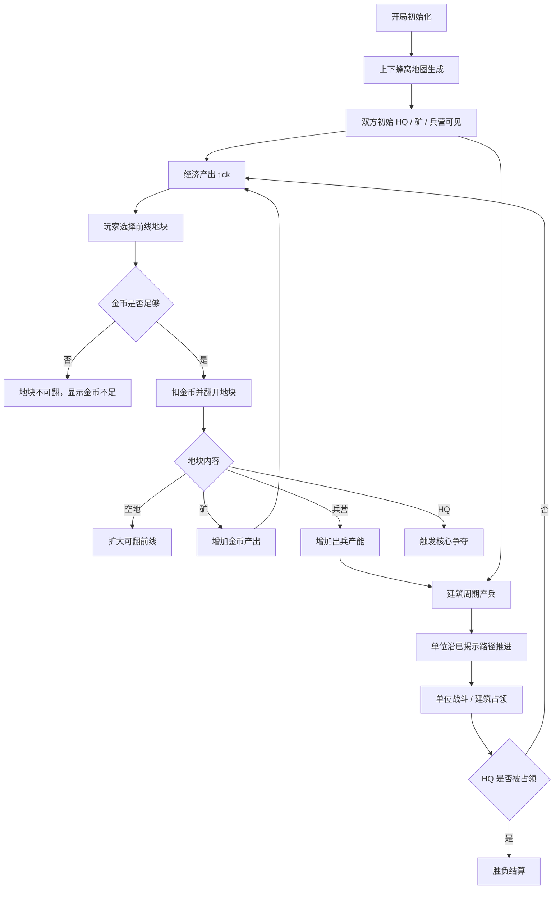

# 核心玩法总需求 GDD

## 一、需求目的

- 复刻视频中“上下对抗、花金币翻地、翻出建筑后改变经济和兵力”的核心体验，手段：通过上下蜂窝地图、地块隐藏内容、金币翻地、建筑产出和自动战斗形成闭环。
- 避免 Demo 变成无限点兵或自动染色游戏，手段：将玩家主动操作限定为“选择前线地块并支付金币翻开”，将兵力来源限定为 HQ 和兵营。
- 让玩家能通过翻地顺序形成策略差异，手段：地块内容分为空地、矿、兵营、HQ，并让矿影响金币产出、兵营影响出兵产能。
- 让实现团队能按模块重写 Demo，手段：将地图翻格、经济、建筑出兵、战斗推进、敌方 AI 和结算拆成独立 GDD，并定义模块接口。

## 二、需求概述

本功能是一个竖屏轻策略对局原型。玩家位于地图下方，敌方位于地图上方。双方通过 HQ 和已占建筑持续获得金币和士兵；玩家消耗金币翻开己方相邻地块，翻出的矿提高金币产出，翻出的兵营增加出兵能力。单位沿已揭示地块向敌方推进并争夺建筑，任一方 HQ 被占领后对局结束。

整体范围限制：

- 第一版只做单局对局，不做局外养成、联网 PvP、广告和内购。
- 第一版只做一种基础兵，后续再扩展兵种。
- 第一版使用规则化地图内容，不做随机地图生成器。
- 第一版敌方 AI 只需要遵守同一经济和翻地规则，不要求强智能。

## 三、功能概述

### 3.1 脑图/流程图

### 3.2 对局初始化

#### 功能说明

对局初始化负责生成上下结构地图、双方初始地块、建筑内容和初始金币，是所有模块的起点。

#### 操作流程

1. 玩家进入 Demo 页面。
2. 系统生成竖屏蜂窝地图，玩家 HQ 位于下方，敌方 HQ 位于上方。
3. 系统将双方起始区域设为已揭示并归属对应阵营。
4. 系统将中间区域设为隐藏地块。
5. 系统给双方分配初始金币。
6. 系统启动经济 tick、建筑产兵 tick 和敌方 AI tick。

#### 配置项

| 配置项 | 生效范围 | 默认值 | 可配置范围 | 说明 |
|---|---|---:|---|---|
| 地图列数 | 实例 | 9 | 7-11 | 控制横向地块数 |
| 地图行数 | 实例 | 14 | 10-18 | 控制上下推进距离 |
| 玩家初始金币 | 实例 | 65 | 30-150 | 影响开局可翻格数量 |
| 敌方初始金币 | 实例 | 65 | 30-150 | 影响敌方开局压力 |
| 初始可见行数 | 实例 | 3 | 1-4 | 双方起始区域可见范围 |

#### 规则/边界

- 若地图生成后玩家 HQ 或敌方 HQ 缺失，则本局不可开始，系统重新生成地图。
- 若任一方起始区域没有至少 1 个可翻前线格，则系统重新生成地图。
- 若中间隐藏区不包含矿或兵营，则系统重新生成地图或使用固定模板补齐。

### 3.3 主循环

#### 功能说明

主循环负责串联经济、翻地、建筑产出、战斗和结算，让单局持续推进。

#### 操作流程

1. 系统每帧更新单位移动、战斗和建筑占领。
2. 系统按经济 tick 给 HQ 和矿所属方增加金币。
3. 系统按出兵 tick 从 HQ 和兵营生成士兵。
4. 玩家在可操作期间点击前线地块发起翻地。
5. 敌方 AI 按规则选择敌方前线地块翻开。
6. 系统持续检查双方 HQ 归属。
7. 若玩家 HQ 被敌方占领，则进入失败结算。
8. 若敌方 HQ 被玩家占领，则进入胜利结算。

#### 规则/边界

- 若玩家不操作，HQ 仍然产金币和基础兵，避免对局完全停滞。
- 若玩家金币不足，经济 tick 仍继续，等待金币足够后可继续翻地。
- 若双方单位都无法抵达敌方目标，系统不自动穿越隐藏地块，应等待双方翻地扩展路径。

### 3.4 模块接口

#### 功能说明

模块接口定义各系统之间传递的数据，避免实现时互相越权。

#### 操作流程

1. 地图系统维护地块归属、揭示状态和内容。
2. 经济系统读取地图中的 HQ / 矿归属，输出金币变化。
3. 出兵系统读取地图中的 HQ / 兵营归属，输出单位生成。
4. 战斗系统读取已揭示地块作为路径，输出单位死亡和建筑占领。
5. 对局流程读取 HQ 归属，输出胜负状态。

#### 规则/边界

- 若经济系统需要判断可否翻地，只读取翻地成本和当前金币，不直接改变地块状态。
- 若战斗系统单位抵达隐藏地块边缘，不得自动揭示隐藏地块。
- 若建筑归属改变，经济和出兵系统必须在下一 tick 使用新的归属。

## 四、UE 交互

### 4.1 主界面布局

| 区域 | 内容 | 交互 |
|---|---|---|
| 顶部 HUD | 当前金币、对局时间、关卡编号 | 只读 |
| 地图区 | 蜂窝地块、建筑、单位、翻地成本 | 点击可翻地块 |
| 底部状态区 | 收入、矿数量、兵营数量、Rush 按钮 | Rush 可点击，状态项只读 |
| 结算层 | 胜负标题、奖励说明、下一局按钮 | 点击进入下一局 |

### 4.2 地块反馈

- 可翻地块显示金币成本。
- 金币不足时成本标记变灰。
- 点击可翻地块后，金币立即扣除，地块播放翻转动画。
- 翻出矿或兵营后，对应底部状态数字更新。

