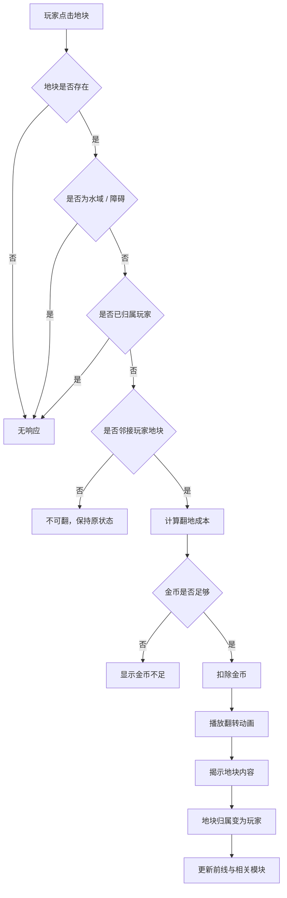

# 地图翻格系统 GDD

## 一、需求目的

- 还原视频中玩家通过翻开地块向上推进的核心操作，手段：将地图设计为上下结构蜂窝格，并限制玩家只能翻己方相邻前线地块。
- 让翻地成为消耗金币的决策，而不是免费扩张，手段：每个可翻地块显示金币成本，点击后扣除金币并揭示内容。
- 让翻地结果产生期待和路线选择，手段：隐藏地块翻开后可能出现空地、矿、兵营或核心建筑。
- 防止单位自动替代玩家翻地，手段：隐藏地块只能通过玩家或 AI 支付金币翻开，单位只能在已揭示路径中移动。

## 二、需求概述

地图翻格系统管理地块布局、地块状态、翻开条件、翻开成本、地块内容揭示和前线扩展。它不直接产金币、不直接产兵，只向经济系统和建筑系统提供地块内容和归属信息。

## 三、功能概述

### 3.1 脑图/流程图

### 3.2 地图布局

#### 功能说明

地图布局定义对局空间，必须让玩家从下方向上推进，敌方从上方向下推进。

#### 操作流程

1. 对局开始时，系统创建固定尺寸蜂窝地图。
2. 系统将玩家 HQ 放在地图下方核心位置。
3. 系统将敌方 HQ 放在地图上方核心位置。
4. 系统将玩家起始区域设为绿色已揭示地块。
5. 系统将敌方起始区域设为红色已揭示地块。
6. 系统将中间区域设为隐藏地块。
7. 系统在隐藏区域预埋空地、矿和兵营。

#### 配置项

| 配置项 | 生效范围 | 默认值 | 可配置范围 | 说明 |
|---|---|---:|---|---|
| 地图列数 | 实例 | 9 | 7-11 | 横向蜂窝格数量 |
| 地图行数 | 实例 | 14 | 10-18 | 纵向推进距离 |
| 玩家起始行数 | 实例 | 3 | 1-4 | 玩家可见起始区域 |
| 敌方起始行数 | 实例 | 3 | 1-4 | 敌方可见起始区域 |
| 障碍地块数量 | 实例 | 4 | 0-12 | 水域或不可通行格数量 |

#### 规则/边界

- 若 HQ 所在地块被配置为障碍，则系统忽略障碍配置并保留 HQ。
- 若障碍导致玩家 HQ 与中线完全不连通，则地图无效，系统使用备用地图模板。
- 若地图视觉方向不是玩家下、敌方上，则本模块不通过验收。

### 3.3 地块状态

#### 功能说明

地块状态决定地块是否可见、是否可点击、属于哪一方，以及是否参与经济或出兵。

#### 操作流程

1. 地块初始化为 Hidden、Player Owned、Enemy Owned 或 Blocked。
2. 玩家点击 Hidden 或 Enemy Owned 地块时，系统先判断是否邻接玩家地块。
3. 若满足翻地条件，系统将地块状态切换为 Player Owned，并将 `revealed` 设为 true。
4. 若地块原本为 Hidden，系统显示预设内容。
5. 若地块原本为 Enemy Owned，系统保留内容但切换归属。

#### 配置项

| 配置项 | 生效范围 | 默认值 | 可配置范围 | 说明 |
|---|---|---:|---|---|
| 默认隐藏地块占比 | 实例 | 55% | 30%-75% | 决定探索空间 |
| 初始玩家归属地块 | 实例 | 20 | 8-40 | 开局绿色区域规模 |
| 初始敌方归属地块 | 实例 | 20 | 8-40 | 开局红色区域规模 |

#### 规则/边界

- 若地块为 Hidden，则玩家只能看到问号和翻地成本，不显示具体内容。
- 若地块为 Blocked，则玩家点击后无响应，不扣金币。
- 若地块已属于玩家，则玩家点击后无响应，不重复扣金币。
- 若地块不邻接玩家地块，则玩家点击后无响应或显示不可达提示，不扣金币。

### 3.4 翻地成本

#### 功能说明

翻地成本决定玩家推进节奏，必须让金币成为真实限制。

#### 操作流程

1. 系统根据地块位置、状态和内容计算翻地成本。
2. 系统在可翻地块上显示成本。
3. 玩家点击地块时，系统再次计算成本。
4. 若当前金币足够，系统扣除金币并翻开地块。
5. 若当前金币不足，系统不翻地，并将成本显示为不足状态。

#### 配置项

| 配置项 | 生效范围 | 默认值 | 可配置范围 | 说明 |
|---|---|---:|---|---|
| 隐藏地块基础成本 | 全局 | 9 | 1-50 | 普通隐藏地块最低成本 |
| 敌方地块基础成本 | 全局 | 14 | 1-80 | 攻占敌方地块最低成本 |
| 深度成本系数 | 全局 | 1.7 | 0-8 | 越靠近敌方越贵 |
| 建筑地块成本修正 | 全局 | 6 | 0-50 | 已知建筑地块额外成本 |

#### 规则/边界

- 若玩家金币不足，则地块不翻开，金币不变化。
- 若玩家在同一帧连续点击多个地块，则系统按点击顺序逐个校验金币。
- 若地块在点击瞬间被敌方占领，系统使用点击时的最新状态重新计算成本。

### 3.5 地块内容揭示

#### 功能说明

地块内容揭示负责给翻地结果提供差异，让玩家获得“翻出矿/兵营”的反馈。

#### 操作流程

1. 系统在地图初始化时为隐藏地块预设内容。
2. 玩家翻开隐藏地块后，系统读取该地块内容。
3. 若内容为空地，地块只扩展前线。
4. 若内容为矿，地块加入经济系统的产出列表。
5. 若内容为兵营，地块加入出兵系统的产兵列表。
6. 若内容为 HQ，系统进入核心争夺逻辑。

#### 配置项

| 配置项 | 生效范围 | 默认值 | 可配置范围 | 说明 |
|---|---|---:|---|---|
| 隐藏空地数量 | 实例 | 53 | 0-100 | 可探索普通地块 |
| 隐藏矿数量 | 实例 | 2 | 0-20 | 经济增长点 |
| 隐藏兵营数量 | 实例 | 2 | 0-20 | 出兵增长点 |
| 内容是否随机 | 实例 | 否 | 是 / 否 | 第一版建议固定，便于调参 |

#### 规则/边界

- 若翻开内容为空地，则不得错误增加收入或产兵数量。
- 若翻开内容为矿，则经济系统必须在下一次经济 tick 读取到该矿。
- 若翻开内容为兵营，则出兵系统必须在下一次产兵 tick 读取到该兵营。
- 若内容随机开启，则必须保证双方地图资源总量公平或按关卡配置明确偏置。

## 四、UE 交互

### 4.1 地块显示

- Hidden 地块显示暗色和问号。
- 可翻地块显示金币成本。
- 金币不足的成本标记变灰。
- 已揭示空地显示归属颜色。
- 矿、兵营、HQ 显示建筑图标和归属颜色。

### 4.2 点击反馈

- 点击可翻地块：立即扣金币，播放翻转动画，显示内容。
- 点击金币不足地块：不扣金币，成本标记闪烁或显示不足提示。
- 点击不可达地块：不扣金币，可轻微抖动提示。

