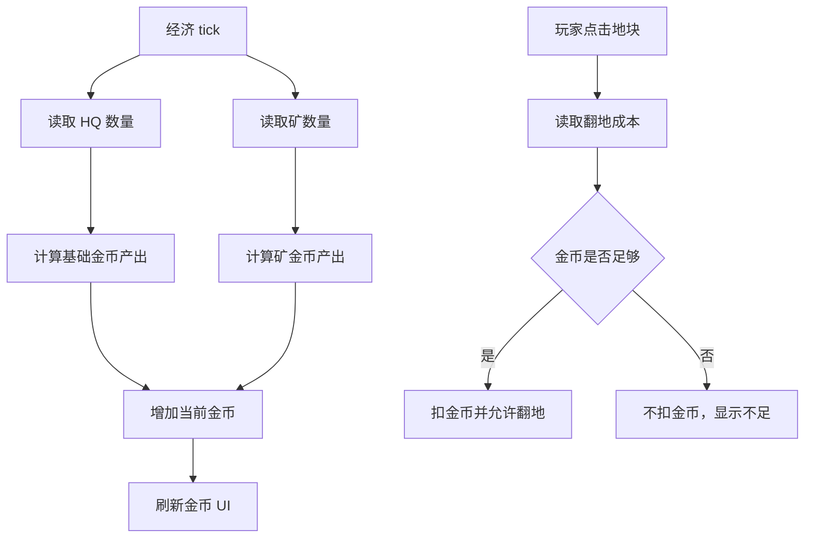

# 经济系统 GDD

## 一、需求目的

- 让金币成为翻地和推进的核心限制，手段：所有主动翻地必须消耗金币，金币不足时不能翻。
- 让玩家能通过翻出矿改变后续节奏，手段：HQ 和矿按周期产金币，矿数量直接提高收入。
- 防止玩家陷入永久卡死，手段：HQ 提供保底金币产出，使等待一段时间后至少能继续翻一格。
- 让敌方 AI 行为可信，手段：敌方也拥有金币、收入和翻地消耗，不允许免费扩张。

## 二、需求概述

经济系统管理玩家和敌方的金币产出、金币消耗、收入显示、金币不足状态和翻地支付校验。第一版只包含金币一种货币，不包含局外货币、广告奖励、内购和建筑升级。

## 三、功能概述

### 3.1 脑图/流程图

### 3.2 金币产出

#### 功能说明

金币产出负责给双方提供持续资源，是翻地循环的燃料。

#### 操作流程

1. 对局开始后，系统启动经济 tick。
2. 每次经济 tick，系统读取玩家拥有的 HQ 和矿。
3. 系统按建筑类型计算金币增量。
4. 系统把金币增量加入玩家当前金币。
5. 系统用同样规则计算敌方金币。
6. 系统刷新顶部金币和底部收入显示。

#### 配置项

| 配置项 | 生效范围 | 默认值 | 可配置范围 | 说明 |
|---|---|---:|---|---|
| HQ 金币产出 | 全局 | 3 / tick | 0-20 | 保底经济 |
| 矿金币产出 | 全局 | 5 / tick | 0-30 | 经济增长来源 |
| HQ 产出间隔 | 全局 | 1.35 秒 | 0.2-10 秒 | HQ 产金币频率 |
| 矿产出间隔 | 全局 | 1.8 秒 | 0.2-10 秒 | 矿产金币频率 |
| 初始金币 | 实例 | 65 | 0-300 | 开局可翻格数量 |

#### 规则/边界

- 若玩家没有矿，HQ 仍继续产金币。
- 若玩家 HQ 被敌方占领，则本局进入失败结算，不继续产金币。
- 若矿被敌方占领，则该矿从下一次经济 tick 起给敌方产金币。
- 若金币显示正在播放增加动画，不影响实际金币数计算。

### 3.3 翻地支付

#### 功能说明

翻地支付负责在地图系统翻开地块前完成金币校验和扣除。

#### 操作流程

1. 玩家点击可翻地块。
2. 地图系统请求经济系统校验该地块翻地成本。
3. 经济系统读取玩家当前金币。
4. 若金币大于等于成本，经济系统扣除对应金币。
5. 经济系统向地图系统返回“支付成功”。
6. 若金币不足，经济系统不扣金币。
7. 经济系统向地图系统返回“支付失败”。

#### 配置项

| 配置项 | 生效范围 | 默认值 | 可配置范围 | 说明 |
|---|---|---:|---|---|
| 是否允许负金币 | 全局 | 否 | 是 / 否 | 第一版必须为否 |
| 支付失败提示时长 | 全局 | 0.5 秒 | 0-3 秒 | 金币不足反馈 |

#### 规则/边界

- 若金币刚好等于成本，则允许支付，支付后金币为 0。
- 若金币小于成本，则不允许支付，金币不变化。
- 若同一地块被重复点击，只有第一次支付成功会触发翻地，后续点击不再扣金币。
- 若敌方 AI 翻地，使用敌方金币执行同样校验。

### 3.4 收入显示

#### 功能说明

收入显示让玩家知道矿和 HQ 的价值，帮助判断是否优先翻矿。

#### 操作流程

1. 系统每次地块归属变化后重新计算玩家收入。
2. 系统读取玩家 HQ 数量和矿数量。
3. 系统计算理论每秒收入。
4. 系统在底部状态区显示 `+X/s`。
5. 若玩家翻出或占领矿，收入显示在下一帧更新。

#### 配置项

| 配置项 | 生效范围 | 默认值 | 可配置范围 | 说明 |
|---|---|---:|---|---|
| 收入显示格式 | 全局 | `+X/s` | 文本格式 | 用于底部状态 |
| 收入取整方式 | 全局 | 向下取整 | 向下 / 四舍五入 | 影响显示，不影响实际 tick |

#### 规则/边界

- 若实际产出按 tick 计算，收入显示可以使用折算后的每秒值。
- 若收入为 0，则显示 `+0/s`，不得隐藏收入区域。
- 若矿被敌方占领，收入显示必须下降。

### 3.5 Rush 消耗

#### 功能说明

Rush 是可选加速按钮，用于消耗金币从当前 HQ 和兵营额外生成一波士兵。

#### 操作流程

1. 玩家点击 Rush 按钮。
2. 系统校验玩家金币是否大于等于 Rush 成本。
3. 若金币足够，系统扣除金币。
4. 系统从玩家当前拥有的 HQ 和兵营各生成一名士兵。
5. 若金币不足，Rush 按钮灰化或点击无响应。

#### 配置项

| 配置项 | 生效范围 | 默认值 | 可配置范围 | 说明 |
|---|---|---:|---|---|
| Rush 成本 | 全局 | 40 | 0-200 | 加速出兵消耗 |
| Rush 是否启用 | 全局 | 是 | 是 / 否 | 可用于第一版调试 |

#### 规则/边界

- 若玩家没有兵营但仍有 HQ，Rush 至少从 HQ 生成士兵。
- 若玩家金币不足，则 Rush 不扣金币，不生成士兵。
- 若对局已结束，则 Rush 按钮不可点击。

## 四、UE 交互

- 顶部 HUD 显示当前金币。
- 底部状态区显示收入、矿数量和 Rush 成本。
- 金币增加时可播放轻微跳字。
- 翻地扣金币时金币数字立即更新。
- 金币不足时可翻地块成本变灰，Rush 按钮灰化。

