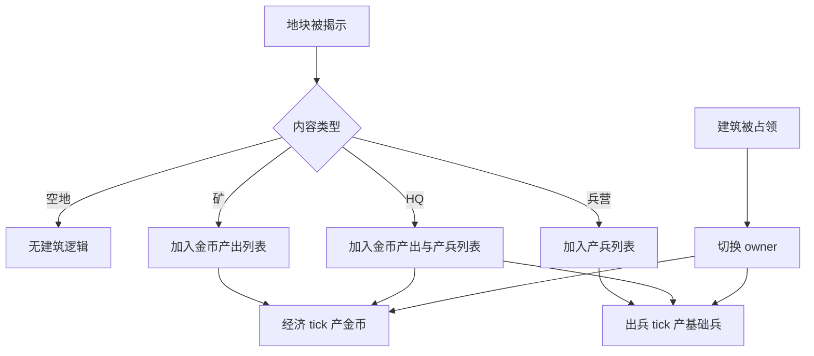

# 建筑与出兵系统 GDD

## 一、需求目的

- 将兵力来源绑定到地图建筑，手段：HQ 和兵营按周期自动生成士兵，玩家不能无限手动买兵。
- 让翻出兵营带来可感知收益，手段：玩家拥有的兵营越多，单位生成点越多、战场压力越强。
- 让建筑归属成为争夺目标，手段：矿、兵营、HQ 被占领后，其产出归属立即切换。
- 保持第一版可实现，手段：先只做基础兵和固定产出周期，不做兵种克制和建筑升级。

## 二、需求概述

建筑与出兵系统管理 HQ、矿、兵营三类建筑。HQ 和矿接入经济系统，HQ 和兵营接入出兵系统。建筑本身是地块内容的一种，归属跟随地块归属变化。

## 三、功能概述

### 3.1 脑图/流程图

### 3.2 建筑揭示

#### 功能说明

建筑揭示负责在隐藏地块翻开后，将矿或兵营接入对应系统。

#### 操作流程

1. 地图系统翻开隐藏地块。
2. 系统读取该地块预设内容。
3. 若内容为空地，建筑系统不处理。
4. 若内容为矿，建筑系统将该地块标记为当前归属方矿。
5. 若内容为兵营，建筑系统将该地块标记为当前归属方兵营。
6. 若内容为 HQ，建筑系统将该地块标记为核心建筑。

#### 配置项

| 配置项 | 生效范围 | 默认值 | 可配置范围 | 说明 |
|---|---|---:|---|---|
| 矿初始隐藏数量 | 实例 | 2 | 0-20 | 玩家可发现经济点 |
| 兵营初始隐藏数量 | 实例 | 2 | 0-20 | 玩家可发现产兵点 |
| HQ 数量 | 实例 | 双方各 1 | 固定 | 第一版固定 |

#### 规则/边界

- 若隐藏地块内容为空地，则不得加入矿或兵营列表。
- 若翻开兵营时地块归属玩家，则兵营立即归属玩家。
- 若翻开兵营时地块归属敌方，则兵营立即归属敌方。
- 若建筑地块归属改变，建筑归属必须同步改变。

### 3.3 HQ 产出

#### 功能说明

HQ 是核心建筑，提供保底金币和基础士兵，同时作为胜负目标。

#### 操作流程

1. 对局开始时，双方各拥有 1 个 HQ。
2. HQ 每隔固定时间为所属方产金币。
3. HQ 每隔固定时间为所属方生成基础兵。
4. 士兵从 HQ 所在地块生成，向敌方目标推进。
5. 若 HQ 被敌方占领，对局流程进入结算。

#### 配置项

| 配置项 | 生效范围 | 默认值 | 可配置范围 | 说明 |
|---|---|---:|---|---|
| HQ 金币产量 | 全局 | 3 | 0-20 | 每次经济 tick 产出 |
| HQ 金币间隔 | 全局 | 1.35 秒 | 0.2-10 秒 | 金币产出频率 |
| HQ 出兵间隔 | 全局 | 3.8 秒 | 0.5-20 秒 | 基础兵生成频率 |
| HQ 士兵是否加强 | 全局 | 是 | 是 / 否 | 第一版可让 HQ 兵略强 |

#### 规则/边界

- 若 HQ 被占领，则立即触发胜负，不等待下一 tick。
- 若 HQ 正在产出动画中被占领，则未完成的产出取消。
- 若 HQ 所属方没有其他建筑，HQ 仍可独立产金币和士兵。

### 3.4 矿产出

#### 功能说明

矿提供高于 HQ 的金币产出，是玩家优先翻地和争夺的经济目标。

#### 操作流程

1. 玩家翻开矿地块。
2. 系统将矿加入玩家矿列表。
3. 到达矿产出 tick 时，系统为玩家增加金币。
4. 若矿被敌方占领，则从下一次 tick 起为敌方增加金币。
5. UI 中矿数量和收入显示同步更新。

#### 配置项

| 配置项 | 生效范围 | 默认值 | 可配置范围 | 说明 |
|---|---|---:|---|---|
| 矿金币产量 | 全局 | 5 | 0-30 | 每次矿 tick 产出 |
| 矿产出间隔 | 全局 | 1.8 秒 | 0.2-10 秒 | 矿产出频率 |

#### 规则/边界

- 若矿未揭示，则不产金币。
- 若矿为玩家所有，则只给玩家产金币。
- 若矿被敌方占领，则玩家收入立即下降，敌方收入上升。

### 3.5 兵营产兵

#### 功能说明

兵营提供主要兵力，是推进速度和战线压力的核心来源。

#### 操作流程

1. 玩家翻开兵营地块。
2. 系统将兵营加入玩家产兵列表。
3. 到达兵营产兵 tick 时，系统在兵营地块生成基础兵。
4. 士兵沿已揭示路径向最近敌方建筑或 HQ 移动。
5. 若兵营被敌方占领，则从下一次 tick 起为敌方产兵。

#### 配置项

| 配置项 | 生效范围 | 默认值 | 可配置范围 | 说明 |
|---|---|---:|---|---|
| 兵营出兵间隔 | 全局 | 2.6 秒 | 0.5-20 秒 | 兵营产兵频率 |
| 单次出兵数量 | 全局 | 1 | 1-10 | 每次 tick 生成单位数 |
| 基础兵生命 | 全局 | 11 | 1-200 | 第一版单位 HP |
| 基础兵速度 | 全局 | 62 | 1-300 | 第一版单位移动速度 |

#### 规则/边界

- 若兵营未揭示，则不产兵。
- 若兵营被占领，当前未完成产兵进度归零或转移，第一版建议归零。
- 若兵营周围没有已揭示可通行路径，士兵生成后停留或等待路径打开，不穿越隐藏地块。

## 四、UE 交互

- HQ 显示 `HQ` 标识。
- 矿显示 `MINE` 或金币图标。
- 兵营显示 `BAR` 或兵营图标。
- 建筑产金币时显示金币跳字。
- 建筑产兵时播放脉冲或小兵生成动画。
- 底部显示当前玩家矿数量和兵营数量。

