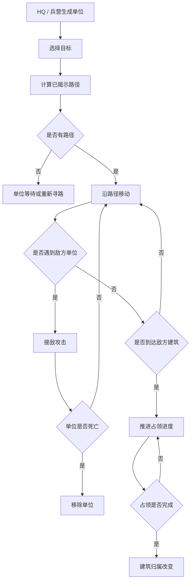

# 战斗推进系统 GDD

## 一、需求目的

- 让兵营产出的士兵能实际改变战线，手段：单位从 HQ / 兵营生成后沿已揭示路径向敌方建筑推进。
- 防止士兵替代翻地核心操作，手段：单位不能穿过隐藏地块，也不能自动翻开隐藏地块。
- 让建筑争夺产生胜负变化，手段：单位接近敌方建筑后推进占领进度，建筑归属改变后影响经济和出兵。
- 保持第一版可调试，手段：只做基础兵、简单接敌攻击和建筑占领，不做复杂技能。

## 二、需求概述

战斗推进系统管理单位生成后的移动、寻路、接敌、攻击、死亡和建筑占领。单位只能在已揭示、可通行地块上移动。战斗结果会改变建筑归属，进而影响经济和出兵系统。

## 三、功能概述

### 3.1 脑图/流程图

### 3.2 单位目标选择

#### 功能说明

单位目标选择决定单位生成后向哪里走，影响战斗聚焦点。

#### 操作流程

1. 单位从 HQ 或兵营生成。
2. 系统读取该单位所属阵营。
3. 系统查找已揭示的敌方建筑。
4. 系统按目标优先级选择目标。
5. 系统为单位计算路径。

#### 配置项

| 配置项 | 生效范围 | 默认值 | 可配置范围 | 说明 |
|---|---|---|---|---|
| 玩家目标优先级 | 全局 | 兵营 > 矿 > HQ > 普通地块 | 枚举顺序 | 控制进攻倾向 |
| 敌方目标优先级 | 全局 | 兵营 > 矿 > HQ > 普通地块 | 枚举顺序 | 控制 AI 进攻倾向 |
| 目标刷新间隔 | 全局 | 0.5 秒 | 0.1-5 秒 | 单位重新寻路频率 |

#### 规则/边界

- 若不存在已揭示敌方建筑，则单位选择最近敌方已揭示普通地块。
- 若不存在任何可攻击目标，则单位停留在原地并等待下一次目标刷新。
- 若当前目标被己方占领，则单位重新选择目标。

### 3.3 单位移动

#### 功能说明

单位移动负责将单位沿已揭示路径推向目标。

#### 操作流程

1. 系统根据单位当前位置和目标位置计算路径。
2. 路径只允许经过已揭示、非障碍地块。
3. 单位按速度沿路径移动。
4. 若路径中途被阻断，单位重新寻路。
5. 若没有路径，单位等待。

#### 配置项

| 配置项 | 生效范围 | 默认值 | 可配置范围 | 说明 |
|---|---|---:|---|---|
| 基础兵移动速度 | 全局 | 62 | 1-300 | 像素或格子速度 |
| 寻路是否允许经过敌方地块 | 全局 | 是 | 是 / 否 | 第一版允许经过已揭示敌方地块并触发战斗 |
| 是否允许经过隐藏地块 | 全局 | 否 | 固定否 | 核心约束 |

#### 规则/边界

- 若路径需要经过隐藏地块，则该路径无效。
- 若单位到达隐藏地块边缘，不自动翻开该地块。
- 若单位和敌方单位重叠，则进入接敌攻击，不继续穿过对方。

### 3.4 接敌攻击

#### 功能说明

接敌攻击负责处理双方单位接触后的伤害和死亡。

#### 操作流程

1. 系统检测单位之间的距离。
2. 若敌我单位距离小于接敌半径，则双方进入攻击状态。
3. 单位按攻击间隔对敌方造成伤害。
4. 若单位生命值小于等于 0，系统移除该单位。
5. 若接敌范围内没有敌方单位，单位恢复移动。

#### 配置项

| 配置项 | 生效范围 | 默认值 | 可配置范围 | 说明 |
|---|---|---:|---|---|
| 基础兵生命值 | 全局 | 11 | 1-200 | 单位生命 |
| 基础兵伤害 | 全局 | 4 | 1-100 | 单次攻击伤害 |
| 攻击间隔 | 全局 | 0.36 秒 | 0.1-5 秒 | 单位攻击频率 |
| 接敌半径 | 全局 | 13 | 1-80 | 判定接战距离 |

#### 规则/边界

- 若两个单位同时死亡，系统同时移除双方，不保留先后优势。
- 若多个敌方单位在范围内，第一版可攻击最近目标。
- 若单位死亡时正在占领建筑，则该单位贡献的占领进度停止增加。

### 3.5 建筑占领

#### 功能说明

建筑占领负责把战斗推进结果转化为地图和产出变化。

#### 操作流程

1. 单位进入敌方建筑所在地块或邻近占领范围。
2. 系统判断该建筑是否为敌方归属。
3. 若范围内没有敌方单位干扰，占领进度随时间增加。
4. 若敌方单位进入范围，占领暂停或下降。
5. 当占领进度达到阈值，建筑归属切换为占领方。
6. 若被占领建筑为 HQ，则对局进入结算。

#### 配置项

| 配置项 | 生效范围 | 默认值 | 可配置范围 | 说明 |
|---|---|---:|---|---|
| 普通建筑占领时间 | 全局 | 2 秒 | 0.2-20 秒 | 矿/兵营占领耗时 |
| HQ 占领时间 | 全局 | 3 秒 | 0.2-30 秒 | 核心建筑更难占领 |
| 敌方干扰是否暂停占领 | 全局 | 是 | 是 / 否 | 第一版建议暂停 |

#### 规则/边界

- 若建筑占领完成，则经济和出兵系统从下一 tick 起使用新归属。
- 若 HQ 占领完成，则立即触发胜负，不等待经济或出兵 tick。
- 若占领过程中所有己方单位死亡，则占领进度暂停或回退，第一版建议缓慢回退。

## 四、UE 交互

- 单位使用不同颜色描边区分阵营。
- 单位血量用短血条显示。
- 建筑被占领时显示进度环或进度条。
- 单位死亡播放小粒子反馈。
- HQ 被占领时立即弹出结算层。

