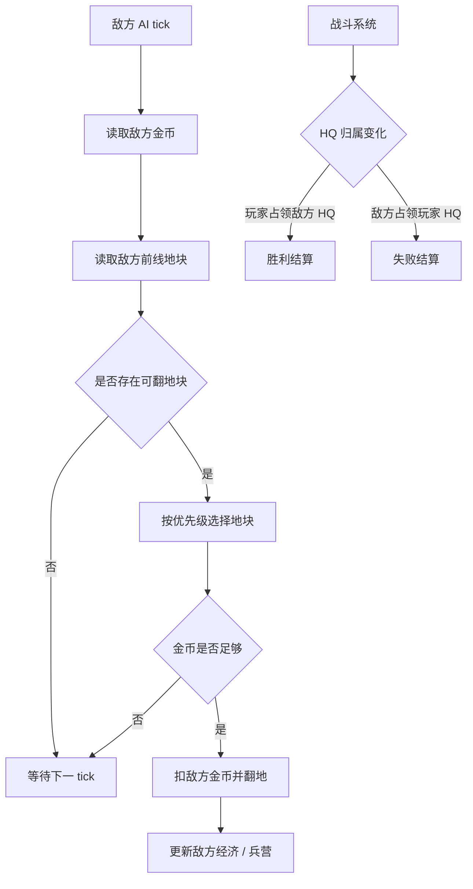

# 敌方 AI 与结算 GDD

## 一、需求目的

- 让对局形成上下双方对抗，而不是玩家单方面翻图，手段：敌方 AI 使用同一套金币、翻地、建筑产出和出兵规则向下推进。
- 保证敌方行为可信，手段：敌方不能免费翻地、不能跳过隐藏地块、不能凭空生成单位。
- 明确胜负判定，手段：任一方 HQ 被对方占领时立即进入结算。
- 让第一版便于调参，手段：AI 使用简单优先级，不做复杂策略。

## 二、需求概述

敌方 AI 负责模拟敌方在对局中的翻地和推进决策；结算负责监听 HQ 归属变化并展示胜负结果。第一版 AI 只需要按规则翻地和产兵，不需要预测玩家策略。

## 三、功能概述

### 3.1 脑图/流程图

### 3.2 敌方翻地 AI

#### 功能说明

敌方翻地 AI 负责让敌方按同样经济约束向玩家方向扩张。

#### 操作流程

1. 系统按固定间隔触发敌方 AI tick。
2. AI 读取敌方当前金币。
3. AI 查找所有与敌方地块相邻、且不属于敌方的可翻地块。
4. AI 按地块优先级排序。
5. AI 选择成本可支付的最高优先级地块。
6. AI 扣除敌方金币并翻开地块。
7. 若无可支付地块，AI 等待下一 tick。

#### 配置项

| 配置项 | 生效范围 | 默认值 | 可配置范围 | 说明 |
|---|---|---:|---|---|
| AI 翻地间隔 | 全局 | 1.55 秒 | 0.2-10 秒 | 敌方尝试翻地频率 |
| AI 优先方向 | 实例 | 向下 | 向下 / 最近玩家建筑 | 控制敌方推进方向 |
| AI 是否使用同金币池 | 全局 | 是 | 固定是 | 禁止免费扩张 |

#### 规则/边界

- 若敌方金币不足，则 AI 不翻地，不透支金币。
- 若候选地块不邻接敌方地块，则 AI 不可翻。
- 若候选地块是玩家后排但中间未连通，则 AI 不可跳翻。
- 若 AI 翻出矿或兵营，该建筑立即归属敌方并参与后续产出。

### 3.3 AI 优先级

#### 功能说明

AI 优先级决定敌方先扩经济、先补兵营还是直线压 HQ。

#### 操作流程

1. AI 统计敌方矿数量和兵营数量。
2. 若敌方收入低于目标值，AI 优先翻可能靠近矿的路线。
3. 若敌方兵营数量低于目标值，AI 优先翻可能靠近兵营的路线。
4. 若敌方经济和产兵都达标，AI 优先向玩家 HQ 方向翻地。
5. 第一版若不知道隐藏内容，则按地图深度和接近玩家 HQ 程度排序。

#### 配置项

| 配置项 | 生效范围 | 默认值 | 可配置范围 | 说明 |
|---|---|---:|---|---|
| AI 目标矿数量 | 全局 | 1 | 0-10 | 低于该值偏经济 |
| AI 目标兵营数量 | 全局 | 1 | 0-10 | 低于该值偏产兵 |
| AI 进攻权重 | 全局 | 1 | 0-10 | 越高越直冲玩家 HQ |

#### 规则/边界

- 若隐藏内容对 AI 不可见，则 AI 不能直接按隐藏内容作弊选择矿或兵营。
- 若第一版为方便调参让 AI 知道隐藏内容，必须在文档和调试开关中标注为“作弊 AI”，默认关闭。
- 若 AI 没有可翻地块但仍有单位，单位继续按战斗系统推进。

### 3.4 胜负判定

#### 功能说明

胜负判定负责定义对局结束条件，避免使用“胜利/失败”自引用。

#### 操作流程

1. 系统每帧检查玩家 HQ 和敌方 HQ 的归属。
2. 若敌方 HQ 的 owner 变为玩家，则玩家胜利。
3. 若玩家 HQ 的 owner 变为敌方，则玩家失败。
4. 系统停止经济 tick、AI tick、出兵 tick 和单位行动。
5. 系统展示结算弹窗。

#### 配置项

| 配置项 | 生效范围 | 默认值 | 可配置范围 | 说明 |
|---|---|---|---|---|
| 胜利条件 | 全局 | 敌方 HQ 归属变为玩家 | 固定 | 第一版核心胜利条件 |
| 失败条件 | 全局 | 玩家 HQ 归属变为敌方 | 固定 | 第一版核心失败条件 |
| 结算延迟 | 全局 | 0 秒 | 0-3 秒 | 可用于播放占领动画 |

#### 规则/边界

- 若同一帧双方 HQ 都被占领，第一版按先完成占领进度的一方判定；若无法判断先后，判为失败或平局需配置，默认失败。
- 若对局已结算，则任何后续点击、AI 翻地和单位伤害都不再生效。
- 若玩家点击下一局，系统重新初始化地图、金币、单位和计时器。

### 3.5 结算展示

#### 功能说明

结算展示负责让玩家明确为什么赢或输，并提供下一局入口。

#### 操作流程

1. 胜负判定触发结算。
2. 系统显示遮罩层。
3. 系统展示胜利或失败标题。
4. 系统展示简短原因，例如“Enemy HQ Flipped”或“HQ Lost”。
5. 玩家点击下一局按钮。
6. 系统重新开始对局。

#### 配置项

| 配置项 | 生效范围 | 默认值 | 可配置范围 | 说明 |
|---|---|---|---|---|
| 胜利标题 | 全局 | Enemy HQ Flipped | 文本 | 胜利弹窗标题 |
| 失败标题 | 全局 | HQ Lost | 文本 | 失败弹窗标题 |
| 下一局按钮文案 | 全局 | Next Match | 文本 | 重开入口 |

#### 规则/边界

- 若结算弹窗显示时玩家点击地图，不响应翻地。
- 若玩家点击下一局，上一局单位和粒子必须清空。
- 若结算原因来自 HQ 被占领，弹窗文案必须明确 HQ 归属变化，不写笼统“战斗胜利”。

## 四、UE 交互

- 敌方翻地不需要玩家确认，但要有翻转动画，避免玩家感觉红色区域凭空扩张。
- 结算弹窗置于地图上层，背景半透明。
- 胜利和失败使用不同标题、颜色或图标。
- 下一局按钮保持唯一主要操作。

