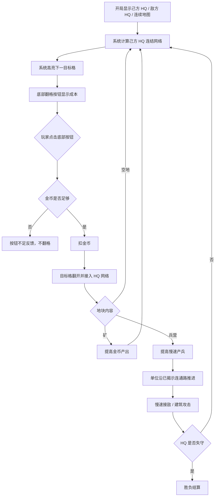

# 核心玩法总需求 GDD v2

## 一、需求目的

- 纠正上一版 demo 与参考交互不一致的问题，手段：将玩家核心输入改为点击底部翻格操作区，而不是点击地图地块。
- 保证玩家能看懂扩张来源，手段：己方 HQ 首屏可见，每次翻开的地块都必须通过可视连结接入己方 HQ 网络。
- 防止战斗压过翻格核心爽点，手段：首 60 秒以翻格、金币和建筑发现为主，出兵和战斗采用慢节奏。
- 支撑立项纸面原型补证，手段：围绕一分钟承接、十分钟成型、爽点成本定义模块和验收。

## 二、需求概述

本功能是一个竖屏轻策略灰盒。玩家位于下方，敌方位于上方，双方处于同一张连续蜂窝地图。玩家点击底部翻格按钮，系统翻开一个与己方 HQ 网络相邻的目标地块。翻出空地会扩大网络，翻出矿会提高金币收入，翻出兵营会提高慢速出兵能力。单位只沿已揭示连通地块移动，最终以 HQ 被攻破或占领作为胜负结算。

第一版 v2 只验证单局核心，不做联网、商业化、局外养成和复杂兵种。

## 三、功能概述

### 3.1 脑图/流程图

### 3.2 首屏承接

#### 功能说明

首屏承接负责让玩家在 3-5 秒内看懂“我从下方基地出发，点底部按钮向上翻格”。

#### 操作流程

1. 玩家进入页面。
2. 系统显示下方己方 HQ，并用绿色或高亮标明归属。
3. 系统显示上方敌方方向或敌方 HQ。
4. 系统显示一张连续蜂窝地图。
5. 系统显示底部翻格按钮、金币和当前成本。
6. 系统高亮当前将被翻开的目标格，并显示该格与己方 HQ 的连结路径。

#### 规则/边界

- 若己方 HQ 不可见，则本局不得开始。
- 若底部翻格按钮不可见，则本局不得开始。
- 若目标格没有连结路径，则底部按钮禁用。

### 3.3 主循环

#### 功能说明

主循环负责串联底部翻格、基地连结、经济、建筑出兵和慢速战斗。

#### 操作流程

1. 系统计算当前 HQ 连结网络。
2. 系统选择并高亮下一目标格。
3. 玩家点击底部翻格按钮。
4. 系统校验金币。
5. 金币足够时翻开目标格并接入网络。
6. 翻出矿后，经济系统从下一 tick 开始增加收入。
7. 翻出兵营后，出兵系统从下一 tick 开始慢速产兵。
8. 单位沿已揭示连通路推进。
9. HQ 被攻破或占领后进入结算。

#### 规则/边界

- 若玩家点击地图地块，则只显示信息，不触发翻格。
- 若单位到达隐藏地块边缘，则停下或重新寻路，不自动翻开。
- 若战斗在首 60 秒内结束，则节奏配置不合格。

## 四、UE 交互

| 区域 | 显示内容 | 交互 |
|---|---|---|
| 地图上方 | 敌方 HQ 或敌方方向 | 只读 |
| 地图中部 | 连续蜂窝格、隐藏格、目标格 | 点击只查看，不翻格 |
| 地图下方 | 己方 HQ、基地网络连结线 | 只读 |
| 底部操作区 | 翻格按钮、成本、金币 | 点击触发翻格 |
