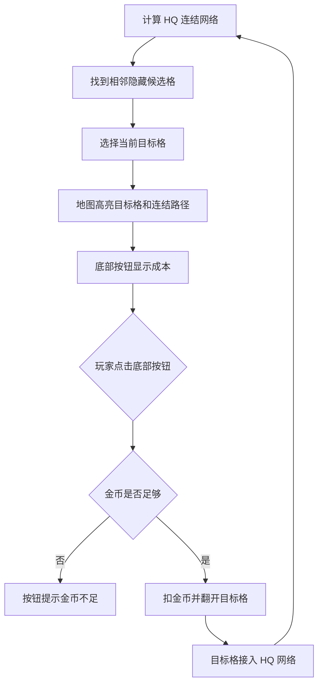

# 底部翻格与基地连结 GDD v2

## 一、需求目的

- 还原参考游戏的核心操作入口，手段：玩家通过底部翻格按钮触发揭示，不通过地图点击触发。
- 让翻格结果可解释，手段：每个目标格必须从己方 HQ 网络相邻产生，并显示连结路径。
- 防止地图出现孤岛或断层，手段：敌我双方必须处在同一张连续蜂窝地图中。

## 二、需求概述

本功能管理底部翻格按钮、目标格选择、金币成本展示、地块揭示和 HQ 连结网络。地图地块不承担核心点击输入，只承担展示、目标高亮和信息查看。

## 三、功能概述

### 3.1 脑图/流程图

### 3.2 HQ 连结网络

#### 功能说明

HQ 连结网络定义哪些地块真正属于玩家可扩张区域，是翻格合法性的根。

#### 操作流程

1. 系统从己方 HQ 所在格开始。
2. 系统遍历所有己方已揭示且可通行地块。
3. 系统形成 `connected_tile_ids`。
4. 系统只允许从该网络边缘选择目标格。

#### 配置项

| 配置项 | 生效范围 | 默认值 | 可配置范围 | 说明 |
|---|---|---|---|---|
| 连结是否必须从 HQ 出发 | 全局 | 是 | 固定是 | v2 核心约束 |
| 断开地块是否保留归属 | 全局 | 否 | 是 / 否 | 第一版建议否，避免孤岛 |

#### 规则/边界

- 若地块不能从己方 HQ 连通，则不得作为翻格目标。
- 若 HQ 被遮挡或移出首屏，则本模块验收失败。

### 3.3 底部翻格按钮

#### 功能说明

底部翻格按钮是玩家唯一的常规翻格入口。

#### 操作流程

1. 系统刷新当前目标格。
2. 按钮显示目标格成本。
3. 玩家点击按钮。
4. 系统校验金币。
5. 金币不足时，按钮播放不足反馈。
6. 金币足够时，系统扣金币并翻开目标格。

#### 配置项

| 配置项 | 生效范围 | 默认值 | 可配置范围 | 说明 |
|---|---|---:|---|---|
| 翻格基础成本 | 全局 | 10 | 1-100 | 每次翻格最低成本 |
| 成本增长系数 | 全局 | 1.2 | 0-10 | 越接近敌方越贵 |
| 前 3 次固定目标 | 实例 | 是 | 是 / 否 | 保证一分钟承接 |

#### 规则/边界

- 若玩家点击地图格子，则不得扣金币，不得翻开地块。
- 若当前没有合法目标格，则按钮禁用并显示“无可连接地块”。
- 若金币不足，则按钮可显示成本但不可完成翻格。

### 3.4 地块揭示

#### 功能说明

地块揭示负责把底部按钮操作转成地图上的新内容。

#### 操作流程

1. 系统读取目标格预设内容。
2. 系统播放翻开反馈。
3. 系统显示空地、矿或兵营。
4. 系统绘制 HQ 到该格的连结路径。
5. 系统刷新下一目标格。

#### 规则/边界

- 若翻出空地，则只扩大网络。
- 若翻出矿，则经济系统从下一 tick 生效。
- 若翻出兵营，则出兵系统从下一 tick 生效。
- 若翻开后没有连结路径显示，则本次反馈不合格。

## 四、UE 交互

- 当前目标格必须有明显边框或跳动提示。
- HQ 到目标格必须有连结线或连续高亮路径。
- 底部按钮文案必须表达“翻开下一格”，不能像出兵按钮。
- 地图点击可弹出地块信息，但不得触发翻格。
