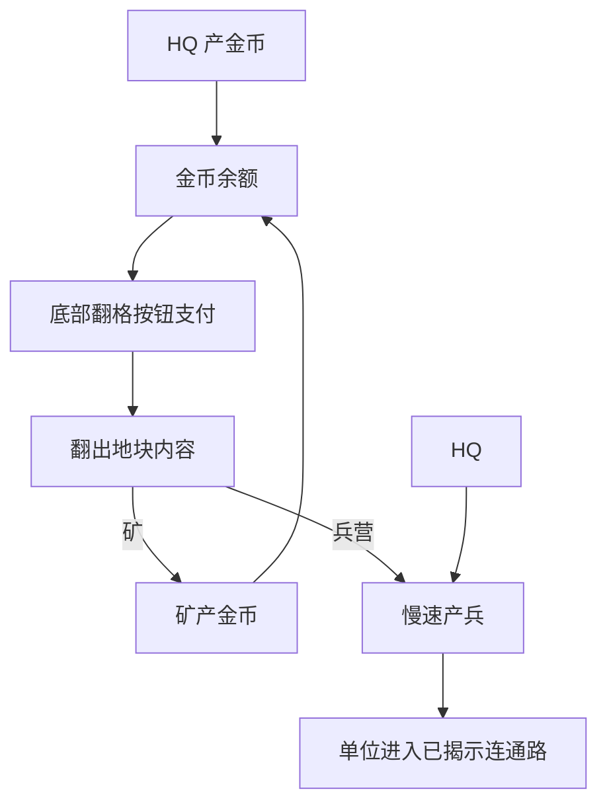

# 经济建筑与出兵节奏 GDD v2

## 一、需求目的

- 让金币成为翻格节奏限制，手段：HQ 和矿慢速产金币，底部翻格按钮消耗金币。
- 让矿和兵营成为翻格奖励，手段：矿改变金币恢复速度，兵营改变出兵能力。
- 防止出兵盖过翻格承接，手段：首个单位晚于第一次翻格反馈出现，整体战斗节奏慢于翻格节奏。

## 二、需求概述

本功能管理金币产出、翻格支付、建筑激活和慢速出兵。它服务于底部翻格主循环，不负责目标格选择，也不负责战斗结算。

## 三、功能概述

### 3.1 脑图/流程图

### 3.2 金币产出

#### 功能说明

金币产出决定玩家多久能再次点击底部翻格按钮。

#### 操作流程

1. 对局开始时，玩家拥有初始金币。
2. HQ 按固定间隔产金币。
3. 已接入 HQ 网络的矿按固定间隔产金币。
4. 金币变化后刷新底部按钮状态。

#### 配置项

| 配置项 | 生效范围 | 默认值 | 可配置范围 | 说明 |
|---|---|---:|---|---|
| 初始金币 | 实例 | 30 | 0-200 | 第一版只允许前几次翻格 |
| HQ 产金间隔 | 全局 | 3 秒 | 1-20 秒 | 不宜过快 |
| HQ 单次产出 | 全局 | 5 | 1-50 | 基础恢复 |
| 矿产金间隔 | 全局 | 4 秒 | 1-20 秒 | 翻出矿后的增益 |
| 矿单次产出 | 全局 | 8 | 1-100 | 应明显缩短等待 |

#### 规则/边界

- 若矿未接入 HQ 网络，则不得产金币。
- 若金币不足，则底部按钮不可完成翻格。

### 3.3 建筑激活

#### 功能说明

建筑激活负责让翻出的矿和兵营进入对应系统。

#### 操作流程

1. 地块被翻开。
2. 系统判断内容类型。
3. 若内容为矿，则加入产金列表。
4. 若内容为兵营，则加入产兵列表。
5. 建筑从下一 tick 开始生效。

#### 规则/边界

- 若建筑没有连到 HQ 网络，则不生效。
- 若建筑被敌方占领，则从下一 tick 起为敌方生效。

### 3.4 慢速出兵

#### 功能说明

慢速出兵用于表现建筑收益，但不能抢走首 60 秒的翻格主视觉。

#### 操作流程

1. HQ 在开局延迟后产出基础兵。
2. 已激活兵营按更慢或相近节奏产兵。
3. 单位生成后进入已揭示连通路。
4. 若没有通往目标的已揭示路径，单位等待。

#### 配置项

| 配置项 | 生效范围 | 默认值 | 可配置范围 | 说明 |
|---|---|---:|---|---|
| 首个单位延迟 | 全局 | 25 秒 | 5-90 秒 | 晚于第一次翻格反馈 |
| HQ 产兵间隔 | 全局 | 18 秒 | 5-120 秒 | 慢速基础兵 |
| 兵营产兵间隔 | 全局 | 14 秒 | 5-120 秒 | 比 HQ 略强 |
| 单屏最大己方单位 | 全局 | 6 | 1-20 | 防止画面过乱 |

#### 规则/边界

- 若首 60 秒单位数量超过翻格反馈的视觉重点，则节奏不合格。
- 若单位能穿过隐藏地块，则战斗模块不合格。

## 四、UE 交互

- 金币变化显示在底部按钮附近。
- 翻出矿后显示收入提升反馈。
- 翻出兵营后显示产兵点接入反馈。
- 出兵反馈应轻量，不遮挡翻格目标格。
