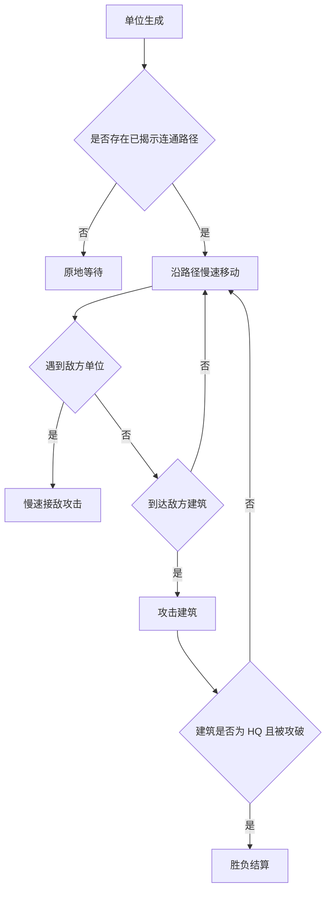

# 战斗节奏与结算 GDD v2

## 一、需求目的

- 让战斗验证翻格路线，而不是替代翻格，手段：单位只沿已揭示连通地块慢速推进。
- 修复上一版战斗过快和结算过早的问题，手段：限制单位数量、移动速度、攻击频率和首战时间。
- 让胜负条件清楚，手段：只有 HQ 被明确攻破或占领时才进入结算。

## 二、需求概述

战斗系统处理单位移动、接敌、建筑攻击和 HQ 结算。战斗只使用底部翻格和基地连结系统已经揭示的路径，不负责揭示隐藏地块。

## 三、功能概述

### 3.1 脑图/流程图

### 3.2 单位移动

#### 功能说明

单位移动负责让士兵沿已揭示网络推进。

#### 操作流程

1. 单位生成。
2. 系统查找最近敌方目标。
3. 系统计算只经过已揭示地块的路径。
4. 若没有路径，单位等待。
5. 若有路径，单位慢速移动。

#### 配置项

| 配置项 | 生效范围 | 默认值 | 可配置范围 | 说明 |
|---|---|---:|---|---|
| 基础兵移动速度 | 全局 | 慢 | 慢 / 中 / 快 | 第一版不使用高速度 |
| 是否允许穿隐藏格 | 全局 | 否 | 固定否 | 核心边界 |
| 首战最早时间 | 全局 | 60 秒 | 30-180 秒 | 防止战斗抢承接 |

#### 规则/边界

- 若路径需要经过隐藏地块，则路径无效。
- 若单位抵达隐藏地块边缘，则等待或重新寻路，不翻开地块。

### 3.3 接敌与建筑攻击

#### 功能说明

接敌与建筑攻击负责产生可见压力，但节奏必须可读。

#### 操作流程

1. 系统检测单位与敌方单位距离。
2. 若进入接敌范围，单位停下攻击。
3. 若没有敌方单位且到达敌方建筑范围，单位攻击建筑。
4. 建筑生命降为 0 后触发占领或摧毁。

#### 配置项

| 配置项 | 生效范围 | 默认值 | 可配置范围 | 说明 |
|---|---|---:|---|---|
| 攻击间隔 | 全局 | 1.2 秒 | 0.2-5 秒 | 明显慢于上一版 |
| 普通建筑耐久 | 全局 | 30 | 1-300 | 不瞬间被打掉 |
| HQ 耐久 | 全局 | 100 | 1-1000 | HQ 是结算核心 |

#### 规则/边界

- 若多个单位同时攻击，伤害可以叠加，但必须受单屏最大单位数限制。
- 若战斗反馈遮挡底部翻格按钮或目标格，则 UE 不合格。

### 3.4 结算

#### 功能说明

结算负责在 HQ 明确失守后结束对局。

#### 操作流程

1. 系统持续读取双方 HQ 状态。
2. 若敌方 HQ 耐久降为 0 或被玩家占领，则玩家胜利。
3. 若己方 HQ 耐久降为 0 或被敌方占领，则玩家失败。
4. 系统弹出结算层。

#### 规则/边界

- 若普通地块被占领，不触发结算。
- 若 HQ 只是被单位接近但未攻破，不触发结算。
- 若 60 秒内触发结算，则节奏配置必须回退。

## 四、UE 交互

- 单位移动速度必须能被肉眼跟踪。
- 建筑受击显示生命或进度。
- HQ 受击反馈要明显，但不遮挡 HQ 识别。
- 结算层只在 HQ 条件满足后出现。
