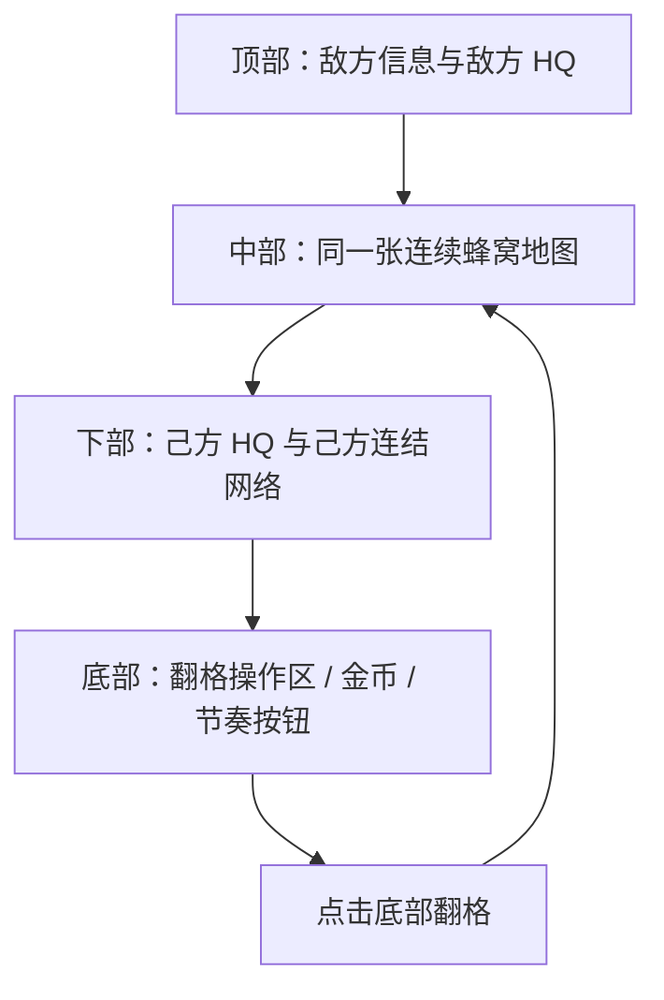
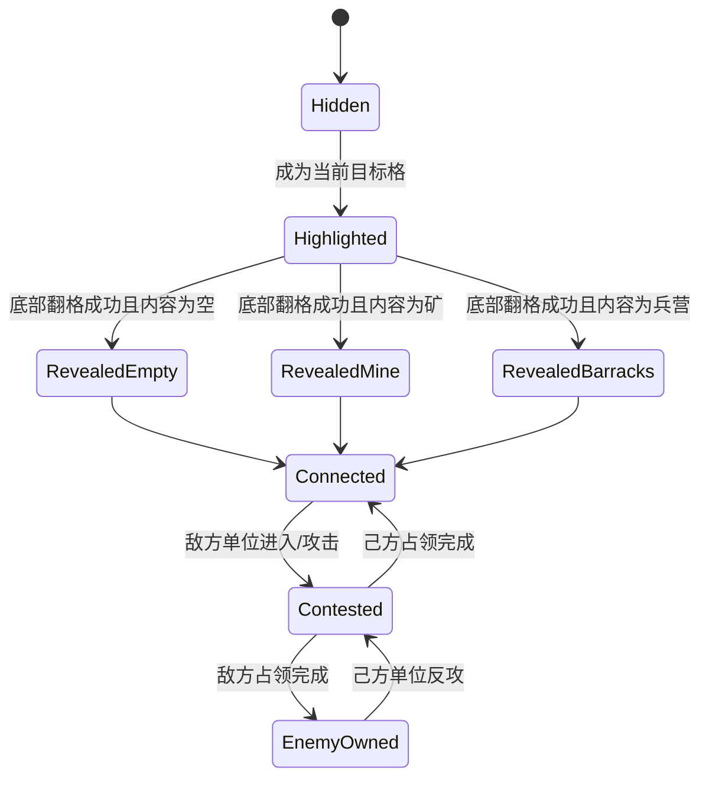

# 纸面原型规则

## 核心结论

本原型的第一性规则是：玩家不是点地图翻格，而是点击底部操作区，系统翻开一个与己方基地连结网络相连的目标地块。地图负责显示基地、连结、目标格和结果，不负责接收核心点击输入。

## 一、屏幕结构

| 区域 | 必须显示 | 不允许 |
|---|---|---|
| 敌方区域 | 敌方 HQ、敌方颜色、向下推进方向 | 敌方区域与玩家地图断开 |
| 中部地图 | 连续蜂窝格、隐藏格、候选目标格 | 大片空白断层、不可解释孤岛 |
| 己方区域 | 己方 HQ、基地连结线、已接入地块 | 己方基地被 HUD 或底栏遮住 |
| 底部操作区 | 翻格按钮、成本、金币、当前目标说明 | 让玩家点击地图作为主要翻格方式 |

## 二、地图拓扑规则

### 2.1 连续地图

- 敌我双方位于同一张蜂窝地图，不是两块分离棋盘。
- 敌方 HQ 与己方 HQ 之间必须存在至少一条由地块组成的潜在连通路径。
- 隐藏地块可以阻挡信息可见性，但不能让拓扑关系不可读。

### 2.2 基地连结网络

基地连结网络指从己方 HQ 出发，经过己方已揭示地块形成的连续集合。

规则：

- 若某地块无法从己方 HQ 通过己方已揭示地块连到，则它不属于己方网络。
- 若翻开一个地块后没有接入己方网络，则本次翻格无效，属于配置错误。
- 若己方 HQ 不在屏幕可见区域，则本局不允许开始。

## 三、底部翻格操作

### 3.1 输入源

| 行为 | 是否核心输入 | 说明 |
|---|---|---|
| 点击底部翻格按钮 | 是 | 参考交互的主输入 |
| 点击地图地块 | 否 | 可用于查看信息，不触发翻格 |
| 点击 Rush / 加速 | 可选 | 第一版可保留，但不能替代翻格 |

### 3.2 操作流程

1. 系统在地图上高亮当前可翻目标格。
2. 底部翻格按钮显示该目标格成本。
3. 玩家点击底部翻格按钮。
4. 系统判断金币是否足够。
5. 若金币不足，则按钮显示不足反馈，不改变地块。
6. 若金币足够，则扣除金币。
7. 系统翻开高亮目标格。
8. 目标格通过连结线接入己方 HQ 网络。
9. 系统根据结果更新矿、兵营、空地或路径。
10. 系统刷新下一可翻目标格。

### 3.3 目标格选择

第一版不做复杂自由选择，先做“系统给出目标格”的参考还原。

目标格优先级：

1. 与己方基地网络相邻。
2. 位于向敌方 HQ 推进的主方向。
3. 若多个候选格同优先级，优先选择成本较低者。
4. 若存在教程或脚本序列，前 3 次翻格使用固定序列。

## 四、地块状态机

## 五、节奏目标

| 项 | v2 目标 | 为什么 |
|---|---:|---|
| 首次翻格时间 | 5-15 秒 | 让玩家先看懂基地和底部按钮 |
| 前 60 秒有效翻格 | 2-4 次 | 翻格是主操作，不能太稀也不能扫屏 |
| 首个单位出现 | 20-35 秒 | 出兵要晚于第一次翻格反馈 |
| 单位到达中线 | 60-90 秒 | 战斗不能压过前 1 分钟承接 |
| 首次建筑争夺 | 90 秒后 | 让玩家先完成路线理解 |
| 单局目标时长 | 6-10 分钟 | 支撑十分钟成型闸门 |

## 六、验收清单

- 首屏能看到己方 HQ。
- 首屏能看到敌方 HQ 或明确敌方方向。
- 玩家点击底部按钮能翻开地块。
- 点击地图地块不会触发翻格。
- 每次翻开后，新地块与己方 HQ 有可视连结。
- 翻出空地只扩边界，不加收入和产兵。
- 翻出矿后，收入变化可见。
- 翻出兵营后，产兵变化可见。
- 前 60 秒内战斗不会结束。
- 单位不会穿过隐藏地块。
