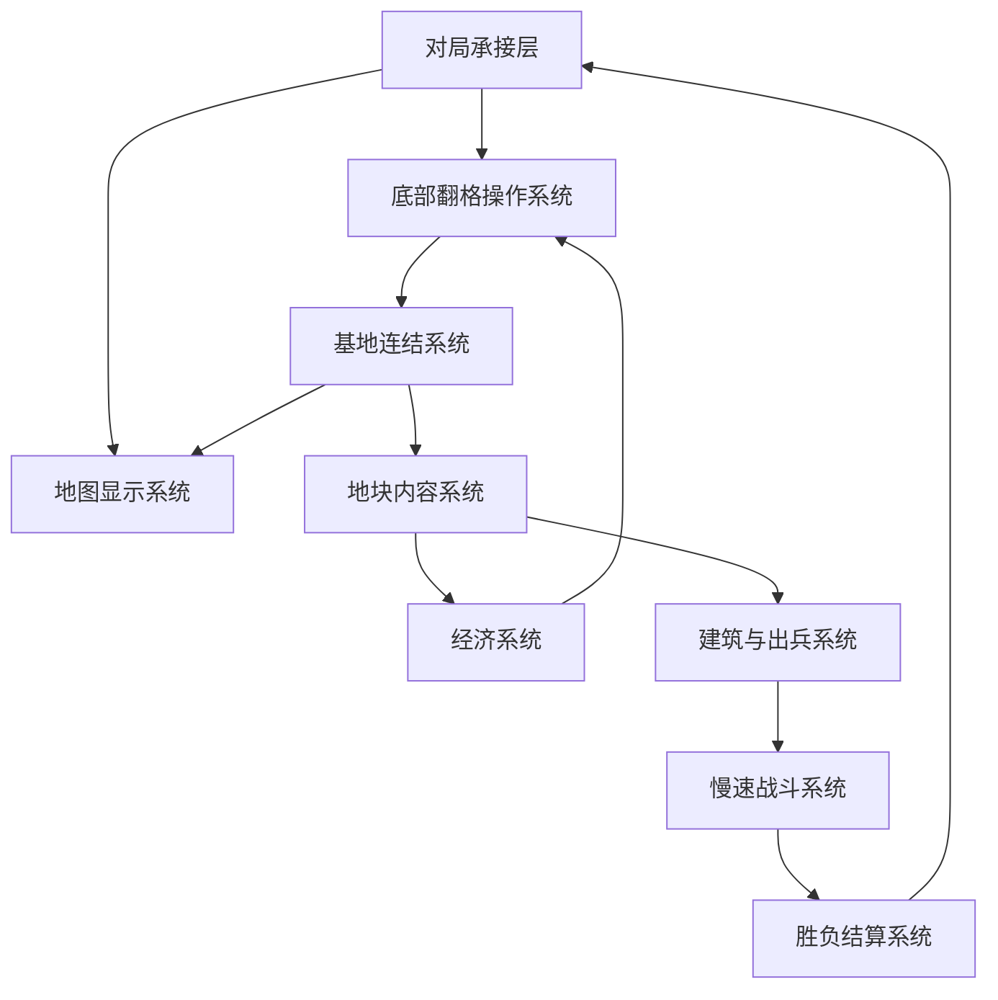

# 模块拆解与边界

## 核心结论

旧拆解把“地图系统”和“玩家操作系统”混在一起，导致实现自然变成点击地块。v2 必须拆成：底部翻格操作系统、基地连结系统、地图显示系统三件事。

## 一、模块层级

## 二、模块清单

| 模块 | 职责 | 输入 | 输出 | 不负责 |
|---|---|---|---|---|
| 对局承接层 | 控制首屏、60 秒承接、闸门节奏 | 开局状态、时间 | 当前阶段、可用交互 | 不生成地图细节 |
| 底部翻格操作系统 | 接收玩家点击、显示成本、触发翻格 | 玩家点击、金币、当前目标格 | 翻格请求、金币扣除结果 | 不决定地图拓扑 |
| 基地连结系统 | 判断地块是否接入己方 HQ 网络 | HQ、已揭示地块、候选格 | 当前目标格、连结线、网络状态 | 不处理金币 |
| 地图显示系统 | 显示上下连续地图、HQ、地块状态 | 地块状态、连结状态 | 画面表现 | 不接收核心翻格输入 |
| 地块内容系统 | 管理空地、矿、兵营、HQ 内容 | 翻格成功事件 | 内容揭示、建筑注册 | 不产金币、不产兵 |
| 经济系统 | HQ/矿产金币，翻格支付校验 | 建筑归属、时间、翻格成本 | 金币变化、按钮状态 | 不选择目标格 |
| 建筑与出兵系统 | HQ/兵营慢速产兵 | 建筑归属、时间 | 单位生成 | 不翻地、不自动接入网络 |
| 慢速战斗系统 | 单位移动、接敌、建筑攻击 | 单位、已揭示路径、建筑 | 单位死亡、建筑受损/占领 | 不穿越隐藏格 |
| 胜负结算系统 | 判定 HQ 失守并结算 | HQ 状态 | 胜利/失败 | 不处理战斗细节 |

## 三、关键接口

### 3.1 底部翻格操作 → 基地连结系统

| 字段 | 含义 |
|---|---|
| `action_type` | 固定为 `bottom_flip` |
| `coin_cost` | 当前目标格成本 |
| `target_tile_id` | 当前高亮目标格 |
| `anchor_hq_id` | 己方 HQ |

规则：若 `target_tile_id` 不能从 `anchor_hq_id` 连通，则底部按钮必须禁用。

### 3.2 基地连结系统 → 地图显示系统

| 字段 | 含义 |
|---|---|
| `connected_tile_ids` | 己方 HQ 网络地块 |
| `target_tile_id` | 当前将翻开的格子 |
| `connection_path` | HQ 到目标格的可视路径 |

规则：地图必须显示 `connection_path`，否则玩家不知道为什么翻这个格。

### 3.3 地块内容系统 → 经济/出兵

| 内容 | 接口结果 |
|---|---|
| 空地 | 只扩展连结网络 |
| 矿 | 注册为金币产出点 |
| 兵营 | 注册为产兵点 |
| HQ | 注册为胜负核心 |

规则：内容揭示后从下一 tick 生效，不在翻开的同一瞬间爆发大量产出。

## 四、错误实现回退表

| 错误表现 | 所属模块问题 | 回退到哪份文档 |
|---|---|---|
| 地图点击触发翻格 | 底部翻格操作系统缺失 | `01_纸面原型规则.md` |
| 看不到己方基地 | 对局承接层和地图显示系统失败 | `00_纸面原型补证稿.md` |
| 新地块像随机出现 | 基地连结系统缺失 | `01_纸面原型规则.md` |
| 兵线太快，玩家只看战斗 | 慢速战斗系统节奏失败 | `03_GDD重写清单.md` |
| 敌我地图不连通 | 地图拓扑规则失败 | `01_纸面原型规则.md` |

## 五、实现顺序

1. 只做静态首屏：己方 HQ、敌方 HQ、连续地图、底部按钮。
2. 做基地连结网络和目标格高亮。
3. 做底部按钮翻开目标格。
4. 接入金币扣除和矿收入。
5. 接入 HQ/兵营慢速产兵。
6. 接入慢速战斗。
7. 最后接入敌方 AI。

禁止跳过第 1-3 步直接做战斗。
