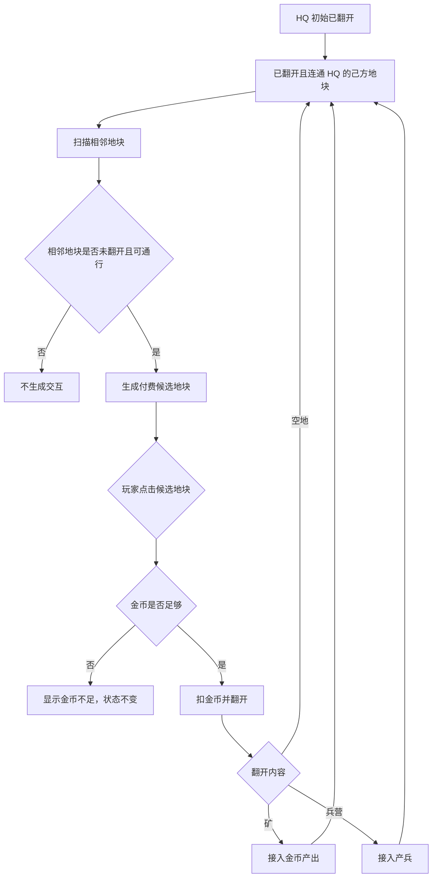

# Pocket Groove Tactics 视频复核纠偏结论

## 一、结论

前几版拆解和 demo 的核心错误不是美术粗糙，而是机制模型错误。后续 demo 必须按下面三个口径重写：

- 翻格发生在地图地块上：未翻开的候选地块显示成本或问号，玩家点击该地块支付金币并翻开。
- 可翻地块由基地连通网络生成：只有已翻开、已归属、且能连回己方 HQ 的地块，才会在相邻位置生成新的付费候选地块。
- 战斗移动走连通地块网络：单位从 HQ/兵营生成后，在已翻开且可通行的地块网络上寻路推进，不是固定一条直线。

## 二、错误来源

| 错误 | 为什么错 | 修正口径 |
|---|---|---|
| 把翻格写成底部按钮 | 视频画面中的可操作标记贴在基地周边地块上，用户也明确指出 `FLIP` 不应做成按钮 | 地图地块本身承担翻格输入 |
| 把地块写成槽位激活 | 槽位模型绕开了地块状态，导致没有“未翻开 / 已翻开”的差异 | 地块必须有状态机 |
| 初始全问号或全显形 | 视频开局有大面积双方归属地，也有基地周边未翻开的候选地块 | 归属地、已翻开地、候选隐藏地并存 |
| 单线战斗 | 视频中单位从多个建筑点生成，并沿基地连通区域和前线通道推进 | 单位用地块图寻路，路径随翻开结果变化 |

## 三、视频证据索引

| 时间点 | 画面事实 | 机制结论 |
|---|---|---|
| 0s | 敌方在上、己方在下；双方 HQ 可见；己方 HQ 周围有白色连线和一圈带问号/成本感的候选地块 | 不是满屏隐藏；翻格围绕 HQ 连通网络展开 |
| 3s-6s | 金币从 35 增到 45，单位已经从双方区域向中部移动 | HQ 会产金币；出兵从开局早期存在 |
| 10s | 金币降到 5，基地周边多个地块/建筑已发生变化，右侧出现新揭示区域 | 点击会消耗金币；翻开后改变地块内容和连通边界 |
| 30s | HQ 周边出现多个建筑/节点，白色连线围出非直线网络 | 基地附近是多节点连通结构，不是单点出兵 |
| 45s | 前线出现弯折通道，单位和建筑围绕已打开通路推进 | 战斗路线受已翻开地块和地形阻挡影响 |
| 60s | 敌方也在 HQ 附近形成候选点和连通结构，并向中部扩张 | 敌方必须使用同类翻格/扩张逻辑 |
| 120s-165s | 新局仍以 HQ 为中心生成候选点，兵线沿中间已连接通路推进 | 这是基础规则，不是偶然局面 |

## 四、地块状态模型

| 状态 | 玩家是否可见 | 是否可点击翻开 | 是否接入 HQ 网络 | 行为 |
|---|---:|---:|---:|---|
| HQ | 是 | 否 | 是 | 产金币、产基础兵、作为连通根 |
| 已翻开空地 | 是 | 否 | 是 | 扩大下一圈候选范围 |
| 已翻开矿 | 是 | 否 | 是 | 扩大候选范围，并周期产金币 |
| 已翻开兵营 | 是 | 否 | 是 | 扩大候选范围，并周期产兵 |
| 未翻开候选地块 | 是，显示问号/成本 | 是 | 否，翻开后接入 | 消耗金币后揭示内容 |
| 未连通隐藏地块 | 可不显示交互 | 否 | 否 | 等待相邻连通地块翻开后才成为候选 |
| 水域/障碍 | 是 | 否 | 否 | 阻断翻格候选和单位寻路 |

## 五、战斗移动模型

战斗系统不应使用固定中心线。它应该从当前地图状态构建可通行图：

- 节点：已翻开、已归属或已争夺、且非水域/障碍的地块。
- 边：两个相邻可通行地块。
- 起点：己方 HQ 和已翻开的己方兵营。
- 目标：最近敌方单位、敌方建筑、敌方 HQ。
- 路径：每次寻路只能经过已翻开可通行地块；遇到水域、隐藏地块或未连通区域必须绕路或等待。

若存在多个产兵点或多个等价路径，单位会自然形成多条局部路线；若地图中部只有一格宽通道，才会在前线收束为瓶颈。这个“收束”来自地块网络，不是硬编码兵线。

## 六、下一版 demo 验收口径

- 首屏必须看到己方 HQ、敌方 HQ、双方归属地、己方 HQ 周边候选未翻地块。
- 点击行为必须发生在地图候选地块上，不使用底部翻格按钮。
- 金币不足时，候选地块不能翻开。
- 翻开结果至少包含空地、矿、兵营三类。
- 翻开后必须立即刷新新候选地块，且新候选只出现在已翻开连通地块旁边。
- HQ 和矿必须持续产金币，金币不是无限点击资源。
- HQ 和兵营必须自动出兵。
- 单位必须按已翻开可通行地块网络寻路，不得使用单条硬编码线。
- 敌方必须按同样逻辑翻地、产金币、出兵和推进。
