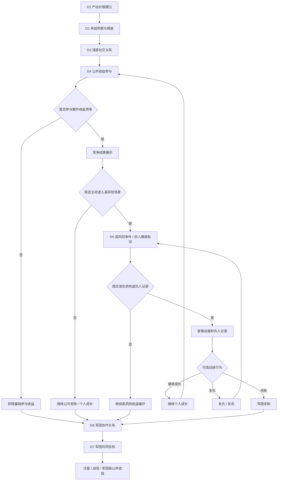

# FF｜7日强社交功能链路细化设计稿

> 基于 `FF-7日强社交功能链路梳理.md` 继续细化。本文为研究稿，不替代后续单功能 GDD。
> 参考表达标准：`reference/部门标准/策划/gdd/GDD写作标准.md` v18。
> 本版修正重点：保留资源争夺和军团承接，明确基础收益、临时收益、失败去向、不同玩家首周位置，以及低活跃玩家的参与方式。

---

## 一、细化目标

- 将首周强社交从“功能开放顺序”细化为“关系递进链路”：先让玩家看见他人，再用高价值产出把玩家带入同场竞争，最后通过击杀战报、仇人、复仇和求助把个人冲突导向军团协作。
- 将 D4-D5 的资源冲突细化为连续行为：高价值产出吸引参与，竞争手段决定额外收益，击杀或被击杀留下战报，复仇与求助推动后续协作。
- 明确军团可以从 D1 露出，但 D6-D7 的重点不是“开放军团按钮”，而是让已有军团关系承担求助、协助、防守、分工和共同目标。
- 控制首周资源争夺的挤压感：普通玩家进入公共场景有基础收益，弱势军团有保底目标，小额付费和非付费玩家可以通过活跃和协作贡献，低活跃玩家不会被每日定时活动直接劝退。

## 二、设计口径

首周强社交的终点，不是让玩家在 7 天内打完一套完整军团战，也不是强迫所有人都经历被抢。它要完成的是一个认知转变：玩家先确认“我能变强”，再意识到“服务器里有别人”，随后发现“好东西会被争夺”，最后形成“我需要一群固定的人一起处理收益和冲突”的判断。

因此，D1-D7 的功能安排要服务同一条线：个人成长先站稳，公共收益再把玩家带到同一个场景里，高风险争夺负责制造可记住的对象，军团则负责给玩家一个后续去向。到 D7，玩家不一定已经经历完整军团对抗，但应该能看懂：单人可以继续成长，加入军团可以更稳定地处理损失、争取额外收益，并参与后续更大的共同目标。

```text
个人产出循环成立
  -> 养成积累可释放
  -> 看见他人、比较战力、查看信息
  -> 高价值公共目标吸引同场参与
  -> 额外收益竞争形成弱竞争
  -> 高风险争夺产生击杀战报和仇人关系
  -> 被击杀后的复仇、求助带动军团协作
  -> 军团共同目标形成长期预期
```

对应到 D1-D7，拆分为：

```text
D1 建立产出价值：推关、掉落、换装、战力提升、军团入口露出
D2 建立养成积累：装备、技能、宠物、任务、七日目标
D3 建立浅层社交关系：同屏、排行、聊天、他人信息、军团信息
D4 建立公共收益参与：世界狩猎、公共首领、额外收益竞争
D5 建立高风险争夺：寻血、入侵、防守、战报、仇人、复仇
D6 建立军团协作：求助、协助成员、共同任务、军团保护
D7 建立军团共同目标：军团试炼、军团榜、沙盘/战役预告
```

## 三、7日细化总表

| 天数 | 当日主题 | 核心入口 | 玩家主行为 | 当天要解决 |
|---|---|---|---|---|
| D1 | 产出价值建立 | 冒险主线、装备、自动战斗、军团入口 | 推关、掉落、换装、领取首日目标 | 确认战斗产出可以转化为战力 |
| D2 | 养成积累 | 装备、技能、宠物、任务、七日活动 | 补齐养成项、领取阶段奖励、升级/强化/培养 | 将 D1 产出接入养成线 |
| D3 | 浅层社交关系 | 同屏、排行、聊天、他人信息、军团信息 | 查看他人战力、装备、养成进度，查看聊天和军团信息 | 让玩家确认服务器中存在其他玩家 |
| D4 | 公共收益参与 | 世界狩猎、公共首领、额外收益竞争 | 参与公共目标、获得基础收益、争夺额外收益 | 让玩家围绕同一个高价值目标竞争 |
| D5 | 高风险争夺 | 寻血、入侵、防守、复仇、玩法背包 | 获取临时收益，防守或争夺他人临时收益 | 让击杀或被击杀通过战报留下对象 |
| D6 | 军团协作 | 军团任务、成员协助、分工贡献、军团保护 | 求助、协助成员、完成共同任务、查看敌方军团 | 让已有军团关系承担求助和协作 |
| D7 | 军团共同目标 | 军团试炼、军团榜、共同进度、沙盘/战役预告 | 参与军团目标、贡献输出或活跃、查看排名和敌对关系 | 给出后续军团争夺预期 |

## 四、整体流程图



## 五、军团首周承接框架

军团在首周的作用，不是把签到、捐献、商店提前摆出来，而是给前面几天的玩家情绪一个落点。玩家已经看见别人、参与过公共收益、经历过争夺或损失之后，军团才有真实价值：它让玩家知道，自己不是只能单人追回损失，也可以把冲突带回一群人中继续处理。

这一章只解决首周军团要接住什么，不展开完整军团战。它的终点很简单：到 D7，玩家应该相信“加入军团不是多做一组日常，而是让我在资源争夺和后续战役里更稳”。

### 5.1 入团理由：从“看见别人”到“需要一群人”

军团入口不应只停留在主界面按钮上。真正推动入团的时机，应该出现在玩家已经感到“别人和我有关”的地方：排行、聊天、他人信息、公共目标结算、战报和仇人记录。

未入团玩家仍然可以参与公共目标和高风险场景，但系统要让他看见差别：没有固定求助对象，失败后只能自己处理；没有成员协助，反击和防守更不稳定；没有军团共同进度，个人成长也少了一个长期去处。这样入团就不是被系统催促，而是玩家在冲突之后自然想要的选择。

推荐军团也要跟当前场景连起来。玩家从战报、公共目标或仇人记录进入入团流程后，加入军团应能回到原场景继续处理当前冲突，而不是被直接带到一个与当前冲突无关的军团主页。

### 5.2 成长归属：个人变强要能进入共同收益

首周前半段已经让玩家理解推关、掉落、换装和战力提升的价值。军团要做的不是再增加一层资源消耗，而是把这些个人结果接到共同收益里。

玩家完成推关、提升装备、参与公共目标、进行寻血防守、复仇或协助成员时，都应能看到这些行为如何影响军团任务、军团试炼或军团榜。这里不需要把所有贡献都压成同一种数字，关键是让不同位置的玩家都有参与感：高战玩家负责输出和反击，活跃玩家补目标和参与试炼，低战玩家也能通过防守、协助和活跃推进获得贡献。

加入较晚的玩家不需要回溯历史贡献，但加入后的成长行为应立刻进入军团目标。否则入团后的第一感受仍然会退回到签到、捐献和商店，军团就接不住前面几天积累起来的关系压力。

### 5.3 战报去向：把一次损失变成可处理事件

高风险争夺真正有价值的地方，不只是让玩家损失一部分临时收益，而是让这次损失留下对象。战报要记录攻击方、防守方、双方军团、发生场景、被抢内容、保留内容，以及复仇和求助入口。

玩家看到战报后，下一步不应只有“自己复仇”。他可以继续成长，可以查看对方军团，也可以把战报发到本军团请求协助。成员看到求助时，也不能只看到一句“某人需要帮助”，而要知道目标是谁、发生在哪里、能怎样协助、协助后能得到什么个人奖励或军团贡献。

这套关系要防止玩家被推入无限复仇。目标当前不可复仇、场景已经关闭，或同一对象重复冲突时，战报仍然保留，但后续动作可以转向继续成长、等待下一次开放、查看敌方军团，或沉淀为军团近期冲突记录。

### 5.4 公共收益边界：个人能参与，军团更稳定

公共目标在首周承担两层作用：先让玩家同场竞争，再让玩家发现有组织参与会更稳。军团不能直接拿走单人玩家的基础收益，否则公共场景会过早变成强军团通吃。

单人玩家进入世界狩猎、公共首领或高风险争夺时，仍应获得基础参与收益，保证“我来了就有进度”。军团的价值放在更高一层：成员可以协助补输出、防守、反击，可以把公共目标参与转成军团任务或试炼进展，也可以在失败后提供求助和再次参与的理由。

弱势军团和低活跃玩家也要有可完成的基础目标。强军团可以在额外收益、排名展示和后续敌对关系上占优，但不能把普通玩家的首周参与感挤掉。

### 5.5 首周收束：让玩家知道后面还有共同目标

D7 不需要承诺完整军团战争已经开放，但必须给出明确预期：这群人后面还有事可做。军团试炼、军团榜和沙盘/战役预告要让玩家看到，前面几天形成的成长、战报、仇人、求助和协助，不会停在一次性日常里。

首周结束时，玩家最好能形成三个判断：我个人变强仍然有价值；公共收益和高风险争夺会不断制造对象；加入军团后，这些对象可以被一群人一起处理。只要这三个判断成立，军团就不是聊天群，也不是额外负担，而是后续资源争夺和军团对抗的组织答案。
