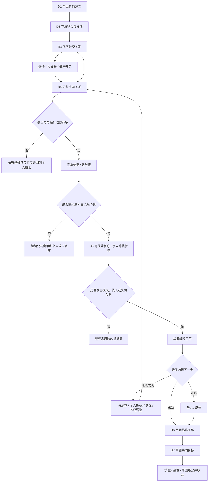

# FF｜7日强社交功能链路细化设计稿

> 基于 `FF-7日强社交功能链路梳理.md` 继续细化。本文是研究稿，不替代后续单功能 GDD。  
> 适用标准：`reference/部门标准/策划/gdd/GDD写作标准.md` v18。  
> 本版修正重点：把首周强社交从“冲突升级链”调整为“生态分层链”，保留资源争夺和军团承接，但补足低压桥接、失败回流、玩家分层和服务器生态保护。

---

## 一、细化目标

- 把首周强社交从“功能开放顺序”细化为“社交关系如何由浅入深”：先让玩家看到他人，再通过高价值产出把玩家带入同场竞争，再通过击杀战报、仇人、复仇和求助推动军团协作。
- 把 D4-D5 的资源冲突从“有 PVEVP / 杀人爆装”细化为“高价值产出吸引参与、竞争手段决定额外收益、击杀或被击杀形成战报、复仇与求助推动军团协作”的连续行为。
- 把 D6-D7 的军团承接从“加入军团解决个人冲突”细化为“个人矛盾带动军团跑起来，并进一步建立军团共同目标、共同收益和后续组织竞争预期”。
- 为首周强社交预留服务器生态治理口径：头部资源占比、弱势军团保底、小 R / 非 R 贡献位置、低活跃玩家压力边界。

## 二、设计口径

首周不是把所有强社交玩法一次性做深，也不是让所有玩家都经历被抢。真正的首周主线应是：先建立个人产出循环，再建立养成积累与释放，再把成长结果放入同屏、排行、聊天、他人信息和军团位置，建立浅层社交关系；从 D4 开始，用高价值公共目标吸引玩家同场参与，让玩家在基础收益安全的前提下争夺额外收益；到 D5，再把愿意追求更高收益的玩家引入明确标记的高风险场景，让争夺产生损失、仇人和复仇需求；到 D6，用这些个人矛盾触发求助、协助、防守和分工，让军团真正运转；到 D7，再把军团协作收束到共同进度、共同收益和后续战役预期。

```text
个人产出循环成立
  -> 养成积累可释放
  -> 他人可见、可比较、可接触
  -> 高价值公共目标吸引同场参与
  -> 额外收益竞争形成弱竞争
  -> 高风险争夺产生击杀战报和仇人关系
  -> 被击杀后的复仇、求助带动军团协作
  -> 军团共同目标形成长期预期
```

对应的设计拆分是：

```text
D1 建立产出价值：建立等级、装备、战力、关卡推进、掉落之间的正反馈循环，并通过关卡推进验证收益有效
D2 建立养成积累与释放：建立装备、技能、宠物、任务、七日目标的积累关系，并通过升级、强化、培养、阶段奖励释放为战力和推进效率
D3 建立浅层社交关系：承接 D1-D2 的成长结果，建立同屏、排行、聊天、他人信息、军团位置之间的可见、可比、可接触关系，差距解释只作为继续个人成长的提示
D4 建立公共收益参与与弱竞争：用高价值公共目标吸引玩家进入同场场景，基础参与收益保底，额外收益通过竞争产生差异，让“看见别人”变成“和别人争同一个目标”
D5 建立高风险争夺、战报与仇人关系：把愿意追求更高收益的玩家引入明确标记的高风险场景，临时收益可被争夺、防守和损失，击杀或被击杀通过战报记录为仇人、复仇和求助入口
D6 建立个人矛盾驱动的军团协作：用 D5 留下的战报、仇人、复仇失败和求助需求，带动军团保护、成员协助、协作防守、分工贡献和收益稳定
D7 建立军团共同目标：将 D6 跑起来的协作关系收束到军团共同进度、共同收益、排名敌对和后续沙盘/战役预期
```

## 三、7日细化总表

| 天数 | 当日主题 | 开放条件 | 核心入口 | 玩家主行为 | 收益状态变化 | 社交关系变化 | 当日必须沉淀 | 流向 |
|---|---|---|---|---|---|---|---|---|
| D1 | 产出价值建立 | 创建角色后 | 冒险主线、装备、自动战斗 | 推关、掉落、换装、领取首日目标 | 产出从“战斗结果”变成“可提升战力的有效收益” | 以单人体验为主，暂不制造关系压力 | 等级、掉落、换装、战力、关卡推进形成正反馈，并由关卡推进验证 | D2 养成积累与释放 |
| D2 | 养成积累与释放 | 完成 D1 基础引导 | 装备、技能、宠物、任务、七日活动 | 补齐养成项、领取阶段奖励、触发升级/强化/培养 | D1 产出接入装备、技能、宠物、任务、七日目标等养成线 | 仍以个人为主，但形成后续可展示、可比较、可继续成长的结果 | 养成积累通过升级、强化、培养、阶段奖励释放为战力和推进效率 | D3 浅层社交关系 |
| D3 | 浅层社交关系 | 达到多人入口等级或主线节点 | 同屏、排行、聊天、他人信息、军团位置、差距提示 | 查看他人战力、装备、养成进度、聊天和军团位置 | D1-D2 的成长结果进入他人展示和排行对照，差距解释只负责提示继续成长方向 | 从“服务器有人”升级为“他人可见、可比较、可接触、可形成组织预期” | 同屏、排行、聊天、他人信息、军团位置形成浅层社交关系 | D4 公共收益参与与弱竞争 |
| D4 | 公共收益参与与弱竞争 | 达到世界狩猎开放条件 | 世界狩猎、公共 Boss、额外收益竞争、轻战报 | 参与公共目标、获得基础收益、争夺额外收益、观察竞争结果 | 高价值产出从个人循环外溢到公共场景，基础收益保底，额外收益由竞争表现决定 | 他人从可见、可比较对象变成同场竞争对象 | 高价值产出、同场参与、基础收益、额外收益竞争、轻战报形成弱竞争关系 | D5 高风险争夺、战报与仇人关系 |
| D5 | 高风险争夺、战报与仇人关系 | 完成一次公共竞争观察，或主动进入高风险场景 | 寻血、入侵、防守、复仇、玩法背包 | 主动进入高风险场景，获取临时收益，防守或争夺他人临时收益，失败后选择继续个人成长、复仇或求助 | 可抢对象限定为高风险场景中的临时收益，核心成长资产仍安全 | 击杀或被击杀通过战报记录对手，形成仇人、复仇和求助关系 | 高风险场景、临时收益、争夺/防守、保留/损失、战报、仇人/复仇/求助形成冲突循环 | D6 个人矛盾驱动军团协作 |
| D6 | 个人矛盾驱动军团协作 | 有战报/仇人记录，或达到军团开放条件 | 军团推荐、创建/加入、军团任务、成员协助、分工贡献 | 加入军团、请求协助、协助成员、完成共同任务、查看敌方军团 | 个人收益风险被军团保护、协作分工和稳定收益承接 | 个人仇恨和收益风险被组织接住，普通玩家也有协作位置 | 战报、仇人、复仇失败、求助、成员协作、分工贡献形成军团运转关系 | D7 军团共同目标 |
| D7 | 军团共同目标 | 加入军团且完成基础活跃 | 军团试炼、军团榜、共同进度、沙盘/战役预告 | 参与军团目标、贡献输出或活跃、查看军团排名和敌对关系 | 个人协作沉淀为军团共同进度、共同收益和后续争夺资格 | 军团从保护单位升级为共同争夺单位 | 成员贡献、军团进度、排名敌对、共同收益、沙盘/战役资格形成长期目标 | 后续沙盘/战役 |

## 四、整体流程图



## 五、每日核心判断

D1-D7 的重点不是每天开放什么功能，而是每天建立一组可延续、可验证的系统关系。以下判断用于约束后续单功能拆解，避免功能入口堆叠但链路目标不成立。

| 天数 | 核心判断 | 当天必须成立 | 不能踩的坑 |
|---|---|---|---|
| D1 | 产出价值循环成立 | 等级、装备、战力、关卡推进、掉落形成正反馈，并能通过关卡推进验证 | 只发福利，不建立战斗产出和推进结果的关系 |
| D2 | 养成积累与释放成立 | 装备、技能、宠物、任务、七日目标形成积累，并通过升级、强化、培养、阶段奖励释放为战力和推进效率 | 只让奖励沉淀，不定义养成积累和成长释放 |
| D3 | 浅层社交关系成立 | 同屏、排行、聊天、他人信息、军团位置把个人成长结果变成可见、可比较、可接触的服务器关系 | 只做战力排行，不建立同屏、聊天、他人信息和军团位置的关系 |
| D4 | 公共收益参与与弱竞争成立 | 高价值公共目标能吸引玩家同场参与；基础收益保证参与不受损，额外收益竞争制造差异，并用轻战报解释谁获得了更高收益 | 只做公共奖励分配，不让玩家围绕同一个高价值目标产生竞争 |
| D5 | 高风险争夺、战报与仇人关系成立 | 玩家主动进入高风险场景后，临时收益可被争夺、防守、保留和损失；击杀或被击杀会生成战报，并给出仇人、复仇和求助入口 | 默认全员被抢，或抢已穿戴装备，或只损失不记录对手和后续行为 |
| D6 | 个人矛盾驱动军团协作成立 | 战报、仇人、复仇失败、求助能接入军团协助、协作防守、成员分工和收益稳定 | 军团只剩签到、捐献、商店，无法回应个人矛盾 |
| D7 | 军团共同目标成立 | 成员贡献、军团进度、排名敌对、共同收益、沙盘/战役资格形成长期目标 | 只说后续开沙盘，没有首周落点 |

这张表是后续拆 GDD 的判断尺。任何单功能如果不能服务对应天数的系统关系，就不应该硬塞进 7 日主链路。

## 六、共用规则提炼

### 6.1 压力分层

核心点：首周不是全员高压，而是让玩家按意愿进入不同压力层。

```text
低压成长 -> 浅层社交关系 -> 公共目标同场参与 -> 额外收益弱竞争 -> 高风险收益争夺 -> 复仇/求助/军团协作 -> 军团共同目标
```

- D1-D3 是低压层，只做成长、展示、比较和低压回流，不产生收益损失。
- D4 是公共目标层，用高价值产出吸引同场参与，用额外收益差异制造弱竞争，但基础参与收益不能被抢。
- D5 是高风险争夺层，只有玩家主动进入标记场景后，临时收益才进入可抢范围，并通过损失和战报形成仇人、复仇和求助。
- D6-D7 是组织层，军团先承接个人矛盾和成员协作，再把协作导向共同目标，但不把低活跃玩家强行推入排期压力。

压力分层的底线：基础成长资产不被抢，基础参与收益不被抢，高风险损失只发生在玩家明确选择的临时收益场景里。

### 6.2 失败回流

核心点：失败不是惩罚展示，而是下一步选择分流。

| 失败场景 | 必须解释 | 推荐回流 |
|---|---|---|
| D4 没拿到额外收益 | 额外收益被谁拿到、为什么自己没拿到、自己拿到了什么基础收益 | 再次参与、继续个人成长、组队或军团预告 |
| D5 被抢临时收益 | 谁抢了我、抢走什么、保留什么、核心资产是否安全 | 保留剩余收益、继续个人成长、复仇、军团求助 |
| 复仇失败 | 差距来自战力、流派、军团还是参与条件 | 军团协助、资源获取、暂避保护 |

如果失败后只给复仇，弱势玩家会连续失败；如果只给付费止损，会变成被抢后的付费绑架；如果只给保护，冲突又没有情绪出口。

### 6.3 公共竞争

核心点：D4 的目的不是分奖励，而是用高价值公共目标让玩家先同场参与，再围绕额外收益产生弱竞争。

- 基础参与收益用于保底，保证普通玩家进入公共场景也有进度。
- 额外收益差异用于制造竞争，服务高活跃、高战力和组织玩家。
- 竞争结果必须可解释，并生成后续入口：查看对方、继续争夺、继续个人成长、复仇或加入军团。

### 6.4 临时收益与战报

核心点：D5 的目的不是结算临时收益，而是让击杀或被击杀有明确对象，并通过战报导向复仇、求助和军团协作。玩法背包只负责隔离可争夺收益，避免伤害长期成长资产。

- 可抢对象：高风险玩法中玩家正在携带的临时收益。
- 不可抢对象：已穿戴装备、核心货币、D1-D2 建立的长期成长资产。
- 战报必须具名：谁抢了我、属于哪个军团、抢了什么、为什么我输了、我下一步能做什么。

如果没有具名战报，损失会被理解成系统扣除；如果没有玩法背包，杀人爆装会破坏长期成长信任。

## 七、玩家分层承接

| 玩家层级 | 首周主要价值 | 设计边界 |
|---|---|---|
| 超 R / 大 R | 抢额外收益、带队、组织威慑、荣誉展示 | 不只做个人碾压，要导向公共增益和组织责任 |
| 中 R | 稳定参战、争次级目标、协作防守、补位复仇 | 不让所有关键奖励都被头部锁死 |
| 小 R / 非 R | 基础参与、活跃贡献、资源建设、集体奖励 | 不让其只成为被抢对象或陪跑 |
| 低活跃玩家 | 低压成长、非定时贡献、军团基础收益 | 不绑定每日定时强排期 |

这部分要和 D6-D7 绑定：军团不是只服务复仇，也要给普通玩家稳定收益和协作位置。

## 八、商业化边界

商业化只能挂在玩家已经理解的压力点上，不能替代功能动机。

| 阶段 | 可挂接方向 | 边界 |
|---|---|---|
| D1-D2 | 首充、月卡、七日活动 | 不和 PVP 强绑定 |
| D3 | 成长包、资源补齐、养成目标 | 不制造只靠付费才能补的单一路径 |
| D4 | 掉落效率、复活、公共资源效率 | 不影响基础参与收益 |
| D5 | 保护、复仇加速、临时收益风险管理 | 不做付费止损绑架，不售卖核心资产掠夺，不承诺被抢收益返还 |
| D6-D7 | 军团建设、版本战令、荣誉外观 | D7 先做长期目标预告，不强行展开沙盘 |

## 九、服务器生态保护预留

首周必须给服务器生态留口子，避免开服早期就进入头部通吃。

| 风险 | 预留口径 |
|---|---|
| TOP 公会垄断公共收益 | 拆分基础参与、额外收益、军团目标 |
| 弱势军团无参与感 | 提供保底目标、次级目标、活跃贡献奖励 |
| 小 R / 非 R 被持续掠夺 | 控制临时收益可抢比例，提供保护期、个人成长回流和求助入口 |
| 高战只有数值碾压 | 给高战带队、公共增益、荣誉、指挥价值 |
| 低活跃被组织压力劝退 | 军团基础收益不绑定每日定时强排期 |

## 十、后续应拆的正式 GDD

| 优先级 | 文档 | 必须回答的问题 |
|---|---|---|
| P0 | PVEVP 基础规则 | 攻击关系、死亡、复活、离场、额外收益判定、战报如何统一 |
| P0 | 玩法背包 / 临时收益系统 | 什么收益可抢、如何携带、如何保护、损失后如何反馈 |
| P0 | 7日功能开放节奏总表 | 每天开哪些入口、开给谁、为什么此时开、未达条件怎么展示 |
| P1 | 战报 / 仇人 / 复仇系统 | 哪些行为生成战报、复仇入口如何出现、如何避免无限报复 |
| P1 | 军团保护、协作与分工规则 | 个人冲突如何导向军团，普通玩家如何获得协作位置 |
| P2 | 军团沙盘 / 战役预告 | D7 之后共同目标如何展开，弱势军团和普通成员如何参与 |

## 十一、当前风险

1. D3 如果只展示排行榜，不解释差距来源，D4-D5 会变成突然施压。
2. D4 如果没有基础参与收益，公共收益会过早变成头部专属玩法。
3. D5 如果默认全员被抢，首周挫败过重；如果什么都抢不到，又没有情绪。
4. 被抢后如果只有复仇或付费止损，弱势玩家会连续失败或感到被绑架。
5. 军团如果只做签到、捐献、商店，无法承接个人冲突和公共目标。
6. D7 如果只有沙盘预告，没有军团共同目标和弱势保底，首周强社交没有落点。
7. 具体数值和开放条件当前资料未覆盖，不能在本文硬填。

## 十二、下一步建议

下一步优先拆 `PVEVP 基础规则`，再拆 `玩法背包 / 临时收益系统`，最后回头写 `7日功能开放节奏总表`。

原因是：当前已经明确首周关系递进、压力分层、失败回流和资产保护底线，下一步要先统一 D4-D5 的攻击、死亡、复活、离场、额外收益竞争和战报规则，再定义临时收益如何携带、被抢、保护和损失反馈。
