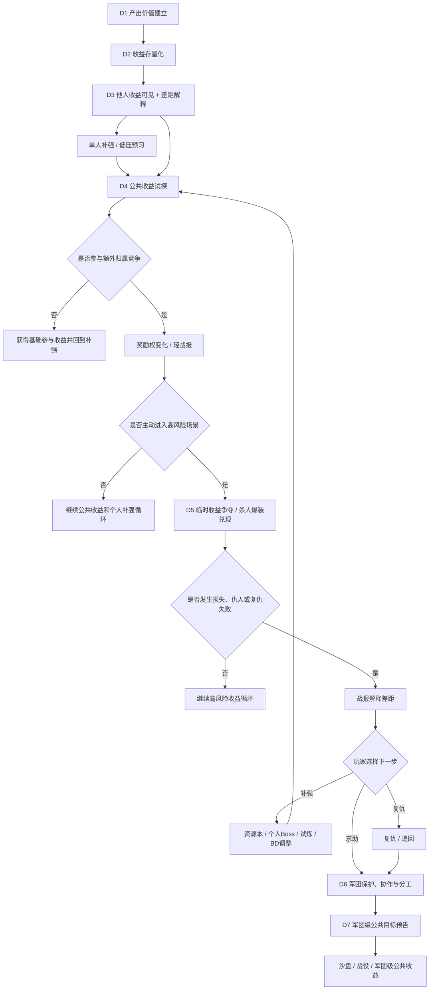

# FF｜7日强社交功能链路细化设计稿

> 基于 `FF-7日强社交功能链路梳理.md` 继续细化。本文是研究稿，不替代后续单功能 GDD。  
> 适用标准：`reference/部门标准/策划/gdd/GDD写作标准.md` v18。  
> 本版修正重点：把首周强社交从“冲突升级链”调整为“生态分层链”，保留资源争夺和军团承接，但补足低压桥接、失败回流、玩家分层和服务器生态保护。

---

## 一、细化目标

- 把首周强社交从“功能开放顺序”细化为“收益如何被看见、如何产生公共归属、如何在可控风险中被争夺、失败后如何回流”，避免首周直接把所有玩家推入高压 PVP。
- 把 D4-D5 的资源冲突从“有 PVEVP / 杀人爆装”细化为“公共收益试探、奖励权变化、临时收益争夺、战报解释、复仇与补强回流”的连续行为。
- 把 D6-D7 的军团承接从“加入军团解决个人冲突”细化为“军团同时提供保护、协作、分工、收益稳定和后续组织目标”。
- 为首周强社交预留服务器生态治理口径：头部资源占比、弱势军团保底、小 R / 非 R 贡献位置、低活跃玩家压力边界。

## 二、设计口径

首周不是把所有强社交玩法一次性做深，也不是让所有玩家都经历被抢。真正的首周主线应是：玩家先相信收益有价值，再理解公共收益有归属，高收益伴随可控风险，失败以后能复仇、求助或回到单人补强，最后把个人冲突和公共收益导向军团组织。

```text
收益有价值
  -> 收益可积累
  -> 他人收益可见 + 差距解释
  -> 公共收益试探
  -> 高风险临时收益争夺
  -> 失败回流 / 复仇 / 军团承接
  -> 军团保护、协作与分工
  -> 军团级公共目标预告
```

对应的设计拆分是：

```text
D1 建立产出价值：玩家先相信掉落、装备、战力、关卡推进是有用收益
D2 建立收益存量：玩家知道收益不只是即时爽点，而会沉淀成可积累资产
D3 建立他人收益可见和差距解释：玩家看见别人拥有更好的收益，也知道自己差在哪里、去哪补
D4 建立公共收益试探：高价值收益从个人循环外溢到公共归属，但基础参与收益不被抢
D5 建立高风险临时收益争夺：杀人爆装首次兑现，但只发生在明确标记的可选高风险场景
D6 建立军团保护、协作与分工：个人损失、复仇、收益稳定和成员分工开始需要组织
D7 建立军团级公共目标预告：军团共同收益、资源分配、排名和后续沙盘/战役形成长期预期
```

## 三、7日细化总表

| 天数 | 当日主题 | 开放条件 | 核心入口 | 玩家主行为 | 收益状态变化 | 社交关系变化 | 当日必须沉淀 | 流向 |
|---|---|---|---|---|---|---|---|---|
| D1 | 产出价值建立 | 创建角色后 | 冒险主线、装备、自动战斗 | 推关、掉落、换装、领取首日目标 | 产出从“战斗结果”变成“可提升战力的有效收益” | 以单人体验为主，暂不制造关系压力 | 玩家知道什么是值得追求的收益 | D2 收益存量化 |
| D2 | 收益积累建立 | 完成 D1 基础引导 | 技能、宠物、任务、七日活动、背包/养成汇总 | 补齐养成项、领取阶段奖励、查看存量目标 | 收益从“即时领取”变成“背包、养成项、阶段目标中的存量” | 仍以个人为主，但为后续展示和被比较准备资产口径 | 玩家知道收益会沉淀，且越积越有价值 | D3 他人收益可见 |
| D3 | 他人收益可见 + 差距解释 | 达到多人入口等级或主线节点 | 同屏、排行、聊天、他人信息、差距提示 | 查看他人战力、装备、养成进度、军团位置，并看到差距来源 | 自己的存量收益获得对照物，差距被解释为可补强方向 | 从“服务器有人”升级为“别人拥有我想要的收益和组织位置” | 玩家意识到收益差距和关系差距存在，但知道去哪补 | D4 公共收益试探 |
| D4 | 公共收益试探 | 达到世界狩猎开放条件 | 世界狩猎、公共 Boss、奖励权、轻战报 | 进入公共场景、参与目标、观察奖励归属变化 | 高价值收益从个人产出变成公共归属，但基础参与收益不被抢 | 他人从可观看对象变成同场竞争对象 | 玩家理解公共收益有归属，额外收益才需要争夺 | D5 高风险临时收益 |
| D5 | 高风险临时收益争夺 | 完成一次公共收益试探，或主动进入高风险场景 | 寻血、入侵、防守、复仇、玩法背包 | 主动进入高风险场景抢夺临时收益，或防守/追回/复仇 | 临时收益第一次可被杀人夺取，核心资产仍安全 | 竞争对象具名化，形成仇人、复仇和求助关系 | 玩家体验“高收益伴随可控风险”，且失败后有回流 | D6 军团承接 |
| D6 | 军团保护、协作与分工 | 有战报/仇人记录，或达到军团开放条件 | 军团推荐、创建/加入、军团任务、成员协助、分工贡献 | 加入军团、请求协助、完成共同任务、查看敌方军团 | 军团提供保护、协作、收益稳定和贡献放大 | 个人仇恨和收益风险被组织接住，普通玩家也有协作位置 | 玩家知道军团不是签到商店，而是保护、协作和分工组织 | D7 军团级目标 |
| D7 | 军团级公共目标预告 | 加入军团且完成基础活跃 | 军团试炼、军团榜、共同进度、沙盘/战役预告 | 参与军团目标、贡献输出或活跃、查看军团排名和敌对关系 | 收益从个人临时收益升级为军团共同收益和后续争夺资格 | 军团从保护单位升级为共同争夺单位 | 玩家期待后续军团级收益争夺，并知道不同层级玩家都有位置 | 后续沙盘/战役 |

## 四、整体流程图



## 五、每日核心结论与逻辑

### 5.1 D1：先让玩家相信“产出有用”

D1 的核心不是送一件很强的装备，也不是用大奖刺激玩家，而是让玩家完成一个最基础的判断：战斗会产出东西，产出的东西能立刻改变我的能力，能力变化又能让我打到更后面的内容。

所以 D1 要把冒险、掉落、换装、战力提升和继续推关连成一段很短的因果。玩家打完一场，拿到装备，换上以后战力变化，再看到自己能推进新关卡，这个体验比“奖励看起来很贵”更重要。因为后面所有争夺都建立在这个前提上：我知道这些东西有用，所以我才会在意别人拿走、我抢到、我损失。

这里最容易错的是把 D1 写成首日福利或首日成长任务。福利可以有，但它不是主线。D1 真正要建立的是“收益能改变战斗结果”。如果只发奖励、不让玩家使用奖励，玩家记住的是领取动作，不是收益价值。

### 5.2 D2：把收益从“拿到一次”变成“我有一批资产”

D2 不能只写成成长目标。成长目标只是表层，它真正要解决的是收益存量化：玩家开始知道昨天拿到的装备、材料、任务奖励、活动进度不会消失，而是会堆在背包、养成项和阶段目标里，成为自己的资产。

这一天的逻辑是：D1 让玩家知道产出有用，D2 让玩家知道产出会积累。背包、技能、宠物、七日活动、阶段奖励都应该服务这个目的。玩家不只是被告诉“明天要养什么”，而是能看到自己已经有多少、还差多少、积累到下一档会带来什么变化。

如果 D2 只做“去升技能、去养宠物、去领七日奖励”，后面会断。因为 D3 要展示他人收益，D5 要抢临时收益，都需要玩家先理解“收益是可存的、可比的、可失去一部分的”。没有 D2 的资产感，后面的社交压力会变成突然出现的外部规则。

### 5.3 D3：不是让玩家知道“有人”，而是让玩家看到“别人有什么，以及我差在哪里”

D3 的重点也不是多人感知。玩家知道服务器里有人还不够，真正要建立的是他人收益可见：别人战力多少、装备是什么、养成进度在哪里、有没有军团、是不是已经拿到了我还没拿到的东西。

但 D3 不能只制造差距焦虑，还要解释差距。玩家看到别人比自己强时，最好能知道差距来自装备、技能、宠物、阶段奖励、公共收益或军团位置，而不是只看到一个战力数字。

D3 当天应同时给出补强方向：

| 差距来源 | 推荐回流 |
|---|---|
| 装备差距 | 冒险章节、个人 Boss、世界普通目标 |
| 技能 / 宠物差距 | 养成目标、资源本、七日活动 |
| 输出差距 | 试炼、个人 Boss、BD 调整 |
| 公共收益差距 | D4 公共收益试探 |
| 军团位置差距 | D6 军团预告或军团占位展示 |

D3 的价值在于把个人资产放进服务器比较里，同时告诉玩家比较之后该做什么。玩家在 D2 形成“我有什么”，到 D3 看到“别人有什么、我差什么”，D4 才能自然进入“公共高价值收益为什么要抢”。

### 5.4 D4：第一次把高价值收益放到公共场景里，但先做公共收益试探

D4 要做的是公共收益试探，不是直接进入强 PVP。玩家前面已经知道收益有用、能积累、别人也有更好的收益，这时才适合把一部分高价值收益放到世界狩猎、公共 Boss 或半公共目标里，让奖励权开始发生变化。

这里的关键不是 Boss 本身，而是“奖励归谁”。玩家可以因为参与、贡献、最后一击、归属队伍或其他规则拿到不同层级的奖励，也可能因为别人介入而失去额外归属奖励。具体结算规则可以后续定，但玩家必须看懂当前归属是谁、为什么变了、自己为什么拿到或没拿到。

D4 必须分出两层收益：

| 收益层 | 设计作用 | 边界 |
|---|---|---|
| 基础参与收益 | 保证普通玩家进入公共场景也有进度 | 不被其他玩家抢走，不影响低保 |
| 额外归属收益 | 让高活跃、高战力、组织玩家有争夺目标 | 可以被竞争影响，但要解释清楚归属变化 |

D4 不能抢玩家已穿戴装备，也不应该把寻血矿点提前混进来。它承担的是从“看见别人”到“和别人争同一份额外收益”的过渡。只要玩家在 D4 记住了“这个人影响了我的奖励”，D5 的入侵、复仇、寻血才有来源。

### 5.5 D5：杀人爆装要在这里第一次兑现，但必须是可选高风险链路

D5 不能再叫轻 PVP。它承担项目表达里的第一次杀人爆装兑现：我可以打别人，拿走对方未入账的一部分玩法收益；我也可能被别人打，损失自己临时包裹里的一部分收益。

但 D5 不能让所有玩家默认被抢。它应当是一个明确标记的高风险场景：

```text
主动进入高风险场景
  -> 获得更高价值临时收益
  -> 临时收益进入玩法背包
  -> 可能被入侵 / 击杀 / 抢夺部分
  -> 入账、损失、追回或复仇
```

边界一定要清楚：爆的是临时收益，不是已穿戴装备，也不是已入账核心货币。这样既能让玩家感到真实损失，又不会破坏 D1-D2 建立起来的长期成长信任。玩法背包或临时包裹的意义就在这里，它把“可被抢的刺激”和“核心资产的安全”分开。

D5 的冲突必须具名。玩家被抢后要知道是谁抢的、对方什么战力、属于哪个军团、抢走了什么、能不能追回或复仇。如果没有具名战报，损失会被理解成系统扣除；如果只做竞技场式切磋，就没有爆装兑现，也不会产生仇人。

被抢之后必须给四条路：

| 路径 | 作用 |
|---|---|
| 解释 | 告诉玩家是谁抢了我、为什么我输了 |
| 复仇 | 保留情绪出口和反击目标 |
| 求助 | 把个人冲突导向军团和关系 |
| 补强 | 让弱势玩家回到单人或低压玩法，而不是连续被打 |

如果只有复仇，没有补强，弱势玩家会继续输；如果只有保护，没有复仇，冲突没有情绪；如果只给付费追回，会变成付费止损，体验压力会过重。

### 5.6 D6：军团必须接住 D5 留下的问题，也要给普通玩家正向加入理由

D6 不是开放军团入口，也不是把签到、捐献、商店摆出来。它要回答 D5 之后玩家自然会问的问题：我被谁抢了？对方是不是有组织？我能不能找人帮忙？我能不能降低下次被抢的风险？我加入军团以后，收益会不会更稳或更大？

但军团不能只从“被抢后求保护”推出。首周军团至少要有三类价值：

| 军团价值 | 回答的问题 | 典型表现 |
|---|---|---|
| 保护价值 | 我被抢了怎么办 | 协助复仇、标记仇人、降低临时收益损失 |
| 协作价值 | 我加入后日常是否更稳 | 军团任务、成员互助、共同进度、收益加成 |
| 分工价值 | 不同战力玩家有什么位置 | 高战输出，中低战贡献活跃/资源/辅助 |

这一天的逻辑是把个人敌对关系升级成组织关系，同时给非高战玩家一个合理位置。D5 里“某个人抢了我”，到 D6 应该能变成“这个人属于某个军团，我也需要一个组织来保护、协助或放大收益”；但普通玩家也应该理解“即使我不复仇，加入军团也能让收益更稳、目标更清楚”。

如果军团只给商店和贡献，D5 到 D6 会断；如果军团只给复仇和保护，军团会过度依赖仇恨绑定，不利于低压玩家留存。

### 5.7 D7：让玩家看到后面要争的是军团级收益，也看到弱势和普通玩家的留下理由

D7 不能只说后续会开沙盘或战役。它需要给首周一个明确落点：军团不是只帮我处理个人损失，后面还会作为整体去争更大的收益。

因此 D7 至少要让玩家参与一次军团共同目标，例如军团试炼、军团总进度、成员贡献、军团榜或后续沙盘/战役资格预告。重点不是当天把 GVG 做完整，而是让玩家看到收益层级已经变化：D5 抢的是个人临时收益，D7 之后争的是军团级公共收益。

D7 还要预告后续生态规则：

| 预告内容 | 设计目的 |
|---|---|
| 军团共同收益 | 让玩家知道后续不是单人抢临时收益，而是组织争公共资源 |
| 成员贡献 | 让中低战玩家知道自己也能影响军团收益 |
| 军团排名 / 敌对关系 | 让组织目标具名化 |
| 弱势军团保底 | 避免玩家预期变成头部军团通吃 |
| 沙盘 / 战役资格 | 把首周军团关系导向中长期玩法 |

如果 D7 只有一句“后续开启沙盘”，首周会没有收束；如果军团试炼只是普通副本，玩家也不会理解军团存在的长期价值。D7 要把 D6 的保护和协作往前推一步：留在军团里，不只是为了少被抢，而是为了之后一起抢更大的东西。

## 六、四条共用规则线

### 6.1 压力分层线

压力分层负责避免首周强社交变成全员高压。

```text
D1-D3 低压：单人成长、展示、比较、补强
D4 中低压：公共收益试探，基础收益不被抢
D5 中高压：玩家主动进入高风险临时收益场景
D6-D7 组织压：军团承接，但不强迫低活跃玩家每日排期
```

**设计原则**

- 高压场景必须可识别、可选择、可退出。
- 低保和基础成长不进入高压抢夺。
- 玩家失败后必须知道去哪补，而不是只能继续被打。

### 6.2 奖励权线

奖励权负责把“我打怪”变成“我和别人抢额外好东西”。

```text
目标出现 -> 玩家参与 -> 基础收益获得 -> 贡献/击杀/归属判断 -> 额外奖励权变化 -> 战报 -> 复仇或军团导向
```

**设计原则**

- 首周不要让奖励权影响核心装备资产。
- 玩家必须看懂自己为什么拿到或失去额外奖励。
- 每次奖励权变化都应生成后续入口：查看对方、复仇、加入军团、回到补强。

### 6.3 临时收益线

临时收益负责让 PVP 有可抢对象，同时保护玩家长期成长。

```text
高风险玩法产出 -> 进入临时收益 -> 可被入侵争夺 -> 入账或损失部分 -> 战报记录 -> 复仇 / 求助 / 补强
```

**设计原则**

- 可抢的是玩法过程收益，不是已沉淀资产。
- 被抢后必须有解释、追回、复仇、求助或补强方向。
- 保护规则要可见，避免玩家误解为系统随意扣除。

### 6.4 战报与仇人线

战报负责把一次争夺变成后续行为。

```text
发生争夺 -> 生成战报 -> 识别对方 -> 解释差距 -> 复仇/追回/查看军团/补强 -> 军团承接
```

**战报最少应包含**

| 信息 | 作用 |
|---|---|
| 对方角色名、战力、职业 | 让玩家知道输赢对象 |
| 对方军团 | 为 D6 军团需求铺垫 |
| 损失或获得的收益 | 让冲突结果可理解 |
| 差距来源 | 告诉玩家为什么输，不只制造挫败 |
| 复仇或追回入口 | 给玩家情绪出口 |
| 补强入口 | 给弱势玩家健康回流 |
| 发生时间和玩法来源 | 区分世界狩猎、寻血、后续沙盘 |

## 七、玩家分层承接

首周强社交不能只服务高战玩家。军团和公共收益必须提前定义不同层级玩家的位置。

| 玩家层级 | 首周主要价值 | 需要避免的问题 |
|---|---|---|
| 超 R / 大 R | 输出、威慑、争夺归属、带队、荣誉展示 | 不要只变成个人数值碾压，要导向公共增益和组织责任 |
| 中 R | 稳定参与、补充战力、争夺次级目标、协作收益 | 不要让所有关键奖励都被头部锁死 |
| 小 R / 非 R | 活跃贡献、资源建设、辅助任务、集体奖励 | 不要让其只能当被抢对象或陪跑 |
| 低活跃玩家 | 获得军团基础收益、低压参与公共目标 | 不要每天背组织排期，否则首周压力过重 |

## 八、商业化挂接修正

商业化只挂在玩家已经理解的压力点上，不提前替代功能动机。

| 阶段 | 压力来源 | 可挂接方向 | 边界 |
|---|---|---|---|
| D1-D2 | 成长速度 | 首充、月卡、七日活动 | 不与 PVP 强绑定 |
| D3 | 差距可见 | 成长包、资源补齐、养成目标 | 不制造只靠付费才能补的单一路径 |
| D4 | 公共资源效率 | 掉落加速、多倍消耗、复活 | 不做强制付费复活，不影响基础参与收益 |
| D5 | 被抢后的追回和保护 | 保护、追回、复仇加速 | 不直接售卖对核心资产的掠夺，不做付费止损绑架 |
| D6 | 军团基础建设 | 捐献、军团商店权益、协作增益 | 不让未付费玩家无法加入军团 |
| D7 | 长期军团目标 | 版本战令、军团目标预告、荣誉外观 | D7 先预告，不强行展开沙盘 |

## 九、服务器生态保护预留

首周设计需要为中长期运营预留生态治理接口，避免开服后公共资源快速被少数头部垄断。

| 风险 | 需要预留的设计口径 |
|---|---|
| TOP 公会垄断公共收益 | 公共收益拆分为基础参与、额外归属、军团目标，避免全部通吃 |
| 弱势军团无参与感 | 提供保底目标、次级目标、活跃贡献奖励 |
| 小 R / 非 R 被持续掠夺 | 临时收益可抢比例、保护期、失败补强、军团求助必须可见 |
| 高战玩家只有数值碾压 | 给高战玩家带队、公共增益、荣誉、指挥类价值 |
| 低活跃玩家被组织压力劝退 | 军团基础收益不绑定每日定时强排期 |

## 十、后续应拆的正式 GDD

| 优先级 | 文档 | 必须回答的问题 |
|---|---|---|
| P0 | 首周社交压力分层与失败回流规则 | 哪些场景低压、哪些场景高风险、失败后如何解释、复仇、求助和补强 |
| P0 | 7日功能开放节奏总表 | 每天开哪些入口、开给谁、为什么此时开、未达条件怎么展示 |
| P0 | PVEVP 基础规则 | 攻击关系、死亡、复活、离场、奖励权、战报如何统一 |
| P0 | 玩法背包 / 临时收益系统 | 什么收益可抢、如何入账、如何保护、如何追回 |
| P1 | 战报 / 仇人 / 复仇系统 | 哪些行为生成战报、复仇入口如何出现、如何避免无限报复 |
| P1 | 军团保护、协作与分工规则 | 个人冲突如何导向军团，普通玩家如何获得协作位置 |
| P2 | 军团沙盘 / 战役预告 | D7 之后共同目标如何展开，弱势军团和普通成员如何参与 |

## 十一、当前风险

1. 如果 D3 只展示排行榜和战力，不解释差距来源，D4-D5 的争夺会变成突然施压。
2. 如果 D4 没有基础参与收益，公共收益试探会过早变成头部玩家专属玩法。
3. 如果 D5 默认让所有玩家被抢，首周挫败会过重；如果什么都抢不到，又没有情绪。
4. 如果被抢后只有复仇和付费追回，没有补强回流，弱势玩家会连续失败。
5. 如果军团只提供签到、捐献、商店，无法解释玩家为什么要从个人冲突转向组织。
6. 如果军团只承接复仇和保护，关系绑定会过度依赖仇恨，普通玩家缺少正向加入理由。
7. 如果 D7 只做沙盘预告但没有军团共同目标和弱势保底，玩家会觉得首周强社交没有落点。
8. 具体数值和开放条件当前资料未覆盖，不能在本文硬填。

## 十二、下一步建议

先写 `首周社交压力分层与失败回流规则`，再写 `PVEVP 基础规则` 和 `玩法背包 / 临时收益系统`，最后回头写 `7日功能开放节奏总表`。

原因是：7 日节奏表看似最上层，但真正决定 D4-D7 是否成立的是压力分层、失败回流、奖励权和临时收益规则。如果这些没定，节奏表只能列入口，无法定义玩家情绪如何产生，也无法保证普通玩家在强社交链路里有健康回流。
