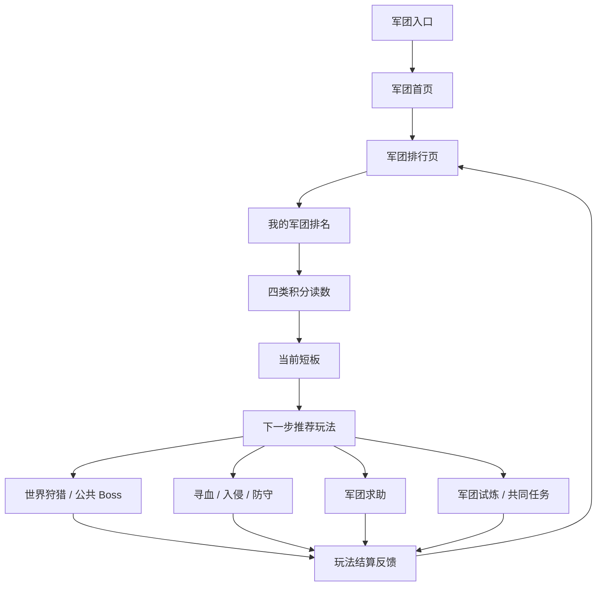

# FF｜首周军团积分排行 UE 设计稿

> 基于 `FF-首周军团积分排行设计拆解GDD.md` 继续细化。本文描述玩家如何在界面上看到：哪些玩法影响军团排行、不同玩法贡献了多少积分、下一步该参与哪个玩法。

---

## 一、UE 目标

- 让玩家进入军团榜后，第一眼知道军团排名由哪些玩法共同影响。
- 让玩家能看懂世界狩猎、寻血、军团求助、军团试炼分别给军团带来了多少积分。
- 让军团榜能反向引导玩家下一步去参与公共 Boss、寻血、防守、求助处理或军团试炼。
- 让不同层级玩家都能找到自己能贡献排行的位置，而不是只看到高战击杀。

## 二、核心 UE 判断

军团积分排行 UE 不能只做成排行榜页。它需要让玩家完成四个连续判断：

```text
我军团现在排第几
这次排名主要由哪几类积分构成
当前最该补哪类积分
我现在能进入哪个玩法补这个缺口
```

因此页面主线应是“排行读数 -> 短板判断 -> 玩法入口 -> 结算反馈 -> 回到排行”，而不是“入口 -> 榜单 -> 若干详情页”。

## 三、整体页面流转



## 四、入口设计

### 4.1 军团首页入口

军团首页保留“排行”页签，并在首页摘要区展示本军团当前排名。

入口位置：

```text
军团首页
  -> 概览
  -> 成员
  -> 任务
  -> 试炼
  -> 求助
  -> 排行
```

首页摘要展示：

```text
当前军团排名
今日积分变化
当前主要得分玩法
待处理求助数
```

点击“排行”进入军团排行页。

### 4.2 玩法结算入口

影响排行的玩法在结算时展示“军团积分变化”。

出现位置：

```text
世界狩猎结算
公共 Boss 结算
寻血结算
防守结算
军团求助处理结果
军团试炼结算
军团任务完成提示
```

结算展示：

```text
本次为军团增加 X 积分
积分来源：公共收益 / 高风险争夺 / 成员协助 / 共同任务
查看军团排行
继续参与该玩法
```

## 五、军团排行页

### 5.1 页面目的

军团排行页负责展示军团排名、积分来源和下一步行动，不只是展示名次。

### 5.2 页面结构

```text
我的军团排名
四类积分读数
当前短板
下一步推荐玩法
服务器军团榜
近期交手军团
成员贡献入口
```

首屏优先级：

```text
第一层：我的军团当前排名、总积分、距离上一名差距
第二层：四类积分占比和今日变化
第三层：当前最该补的积分类型
第四层：进入推荐玩法
```

服务器军团榜和成员贡献可以放在下半屏，不能压过“我的军团现在该做什么”。

### 5.3 我的军团排名

展示内容：

```text
当前排名
总积分
距离上一名差距
今日新增积分
本周最高贡献玩法
```

按钮：

```text
查看积分来源
去提升排名
```

点击“查看积分来源”定位到四类积分读数区。  
点击“去提升排名”定位到下一步推荐玩法区。

### 5.4 当前短板提示

当前短板提示承接“我的军团排名”和“四类积分读数”，告诉玩家下一步为什么推荐某个玩法。

判断规则：

```text
优先判断距离上一名差距
再判断四类积分中低于前一名最多的类别
再判断是否存在待处理求助或未完成共同任务
最后结合当日开放阶段给出推荐玩法
```

展示格式：

```text
当前最需要补：成员协助积分
原因：本军团该项积分低于上一名，且有 3 条求助未处理
推荐：处理军团求助
```

## 六、四类积分读数区

### 6.1 页面目的

四类积分读数区告诉玩家：排名不是单一击杀决定的，而是由四类玩法共同构成。

### 6.2 展示结构

四个积分卡片：

```text
公共收益积分：来自世界狩猎 / 公共 Boss
高风险争夺积分：来自寻血 / 入侵 / 防守
成员协助积分：来自军团求助 / 反击 / 保护 / 补回
共同任务积分：来自军团任务 / 军团试炼
```

每张卡片展示：

```text
积分名称
当前积分
今日新增
占总分比例
与上一名该项差距
主要贡献成员
当前可做动作
进入详情
```

### 6.3 积分卡片状态

| 状态 | 展示 |
|---|---|
| 今日有增长 | 显示今日 +X 和贡献成员 |
| 今日无增长 | 显示“今日暂无积分，去参与” |
| 玩法未开放 | 显示开放天数和预告 |
| 有待处理内容 | 显示红点和“有可处理事项” |

### 6.4 开放节奏提示

四类积分读数区需要展示当前阶段主推玩法，避免玩家误解为四类积分从首日同时开放。

展示方式：

```text
D4 主推：公共收益积分
  世界狩猎 / 公共 Boss 已开放，参与公共目标可提升军团排名。

D5 主推：高风险争夺积分
  寻血 / 入侵 / 防守已开放，带回临时收益、防守成功可提升军团排名。

D6 主推：成员协助积分
  军团求助已开放，处理成员战报可提升军团排名。

D7 主推：共同任务积分
  军团试炼 / 共同任务已开放，稳定参与可提升军团排名。
```

未到开放天数的积分卡片展示“即将开放”，已开放但今日无增长的卡片展示“去参与”。

### 6.5 分玩法详情页

玩家点击任一积分卡片进入对应详情。

详情页通用结构：

```text
玩法说明
今日积分明细
成员贡献
可继续参与的入口
```

## 七、公共收益积分详情

### 7.1 对应玩法

```text
世界狩猎
公共 Boss
```

### 7.2 页面说明

公共收益积分表示军团成员在公共收益玩法中的组织参与能力。

展示内容：

```text
今日参与次数
今日公共收益积分
参与成员数
Boss 归属或奖励权结果
主要贡献成员
```

按钮：

```text
前往世界狩猎
前往公共 Boss
查看今日记录
```

### 7.3 结算反馈

世界狩猎或公共 Boss 结算时，若产生军团积分，展示：

```text
本次公共收益积分 +X
来源：世界狩猎 / 公共 Boss
本军团当前排名：第 N 名
```

## 八、高风险争夺积分详情

### 8.1 对应玩法

```text
寻血
入侵
防守
追回被抢收益
```

### 8.2 页面说明

高风险争夺积分表示军团成员在高风险 PVP 中带回收益、防住损失和回应对方军团的能力。

展示内容：

```text
今日寻血参与次数
成功入侵次数
成功防守次数
带回临时收益次数
主要交手军团
```

按钮：

```text
前往寻血
参与防守
查看战报
```

### 8.3 战报关联

玩家从高风险争夺积分详情进入战报列表时，战报按军团积分相关性展示，优先呈现能影响军团积分的记录。

展示分组：

```text
本军团带回收益记录
本军团成功防守记录
本军团可追回记录
与主要交手军团相关记录
```

战报详情展示：

```text
对方军团
发生玩法
收益变化
当前可处理动作
处理后增加的积分类型
剩余有效时间
```

按钮：

```text
参与防守
追回收益
发布到军团求助
查看相关记录
```

## 九、成员协助积分详情

### 9.1 对应玩法

```text
战报求助
成员反击
成员保护
成员补回
```

### 9.2 页面说明

成员协助积分表示军团成员是否能帮助彼此处理 PVP 后果。

展示内容：

```text
待处理求助数
已回应求助数
今日协助积分
参与协助成员数
被帮助成员数
```

按钮：

```text
查看军团求助
发布我的战报
查看协助记录
```

### 9.3 军团求助列表

求助列表作为成员协助积分的下钻页面，不再作为整个系统的主入口。

列表展示：

```text
求助来源成员
对方军团
发生玩法
损失内容
可协助动作
剩余时间
当前状态
可获得协助积分
```

按钮：

```text
去反击
去保护
去补回
查看战报
```

### 9.4 求助处理反馈

成员完成协助后展示：

```text
协助成功
成员协助积分 +X
本军团当前排名变化
```

## 十、共同任务积分详情

### 10.1 对应玩法

```text
军团任务
军团试炼
共同进度
```

### 10.2 页面说明

共同任务积分给普通活跃玩家和低战玩家稳定贡献排行的位置。

展示内容：

```text
今日共同任务进度
军团试炼进度
参与成员数
未完成目标
可领取奖励
```

按钮：

```text
前往军团任务
前往军团试炼
查看成员贡献
```

### 10.3 低战玩家提示

当玩家战力不足以参与高风险争夺时，在推荐区提示：

```text
当前战力更适合参与军团任务和试炼，也能为军团排行增加积分。
```

## 十一、下一步推荐玩法

### 11.1 页面目的

下一步推荐玩法让玩家知道该去哪个玩法提升军团排行。

### 11.2 推荐逻辑

推荐内容按本军团当前缺口展示。

推荐示例：

```text
公共收益积分落后：推荐前往世界狩猎 / 公共 Boss
高风险争夺积分落后：推荐前往寻血 / 防守
成员协助积分落后：推荐处理军团求助
共同任务积分落后：推荐参与军团试炼 / 军团任务
```

推荐卡片展示：

```text
推荐玩法
推荐原因
预计可增加积分类型
进入玩法按钮
```

### 11.3 推荐卡片文案

```text
公共收益落后：本军团公共收益积分低于前一名，参与世界狩猎可提升该项积分。
高风险争夺落后：本军团今日寻血和防守积分较低，参与寻血可提升该项积分。
成员协助待处理：军团还有 X 条求助未回应，处理后可增加成员协助积分。
共同任务未完成：军团试炼仍有进度缺口，参与试炼可稳定增加积分。
```

## 十二、玩法结算反馈

### 12.1 页面目的

玩法结算反馈负责把一次玩法行为接回军团排行，让玩家知道“这次行为不是只给我个人奖励，也推进了军团目标”。

### 12.2 通用结算结构

影响军团积分的玩法结算时，展示：

```text
本次军团积分 +X
积分类型：公共收益 / 高风险争夺 / 成员协助 / 共同任务
本军团当前排名
距离上一名还差 X 分
继续参与该玩法
查看军团排行
```

如果本次没有增加军团积分，需要说明原因：

```text
本次未增加军团积分
原因：未达到有效参与 / 玩法未计入今日排行 / 已达今日上限
```

### 12.3 回流规则

结算页点击“查看军团排行”后，应定位到对应积分卡片，而不是只进入榜单顶部。

```text
世界狩猎结算 -> 定位公共收益积分卡片
寻血 / 防守结算 -> 定位高风险争夺积分卡片
求助处理结算 -> 定位成员协助积分卡片
军团试炼结算 -> 定位共同任务积分卡片
```

## 十三、服务器军团榜

### 13.1 列表字段

```text
排名
军团名
总积分
最高积分来源
主要交手军团
今日变化
```

点击军团项展示公开信息：

```text
军团名称
军团等级
成员数
总积分
分玩法积分占比
近期主要交手军团
```

不展示对方未公开的求助明细和成员内部任务明细。

### 13.2 排名变化反馈

当本军团排名变化时，军团首页和排行页显示：

```text
军团排名上升至第 N 名
本次主要来自：玩法名称 +X 积分
```

## 十四、新手引导

### 14.1 首次进入军团排行

触发条件：

```text
玩家首次进入军团排行页
军团榜已开放
```

引导步骤：

```text
引导查看当前排名
引导查看四类积分来源
引导点击下一步推荐玩法
```

### 14.2 首次从玩法结算进入排行

触发条件：

```text
玩家完成一次会增加军团积分的玩法
```

引导步骤：

```text
展示本次增加的积分类型
引导点击查看军团排行
引导查看该积分在总分中的占比
```

### 14.3 首次处理军团求助

触发条件：

```text
玩家首次进入成员协助积分详情
军团存在待处理求助
```

引导步骤：

```text
引导查看求助列表
引导选择反击、保护或补回
引导查看协助积分变化
```

## 十五、异常与边界

### 15.1 玩法未开放

若某类积分对应玩法未开放：

```text
积分卡片置灰
显示开放时间
不展示进入按钮
```

### 15.2 今日暂无积分

若某类积分今日无增长：

```text
显示“今日暂无积分”
展示可参与玩法入口
```

### 15.3 军团未加入

若玩家未加入军团：

```text
军团排行可预览
我的军团排名区域显示“加入军团后可为排名贡献积分”
按钮跳转军团推荐页
```

### 15.4 战报求助过期

若求助战报过期：

```text
求助从待处理移至历史
不再允许反击、保护或补回
已获得积分保留
```

### 15.5 排行结算周期结束

若排行周期结束：

```text
本周期排名锁定
展示结算结果
新周期积分从 0 开始
历史记录保留
```

## 十六、首版 UE 范围

首版必须完成：

```text
军团排行页
我的军团排名
四类分玩法积分卡片
分玩法积分详情
下一步推荐玩法
玩法结算中的军团积分反馈
成员协助积分下钻到军团求助
服务器军团榜
```

首版暂缓：

```text
正式宣战界面
军团战地图
跨服军团榜
复杂指挥面板
赛季级结算动画
```

首版 UE 的成立标准：

```text
玩家能从军团榜看出哪些玩法影响排名
玩家能看到不同玩法贡献了多少积分
玩家能从排行页直接进入推荐玩法
玩家能理解自己当前适合通过哪类玩法为军团加分
玩家完成玩法后能看到军团积分变化并回到对应积分卡片
```
