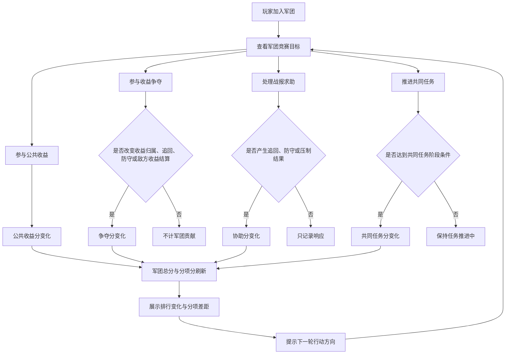

# FF-军团竞赛玩法串联设计GDD

## 一、需求目的

- 把公共收益、收益争夺、战报求助、成员协助、共同任务串成同一个军团竞争目标。
- 让玩家知道自己的行为如何影响军团，而不是只看到个人奖励。
- 让军团能根据当前差距判断下一轮应该抢收益、防守、追回、处理战报还是补共同任务。
- 避免军团竞赛变成高战击杀榜。
- 让普通成员和低战成员也能产生可见贡献。

## 二、需求概述

军团竞赛是一个把多种玩法行为汇总到军团目标上的轻量玩法。玩家加入军团后，参与公共收益、收益争夺、战报协助、共同任务等行为，都会在满足条件时转化为军团积分。

军团积分不只是排行结果。它要告诉玩家三件事：

1. 本军团当前排在什么位置。
2. 本军团是因为哪类行为领先或落后。
3. 下一轮更应该组织什么行动。

本设计只负责把玩法串成一个军团竞争目标，不展开完整军团战、沙盘地图、正式宣战、跨服赛季或完整 GVG 结算。

## 三、玩法结构

### 3.1 流程图

### 3.2 核心循环

玩家参与玩法，系统把有效行为转化为军团分项变化；军团页展示总分、排行和分项差距；成员根据差距决定下一轮抢收益、防守、追回、处理战报或补共同任务。

这个循环成立的关键不是“给积分”，而是让玩家看到行为改变了军团竞争状态。如果系统只给个人奖励，军团竞赛就会退回成多个独立玩法。

## 四、军团积分获取

军团积分不是四个独立玩法，而是把不同玩家行为汇总到同一个军团目标上的计分方式。公共收益、收益争夺、战报协助、共同任务分别对应不同的贡献来源，但都服务于同一个结果：让军团总分和分项差距发生变化。

公共收益承接普通成员和低战成员的稳定贡献。玩家完成本轮指定的公共收益目标后，系统增加公共收益分，并记录贡献成员。公共收益目标结算后，不再重复给分；个人日常收益、非军团目标收益、已过期目标不计入公共收益分。公共收益目标的具体来源、每日上限和个人贡献上限在数值配置中确定。

收益争夺承接围绕收益发生的 PVP 行为。PVP 只有在改变收益归属、追回结果、防守结果或敌方收益结算时，才计入军团贡献。单纯击杀路人、反复刷同一对象、没有改变任何收益或军团状态的战斗，不计入争夺分。争夺分的判定重点是“是否改变军团收益状态”，不是战斗次数或击杀数量。

战报协助承接求助和成员响应。玩家产生有效战报后，可以向军团求助；其他成员参与后，如果造成追回、防守或压制结果，系统增加协助分。只点击响应但没有实际结果时，只记录响应，不给军团积分。同一战报已结算、过期或失败后，不再重复给分。

共同任务承接军团整体推进和低风险参与。成员通过提交、协作、补进度等行为推进共同任务；任务达到阶段条件后，系统增加共同任务分，并记录贡献成员。共同任务完成后不继续给分，单人重复刷低价值动作需要设置上限，避免共同任务分压过收益争夺和战报协助。

不同成员的积分获取重点不同。高战成员主要通过抢夺高价值收益、追回被抢收益、防守关键目标、处理高威胁战报产生贡献；普通成员主要通过公共收益、共同任务、简单协助、战报响应产生贡献；低战成员主要通过补共同任务进度、提交资源、响应低风险协助、防守提醒等行为产生贡献。成员分层不是三套独立功能，只是同一个积分获取规则下的参与差异。

低战贡献不能只做成安慰分，必须进入军团总分或明确影响分项差距。高战价值来自改变军团收益状态，不来自脱离目标的击杀数量。

## 五、排行与积分反馈

### 5.1 总分与分项

军团页展示军团总分、排行、公共收益分、争夺分、协助分、共同任务分。每次有效贡献后，玩家需要看到本次行为进入了哪类分项，以及军团状态发生了什么变化。

玩家加入、退出或更换军团时，历史贡献是否保留给原军团，需要跟军团成员规则统一。

### 5.2 差距提示

军团页根据分项差距提示下一轮行动方向：

- 公共收益落后：提示优先组织公共收益目标。
- 争夺分落后：提示优先抢收益、追回或拦截。
- 协助分落后：提示优先处理战报求助。
- 共同任务分落后：提示优先补共同任务进度。
- 某分项领先但被追近：提示优先防守对应优势。

差距提示只告诉军团该做什么，不自动分配成员，也不展开完整指挥系统。
