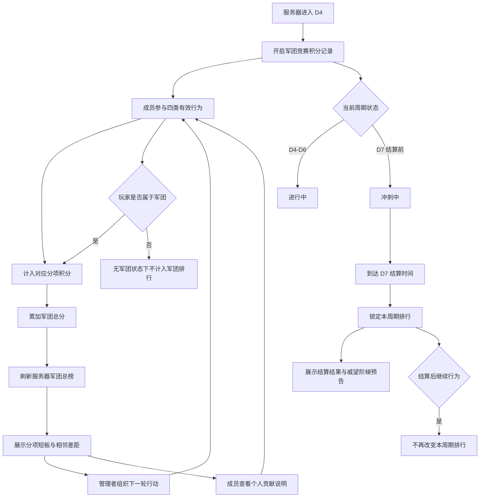

# FF｜首周军团竞赛设计拆解 GDD

版本：v0.1  
日期：2026-07-03  
性质：方向验证稿，基于首周军团积分排行继续拆解  
目标：把 D4-D7 的军团积分排行活动化，让军团围绕分项短板、相邻名次差距和首周结算形成可组织、可追赶、可承接后续沙盘预告的共同目标

---

## 0. 资料来源与设计边界

### 0.1 当前依据

- 本地文档：`workspace/projects/开发中/FF-指尖战记/策划/输出/7日强社交功能链路/文档/FF-7日强社交功能链路梳理.md`
- 本地文档：`workspace/projects/开发中/FF-指尖战记/策划/输出/7日强社交功能链路/文档/FF-首周军团积分排行设计拆解GDD.md`
- 本地文档：`workspace/projects/开发中/FF-指尖战记/策划/输出/7日强社交功能链路/文档/FF-首周军团积分排行UE设计稿.md`
- 本地文档：`workspace/projects/开发中/FF-指尖战记/策划/输出/7日强社交功能链路/文档/FF-首周军团积分与后续沙盘威望预留方案.md`

### 0.2 设计边界

本文只设计首周军团竞赛，不展开完整军团战、沙盘地图、正式宣战、跨服赛季或完整 GVG 结算。

军团竞赛不是一套脱离积分排行的新玩法。它是军团积分排行的活动化承接：把公共收益积分、高风险争夺积分、成员协助积分、共同任务积分放入 D4-D7 的短周期目标，让军团能看到当前名次、分项短板、相邻差距、冲刺时间和 D7 结算结果。

本文不写具体数值、奖励内容、防刷实现、接口字段、埋点或技术实现方案。四类积分的有效判定、奖励档位、入退团处理和防刷规则仍需后续正式 GDD 或数值表补齐。

---

## 一、需求目的

- 让 D4-D7 的多个玩法不再松散，手段：通过军团竞赛把公共收益、高风险争夺、成员协助和共同任务汇总到同一周期目标。
- 让军团知道下一轮该组织什么，手段：展示四类积分分项、当前短板和相邻名次差距。
- 让不同成员层都有贡献位置，手段：让高战、普通活跃、低战成员分别通过争夺、防守、协助、共同任务等行为推动军团竞赛状态。
- 让排行具备轻量竞赛压力，手段：展示上一名和下一名的差距，形成追赶或守位目标，但不生成指定宣战关系。
- 让首周军团目标承接后续沙盘预期，手段：D7 结算后展示轻量奖励和后续威望阶梯预告，不让首周结果决定后续沙盘胜负。

---

## 二、需求概述

首周军团竞赛是军团积分排行的活动化、周期化承接，用于把 D4-D7 的多人参与行为转化为军团总分、四类分项表现、相邻名次差距和首周结算结果。

本功能的核心不是另做一个军团战，而是把已有首周链路收束成一个军团共同目标：

```text
公共收益参与
  -> 高风险争夺
  -> 成员求助和协助
  -> 军团共同任务
  -> 军团竞赛排行
  -> D7 结算和后续威望预告
```

本功能不包含指定宣战、沙盘地图、跨服赛季或完整 GVG。职业竞技场不进入首版军团竞赛主线。个人贡献主要用于解释玩家做了什么、计入哪类军团积分、是否影响军团短板和相邻差距，不替代个人奖励规则。

周期按 D4-D7 递进：D4 开启军团竞赛积分记录，D5 让高风险争夺进入军团状态，D6 强化成员协助和组织补短板，D7 进入冲刺、结算和后续威望预告。

---

## 三、功能概述

### 3.1 流程图



### 3.2 军团竞赛开启与总榜展示

军团竞赛在服务器进入 D4 后开启，用服务器军团总榜承接 D4-D7 的军团积分变化。

**操作流程**

1. 服务器进入 D4 后，系统开启本周期军团竞赛积分记录。
2. 已加入军团的玩家参与周期内有效行为后，该行为按来源进入对应军团分项。
3. 分项积分累加到军团总分。
4. 军团总分变化后，服务器军团总榜展示当前排行。
5. 到达 D7 结算时间后，系统锁定本周期排行，并进入结算展示。

**规则/边界**

- 若服务器未进入 D4，则军团竞赛处于未开启状态，不展示本周期排行变化。
- 若服务器进入 D4，则开启军团竞赛积分记录。
- 若到达 D7 结算时间，则锁定本周期排行并进入结算展示。
- 若周期已结算，则后续行为不再改变本周期军团排行，只进入下一周期或不计入。
- 若玩家当前无军团，则其行为不计入本周期军团排行。
- 排名只面向服务器军团总榜，不生成跨服排行。

**状态说明**

| 状态 | 玩家可见含义 | 功能表现 |
|---|---|---|
| 未开启 | 本服尚未进入 D4 | 不记录本周期军团竞赛积分 |
| 进行中 | D4-D6 正常累计积分 | 总榜、分项、相邻差距随有效行为变化 |
| 冲刺中 | D7 结算前 | 继续累计积分，并强化结算临近感 |
| 已结算 | D7 结算时间已到 | 本周期排行锁定，展示结算与预告 |
| 无军团 | 玩家当前不属于任何军团 | 可查看活动信息，但无军团计分归属 |
| 换团 / 离团待处理 | 玩家周期内发生入退团或换团 | 计分归属待正式规则确认 |

### 3.3 四类积分计入

四类积分用于把不同成员行为转化为军团竞赛状态。每类积分独立展示，并累加到军团总分。

**操作流程**

1. 玩家在周期内完成有效行为。
2. 系统判断该行为属于四类来源中的哪一类。
3. 若玩家完成行为时属于某军团，则该行为计入该军团对应分项。
4. 对应分项增加后，同步累加到军团总分。
5. 军团总榜、分项表现和相邻名次差距根据积分变化更新。
6. 玩家可在个人贡献页看到该行为计入的分项、贡献值和影响说明。

#### 公共收益积分

公共收益积分承接 D4 的公共收益目标，用于让军团先形成共同追分对象。

**规则/边界**

- 若玩家完成已判定为公共收益来源的有效行为，则该行为计入公共收益分项。
- 若公共收益分项增长，则军团总分同步增长。
- 若公共收益是本军团当前短板，则该行为在个人贡献说明中标记为对短板有贡献。

#### 高风险争夺积分

高风险争夺积分承接 D5 的 PVP 和临时收益争夺，让冲突行为进入军团竞赛状态。

**规则/边界**

- 若玩家完成已判定为高风险争夺来源的有效行为，则该行为计入高风险争夺分项。
- 若高风险争夺分项增长，则军团总分同步增长。
- 若该分项影响相邻名次差距，则个人贡献页显示本次行为对差距的影响。
- 高风险争夺不按纯击杀独立成立，后续有效判定需继续绑定收益变化、防守、追回或战报处理。

#### 成员协助积分

成员协助积分承接 D6 的求助协作，让个人 PVP 后果进入军团处理。

**规则/边界**

- 若玩家完成已判定为成员协助来源的有效行为，则该行为计入成员协助分项。
- 若成员协助分项增长，则军团总分同步增长。
- 若军团在成员协助分项落后，则该分项在短板展示中提示为可组织方向。
- 只发布求助不应直接作为高价值计分结果，正式规则需确认求助被回应、反击、保护、补回等完成判定。

#### 共同任务积分

共同任务积分承接军团共同目标，让普通活跃和低战成员也能稳定推动军团竞赛。

**规则/边界**

- 若玩家完成已判定为共同任务来源的有效行为，则该行为计入共同任务分项。
- 若共同任务分项增长，则军团总分同步增长。
- 若共同任务分项变化改变相邻名次差距，则总榜差距展示同步更新。
- 共同任务不应高到覆盖公共收益和高风险争夺，否则军团竞赛会退化为日常活跃榜。

**四类积分通用边界**

- 若玩家在周期内完成有效行为，且当时属于某军团，则该行为按来源计入该军团对应分项。
- 公共收益、高风险争夺、成员协助、共同任务分别进入独立分项，同时累加到军团总分。
- 若行为不属于已确认的四类有效来源，则不写入本功能正文规则，待有效判定确认后补充。
- 若周期已结算，则该行为不再改变本周期军团排行。
- 职业竞技场不进入军团竞赛主线积分来源。

### 3.4 分项短板与相邻差距展示

分项短板与相邻差距用于让军团知道下一轮行动应围绕哪里组织，而不是只看到一个静态总分。

**操作流程**

1. 玩家进入军团竞赛页面。
2. 系统展示本军团在服务器总榜中的当前名次、总分和相邻名次差距。
3. 系统展示四类分项表现，让成员看到本军团当前较弱的积分来源。
4. 若本军团与上一名存在差距，则展示追赶所需的相邻差距。
5. 若本军团与下一名存在接近关系，则展示守位压力。
6. 玩家根据分项短板和相邻差距选择下一轮可参与行为。

**规则/边界**

- 若展示追分目标，则只展示相邻名次差距，不生成指定宣战关系。
- 若军团处于服务器总榜第一名，则不展示追赶上一名，只展示守位压力或领先状态。
- 若军团处于服务器总榜末位，则不展示被下一名追赶压力，只展示追赶上一名差距。
- 若四类分项中存在明显落后项，则该分项作为短板展示。
- 若短板判定口径尚未确认，则短板展示规则标记为待定，不补写具体算法。

### 3.5 管理者组织指引

管理者组织指引用于把排行压力转化为军团行动方向，帮助管理者根据短板和相邻差距安排成员参与。

**操作流程**

1. 管理者进入军团竞赛页面。
2. 管理者查看军团总分、相邻名次差距和四类分项表现。
3. 页面根据当前短板提示下一轮适合组织的积分方向。
4. 管理者根据提示组织成员参与对应来源行为。
5. 成员完成行为后，管理者回到页面查看分项增长和相邻差距变化。

**规则/边界**

- 若本军团某分项为当前短板，则管理者指引优先提示该分项对应的行动方向。
- 若相邻名次差距较小，则管理者指引强调追赶或守位。
- 若周期进入 D7 冲刺中，则管理者指引围绕结算前可改变排行的分项展示。
- 若周期已结算，则管理者指引不再提示本周期追分行动，只展示结算结果和后续预告。
- 管理者指引只提供组织方向，不替代成员个人选择，也不创建强制任务。

### 3.6 成员个人贡献说明

个人贡献说明用于让成员知道自己做了什么、贡献进入了哪类军团积分、是否帮助军团缩小或拉开相邻差距。

**操作流程**

1. 玩家进入个人贡献页。
2. 页面展示玩家周期内已计入军团的行为记录。
3. 每条记录展示行为、所属分项、贡献值和对军团差距的影响。
4. 若该行为补到了军团当前短板，则页面说明该行为对短板有贡献。
5. 若该行为影响相邻名次差距，则页面说明差距变化方向。

**规则/边界**

- 若个人行为已计入军团，则在个人贡献页显示行为、分项、贡献值和对差距的影响。
- 若个人行为未计入军团，则不在本周期军团贡献中展示为有效贡献。
- 若玩家无军团，则个人贡献页提示当前无军团归属，无法形成军团竞赛贡献。
- 若玩家发生换团或离团，则相关贡献归属待正式规则确认，不在本稿中补造。
- 个人贡献说明只解释个人行为和军团积分关系，不作为个人奖励最终口径。

### 3.7 D7 结算与威望阶梯预告

D7 结算用于锁定首周军团竞赛结果，并以轻量奖励和威望阶梯预告承接后续沙盘目标。

**操作流程**

1. D7 结算时间到达后，系统锁定本周期军团排行。
2. 页面展示本军团最终名次、总分、四类分项表现和相邻差距结果。
3. 系统展示本周期轻量奖励结果。
4. 页面展示后续威望阶梯预告，让玩家知道军团竞赛与后续沙盘威望存在承接关系。
5. 结算后玩家继续参与行为，不再改变本周期排行。

**规则/边界**

- 若到达 D7 结算时间，则锁定本周期排行并进入结算展示。
- 若周期已结算，则后续行为不再改变本周期军团排行，只进入下一周期或不计入。
- 若展示后续威望阶梯预告，则只作为后续沙盘威望的轻量承接，不提供决定性沙盘优势。
- 若奖励档位尚未确认，则只标注轻量奖励，不写具体奖励内容和数值。
- 若威望阶梯的正式规则尚未确认，则只展示预告关系，不写完整威望规则。

---

## 四、UE 交互

### 4.1 页面入口

- D4 开启后，玩家可从军团相关入口进入军团竞赛页面。
- 无军团玩家可查看活动说明，但无法形成本周期军团贡献。
- D7 结算后，入口进入结算展示状态。

### 4.2 总榜页面

总榜页面展示服务器军团排行、本军团名次、军团总分、相邻名次差距和当前周期状态。

- 进行中：展示当前排行和积分变化。
- 冲刺中：突出 D7 结算临近与相邻差距。
- 已结算：展示最终排行和结算结果，不再展示本周期追分指引。

### 4.3 分项页面

分项页面展示公共收益、高风险争夺、成员协助、共同任务四类积分表现。

- 若某分项为短板，则标记为当前可组织方向。
- 若短板判定口径待定，则页面文案与展示强度待确认。

### 4.4 管理者指引

管理者视角展示当前短板、相邻差距和建议组织方向。

- 管理者看到的是行动方向，不是强制任务。
- 指引不生成指定宣战关系。
- 已结算后不再展示本周期组织追分指引。

### 4.5 个人贡献页

个人贡献页展示玩家已计入军团竞赛的行为、分项、贡献值和差距影响。

- 若行为已计入军团，则展示贡献说明。
- 若玩家当前无军团，则提示无军团归属。
- 若换团 / 离团贡献归属未确认，则相关展示口径待定。

### 4.6 D7 结算页

D7 结算页展示最终排名、四类分项结果、轻量奖励和后续威望阶梯预告。

- 奖励展示只表达本周期结果，不写未确认的具体奖励内容。
- 威望阶梯只作为后续沙盘目标预告，不写完整沙盘规则。
- 结算后不再显示本周期追分入口。

---

## 五、待定与阻塞项

### 5.1 方向验证保留项

- 个人奖励口径：待定，原因：当前仅确认个人贡献用于解释个人做了什么，未确认个人奖励规则。
- 弱军团是否需要追赶系数：待定，原因：当前只确认相邻名次差距形成追赶压力，未确认额外追赶加成。
- 四类事件数据稳定性：待定，原因：当前只确认四类来源方向，未确认每类有效事件清单。
- 入退团 / 换团计分公平：待定，原因：当前只确认存在换团 / 离团待处理状态，未确认归属规则。

### 5.2 正式 GDD 阻塞项

- 四类积分有效判定：阻塞，原因：未确认哪些具体行为可计入公共收益、高风险争夺、成员协助、共同任务。
- 排行周期与结算口径：阻塞，原因：D4-D7 与 D7 结算已确认，但具体结算时间点和跨周期归属未确认。
- 奖励档位：阻塞，原因：当前只确认轻量奖励，不确认奖励档位、内容和领取规则。
- 入退团 / 换团处理：阻塞，原因：周期内入团、退团、换团的贡献归属未确认。
- 防刷规则：阻塞，原因：当前 GDD 不补造防刷条件，需要先确认设计层有效行为边界。

---

## 六、验证指标

### 6.1 军团竞赛是否形成组织行动

| 验证问题 | 观察指标 |
|---|---|
| 军团是否围绕分项短板组织行动 | 管理者指引打开率、从短板卡片进入玩法比例、组织目标后的参与人数 |
| 玩家是否理解行为计入哪类军团积分 | 玩法结算后查看个人贡献比例、分项详情点击率 |
| 相邻差距是否形成追赶或守位压力 | 相邻差距展示后的玩法进入率、D7 冲刺期参与率 |

### 6.2 成员分层是否健康

| 用户层 | 验证重点 | 观察指标 |
|---|---|---|
| 高战成员 | 是否推动高风险争夺但不垄断全部结果 | 高风险争夺分项占比、总贡献集中度 |
| 普通活跃成员 | 是否通过公共收益和协助参与竞赛 | 公共收益参与率、成员协助完成率 |
| 低战成员 | 是否通过共同任务和补位获得贡献位置 | 共同任务参与率、低战贡献占比 |
| 管理者 | 是否根据短板组织下一轮行动 | 指引点击后的分项增长、组织目标响应人数 |

### 6.3 竞赛结构是否稳定

| 异常方向 | 异常表现 |
|---|---|
| 变成击杀榜 | 高风险争夺分项过高，公共收益、协助、共同任务无人参与 |
| 变成活跃榜 | 共同任务分项过高，PVP 和公共收益失去意义 |
| 变成静态榜 | 玩家只看总排名，不点击分项、不进入推荐玩法 |
| 弱军团放弃 | 弱军团只看到头部差距，看不到相邻追分和守位目标 |

---

## 七、总结

首周军团竞赛不应被设计成另一个完整军团战，也不应只是军团积分排行换名包装。它的定位是把首周军团积分排行变成有周期、有追分、有组织、有结算的共同目标。

它承接的核心关系是：

```text
四类玩法行为
  -> 四类军团积分
  -> 军团总榜和相邻差距
  -> 管理者组织下一轮行动
  -> D7 结算和后续威望预告
```

首版最重要的边界是三条：

1. 竞赛感来自相邻名次和分项短板，不来自指定宣战。
2. 个人贡献用于解释玩家行为如何影响军团，不替代个人奖励规则。
3. D7 结果只做轻量奖励和威望预告，不提前决定后续沙盘胜负。

只要这三条边界稳定，军团竞赛就能把 FF 首周从“军团积分看板”推进到“军团共同目标”，同时为后续沙盘、战役和威望系统保留足够空间。
