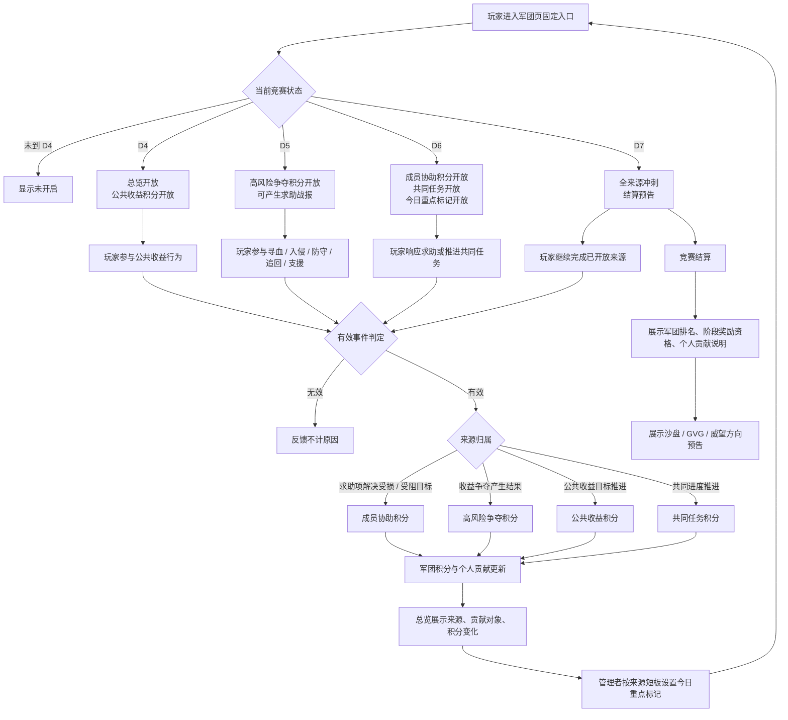

# FF｜首周军团竞赛正式 GDD

> 适用标准：`reference/部门标准/策划/gdd/GDD写作标准.md`（v25）
> 覆盖范围：D4-D7 首周军团竞赛。D7 后仅保留沙盘、GVG、威望方向预告，不展开完整军团战、沙盘地图、正式宣战、跨服赛季或完整 GVG 结算。

---

## 一、需求目的

- 将 D4-D7 的公共收益、收益争夺、成员协助、共同任务正式汇总成军团阶段表现，让首周玩家知道自己的行为如何影响军团。
- 让军团管理者能从来源表现中看到短板，并按公共收益、争夺、协助、共同任务组织下一轮行动。
- 让高战玩家影响军团上限，但不能独占全部追分路径；普通成员和低战成员也能通过公共收益、协助和共同任务产生有效贡献。
- 在 D7 结算时分清原玩法个人奖励与军团竞赛阶段奖励，并把首周军团目标承接到沙盘、GVG、威望方向预告。

---

## 二、需求概述

首周军团竞赛是 D4-D7 开放的军团阶段表现系统，玩家在指定玩法中产生的有效行为会按四类来源计入所属军团，用于军团阶段排名、军团奖励资格和个人贡献说明。竞赛只统计公共收益积分、高风险争夺积分、成员协助积分、共同任务积分四类主来源，职业竞技场、纯个人成长、登录、聊天、签到、普通捐献、无收益变化切磋不进入主竞赛。积分只作为军团阶段表现和排名依据，不替代原玩法个人奖励，也不是个人货币。

---

## 三、主体功能 / 玩法设计

### 3.1 设计对象与范围

本功能从玩家进入军团页固定入口开始，到 D7 竞赛结算展示和后续方向预告结束。系统只处理首周军团竞赛的入口、来源开放、有效行为判定、来源计分、求助协助、共同任务、今日重点标记、D7 冲刺、结算展示和 D7 后预告。

四类来源是本竞赛唯一主来源：

| 来源 | 开放节奏 | 设计作用 |
|---|---:|---|
| 公共收益积分 | D4 开放 | 把世界狩猎、公共 Boss、公共收益目标推进等行为转成军团基础贡献 |
| 高风险争夺积分 | D5 开放 | 把临时收益归属变化、保护收益、防止损失、追回损失、影响敌方收益结算的行为转成军团竞争表现 |
| 成员协助积分 | D6 开放 | 把真实受损或受阻事件中的求助响应结果转成成员间协作贡献 |
| 共同任务积分 | D6-D7 开放 | 把军团任务、军团试炼、共同进度目标、多人补进度目标转成共同目标推进 |

同一玩家同一次行为只计入一个主来源。通过求助项解决受损或受阻目标时，优先计入成员协助；无求助项且围绕收益争夺产生结果时，计入高风险争夺；同一事件已结算、过期或归档后，不再追加同来源积分。

### 3.2 Mermaid 流程图

### 3.3 军团入口与总览汇总阶段表现

军团页在 D4 后提供固定竞赛入口。玩家进入后，总览页展示军团当前积分、个人贡献、四类来源开放状态、今日重点标记和排行入口。若竞赛未开启，总览只展示未开启状态；若玩家未加入军团，玩家可以看到入口提示，但不产生军团计分。

系统根据当前竞赛日判断可参与来源。来源未开放时，相关行为不进入该来源计分；来源已开放时，行为仍需满足对应来源的有效事件条件。每次有效计分反馈必须说明来源、贡献对象和积分变化；无效行为必须说明不计原因，例如来源未开放、行为不属于四类主来源、事件已结算、事件已过期、事件已归档或未产生有效收益变化。

总览页承担军团阶段表现汇总，不替代原玩法入口。玩家仍从原玩法完成世界狩猎、公共 Boss、寻血、入侵、防守、追回、支援、求助响应、共同任务或军团试炼；军团竞赛只汇总这些行为在首周军团阶段中的贡献结果。

### 3.4 公共收益积分将公共收益行为转成军团贡献

公共收益积分 D4 开放，统计玩家在世界狩猎、公共 Boss、公共收益目标推进中的有效行为。公共 Boss 相关行为包括参与、协助和奖励归属；公共收益目标推进只统计确实推进军团公共收益目标的行为。

系统判定公共收益积分时，需要同时满足：玩家已加入军团、来源已开放、行为属于公共收益范围、该行为未被其他主来源优先占用、事件未结算或归档。满足条件后，本次行为按公共收益来源为玩家所属军团增加阶段积分，并在个人贡献中记录为公共收益贡献。

公共收益积分承担首周军团共同目标的基础贡献路径。它不能被共同任务完全覆盖，也不能被高风险争夺挤压为无效来源。职业竞技场、纯个人成长、登录、聊天、签到、普通捐献、无收益变化切磋不计入公共收益积分。

### 3.5 高风险争夺积分将收益归属变化转成军团竞争表现

高风险争夺积分 D5 开放，统计寻血、入侵、防守、追回、支援中围绕临时收益或敌我收益结算产生结果的行为。有效结果包括改变临时收益归属、保护收益、防止损失、追回损失或影响敌方收益结算。

D5 起，高风险争夺行为可以产生求助战报，但成员协助积分到 D6 才开放。若 D5 的争夺行为没有通过求助项完成，则按高风险争夺条件判定；若 D6 后同一受损或受阻目标通过求助项被成员回应并解决，则优先计入成员协助，不再重复计入高风险争夺。

高风险争夺积分用于体现军团之间围绕收益的对抗强度，但不得成为唯一有效追分方式。该来源受独立分值、单日来源上限、重复对象衰减、军团总日上限和占比限制约束，具体数值由配置表测试校准。

### 3.6 求助项与成员协助积分将受损受阻事件转化为协作贡献

成员协助积分 D6 开放，必须来自真实受损或受阻事件。玩家在遭遇收益受损、目标受阻或需要补位完成目标时，可以形成求助项；成员回应求助后，通过支援、护送、复仇、追回、补位完成目标等结果解决该求助，才产生成员协助积分。

求助项有三类过程状态：求助待响应、求助进行中、求助已解决。待响应表示目标已形成求助但尚无成员接手；进行中表示成员已回应并正在处理；已解决表示求助目标被有效完成。只有已解决且结果属于成员协助有效结果范围的求助项，才能为回应成员和相关军团产生成员协助贡献。

成员协助积分的设计作用是让普通成员和低战成员有有效贡献路径，并把个人损失、受阻目标转成可被军团承接的协作行为。无真实受损或受阻事件、无人回应、未产生有效结果、已过期、已归档、已结算的求助项不追加成员协助积分。

### 3.7 共同任务积分将多人补进度纳入军团目标

共同任务积分 D6-D7 开放，统计军团任务、军团试炼、共同进度目标、多人补进度目标中的有效推进。共同任务面向军团成员共同完成，承担稳定组织目标和补齐进度的作用。

系统判定共同任务积分时，需要确认任务或目标处于开放状态，玩家已加入军团，行为确实推进军团任务、军团试炼或共同进度目标，并且没有被公共收益、高风险争夺或成员协助来源优先占用。满足条件后，本次行为按共同任务来源增加军团阶段积分，并更新个人贡献说明。

共同任务不得覆盖公共收益和高风险争夺。它用于补充首周军团组织目标，而不是把所有行为都改写成任务进度。共同任务池、进度目标、基础分值、单日来源上限和占比限制由配置表承接。

### 3.8 今日重点标记帮助管理者组织下一轮行动

今日重点标记 D6 开放，团长和副团可以设置、修改或取消今日重点标记。普通成员只能查看标记。标记展示在总览页，用于提示今天优先关注的来源、目标或短板方向，帮助成员理解下一轮行动重点。

今日重点标记只影响展示和组织提示，不改变任何来源积分，不强制成员行动，也不影响奖励资格。被标记的来源或目标仍按原来源规则判定有效行为；未被标记的来源或目标，在满足有效条件时仍可正常计分。

### 3.9 D7 冲刺、结算展示与后续预告

D7 开放全来源冲刺，总览页展示结算预告，提示玩家剩余可参与来源、个人贡献状态和军团阶段表现。D7 结算时，系统按军团阶段积分形成排名展示，并展示军团奖励资格和个人贡献说明。

原玩法个人奖励仍由原玩法结算，军团竞赛不替代原玩法奖励。军团竞赛阶段奖励按军团结算档位发放到军团或成员资格规则；个人领取阶段奖励需同时满足结算时所在军团条件和本周期有效贡献条件。

D7 结算展示之后，只出现沙盘、GVG、威望方向预告。预告用于告诉玩家军团阶段表现会承接后续更长期的军团目标，但不开放完整军团战报名、宣战、地图、跨服赛季结算入口，也不展示完整 GVG 结算规则。

---

## 四、状态与边界

### 4.1 状态定义

| 状态 | 进入条件 | 玩家反馈 | 退出或流转 |
|---|---|---|---|
| 未开启 | 当前时间早于 D4 或竞赛未到开放日 | 入口或总览显示未开启 | 到 D4 后进入可参与 |
| 可参与 | 当前竞赛日已开放，玩家所在军团可参与 | 总览展示积分、来源状态、排行入口 | 根据竞赛日开放更多来源，或进入待结算 |
| 来源未开放 | 玩家触发的来源晚于当前竞赛日开放 | 说明该来源尚未开放，不计入本次竞赛来源 | 到对应开放日后可参与 |
| 有效事件待判定 | 玩家完成可能计分的玩法行为 | 等待来源归属与有效性反馈 | 判定为有效计分或无效不计 |
| 求助待响应 | 真实受损或受阻事件形成求助项，尚无成员回应 | 求助列表显示待响应 | 成员回应后进入求助进行中，过期后不计 |
| 求助进行中 | 成员已回应求助并处理目标 | 求助列表显示进行中 | 达成有效结果后进入求助已解决，失败或过期后不计 |
| 求助已解决 | 求助项产生支援、护送、复仇、追回、补位完成目标等有效结果 | 显示协助来源、贡献对象、积分变化 | 已结算或归档后不再追加同来源积分 |
| 重点已标记 | 团长或副团设置今日重点标记 | 总览展示今日重点 | 管理者修改或取消，或次日按配置刷新 |
| 待结算 | D7 冲刺结束，进入结算前展示 | 展示结算预告和资格说明 | 结算完成后进入已结算 |
| 已结算 | D7 阶段结算完成 | 展示军团排名、阶段奖励资格、个人贡献说明 | 进入 D7 后预告 |
| D7 后预告 | 竞赛结算展示后 | 展示沙盘、GVG、威望方向预告 | 不在本 GDD 内展开后续完整玩法 |

### 4.2 来源互斥边界

- 同一玩家同一次行为只计入一个主来源。
- 通过求助项解决受损或受阻目标，优先计入成员协助。
- 无求助项且围绕收益争夺产生结果，计入高风险争夺。
- 公共收益目标推进计入公共收益，除非该行为已被求助项优先占用。
- 共同任务只统计军团任务、军团试炼、共同进度目标、多人补进度目标中的有效推进，不吸收其他来源的核心行为。
- 同一事件已结算、过期或归档后，不再追加同来源积分。

### 4.3 无效行为边界

以下行为不进入主竞赛来源：职业竞技场、纯个人成长、登录、聊天、签到、普通捐献、无收益变化切磋。玩家触发这些行为时，如页面需要反馈，应说明该行为不属于本次军团竞赛四类主来源，不产生军团竞赛积分。

高风险争夺必须产生收益归属、收益保护、防止损失、追回损失或影响敌方收益结算的结果；仅发生战斗但无收益变化的切磋不计入高风险争夺。成员协助必须来自真实受损或受阻事件，并通过求助项被成员回应后产生有效结果；只有求助展示或口头组织，不产生有效结果时不计入成员协助。

### 4.4 军团变更边界

- 未加入军团的玩家不产生军团竞赛积分。
- 玩家加入军团后，从加入后的有效行为开始为当前军团计分。
- 玩家退出、被踢或转团后，已产生积分保留在原军团，个人不能携带到新军团。
- 同一竞赛日内，玩家只为一个军团产生积分；转团后从下一竞赛日开始为新军团计分。
- 结算前转团或退出，不影响原军团已获得积分。
- 个人结算资格以结算时所在军团和本周期有效贡献为准。
- 军团解散后不再参与本周期后续排行；解散前个人贡献保留展示，但不再产生军团结算奖励。

### 4.5 结算奖励边界

军团竞赛积分是军团阶段表现和排名依据，不是个人货币。原玩法个人奖励仍按原玩法结算；军团竞赛只提供阶段排名展示、军团奖励资格和个人贡献说明。

阶段奖励按军团结算档位发放到军团或成员资格规则。个人领取阶段奖励需要满足结算时所在军团和本周期有效贡献条件；只加入军团但没有本周期有效贡献，不应获得个人阶段奖励资格。

---

## 五、UE 交互

### 5.1 军团页固定入口

D4 后，军团页展示首周军团竞赛入口。未开启时入口展示未开启状态；可参与时点击进入总览页；未加入军团的玩家点击后看到加入军团后才可产生贡献的提示。

### 5.2 总览页

总览页展示军团积分、个人贡献、四类来源开放状态、今日重点标记和排行入口。来源未开放时展示未开放状态；来源开放后展示可参与状态；D7 展示冲刺提示和结算预告。

总览页应让玩家看到自己当前贡献来自哪类来源，也让管理者看到军团当前来源结构，便于判断公共收益、高风险争夺、成员协助、共同任务中哪一类需要组织。

### 5.3 有效计分反馈

玩家完成有效行为后，反馈说明本次计入的来源、贡献对象和积分变化。贡献对象可以是公共收益目标、被争夺收益、求助项、共同任务或共同进度目标。若同一行为因来源互斥只计入一个来源，反馈以最终计入来源为准。

### 5.4 无效行为反馈

无效行为反馈说明不计原因，不只显示失败。可出现的原因包括：来源未开放、行为不属于四类主来源、未产生有效收益变化、求助未被回应、求助未产生有效结果、事件已过期、事件已结算、事件已归档。

### 5.5 求助列表

求助列表区分求助待响应、求助进行中、求助已解决。待响应项提示成员可回应；进行中项提示已有成员处理；已解决项展示解决结果和成员协助贡献。过期、归档或未产生有效结果的求助项不展示为可继续计分目标。

### 5.6 今日重点标记

团长和副团在总览页设置、修改或取消今日重点标记。普通成员只查看标记。标记展示为组织提示，不改变积分，不强制成员参与，也不改变奖励资格。

### 5.7 D7 结算页与后续预告

D7 结算页分开展示原玩法个人奖励和军团竞赛阶段奖励。军团竞赛区域展示军团排名、阶段奖励资格、个人贡献说明；原玩法奖励区域按原玩法展示。结算完成后展示沙盘、GVG、威望方向预告，不展示完整军团战报名、宣战、地图、跨服赛季结算或完整 GVG 结算入口。

---

## 六、配置项契约

| 配置项 | 生效范围 | 配置契约 | 说明 |
|---|---|---|---|
| D4-D7 开放日程 | 全竞赛周期 | 决定入口、来源、冲刺、结算预告的开放日 | D4 公共收益；D5 高风险争夺；D6 成员协助、共同任务、今日重点标记；D7 全来源冲刺与结算 |
| 四类来源基础分值 | 来源维度 | 每类来源独立配置基础分值 | 具体数值由配置表测试校准 |
| 单日来源上限 | 玩家 / 军团来源维度 | 限制单日单来源可贡献积分 | 防止单一来源成为唯一有效追分方式 |
| 军团总日上限 | 军团每日维度 | 限制军团每日总积分 | 用于控制首周节奏 |
| 重复对象衰减 | 来源内重复对象维度 | 同一对象重复产生贡献时按规则衰减 | 适用于需要避免刷同一对象的来源 |
| 高风险争夺占比限制 | 军团总分维度 | 高风险争夺不得独占总分 | 保留公共收益、成员协助、共同任务的有效空间 |
| 共同任务占比限制 | 军团总分维度 | 共同任务不得覆盖公共收益和高风险争夺 | 防止共同任务替代收益争夺 |
| 成员协助有效结果范围 | 求助项维度 | 只有支援、护送、复仇、追回、补位完成目标等有效结果可计分 | 必须以有效结果计分 |
| 求助有效期 | 求助项维度 | 决定求助待响应和进行中的可处理时间 | 过期后不再追加同来源积分 |
| 共同任务池与进度目标 | D6-D7 共同任务维度 | 决定军团任务、军团试炼、共同进度目标、多人补进度目标的内容范围 | 只承接共同任务来源，不替代其他来源 |
| 结算档位与成员资格 | D7 结算维度 | 决定军团阶段奖励档位和个人领取资格 | 个人领取需满足结算时所在军团与本周期有效贡献条件 |
| 管理权限 | 军团职位维度 | 团长和副团可设置、修改、取消今日重点标记，普通成员只查看 | 标记只影响展示和组织提示 |
| D7 后预告内容 | 结算后展示维度 | 只配置沙盘、GVG、威望方向预告内容 | 不开放完整后续玩法规则 |

---

## 七、配置表承接项

以下内容由数值和配置表补齐，不改变本文已确认目标、循环、来源和边界：

- 四类上游玩法结果清单的具体配置：公共收益、高风险争夺、成员协助、共同任务分别接收哪些已确认玩法结果。
- 具体分值、单日来源上限、军团总日上限、重复对象衰减、结算档位、领取阈值。
- 竞赛日切换时间和 D7 结算时间。

配置表承接项用于测试校准和落表，不作为新增目标，也不作为阻塞正式 GDD 的待定目标。

---

## 八、验证指标

| 验证项 | 通过标准 |
|---|---|
| 范围控制 | 正文只覆盖 D4-D7 首周军团竞赛，D7 后只展示沙盘、GVG、威望方向预告 |
| 来源完整 | 公共收益、高风险争夺、成员协助、共同任务四类来源均有入口、判断、结算、状态变化和反馈 |
| 来源互斥 | 同一玩家同一次行为只计入一个主来源，求助项解决受损或受阻目标时优先计入成员协助 |
| 无效行为排除 | 职业竞技场、纯个人成长、登录、聊天、签到、普通捐献、无收益变化切磋不进入主竞赛，并能展示不计原因 |
| 高战不独占 | 高风险争夺受占比和上限约束，普通成员和低战成员仍可通过公共收益、成员协助、共同任务产生有效贡献 |
| 管理可组织 | 团长和副团能查看来源表现并设置今日重点标记，普通成员能看到组织提示 |
| 求助有效 | 成员协助只在真实受损或受阻事件被回应并产生有效结果后计分 |
| 结算清晰 | D7 结算页分开展示原玩法个人奖励和军团竞赛阶段奖励，并说明军团奖励资格和个人贡献 |
| 军团变更清晰 | 加入、退出、被踢、转团、解散的积分归属和奖励资格符合本文边界 |
| 后续承接克制 | 结算后只出现沙盘、GVG、威望方向预告，不出现完整军团战、沙盘地图、正式宣战、跨服赛季或完整 GVG 结算 |
