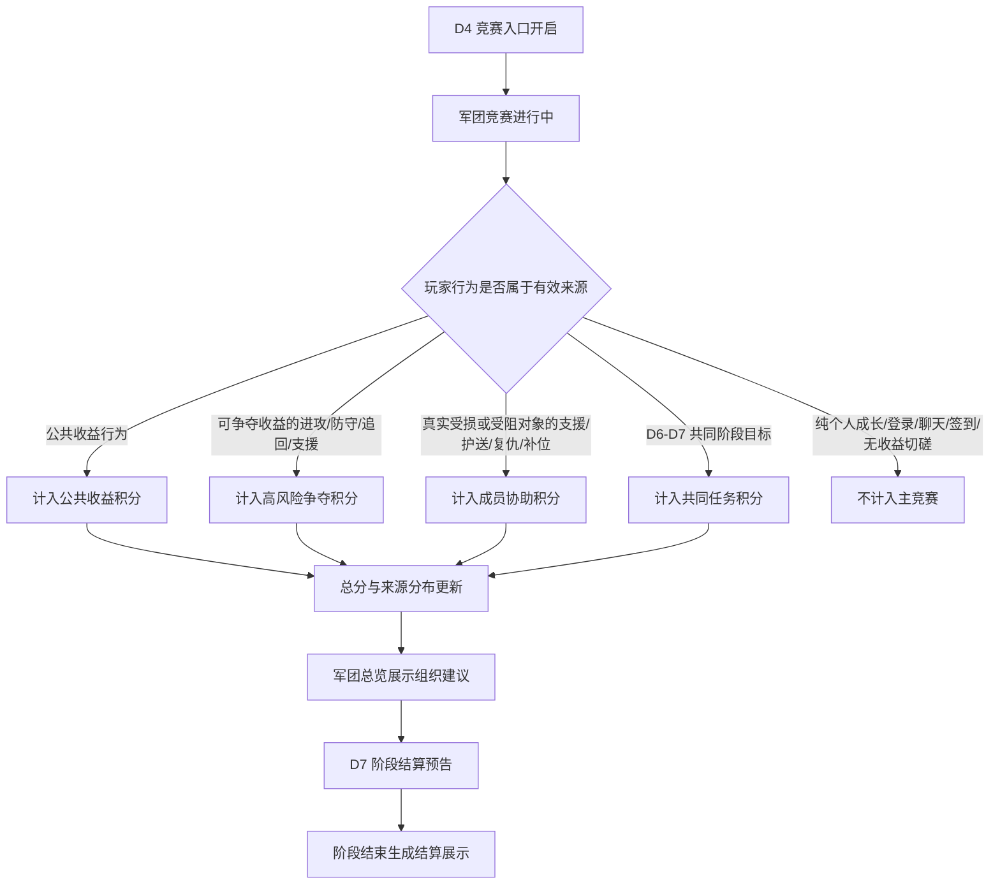

# FF｜首周军团竞赛设计拆解 GDD

> 适用标准：`reference/部门标准/策划/gdd/GDD写作标准.md`（v25）

---

## 一、需求目的

- 让 D4-D7 的首周公共收益、PVP 争夺、成员协助、共同任务被军团目标吸收，形成玩家能理解、军团能组织、不同成员都能参与的首周军团竞赛目标。
- 让军团在首周通过阶段结果展示组织能力，包括参与公共收益、处理高风险争夺、回应成员求助、推进共同任务。
- 让玩家和管理者能看到总分来源，并据此判断下一步应优先参与公共收益、争夺、协助或共同任务。
- 让 D7 形成首周军团共同目标和阶段结算预告，为 D7 后沙盘 / GVG 承接方向提供入口预期，但不在本 GDD 内展开后续规则。

---

## 二、需求概述

首周军团竞赛是 D4-D7 逐步接入的军团阶段目标系统。系统把个人在公共收益、高风险争夺、成员协助、共同任务中的有效行为计入军团竞赛积分，并在 D7 展示阶段结算预告。

本设计对象不是完整军团战、沙盘、宣战、跨服赛季或完整 GVG 结算。竞赛积分只表达军团阶段表现，不作为个人货币，不替代个人奖励，不直接决定 PVP 胜负。

---

## 三、功能 / 玩法设计

### 3.1 首周军团竞赛流程图

### 3.2 军团竞赛总览承接四类来源

军团竞赛总览是首周军团竞赛的主入口。入口在 D4 开启，D4-D7 按阶段逐步接入积分来源，并在 D7 转入结算预告状态。

总览展示军团竞赛总分、四类来源分布、当前阶段状态和下一步组织建议。总分必须拆分展示来源，避免玩家只看到排名结果却不知道下一步应该做什么，也避免管理者无法判断当前军团缺少哪类组织行为。

当前已确认的主竞赛来源只包括四类。下表锁定来源方向和不计入边界，不替代后续“具体玩法事件 / 行为清单”的正式枚举。

| 来源 | 计入定位 | 不计入内容 |
|---|---|---|
| 公共收益积分 | 表达军团成员参与公共收益的程度 | 纯个人成长、登录、签到 |
| 高风险争夺积分 | 表达军团处理可争夺收益冲突的能力 | 无收益变化切磋、职业竞技场 |
| 成员协助积分 | 表达军团回应成员求助和处理损失的能力 | 纯聊天、无真实受损或受阻的刷分行为 |
| 共同任务积分 | 表达 D6-D7 的基础参与和共同推进 | 不能替代前三类来源，不能变成单纯活跃榜 |

高风险 PVP 是竞赛张力来源，但不独占总分。共同任务是基础参与来源，但不能把首周军团竞赛改写成只看在线和日常完成度的活跃排名。

### 3.3 公共收益行为计入公共收益积分

公共收益积分用于记录军团成员对首周公共收益的参与。玩家完成可计入的公共收益行为后，该行为为所属军团增加公共收益积分，并更新军团总览中的来源分布。

公共收益行为只有在当前阶段开放、玩家已加入军团、行为属于可计入公共收益范围时生效。未加入军团的玩家不产生竞赛积分；中途加入军团的玩家只从加入后行为开始计入；退出或转团不携带已归属军团的竞赛积分。

公共收益行为存在两种状态：

| 状态 | 设计含义 | 玩家反馈 |
|---|---|---|
| 可计入 | 当前行为属于阶段开放的公共收益来源 | 行为完成后在军团竞赛来源中反馈本次贡献 |
| 不计入 | 行为未开放、未加入军团，或不属于公共收益范围 | 不显示为军团竞赛贡献，避免误导玩家 |

公共收益积分只表达军团共同参与，不替代玩家在原玩法中的个人奖励。

### 3.4 高风险争夺行为计入高风险争夺积分

高风险争夺积分用于记录军团围绕可争夺收益发生的进攻、防守、追回和支援行为。计入对象必须围绕可争夺收益，且争夺事件处于可争夺状态。具体哪些玩法事件满足“可争夺收益”条件，保留为正式 GDD 阻塞项。

已确认的行为方向包括：

| 行为 | 计入条件 | 结算反馈 |
|---|---|---|
| 进攻 | 围绕可争夺收益发生进攻行为 | 计入高风险争夺来源 |
| 防守 | 围绕可争夺收益发生防守行为 | 计入高风险争夺来源 |
| 追回 | 对已被争夺或受损收益进行追回 | 计入高风险争夺来源 |
| 支援 | 对正在发生的可争夺收益冲突进行支援 | 计入高风险争夺来源 |

争夺事件结束后，不再因为该事件新增高风险争夺积分。职业竞技场、纯个人成长、无收益变化的切磋不进入主竞赛。

高风险争夺积分不直接决定 PVP 胜负。PVP 胜负仍由原玩法规则结算，军团竞赛只记录该类行为对军团阶段表现的贡献。

### 3.5 成员协助行为计入成员协助积分

成员协助积分用于记录军团对真实受损或受阻成员的回应。只有存在真实受损或受阻对象时，支援、护送、复仇、补位才进入成员协助积分。真实受损或受阻的判定标准保留为正式 GDD 阻塞项。

求助项在军团内形成可响应对象，并按状态展示：

| 求助状态 | 设计含义 | 玩家反馈 |
|---|---|---|
| 待响应 | 成员已经发起或形成可响应求助 | 军团成员可看到求助入口和目标 |
| 支援中 | 已有成员参与支援 | 求助项显示支援进展 |
| 已解决 | 求助目标已完成或受阻状态解除 | 参与成员获得军团竞赛贡献反馈 |
| 已过期或失效 | 求助对象不再有效 | 求助项关闭，不再产生积分 |

成员协助积分不奖励纯聊天，不奖励无真实受损或受阻对象的重复请求。高战刷弱号、求助刷分属于需要限制的异常方向，具体限制口径保留为正式 GDD 阻塞项。

### 3.6 共同任务在 D6-D7 提供基础参与来源

共同任务积分用于记录军团在 D6-D7 推进共同阶段目标的基础参与。共同任务未开放前不产生积分；开放后，符合共同阶段目标的行为计入共同任务积分；任务达成后进入已达成状态，并在总览中展示完成反馈。共同任务的具体类型保留为正式 GDD 阻塞项。

共同任务状态如下：

| 状态 | 设计含义 | 玩家反馈 |
|---|---|---|
| 未开放 | D6-D7 共同阶段目标尚未开启 | 总览可展示后续开放预期 |
| 进行中 | 共同阶段目标正在推进 | 展示当前进度和可参与入口 |
| 已达成 | 共同阶段目标完成 | 展示达成结果并保留结算预告入口 |

共同任务用于保障不同成员都有基础参与路径，但不能替代公共收益、高风险争夺和成员协助，也不能成为单纯以活跃次数累计的榜单。

### 3.7 来源分布生成组织建议

来源分布用于帮助玩家和管理者识别当前军团表现。总览展示四类来源占比和当前相对短板，并给出下一步组织建议。

组织建议只围绕已确认的四类来源给出：

| 来源表现 | 组织建议方向 |
|---|---|
| 公共收益积分偏低 | 引导成员优先参与当前阶段公共收益行为 |
| 高风险争夺积分偏低 | 引导管理者组织可争夺收益的防守、追回或支援 |
| 成员协助积分偏低 | 引导成员响应待处理求助项 |
| 共同任务积分偏低 | 引导成员推进 D6-D7 共同阶段目标 |

管理者可对重点事项进行标记。管理标记只有未标记和已标记两种状态，用于让成员识别当前优先目标，不改变积分规则，不直接改变原玩法结算。

### 3.8 D7 阶段结算预告与阶段结束展示

D7 进入阶段结算预告。系统展示当前军团总分、来源分布、结算时间预告和阶段表现说明，帮助军团理解首周结果即将结算。

阶段结束后生成结算展示。结算展示表达军团阶段表现和四类来源贡献，不把竞赛积分转成个人货币，不替代个人奖励。个人结算反馈只说明玩家对军团竞赛的贡献来源和阶段参与结果，避免把军团表现误读为个人可消费资产。

D7 后沙盘 / GVG 仅作为承接方向出现。本 GDD 不设计沙盘、宣战、跨服赛季、完整 GVG 结算或后续赛季规则。

---

## 四、状态与边界汇总

### 4.1 主状态

本节汇总 3.2-3.8 已写入对应功能场景的状态，作为检查索引使用；具体触发、判断、结算和反馈仍以主体设计各小节为准。

| 对象 | 状态 | 说明 |
|---|---|---|
| 军团竞赛 | 未开启 / 进行中 / 结算预告 / 已结算 | D4 前未开启，D4-D7 进行中，D7 展示结算预告，阶段结束后已结算 |
| 公共收益行为 | 可计入 / 不计入 | 由阶段开放、军团归属和来源范围决定 |
| 争夺事件 | 可争夺 / 已结束 | 已结束事件不再新增高风险争夺积分 |
| 求助项 | 待响应 / 支援中 / 已解决 / 已过期或失效 | 仅真实受损或受阻对象可形成有效协助来源 |
| 共同任务 | 未开放 / 进行中 / 已达成 | D6-D7 作为基础参与来源 |
| 管理标记 | 未标记 / 已标记 | 只影响组织提示，不改变积分规则 |

### 4.2 参与边界

本节汇总 3.3、3.4、3.5、3.8 已写入对应功能场景的参与边界，作为检查索引使用。

| 场景 | 处理口径 |
|---|---|
| 未加入军团 | 不产生军团竞赛积分 |
| 中途加入军团 | 只计入加入后行为 |
| 退出军团 | 退出后行为不再计入原军团；已归属军团的阶段积分不作为个人资产携带 |
| 转团 | 不携带军团竞赛积分 |
| 军团解散 | 处理口径待定 |
| 纯个人成长 | 不进入主竞赛 |
| 登录、聊天、签到 | 不进入主竞赛 |
| 职业竞技场 | 不进入主竞赛 |
| 无收益变化切磋 | 不进入主竞赛 |

### 4.3 积分边界

本节汇总 3.2、3.4、3.8 已写入对应功能场景的积分边界，作为检查索引使用。

- 竞赛积分是军团阶段表现记录，不是个人货币。
- 竞赛积分不替代个人奖励。
- 竞赛积分不直接决定 PVP 胜负。
- 总分必须展示四类来源，不能只展示总分或排名。
- 四类来源必须同时保留展示，不允许只展示高风险 PVP 或共同任务。

---

## 五、UE 交互

### 5.1 军团页主入口

军团页提供首周军团竞赛主入口。D4 前入口展示未开启状态或开放预告；D4 开启后进入军团竞赛总览；D7 展示结算预告入口；阶段结束后展示已结算结果。

### 5.2 首页摘要

首页摘要展示当前军团竞赛状态、总分变化、主要短板来源和下一步可参与入口。摘要不替代完整总览，只承担提醒和快速进入作用。

### 5.3 来源详情

来源详情展示公共收益、高风险争夺、成员协助、共同任务四类来源。每类来源展示当前贡献、可参与入口、有效行为说明和不计入提示。

### 5.4 个人结算反馈

个人结算反馈展示玩家在本阶段对军团竞赛的贡献来源。反馈文案必须区分个人奖励和军团表现，避免玩家把军团竞赛积分理解为个人可领取货币。

### 5.5 军团动态

军团动态展示关键贡献、争夺事件、求助响应、共同任务推进和阶段结算预告。动态用于让成员看到军团正在发生的组织行为，不承载额外积分规则。

### 5.6 求助入口

求助入口展示待响应、支援中、已解决、已过期或失效的求助项。玩家进入求助项后，应看到求助对象、可参与行为和当前状态。

### 5.7 管理视图

管理视图展示总分、四类来源分布、来源短板、待处理求助项、可争夺事件和共同任务进度。管理者可对重点目标进行标记，标记只作为组织提示展示。

### 5.8 D7 结算预告

D7 结算预告展示结算时间、当前总分、四类来源分布、阶段表现说明和结算后展示预期。预告不提前发放个人奖励，不把竞赛积分转成个人货币。

### 5.9 弱参与保护

界面需要为低战力、低在线或不适合参与高风险 PVP 的成员展示共同任务、公共收益和成员协助入口。弱参与保护只保证可参与路径可见，不改变已确认的四类来源范围。

---

## 六、配置项 / 待定项

### 6.1 当前可配置项

| 配置项 | 生效范围 | 默认值 | 可配置范围 | 说明 |
|---|---|---|---|---|
| 每日开放来源 | 首周竞赛阶段 | 待定 | D4-D7 | 决定每日接入哪些积分来源 |
| 四类来源权重 | 单期军团竞赛 | 待定 | 待定 | 决定公共收益、高风险争夺、成员协助、共同任务对总分的影响 |
| 每日上限 | 单军团 / 单来源 | 待定 | 待定 | 控制单日积分增长上限 |
| 奖励档位 | 阶段结算 | 待定 | 待定 | 决定阶段表现与奖励展示关系 |
| 结算展示时间 | 阶段结算 | 待定 | 待定 | 决定 D7 预告和阶段结束展示的时间口径 |

### 6.2 方向验证保留项

| 保留项 | 原因 |
|---|---|
| 具体公式 | 需要数值验证后确定 |
| 每日上限 | 需要结合军团人数规模和日开放来源确定 |
| 奖励档位 | 需要明确奖励与军团表现的关系 |
| 反作弊 | 高战刷弱号、求助刷分需要专门限制口径 |
| 军团人数规模 | 会影响来源权重、追分强度和上限 |
| 弱军团追分强度 | 需要避免弱军团失去参与，同时不能抹平组织差异 |
| 后续沙盘 / GVG 具体承接 | 本 GDD 只保留承接方向，不展开后续规则 |

### 6.3 正式 GDD 阻塞项

| 阻塞项 | 当前状态 |
|---|---|
| 四类有效行为清单 | 具体玩法事件 / 行为枚举待确认；四类来源方向已确认 |
| 每日开放来源 | 待确认 |
| 高风险争夺计入条件 | 具体玩法事件与收益争夺判定待确认；进攻 / 防守 / 追回 / 支援方向已确认 |
| 协助真实受损判定 | 具体判定标准待确认；真实受损 / 受阻对象方向已确认 |
| 共同任务类型 | 具体任务类型待确认；D6-D7 共同阶段目标方向已确认 |
| 权重 / 上限 | 待确认 |
| 中途加入、退出、转团、解散 | 中途加入、退出、转团已有方向；军团解散待确认 |
| 结算奖励关系 | 待确认 |
| 管理权限 | 待确认 |
| D7 后承接口径 | 待确认 |

---

## 七、验证指标

### 7.1 玩家理解

| 指标 | 验证目标 |
|---|---|
| 军团竞赛入口点击率 | 玩家能在 D4 后找到竞赛入口 |
| 来源详情查看率 | 玩家会查看总分由哪些行为构成 |
| 不计入提示触发后的返回参与率 | 玩家能理解哪些行为不进入主竞赛，并转向有效来源 |

### 7.2 军团组织

| 指标 | 验证目标 |
|---|---|
| 四类来源参与覆盖率 | 不同成员能参与不同来源，而不是只集中在高风险 PVP |
| 管理标记使用率 | 管理者会使用标记组织当前目标 |
| 求助项响应率 | 成员协助能形成真实响应 |
| 共同任务参与人数 | D6-D7 共同任务能提供基础参与来源 |

### 7.3 竞赛结构

| 指标 | 验证目标 |
|---|---|
| 高风险争夺积分占比 | 高风险 PVP 提供张力但不独占总分 |
| 共同任务积分占比 | 共同任务提供基础参与但不变成活跃榜 |
| 来源分布查看后的行为变化 | 来源分布能帮助军团调整下一步参与方向 |
| D7 结算预告查看率 | 玩家能感知首周阶段结果即将结算 |

### 7.4 边界风险

| 指标 | 验证目标 |
|---|---|
| 无效行为计入拦截量 | 纯个人成长、登录、聊天、签到、无收益切磋不进入主竞赛 |
| 求助过期或失效率 | 求助项能及时关闭无效对象 |
| 异常协助行为占比 | 高战刷弱号、求助刷分等风险可被后续限制口径覆盖 |
| 玩家对个人奖励和军团表现的误解反馈 | UE 文案能区分个人奖励与军团表现 |
