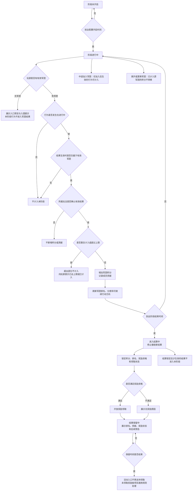

# FF 首周军团竞赛 GDD

## 一、需求目的

- 让玩家从个人成长进入固定军团成员共同处理收益、冲突、协助和阶段结果的关系。
- 让军团阶段结果可比较、可追赶、可被成员理解，并引导成员形成下一轮共同目标。
- 为后续更强的军团共同玩法建立首周行为预期，但不在本文定义后续完整玩法规则。

## 二、需求概述

首周军团竞赛是 D6-D7 承接个人成长、公共收益、轻 PVP 冲突与军团关系的阶段功能。玩家在已开放玩法中产生有效结果后，系统按其结果生效时的军团归属，记录为军团积分与成员贡献，并在阶段内形成排名、差距提示、结算奖励和后续预告。

本文覆盖阶段开启、参与资格、成员行为计入、军团积分、成员贡献、排行反馈、阶段结算、奖励领取、结果保留和后续预告。本文不重新定义世界狩猎、寻血、玩法背包、PVEVP、战报、仇人、复仇、GVG、沙盘、战役或威望的完整规则。

## 三、整体流程

## 四、功能设计

### 4.1 阶段开启与参与资格

#### 功能说明

首周军团竞赛按配置时间开启。阶段开启后，系统只接收进行中产生并已确认生效的成员行为结果；阶段结束进入结算后，不再接收新的有效结果。

#### 触发条件

| 条件 | 说明 |
|---|---|
| 到达配置的开启时间 | 阶段从未开启进入进行中 |
| 到达配置的结束时间 | 阶段从进行中进入结算中 |

#### 操作与响应

| 步骤 | 玩家操作 / 系统事件 | 系统判断 | 系统响应 | 玩家反馈 |
|---|---|---|---|---|
| 1 | 阶段未开启时，玩家点击入口 | 当前时间未到开启时间 | 不开放功能 | 展示未开启状态和开启倒计时 |
| 2 | 阶段进行中，玩家点击入口 | 玩家是否属于有效军团 | 有军团则进入阶段页面；无军团则展示预览与入团引导 | 有军团展示积分和排行；无军团展示入团提示 |
| 3 | 阶段结算后，玩家点击入口 | 当前时间已过结束时间 | 进入结果页 | 展示最终排名、奖励状态和后续预告 |

#### 规则与结算

| 规则项 | 触发条件 | 判断方式 | 结算结果 | 状态变化 | 玩家反馈 |
|---|---|---|---|---|---|
| 阶段状态切换 | 到达配置时间点 | 按配置的开启、结束、结算、保留时间顺序切换 | 阶段进入对应状态 | 未开启→进行中→结算中→已结算→结果保留中→入口关闭 | 各状态展示对应界面和提示 |
| 参与资格判断 | 玩家行为结果生效时 | 检查玩家是否属于有效军团 | 有军团则行为可计入；无军团则不计入 | 无军团玩家行为不产生军团积分和贡献 | 无军团玩家看到入团引导 |
| 中途加入 | 阶段进行中加入军团 | 加入后生效的行为可计入；加入前不追溯 | 仅加入后的行为产生积分和贡献 | 玩家从无归属变为有归属 | 加入后行为正常计入并反馈 |
| 离开或更换军团 | 玩家离开军团或更换军团 | 已计入原军团的积分保留在原军团，不转移 | 原军团积分不变；新军团从加入后开始累计 | 玩家归属变化 | 新行为按新军团归属计入 |
| 结算后加入 | 阶段结算后加入军团 | 不获得本阶段奖励资格 | 无本阶段奖励 | 玩家归属变化但不影响本阶段 | 展示本阶段已结束 |

#### 边界与异常

| 场景 | 处理口径 | 玩家反馈 |
|---|---|---|
| 无军团玩家点击入口 | 展示入口预览和入团引导，行为不计入军团结果 | 展示入团或创建军团引导，说明当前行为不会进入军团结果 |
| 阶段进行中离开军团 | 离开后行为不计入任何军团；已计入原军团的积分保留 | 离开后行为无军团积分反馈 |
| 结算锁定后才生效的结果 | 不进入本阶段 | 按上游玩法自身反馈，不展示军团竞赛相关提示 |

### 4.2 成员行为计入

#### 功能说明

系统接收玩家在已开放玩法中产生的有效结果，按结果生效时的军团归属，转化为军团积分和成员贡献。可计入的行为来源包括军团目标、世界狩猎、寻血争夺和同军团协助。

#### 触发条件

| 条件 | 说明 |
|---|---|
| 上游玩法确认结果生效 | 世界狩猎、寻血、军团目标、协助等玩法产生有效结果 |
| 结果生效时玩家属于有效军团 | 玩家在结果确认时仍有军团归属 |
| 行为发生在阶段进行中 | 阶段未结束且未进入结算 |

#### 操作与响应

| 步骤 | 玩家操作 / 系统事件 | 系统判断 | 系统响应 | 玩家反馈 |
|---|---|---|---|---|
| 1 | 玩家完成世界狩猎并产生有效结果 | 结果生效时玩家属于有效军团，且阶段进行中 | 计算本次军团积分和成员贡献 | 展示本次计入的积分和贡献 |
| 2 | 玩家完成寻血防守并确认有效 | 防守结果已确认，未超过上限 | 计算防守积分和贡献 | 展示防守成功和计入结果 |
| 3 | 玩家响应同军团成员协助请求 | 协助结果被对应玩法确认有效 | 响应成员获得贡献，军团增加积分 | 展示协助成功和贡献结果 |
| 4 | 玩家完成行为但已达上限 | 该来源已达日上限或阶段上限 | 不新增积分和贡献 | 提示该来源已达上限，本次未计入 |

#### 规则与结算

| 规则项 | 触发条件 | 判断方式 | 结算结果 | 状态变化 | 玩家反馈 |
|---|---|---|---|---|---|
| 有效结果计入 | 上游玩法确认结果生效 | 检查阶段状态、军团归属、来源开关、上限 | 增加军团积分，记录成员贡献 | 军团积分和成员贡献更新 | 即时反馈本次计入结果 |
| 重复计入限制 | 同一结果多次触发 | 检查是否已计入过 | 不重复计入 | 无变化 | 提示已计入 |
| 上限控制 | 玩家、军团或来源达到配置上限 | 检查日上限和阶段上限 | 超出部分不计入 | 该来源后续行为不再新增积分 | 提示已达上限 |
| 失败结果处理 | 玩家行为失败 | 失败不扣除已获得积分；只有确认有效结果才新增积分 | 不新增积分和贡献 | 无变化 | 按上游玩法自身反馈 |
| 协助计入 | 响应同军团成员协助请求 | 协助结果被对应玩法确认有效 | 响应成员获得贡献，军团增加积分 | 贡献和积分更新 | 展示协助成功 |
| 请求成员贡献 | 玩家发起协助请求 | 按配置开关决定请求成员是否获得贡献 | 若开启，请求成员获得贡献 | 贡献更新 | 展示为请求成员贡献，不与响应成员贡献混写 |

#### 边界与异常

| 场景 | 处理口径 | 玩家反馈 |
|---|---|---|
| 协助过期或失败 | 不进入军团结果 | 提示协助已过期或失败 |
| 跨军团协助 | 不进入军团结果 | 按上游玩法自身反馈 |
| 未确认有效结果的协助 | 不进入军团结果 | 提示协助未生效 |
| 行为发生在阶段开启前或结算后 | 不计入本阶段 | 按上游玩法自身反馈 |

### 4.3 军团积分与成员贡献

#### 功能说明

军团积分用于军团排行。成员贡献用于说明成员行为如何影响本军团结果。系统按有效行为来源配置积分规则，一个有效行为产生的军团积分受来源权重、计入次数、日上限和阶段上限限制。

#### 触发条件

| 条件 | 说明 |
|---|---|
| 成员行为被确认计入 | 4.2 中确认的有效结果 |

#### 操作与响应

| 步骤 | 玩家操作 / 系统事件 | 系统判断 | 系统响应 | 玩家反馈 |
|---|---|---|---|---|
| 1 | 有效结果确认计入 | 按来源配置计算积分 | 军团积分增加，成员贡献记录更新 | 展示本次积分和贡献变化 |
| 2 | 玩家查看成员贡献 | 读取成员贡献记录 | 展示贡献来源、结果、是否计入积分 | 展示贡献明细 |

#### 规则与结算

| 规则项 | 触发条件 | 判断方式 | 结算结果 | 状态变化 | 玩家反馈 |
|---|---|---|---|---|---|
| 积分计算 | 有效结果确认计入 | 单次积分 = 行为基础分 × 结果系数 × 来源权重，再受上限限制 | 军团积分增加可计入部分 | 军团总积分更新 | 展示本次增加积分 |
| 贡献记录 | 有效结果确认计入 | 记录行为来源、结果类型、是否计入积分 | 成员贡献记录新增 | 成员贡献列表更新 | 展示贡献来源和结果 |
| 上限提示 | 来源达到上限 | 检查日上限和阶段上限 | 后续同来源行为不计入 | 该来源标记为已达上限 | 提示该来源已达上限或本次未计入 |
| 贡献展示 | 玩家查看贡献页面 | 读取成员贡献记录 | 展示贡献来源、贡献结果、是否计入军团积分 | 无变化 | 展示贡献明细和未计入原因 |

#### 边界与异常

| 场景 | 处理口径 | 玩家反馈 |
|---|---|---|
| 贡献来源与行为不符 | 贡献展示必须对应真实有效行为 | 不展示虚假贡献 |
| 低活跃玩家贡献 | 可通过基础目标、协助、防守或共同任务获得贡献位置 | 展示对应贡献来源 |

### 4.4 军团排行与追赶反馈

#### 功能说明

军团排行按军团总积分比较。排行页面展示本军团排名、总积分、与相邻军团或下一奖励档位的差距、刷新状态和当前可继续行动方向。

#### 触发条件

| 条件 | 说明 |
|---|---|
| 军团积分更新 | 任何军团积分变化触发排行刷新 |
| 玩家点击排行入口 | 主动查看排行 |

#### 操作与响应

| 步骤 | 玩家操作 / 系统事件 | 系统判断 | 系统响应 | 玩家反馈 |
|---|---|---|---|---|
| 1 | 军团积分更新 | 按配置刷新间隔更新排行 | 排行数据更新 | 展示最新排名和积分 |
| 2 | 玩家点击排行 | 读取当前排行快照 | 展示排行列表 | 展示本军团排名、积分、分差和刷新状态 |

#### 规则与结算

| 规则项 | 触发条件 | 判断方式 | 结算结果 | 状态变化 | 玩家反馈 |
|---|---|---|---|---|---|
| 排行排序 | 军团积分更新 | 按军团总积分降序排列 | 生成排行列表 | 排行更新 | 展示排名 |
| 同分排序 | 多个军团积分相同 | 更早达到当前积分的军团排前；仍无法区分则并列 | 确定排名顺序 | 排名确定 | 并列展示，按配置奖励档位发放 |
| 排行刷新 | 按配置间隔 | 刷新期间保留上一轮可见结果 | 展示最新快照 | 刷新状态切换 | 显示刷新中或更新时间 |
| 追赶提示 | 玩家查看排行 | 指向当前可参与且未达上限的行为来源 | 展示可继续行动方向 | 无变化 | 展示追赶方向，不承诺必然反超 |
| 差距展示 | 玩家查看排行 | 计算与相邻军团或下一奖励档位的积分差 | 展示分差 | 无变化 | 展示分差和可行动方向 |

#### 边界与异常

| 场景 | 处理口径 | 玩家反馈 |
|---|---|---|
| 来源已达上限或已关闭 | 追赶提示不指向该来源 | 不展示已关闭来源的追赶提示 |
| 玩家不具备参与资格 | 追赶提示不指向该来源 | 不展示无资格来源的追赶提示 |
| 排行刷新延迟 | 页面保留上一轮结果，明确显示刷新中 | 提示当前为上一次确认结果 |

### 4.5 阶段结算与奖励领取

#### 功能说明

到达结算时间后，阶段进入结算中，系统停止接收新的有效结果，并锁定本阶段积分、排名、奖励资格和领取状态。结算锁定后才生效的结果，不进入本阶段。

#### 触发条件

| 条件 | 说明 |
|---|---|
| 到达配置的结束时间 | 阶段进入结算中 |

#### 操作与响应

| 步骤 | 玩家操作 / 系统事件 | 系统判断 | 系统响应 | 玩家反馈 |
|---|---|---|---|---|
| 1 | 到达结束时间 | 停止接收新结果 | 锁定积分、排名、奖励资格和领取状态 | 展示结算中状态 |
| 2 | 结算完成 | 生成最终排名和奖励 | 开放结果页和奖励领取入口 | 展示最终排名和奖励状态 |
| 3 | 玩家领取奖励 | 检查领取资格 | 满足资格则发放奖励 | 展示奖励内容和领取成功 |
| 4 | 玩家不满足领取资格 | 检查不满足原因 | 不发放奖励 | 展示无奖励原因 |

#### 规则与结算

| 规则项 | 触发条件 | 判断方式 | 结算结果 | 状态变化 | 玩家反馈 |
|---|---|---|---|---|---|
| 结算锁定 | 到达结束时间 | 停止接收新结果，锁定积分和排名 | 本阶段积分不再变化 | 阶段进入结算中 | 展示结算中状态 |
| 奖励资格判断 | 结算完成 | 成员在结算时属于该军团，且本阶段至少有一次有效贡献 | 满足条件则可领取 | 奖励状态更新 | 展示可领取或不可领取 |
| 奖励发放 | 玩家点击领取 | 检查领取资格和领取状态 | 发放奖励 | 领取状态变为已领取 | 展示奖励内容 |
| 无贡献成员 | 结算时无有效贡献 | 默认不获得阶段奖励 | 无奖励 | 无变化 | 展示无奖励原因 |
| 延迟结果处理 | 结算锁定后才生效的结果 | 不进入本阶段 | 不影响本阶段排名和奖励 | 无变化 | 按上游玩法自身反馈 |

#### 边界与异常

| 场景 | 处理口径 | 玩家反馈 |
|---|---|---|
| 结算后加入军团 | 不获得本阶段奖励资格 | 展示本阶段已结束 |
| 未领取奖励 | 结果保留期间可通过活动入口领取 | 展示可领取状态和保留时间 |
| 结果保留结束 | 活动入口不再支持领取，按项目通用规则处理 | 提前在奖励说明中展示未领取处理方式 |

### 4.6 结果保留与后续预告

#### 功能说明

结算完成后，结果页保留本阶段军团排名、军团积分、成员贡献摘要、奖励领取状态和阶段回顾。保留时长由配置决定。后续预告只告诉玩家军团后续会有更强的共同目标。

#### 触发条件

| 条件 | 说明 |
|---|---|
| 结算完成 | 结果页开放 |

#### 操作与响应

| 步骤 | 玩家操作 / 系统事件 | 系统判断 | 系统响应 | 玩家反馈 |
|---|---|---|---|---|
| 1 | 玩家查看结果页 | 读取本阶段结果数据 | 展示排名、积分、贡献摘要、奖励状态 | 展示阶段回顾 |
| 2 | 玩家查看后续预告 | 读取配置的预告文案 | 展示后续玩法方向和开放提示 | 展示后续共同目标预告 |
| 3 | 保留时间结束 | 活动入口关闭 | 不再支持领取 | 入口消失或展示已结束 |

#### 规则与结算

| 规则项 | 触发条件 | 判断方式 | 结算结果 | 状态变化 | 玩家反馈 |
|---|---|---|---|---|---|
| 结果保留 | 结算完成 | 按配置保留时长展示结果 | 保留期间可查看和领取 | 结果页开放 | 展示阶段回顾和奖励领取 |
| 后续预告 | 结算完成 | 展示后续玩法方向或开放提示 | 不展开完整规则 | 无变化 | 展示后续共同目标预告 |
| 保留结束 | 保留时间结束 | 活动入口不再支持领取 | 未领取奖励按项目通用规则处理 | 入口关闭 | 提前展示保留结束时间 |

#### 边界与异常

| 场景 | 处理口径 | 玩家反馈 |
|---|---|---|
| 后续预告文案 | 不得承诺本文未定义的完整玩法规则或奖励结果 | 只展示方向性预告 |
| 保留结束后历史记录 | 是否进入历史记录需按项目资料确认后再写入 | 当前只确认入口关闭 |

## 五、UE 交互

| 界面 / 入口 | 展示内容 | 可操作项 | 状态变化 | 异常提示 |
|---|---|---|---|---|
| 活动入口 | 阶段状态、开启或结束倒计时、玩家参与资格 | 点击进入阶段页面 | 无军团玩家展示入团引导 | 无军团时展示入团或创建军团引导，说明当前行为不会进入军团结果 |
| 阶段页面 | 本军团积分、当前排名、成员个人贡献、贡献来源、可继续行动方向 | 前往玩法、查看排行、协助成员 | 行为完成后即时反馈计入结果 | 未计入时说明原因 |
| 排行页面 | 军团排名、总积分、分差、刷新状态、奖励档位 | 查看排行、查看追赶提示 | 刷新时展示刷新中状态 | 追赶提示只展示当前可参与的行动方向 |
| 结算页面 | 结算中、已结算、可领取、已领取、不可领取等状态 | 领取奖励 | 领取后状态更新 | 不可领取时展示原因 |
| 结果页面 | 阶段回顾、最终排名、奖励领取状态、后续共同目标预告 | 查看回顾、领取奖励 | 保留结束后入口关闭 | 后续预告不承诺完整玩法规则 |

## 六、附属规则与配置

### 6.1 附属规则

| 归属模块 | 规则项 | 触发条件 | 判断方式 | 结果 | 玩家反馈 |
|---|---|---|---|---|---|
| 4.2 成员行为计入 | 可计入行为来源 | 上游玩法确认有效结果 | 按配置的来源开关判断 | 开启的来源可计入 | 关闭的来源不展示为可计入 |
| 4.2 成员行为计入 | 有效结果类型 | 上游玩法确认结果 | 只接收参与、击败、奖励、防守、追回、协助等已确认结果 | 有效结果可计入 | 无效结果不计入 |
| 4.3 军团积分与成员贡献 | 请求成员贡献开关 | 玩家发起协助请求 | 按配置开关决定 | 开启时请求成员获得贡献 | 展示为请求成员贡献，不与响应成员贡献混写 |
| 4.4 军团排行与追赶反馈 | 同分排序规则 | 多个军团积分相同 | 更早达到当前积分排前；仍无法区分则并列 | 确定排名 | 并列展示，按配置奖励档位发放 |
| 4.5 阶段结算与奖励领取 | 未领取奖励处理 | 结果保留结束 | 按项目通用未领取奖励规则处理 | 邮件、失效或补领入口 | 提前在奖励说明中展示 |

### 6.2 配置项

| 配置项 | 所属模块 | 生效范围 | 默认值 | 可配置范围 | 说明 |
|---|---|---|---|---|---|
| 阶段开启时间 | 4.1 阶段开启与参与资格 | 阶段实例 | 按首周活动排期配置 | 具体日期、时间点 | 控制阶段从未开启进入进行中 |
| 阶段结束时间 | 4.1 阶段开启与参与资格 | 阶段实例 | 按首周活动排期配置 | 具体日期、时间点 | 到达后停止接收新结果 |
| 结算时间 | 4.5 阶段结算与奖励领取 | 阶段实例 | 阶段结束后进入结算 | 具体时间点或结束后延迟时间 | 控制排名、奖励资格和领取状态生成 |
| 结果保留时间 | 4.6 结果保留与后续预告 | 阶段实例 | 结算后保留一段时间 | 时长配置 | 保留期间支持结果查看和奖励领取 |
| 有效军团条件 | 4.1 阶段开启与参与资格 | 阶段实例 | 结果生效时玩家属于有效军团 | 军团状态、成员状态、加入时间限制 | 用于判断行为是否可进入军团结果 |
| 中途加入计入规则 | 4.1 阶段开启与参与资格 | 阶段实例 | 加入后生效的行为可计入，加入前不追溯 | 可关闭中途加入计入，或增加加入后等待时间 | 需与军团系统成员状态一致 |
| 无军团展示规则 | 4.1 阶段开启与参与资格 | 阶段实例 | 可预览入口，不计入结果 | 关闭预览、展示入团引导、展示创建军团引导 | 影响无军团玩家入口反馈 |
| 可计入行为来源 | 4.2 成员行为计入 | 阶段实例 | 军团目标、公共 Boss、寻血或高风险争夺、同军团协助 | 可按来源开启或关闭 | 关闭来源不进入本阶段积分和贡献 |
| 有效结果类型 | 4.2 成员行为计入 | 阶段实例 | 只接收所属玩法确认生效的结果 | 参与、击败、奖励、防守、追回、协助等结果类型 | 具体结果类型需与所属玩法资料一致 |
| 来源积分权重 | 4.3 军团积分与成员贡献 | 阶段实例 | 待配置 | 每个来源独立配置 | 用于决定不同来源增加的军团积分 |
| 行为基础分 | 4.3 军团积分与成员贡献 | 阶段实例 | 待配置 | 按行为类型配置 | 区分目标完成、收益获得、争夺成功、协助成功的基础价值 |
| 结果系数 | 4.3 军团积分与成员贡献 | 阶段实例 | 待配置 | 按结果强度配置 | 普通完成、关键目标完成、追回成功、防守成功等使用不同系数 |
| 日上限 | 4.3 军团积分与成员贡献 | 阶段实例 | 待配置 | 按来源、成员或军团配置 | 限制单日可计入次数或积分 |
| 阶段上限 | 4.3 军团积分与成员贡献 | 阶段实例 | 待配置 | 按来源、成员或军团配置 | 限制整个阶段可计入次数或积分 |
| 重复计入规则 | 4.2 成员行为计入 | 阶段实例 | 重复结果不超过来源次数和上限 | 按来源设置是否允许多次计入 | 达到上限后继续完成玩法但不新增本阶段积分 |
| 失败结果处理 | 4.2 成员行为计入 | 阶段实例 | 不扣除已获得积分，未确认有效结果不新增积分 | 可按来源覆盖 | 如所属玩法另有确认结果，以所属玩法结果为准 |
| 成员贡献展示来源 | 4.3 军团积分与成员贡献 | 阶段实例 | 只展示对应真实有效行为的贡献来源 | 来源展示开关、展示排序、展示数量 | 贡献展示不得脱离实际行为结果 |
| 请求成员贡献开关 | 4.3 军团积分与成员贡献 | 阶段实例 | 响应成员默认获得贡献；请求成员是否获得贡献按开关配置 | 开启 / 关闭 | 开启时必须单独展示为请求成员贡献 |
| 排行刷新间隔 | 4.4 军团排行与追赶反馈 | 阶段实例 | 待配置 | 秒级、分钟级或手动刷新 | 页面需展示刷新状态和更新时间 |
| 排行展示范围 | 4.4 军团排行与追赶反馈 | 阶段实例 | 展示本军团及相关排名范围 | 全榜、前 N 名、本军团附近范围 | 影响排行页信息量 |
| 同分排序规则 | 4.4 军团排行与追赶反馈 | 阶段实例 | 更早达到当前积分的军团排前；仍无法区分则并列 | 可按项目统一排行规则覆盖 | 并列时按配置奖励档位发放奖励 |
| 追赶提示目标 | 4.4 军团排行与追赶反馈 | 阶段实例 | 指向当前可参与且未达上限的行为来源 | 按来源、奖励档位、相邻军团配置 | 不得承诺必然反超 |
| 奖励档位 | 4.5 阶段结算与奖励领取 | 阶段实例 | 待配置 | 排名区间、并列处理、参与奖励 | 控制不同排名的奖励范围 |
| 奖励内容 | 4.5 阶段结算与奖励领取 | 阶段实例 | 待配置 | 道具、货币、权益或其他奖励内容 | 需与项目奖励库确认 |
| 领取资格 | 4.5 阶段结算与奖励领取 | 阶段实例 | 结算时属于军团且本阶段有有效贡献 | 可增加参与奖励或最低贡献要求 | 无贡献成员默认无阶段奖励 |
| 未领取奖励处理 | 4.5 阶段结算与奖励领取 | 阶段实例 | 按项目通用未领取奖励规则处理 | 邮件、失效、补领入口等项目规则 | 必须在奖励说明中展示 |
| 延迟生效结果处理 | 4.5 阶段结算与奖励领取 | 阶段实例 | 结算锁定后才生效的结果不进入本阶段 | 可按项目统一结算规则覆盖 | 避免结算后排名变化 |
| UI 文案 | 5 UE 交互 | 阶段实例 | 待配置 | 无资格、结算中、已结算、追赶提示、后续预告等文案 | 文案不得写入本文未定义的完整后续玩法规则 |

## 七、待定项

| 待定项 | 所属模块 | 待定原因 | 后续确认方式 |
|---|---|---|---|
| 各行为来源的积分值、权重、日上限和阶段上限 | 4.3 军团积分与成员贡献 | 当前资料未提供具体数值 | 需要数值表或活动配置确认 |
| 奖励档位、奖励内容和奖励数量 | 4.5 阶段结算与奖励领取 | 当前资料未提供奖励表 | 需要奖励库和活动投放方案确认 |
| 阶段开启时间、结束时间、结算时间和结果保留时长 | 4.1 阶段开启与参与资格 | 需要首周活动排期确认 | 需要活动排期确认 |
| 排行刷新间隔和排行展示范围 | 4.4 军团排行与追赶反馈 | 需要 UE 信息量、服务器刷新策略和活动节奏确认 | 需要 UE 和服务器策略确认 |
| 请求成员是否默认获得协助贡献 | 4.3 军团积分与成员贡献 | 当前只确认可配置 | 需要协助玩法资料或项目口径确认默认开关 |
| 后续预告具体指向 GVG、沙盘、战役或威望中的哪一个 | 4.6 结果保留与后续预告 | 当前只确认后续共同目标预告 | 需要后续玩法排期确认 |
| 项目通用未领取奖励规则 | 4.5 阶段结算与奖励领取 | 奖励过期、邮件补发或补领入口需与项目通用规则一致 | 需要项目通用规则确认 |
| 结果保留结束后是否进入历史记录或军团长期展示 | 4.6 结果保留与后续预告 | 当前只确认活动入口不再支持领取 | 需要军团历史展示资料确认 |
