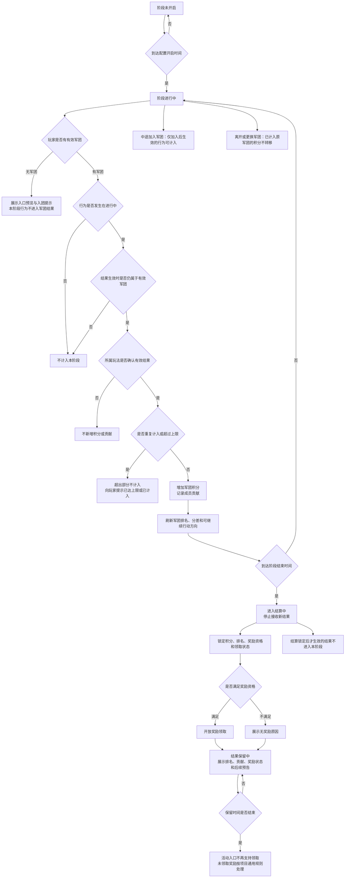

# FF 首周军团竞赛 GDD（DeepSeek降噪版）

## 一、需求目的

- 让玩家从个人成长进入固定军团成员共同处理收益、冲突、协助和阶段结果的关系。
- 让军团阶段结果可比较、可追赶、可被成员理解，并引导成员形成下一轮共同目标。
- 为后续更强的军团共同玩法建立首周行为预期，但不在本文定义后续完整玩法规则。

## 二、需求概述

首周军团竞赛是 D6-D7 承接个人成长、公共收益、轻 PVP 冲突与军团关系的阶段功能。玩家在已开放玩法中产生有效结果后，系统按其结果生效时的军团归属，记录为军团积分与成员贡献，并在阶段内形成排名、差距提示、结算奖励和后续预告。

本文覆盖阶段开启、参与资格、成员行为计入、军团积分、成员贡献、排行反馈、阶段结算、奖励领取、结果保留和后续预告。本文不重新定义世界狩猎、寻血、玩法背包、PVEVP、战报、仇人、复仇、GVG、沙盘、战役或威望的完整规则。

## 三、整体流程

## 四、功能设计

### 4.1 开放与参与口径

本模块定义首周军团竞赛的时间窗口和玩家参与资格。阶段按配置时间开启，系统只接收进行中产生并已确认生效的成员行为结果；阶段结束进入结算后，不再接收新的有效结果。

**阶段状态流转**

| 阶段状态 | 进入条件 | 系统规则 | 玩家反馈 |
|---|---|---|---|
| 未开启 | 未到配置开启时间 | 不接收成员行为结果 | 入口展示未开启状态和开启时间 |
| 进行中 | 到达开启时间且未到结束时间 | 接收符合条件的成员行为结果 | 展示倒计时、军团积分、个人贡献和可继续行动方向 |
| 结算中 | 到达阶段结束时间 | 停止接收新结果，锁定本阶段计算范围 | 展示结算中状态 |
| 已结算 | 排名、奖励资格和领取状态生成完成 | 开放结果页和奖励领取入口 | 展示最终排名、奖励状态和无奖励原因 |
| 结果保留中 | 结算完成后仍在保留时间内 | 保留结果展示和可领取奖励 | 展示阶段回顾、奖励领取和后续预告 |

**参与资格**

参与资格按玩家在结果生效时的军团归属判断：

- 无军团玩家可以看到入口预览或入团提示，但其行为不进入军团结果。
- 阶段进行中加入军团的玩家，从加入后产生并生效的行为开始计入；加入前的行为不追溯。
- 结算后加入军团的玩家，不获得本阶段奖励资格。
- 成员离开或更换军团后，已经计入原军团的积分保留在原军团，不转移到新军团。
- 成员更换军团后的新行为，按新行为生效时的军团归属判断；无军团期间产生的行为不计入。

### 4.2 计入条件与流程

本模块承接上游玩法结果，定义哪些行为可以转化为军团积分和成员贡献。系统接收玩家在已开放玩法中产生的有效结果，按结果生效时的军团归属，转化为军团积分和成员贡献。

**可计入的行为来源**

1. 军团目标、军团任务、军团试炼。
2. 世界狩猎或公共 Boss 的有效参与、有效击败或有效奖励结果。
3. 寻血或高风险争夺中，由所属玩法确认的有效争夺、防守、追回或收益结果。
4. 同军团成员协助中，由所属玩法确认的有效协助结果。

**计入条件**

成员行为必须同时满足以下条件，才进入军团结果：

- 行为发生在阶段进行中。
- 玩家在结果生效时属于有效军团。
- 结果已经由所属玩法确认生效。
- 该来源在本阶段配置为可计入。
- 未超过该来源的计入次数、日上限或阶段上限。
- 结算锁定前已经生效。

**不计入的情况**

- 失败行为默认不扣除已经获得的军团积分。失败行为只有在所属玩法确认产生有效结果时，才新增军团积分或成员贡献。
- 协助过期、协助失败、重复响应、跨军团响应，或没有确认有效结果的协助，不进入军团结果。
- 行为发生在阶段开启前或结算后，不计入本阶段。

**协助计入**

同军团协助只记录已确认的有效协助结果：

- 成员响应同军团成员的协助请求，且相关玩法确认协助有效时，响应成员获得成员贡献，并为军团增加积分。
- 请求成员是否获得贡献由配置决定；若开启，页面必须展示为请求成员贡献，不与响应成员贡献混写。

### 4.3 积分口径与贡献记录

本模块定义军团积分和成员贡献的计算与展示规则。军团积分用于军团排行，成员贡献用于说明成员行为如何影响本军团结果。

**积分计算**

系统按有效行为来源配置积分规则。一个有效行为产生的军团积分受来源权重、计入次数、日上限和阶段上限限制。达到上限后，后续同来源行为可以继续完成所属玩法，但不再为本阶段新增军团积分；页面需提示该来源已达上限或本次未计入。

单次积分 = 行为基础分 × 结果系数 × 来源权重，再受上限限制。

**贡献记录**

成员贡献展示必须对应真实有效行为。军团积分和成员贡献可以使用不同展示数值，但贡献来源不得脱离实际完成结果。

成员贡献至少需要覆盖以下贡献位置：

- 基础军团目标、军团任务或军团试炼。
- 同军团协助响应。
- 防守、追回或其他已确认的争夺结果。
- 面向普通成员的共同任务。

低战力、低活跃、晚加入或非高竞争玩家，仍可通过基础目标、协助、防守或共同任务获得贡献位置。竞赛结果不应成为唯一可见贡献来源。

成员贡献记录展示到成员个人和军团阶段页面。展示内容至少包括贡献来源、贡献结果、是否计入军团积分，以及未计入时的原因。

### 4.4 排行规则与追赶反馈

本模块定义军团排行的排序、刷新和追赶提示规则。排行页面展示本军团排名、总积分、与相邻军团或下一奖励档位的差距、刷新状态和当前可继续行动方向。

**排行规则**

- 军团排行按军团总积分降序排列。
- 同分排序默认按更早达到当前积分的军团排前。若仍无法区分，展示并列排名，并按配置奖励档位发放奖励。

**刷新与追赶**

- 排行刷新按配置间隔更新。刷新期间页面保留上一轮可见结果，并明确显示刷新中或更新时间，避免玩家把未刷新结果误认为最终结果。
- 追赶提示只指向当前仍可完成的行为来源，不承诺必然反超。若某来源已达上限、已关闭或玩家不具备参与资格，追赶提示不得继续指向该来源。

### 4.5 结算锁定与奖励资格

本模块定义阶段结算时的锁定规则和奖励领取条件。到达结算时间后，阶段进入结算中，系统停止接收新的有效结果，并锁定本阶段积分、排名、奖励资格和领取状态。结算锁定后才生效的结果，不进入本阶段。

**奖励资格**

默认奖励资格为：成员在结算时属于该军团，且本阶段至少有一次有效贡献。没有有效贡献的成员默认不获得阶段奖励，除非奖励配置明确包含参与奖励。

**奖励发放**

奖励按军团结算排名和配置奖励档位生成。奖励页面需要展示玩家是否可领取、不可领取原因、奖励内容、领取状态和未领取处理说明。

结果保留期间，未领取奖励仍可通过活动入口领取。结果保留结束后，活动入口不再支持领取；未领取奖励按项目通用未领取奖励规则处理，并需要在奖励说明中提前展示。

### 4.6 展示边界与后续预告

本模块定义结算完成后的结果保留和后续预告规则。结算完成后，结果页保留本阶段军团排名、军团积分、成员贡献摘要、奖励领取状态和阶段回顾。保留时长由配置决定。

后续预告只告诉玩家军团后续会有更强的共同目标。预告可以展示后续玩法方向或开放提示，但不得在本文中定义完整 GVG、沙盘、战役、威望、资源、奖励或结算规则。

结果保留结束后，活动入口不再支持奖励领取。是否进入历史记录、军团日志或长期展示页面，需按项目资料确认后再写入正式规则。

## 五、UE 交互

**活动入口**

展示阶段状态、开启或结束倒计时、玩家参与资格和无军团引导。无军团玩家点击入口时，展示入团或创建军团引导，并说明当前行为不会进入军团结果。

**阶段页面**

展示本军团积分、当前排名、成员个人贡献、贡献来源和可继续行动方向。玩家完成有效行为后，系统需即时反馈本次结果是否进入军团结果；未计入时需说明原因。

**排行页面**

展示军团排名、总积分、分差、刷新状态和奖励档位。追赶提示只展示当前可参与的行动方向。

**结算页面**

展示结算中、已结算、可领取、已领取、不可领取等状态。不可领取时需展示原因，包括未满足贡献条件、结算后加入军团或结果保留已结束。

**结果页面**

展示阶段回顾、最终排名、奖励领取状态和后续共同目标预告。后续预告文案不得承诺本文未定义的完整玩法规则或奖励结果。

## 六、附属规则与配置

### 6.1 附属规则

| 归属模块 | 规则项 | 触发条件 | 判断方式 | 结果 | 玩家反馈 |
|---|---|---|---|---|---|
| 4.2 成员行为计入 | 可计入行为来源 | 上游玩法确认有效结果 | 按配置的来源开关判断 | 开启的来源可计入 | 关闭的来源不展示为可计入 |
| 4.2 成员行为计入 | 有效结果类型 | 上游玩法确认结果 | 只接收参与、击败、奖励、防守、追回、协助等已确认结果 | 有效结果可计入 | 无效结果不计入 |
| 4.3 军团积分与成员贡献 | 请求成员贡献开关 | 玩家发起协助请求 | 按配置开关决定 | 开启时请求成员获得贡献 | 展示为请求成员贡献，不与响应成员贡献混写 |
| 4.4 军团排行与追赶反馈 | 同分排序规则 | 多个军团积分相同 | 更早达到当前积分排前；仍无法区分则并列 | 确定排名 | 并列展示，按配置奖励档位发放 |
| 4.5 阶段结算与奖励领取 | 未领取奖励处理 | 结果保留结束 | 按项目通用未领取奖励规则处理 | 邮件、失效或补领入口 | 提前在奖励说明中展示 |

### 6.2 配置项

| 配置项 | 所属模块 | 生效范围 | 默认值 | 可配置范围 | 说明 |
|---|---|---|---|---|---|
| 阶段开启时间 | 4.1 开放与参与口径 | 阶段实例 | 按首周活动排期配置 | 具体日期、时间点 | 控制阶段从未开启进入进行中 |
| 阶段结束时间 | 4.1 开放与参与口径 | 阶段实例 | 按首周活动排期配置 | 具体日期、时间点 | 到达后停止接收新结果 |
| 结算时间 | 4.5 结算锁定与奖励资格 | 阶段实例 | 阶段结束后进入结算 | 具体时间点或结束后延迟时间 | 控制排名、奖励资格和领取状态生成 |
| 结果保留时间 | 4.6 展示边界与后续预告 | 阶段实例 | 结算后保留一段时间 | 时长配置 | 保留期间支持结果查看和奖励领取 |
| 有效军团条件 | 4.1 开放与参与口径 | 阶段实例 | 结果生效时玩家属于有效军团 | 军团状态、成员状态、加入时间限制 | 用于判断行为是否可进入军团结果 |
| 中途加入计入规则 | 4.1 开放与参与口径 | 阶段实例 | 加入后生效的行为可计入，加入前不追溯 | 可关闭中途加入计入，或增加加入后等待时间 | 需与军团系统成员状态一致 |
| 无军团展示规则 | 4.1 开放与参与口径 | 阶段实例 | 可预览入口，不计入结果 | 关闭预览、展示入团引导、展示创建军团引导 | 影响无军团玩家入口反馈 |
| 可计入行为来源 | 4.2 计入条件与流程 | 阶段实例 | 军团目标、公共 Boss、寻血或高风险争夺、同军团协助 | 可按来源开启或关闭 | 关闭来源不进入本阶段积分和贡献 |
| 有效结果类型 | 4.2 计入条件与流程 | 阶段实例 | 只接收所属玩法确认生效的结果 | 参与、击败、奖励、防守、追回、协助等结果类型 | 具体结果类型需与所属玩法资料一致 |
| 来源积分权重 | 4.3 积分口径与贡献记录 | 阶段实例 | 待配置 | 每个来源独立配置 | 用于决定不同来源增加的军团积分 |
| 行为基础分 | 4.3 积分口径与贡献记录 | 阶段实例 | 待配置 | 按行为类型配置 | 区分目标完成、收益获得、争夺成功、协助成功的基础价值 |
| 结果系数 | 4.3 积分口径与贡献记录 | 阶段实例 | 待配置 | 按结果强度配置 | 普通完成、关键目标完成、追回成功、防守成功等使用不同系数 |
| 日上限 | 4.3 积分口径与贡献记录 | 阶段实例 | 待配置 | 按来源、成员或军团配置 | 限制单日可计入次数或积分 |
| 阶段上限 | 4.3 积分口径与贡献记录 | 阶段实例 | 待配置 | 按来源、成员或军团配置 | 限制整个阶段可计入次数或积分 |
| 重复计入规则 | 4.2 计入条件与流程 | 阶段实例 | 重复结果不超过来源次数和上限 | 按来源设置是否允许多次计入 | 达到上限后继续完成玩法但不新增本阶段积分 |
| 失败结果处理 | 4.2 计入条件与流程 | 阶段实例 | 不扣除已获得积分，未确认有效结果不新增积分 | 可按来源覆盖 | 如所属玩法另有确认结果，以所属玩法结果为准 |
| 成员贡献展示来源 | 4.3 积分口径与贡献记录 | 阶段实例 | 只展示对应真实有效行为的贡献来源 | 来源展示开关、展示排序、展示数量 | 贡献展示不得脱离实际行为结果 |
| 请求成员贡献开关 | 4.3 积分口径与贡献记录 | 阶段实例 | 响应成员默认获得贡献；请求成员是否获得贡献按开关配置 | 开启 / 关闭 | 开启时必须单独展示为请求成员贡献 |
| 排行刷新间隔 | 4.4 排行规则与追赶反馈 | 阶段实例 | 待配置 | 秒级、分钟级或手动刷新 | 页面需展示刷新状态和更新时间 |
| 排行展示范围 | 4.4 排行规则与追赶反馈 | 阶段实例 | 展示本军团及相关排名范围 | 全榜、前 N 名、本军团附近范围 | 影响排行页信息量 |
| 同分排序规则 | 4.4 排行规则与追赶反馈 | 阶段实例 | 更早达到当前积分的军团排前；仍无法区分则并列 | 可按项目统一排行规则覆盖 | 并列时按配置奖励档位发放奖励 |
| 追赶提示目标 | 4.4 排行规则与追赶反馈 | 阶段实例 | 指向当前可参与且未达上限的行为来源 | 按来源、奖励档位、相邻军团配置 | 不得承诺必然反超 |
| 奖励档位 | 4.5 结算锁定与奖励资格 | 阶段实例 | 待配置 | 排名区间、并列处理、参与奖励 | 控制不同排名的奖励范围 |
| 奖励内容 | 4.5 结算锁定与奖励资格 | 阶段实例 | 待配置 | 道具、货币、权益或其他奖励内容 | 需与项目奖励库确认 |
| 领取资格 | 4.5 结算锁定与奖励资格 | 阶段实例 | 结算时属于军团且本阶段有有效贡献 | 可增加参与奖励或最低贡献要求 | 无贡献成员默认无阶段奖励 |
| 未领取奖励处理 | 4.5 结算锁定与奖励资格 | 阶段实例 | 按项目通用未领取奖励规则处理 | 邮件、失效、补领入口等项目规则 | 必须在奖励说明中展示 |
| 延迟生效结果处理 | 4.5 结算锁定与奖励资格 | 阶段实例 | 结算锁定后才生效的结果不进入本阶段 | 可按项目统一结算规则覆盖 | 避免结算后排名变化 |
| UI 文案 | 5 UE 交互 | 阶段实例 | 待配置 | 无资格、结算中、已结算、追赶提示、后续预告等文案 | 文案不得写入本文未定义的完整后续玩法规则 |

## 七、待定项

| 待定项 | 所属模块 | 待定原因 | 后续确认方式 |
|---|---|---|---|
| 各行为来源的积分值、权重、日上限和阶段上限 | 4.3 积分口径与贡献记录 | 当前资料未提供具体数值 | 需要数值表或活动配置确认 |
| 奖励档位、奖励内容和奖励数量 | 4.5 结算锁定与奖励资格 | 当前资料未提供奖励表 | 需要奖励库和活动投放方案确认 |
| 阶段开启时间、结束时间、结算时间和结果保留时长 | 4.1 开放与参与口径 | 需要首周活动排期确认 | 需要活动排期确认 |
| 排行刷新间隔和排行展示范围 | 4.4 排行规则与追赶反馈 | 需要 UE 信息量、服务器刷新策略和活动节奏确认 | 需要 UE 和服务器策略确认 |
| 请求成员是否默认获得协助贡献 | 4.3 积分口径与贡献记录 | 当前只确认可配置 | 需要协助玩法资料或项目口径确认默认开关 |
| 后续预告具体指向 GVG、沙盘、战役或威望中的哪一个 | 4.6 展示边界与后续预告 | 当前只确认后续共同目标预告 | 需要后续玩法排期确认 |
| 项目通用未领取奖励规则 | 4.5 结算锁定与奖励资格 | 奖励过期、邮件补发或补领入口需与项目通用规则一致 | 需要项目通用规则确认 |
| 结果保留结束后是否进入历史记录或军团长期展示 | 4.6 展示边界与后续预告 | 当前只确认活动入口不再支持领取 | 需要军团历史展示资料确认 |
