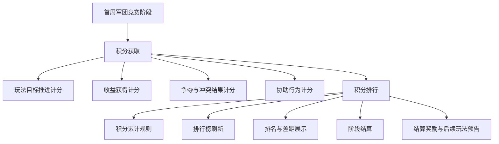

# FF 首周军团竞赛正式 GDD 草稿（中间功能版）

## 一、需求目的

- 在首周军团阶段，让玩家从个人成长进入固定军团成员共同处理收益、冲突、协助和阶段表现的关系。
- 让军团阶段表现可比较、可追赶、可被成员理解，并引导成员围绕下一轮行动形成共同目标。

## 二、需求概述

首周军团竞赛是后续军团玩法的前置活动，以积分比拼为核心，让玩家在首周中后段通过已开放玩法初步接触军团目标、成员贡献、排行竞争和协助关系，为后续更激烈的 GVG 玩法做准备。

本功能将首周开放玩法中的成员有效行为汇总为军团阶段表现，并通过排行、差距、求助协助、结算奖励和后续预告形成反馈，让玩家理解个人行为会影响军团表现，逐步熟悉军团关系和共同目标。具体战斗结果、掉落结果、冲突判定和背包变化仍按对应上游玩法结果判断，本功能只承接结果并转化为军团阶段表现。

## 三、主体设计

### 3.1 结构图



### 3.2 首周军团竞赛阶段

首周军团竞赛在首周中后段开启，并在阶段结算节点停止计分。该阶段不新增独立战斗入口，只承接已开放玩法中被上游玩法确认的有效结果。

阶段开启后，玩家可在军团入口查看本军团积分、排行、可参与玩法和阶段剩余时间。阶段推进期间，成员通过指定玩法获得军团积分；阶段结算后，军团积分停止增长，系统根据最终积分和排名发放奖励并展示后续军团玩法预告。

| 阶段 | 系统处理 | 玩家反馈 |
|---|---|---|
| 阶段开启 | 开放首周军团竞赛入口，开始接收可计分结果 | 显示当前积分、排行入口、可参与玩法 |
| 阶段推进 | 按玩法类型累计军团积分，刷新排行和差距 | 显示积分变化、排行变化、可继续获取积分的方向 |
| 阶段结算 | 锁定军团积分和排名，停止继续计分 | 展示最终排名、奖励领取入口和后续玩法预告 |

可配置参数：阶段开启时间、阶段结算时间、入口展示条件、阶段结果保留时间。生效范围为首周军团竞赛阶段。

### 3.3 积分获取

首周军团竞赛不新增独立战斗入口。玩家在首周中后段参与已开放玩法时，若对应玩法产出可计入军团竞赛的结果，则该结果按玩法类型和行为结果转化为军团积分。

积分获取需要覆盖不同玩家在首周能自然接触到的军团关系：共同推进目标、把个人收益转化为军团表现、在冲突中形成军团对抗感，以及通过求助协助理解成员之间的互相支撑。具体数值不在本稿锁定，由数值配置决定。

| 玩法类型 | 接收的结果类别 | 可计分行为 | 权重倾向 | 分配理由 | 不计入情况 |
|---|---|---|---|---|---|
| 军团目标类玩法 | 目标完成、阶段进度达成、共同任务完成 | 完成军团目标、推进共同任务、达成阶段进度 | 稳定基础权重 | 让普通成员也能通过可理解的目标为军团贡献，建立“个人行动影响军团”的第一层认知 | 目标未完成、阶段已结束、重复领取同一进度 |
| 收益获取类玩法 | 收益获得、收益保护、收益追回 | 获得、保护或追回可计入军团竞赛的收益结果 | 中等权重 | 把个人收益和军团表现连接起来，让玩家理解资源不是只服务个人成长 | 收益结果无效、收益已过期、收益未进入本阶段竞赛范围 |
| 对抗争夺类玩法 | 争夺胜利、防守成功、追回成功、压制结果 | 参与争夺并产生击败、防守、追回、压制等有效结果 | 较高权重并设置上限 | 提前让玩家感知军团之间的竞争关系，为后续更激烈的 GVG 做行为预热 | 只发生战斗但未改变有效结果、重复刷同一对象、超出配置上限 |
| 协助类玩法行为 | 协助成功、协助追回、协助防守、协助推进 | 响应成员求助，并在对应玩法中产生有效协助结果 | 辅助权重并限制次数 | 让成员理解军团不是只看个人输出，也包含互相响应和共同处理问题 | 只点击响应但未产生结果、求助已过期、求助不可参与 |

积分计算按“玩法类型 + 行为结果”共同决定。同一行为只归入一个玩法类型，避免同一结果重复计分。若行为同时满足多个类型，按配置的归属优先级确认唯一计分类型。

单次基础积分按以下骨架计算：

```text
单次基础积分 = 行为基础分 × 结果系数 × 玩法类型权重
本次可计入积分 = 单次基础积分在单人上限、军团上限、来源上限内的可计入部分
```

其中：

- 行为基础分由可计分行为决定，用于区分目标完成、收益获得、争夺成功、协助成功等行为的基础价值。
- 玩法类型权重由玩法类型决定，用于控制军团目标、收益获取、对抗争夺、协助行为在首周竞赛中的占比。
- 结果系数由上游玩法确认的结果强度决定，例如普通完成、关键目标完成、追回成功、防守成功等结果可使用不同系数。
- 单次基础积分生成后，系统再按单人上限、军团上限、来源上限和重复计入规则确认本次可计入积分。

基础计分规则：

- 若玩家在首周军团阶段内产生可计入结果，则系统按对应玩法类型计算本次积分。
- 若上游玩法判定结果无效、取消、过期或未完成，则本功能不计入军团积分。
- 若行为发生时玩家没有军团归属，则不计入军团积分。
- 若玩家、军团或来源已达到对应周期上限，则超出部分不再计入军团积分，但可保留原玩法自身反馈。
- 若协助行为没有产生对应玩法认可的有效结果，则只保留求助或响应反馈，不产生军团积分。

可配置参数：可计入玩法类型、玩法类型权重、行为基础分、结果系数、单人上限、军团上限、来源上限、归属优先级、重复计入规则。生效范围为首周军团竞赛的积分获取。

### 3.4 积分排行

积分排行用于把成员在不同玩法中的贡献转化为军团之间可比较的阶段表现。排行不改变上游玩法自身胜负和奖励，只展示首周军团竞赛中的军团积分、名次、分项表现和差距。

汇总规则：

- 军团总分由本阶段内所有有效积分累加生成。
- 军团分项表现按玩法类型展示，用于说明军团积分主要来自哪些玩法行为。
- 成员贡献概览只用于解释军团积分构成，不在本功能内扩展为独立个人排行玩法。
- 上游玩法原有奖励和军团竞赛积分分别结算，互不替代。
- 军团被解散或不可参与时，该军团不再继续累计积分或展示可参与入口；已进入结算节点的结果按本活动结算规则处理。

排行规则：

- 排行榜按军团总分排序。
- 同分时默认按先达到当前总分的军团靠前，用于鼓励更早形成阶段表现。
- 若项目希望强调对抗结果，可配置为优先比较对抗争夺类积分，再比较收益获取类积分，再比较协助类积分，仍相同则按先达到当前总分排序。
- 若以上口径仍无法区分，可按军团创建时间较早者靠前；该口径只用于稳定展示，不表达额外奖励倾向。
- 排行榜展示使用阶段内已确认积分。页面可按固定刷新节奏展示最新快照，刷新中或结果延迟时应提示当前展示为上一次确认结果。
- 排行页展示本军团名次、总分、与上一目标名次或下一奖励档位的差距。
- 差距提示只展示可继续行动方向，不承诺一定反超。

结算规则：

- 阶段结算时，以结算节点前已确认的有效积分锁定军团总分和排名。
- 结算节点后，本阶段积分停止增长，排行进入结算确认状态。
- 结算节点后才返回或确认的上游结果，不再改变本阶段排名；如项目需要处理延迟结果，只能按统一补发或下期处理规则执行，不回滚本期榜单。
- 奖励按结算排名或积分档位发放，具体奖励内容、档位和领取条件按配置执行。
- 未领取奖励按项目统一领取规则处理。

可配置参数：排行范围、刷新节奏、同分排序规则、奖励档位、奖励内容、领取条件、结果展示保留时间、延迟结果处理方式。生效范围为首周军团竞赛排行榜、结算页和奖励领取入口。

### 3.5 结算奖励与后续玩法预告

阶段结算后，系统向成员展示本军团在首周军团竞赛中的最终表现，并把结算奖励和结果反馈连接到后续军团玩法预告。这里不展开后续 GVG 玩法规则，只说明首周军团竞赛如何完成承接。

结果反馈包括：

- 本军团最终排名、总分和奖励领取状态。
- 军团积分来源构成，用于让成员理解本阶段主要贡献来自哪些玩法行为。
- 成员贡献概览，用于解释个人行为如何进入军团表现。
- 后续军团玩法预告，用于提示玩家后续会进入更强的军团竞争场景。

后续预告只做方向承接，不在本功能内开放完整 GVG 规则。玩家从首周军团竞赛中获得的主要认知是：个人行为会影响军团积分，军团排行会形成组织目标，不同成员可以通过目标推进、收益获取、对抗争夺和协助类玩法行为共同影响军团表现。

可配置参数：结果展示保留时间、来源构成展示项、成员贡献展示数量、后续预告文案、后续玩法入口展示条件。生效范围为阶段结果页和后续玩法预告展示。

## 四、UE 交互

军团入口在首周军团阶段开启后增加阶段表现入口。入口展示本军团当前阶段状态、积分、排名和可继续行动提示。

军团阶段页面包含阶段状态区、积分获取区、积分排行区、行动引导区和阶段结果区。

按钮状态：

| 按钮 | 可操作条件 | 不可操作反馈 |
|---|---|---|
| 前往玩法 | 对应玩法已开放且玩家可参与 | 提示玩法未开放或暂不可参与 |
| 查看排行 | 排行榜已开放 | 提示当前阶段尚未开启排行 |
| 协助成员 | 当前存在可计入积分的有效求助行为 | 提示求助已完成、过期或不可参与 |
| 领取奖励 | 阶段已结算且有可领奖励 | 提示未结算、无奖励或已领取 |

## 五、仍需对齐项

- 具体数值：行为基础分、结果系数、玩法类型权重、单人上限、军团上限、来源上限、刷新节奏和结果保留时间。
- 奖励内容：排名奖励、积分档位奖励、领取条件、未领取处理方式。
- UE 位置：军团入口、排行页、积分变化反馈、分项构成展示、结算页和后续预告的具体页面位置。
- 后续玩法入口：结算后承接到 GVG、战役、沙盘或威望系统中的哪一个入口，以及入口开放条件。
