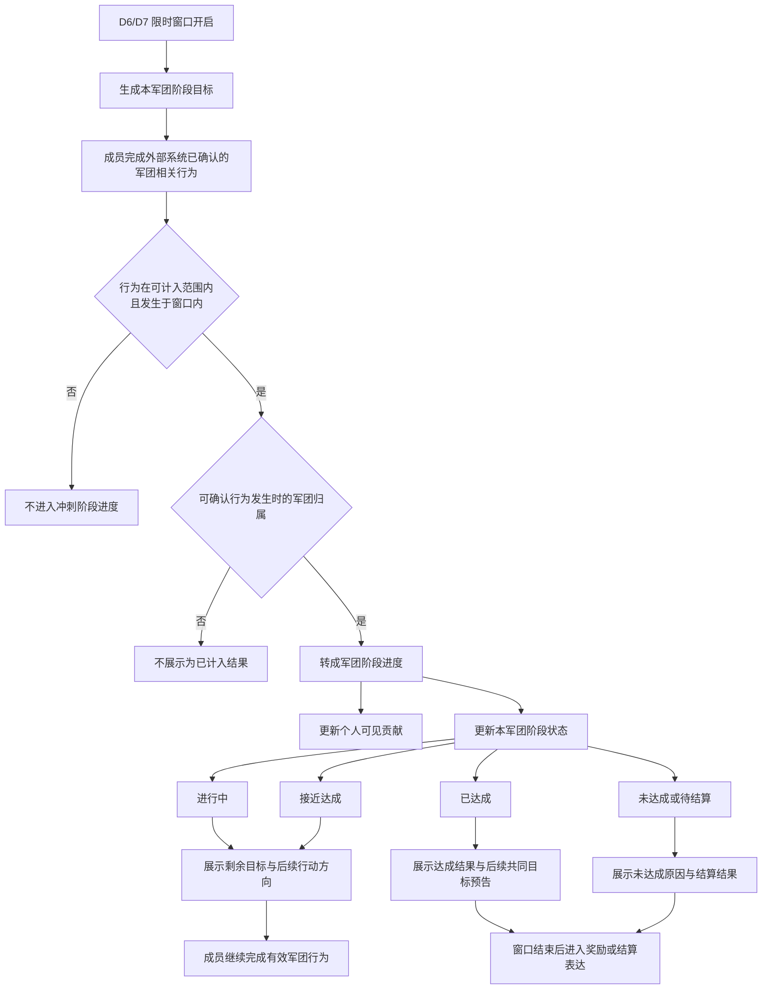

# FF-军团冲刺方向验证稿

## 一、需求目的

军团冲刺用于在首周 D6/D7 将“加入军团”和零散军团行为推进为“成员共同推进一个限时军团阶段目标”的组织认知与参与压力。

成员需要在限时窗口内清楚看到：自己的既有军团相关行为正在推进本军团阶段结果，并通过本军团共同进度、个人可见贡献、达成或追赶反馈，完成从军团承接到后续军团共同目标的过渡。

## 二、需求概述

军团冲刺是在 D6/D7 限时窗口内生成的本军团阶段目标。功能使用外部系统已确认完成的成员有效军团相关行为，经行为有效性、窗口时间和军团归属判断后，转成军团冲刺阶段进度与个人可见贡献。

军团冲刺表达的是本军团短窗口共同推进状态，不生成跨军团排行榜，不替代首周军团竞赛的跨军团积分排名，不改写军团等级经验规则，也不把个人贡献用于踢人、权限、惩罚或个人排名。

## 三、主体设计

### 3.1 结构图

### 3.2 限时窗口生成军团阶段目标

军团冲刺只在首周 D6/D7 限时窗口内生成本军团阶段目标。

窗口未开启时，功能只表达预告状态，不把窗口外普通行为追补为冲刺进度。窗口进行中时，成员可通过已确认的有效军团相关行为推进本军团阶段目标。窗口结束后，阶段目标停止接收新的冲刺进度，并进入待结算或已结束状态。

阶段目标归属于军团，不是个人任务目标，也不是跨军团竞赛目标。成员看到的是本军团共同进度，以及自己对该共同进度的可见贡献。

### 3.3 窗口内行为归集为军团阶段目标

军团冲刺使用外部系统已确认完成的成员有效军团相关行为作为进度来源。

可计入行为必须同时满足以下条件：

- 行为属于已确认的军团冲刺可计入范围。
- 行为发生在军团冲刺限时窗口内。
- 行为完成结果有效。
- 行为发生时的军团归属可确认。

不满足上述条件的行为，不进入军团冲刺阶段进度。外部来源暂未就绪或完成结果尚未确认时，军团冲刺不把该行为展示为已计入结果；成员仍可按原系统完成对应行为，最终是否进入冲刺进度以来源系统确认结果为准。

军团任务继续负责行为清单本身，军团冲刺只承接已确认行为结果，不新增强制打卡任务表，也不把所有军团行为自动计入冲刺进度。

### 3.4 有效行为转成阶段进度

进入军团冲刺的有效行为，会按已确认口径转成两类结果：

- 本军团阶段进度：用于推进军团冲刺阶段目标。
- 个人可见贡献：用于让成员看到自己的有效行为如何参与推进本军团目标。

具体行为权重、公式、阈值和奖励换算需要后续确认。个人可见贡献只解释成员参与价值和阶段结果来源，不形成个人排行榜，不等同于军团贡献货币，除非后续明确复用。

同一有效行为不得被制造成跨军团重复计入。换团、退团、窗口中加入军团后的计入口径，需要在正式 GDD 前确认。

### 3.5 阶段状态反馈共同推进结果

军团冲刺围绕本军团共同进度表达阶段状态。

| 阶段状态 | 功能表达 |
|---|---|
| 未开启 | 展示军团冲刺预告，不接收窗口外行为作为冲刺进度。 |
| 进行中 | 展示本军团当前进度、剩余目标和成员可继续参与的方向。 |
| 接近达成 | 强化本军团距离目标较近的状态，让成员看到继续参与的价值。 |
| 已达成 | 展示本军团阶段目标已完成，并转入达成反馈和后续共同目标预告。 |
| 未达成 | 展示本军团未完成阶段目标的结果，以及剩余目标或参与不足等原因表达。 |
| 待结算 / 已结束 | 停止接收新的冲刺进度，进入奖励或结算表达。 |

阶段状态只表达本军团共同推进结果，不复用首周军团竞赛的排行表达，不生成跨军团名次、积分榜或追榜关系。

### 3.6 个人贡献反馈说明参与价值

成员需要看到自己的有效行为如何推进本军团阶段目标。

个人贡献反馈用于回答三件事：

- 哪些已确认有效行为已经为本军团冲刺产生贡献。
- 这些贡献如何反映到本军团阶段进度上。
- 当前继续完成哪些军团相关行为，可以帮助本军团接近或完成阶段目标。

个人贡献反馈不能作为惩罚、权限、踢人或个人排名依据。成员覆盖不足时，只作为软提示表达参与不足或需要更多成员继续推进，不设置强制参与门槛，不引入个人惩罚。

### 3.7 追赶与达成反馈承接后续共同目标

军团冲刺通过剩余目标、接近达成、未达成原因和后续行动方向，表达本军团短窗口共同推进状态。

进行中和接近达成时，反馈重点是让成员知道本军团还差多少、继续做什么行为有价值。未达成时，反馈重点是说明阶段结果和主要缺口，避免成员只看到失败结果而不知道后续行动方向。已达成后，反馈转为达成结果展示，并预告后续军团共同目标。

该反馈服务 D6/D7 的军团承接：让成员从“我加入了军团”转为“我和军团成员正在共同推进一个阶段结果”。

### 3.8 奖励结算与既有系统关系

窗口结束后，军团冲刺按军团阶段结果和个人可见参与关系进入奖励或结算表达。奖励明细、领取条件和结算口径需要后续确认。

既有系统关系保持如下边界：

- 首周军团竞赛继续负责跨军团积分排名与竞赛结果表达。
- 军团任务继续负责具体行为清单和行为完成。
- 军团等级成长继续按原经验规则运行。
- 军团科技成长不由军团冲刺直接生成、消耗或升级。
- 军团积分用途不因军团冲刺直接改写。
- 军团冲刺不新增跨军团排行榜。

## 四、待确认项与正式 GDD 阻塞项

### 4.1 方向验证保留项

- 军团冲刺后续是否周期复用，以及复用时是否仍沿用 D6/D7 的阶段目标表达。
- 精确行为范围。
- 有效行为的进度权重、公式和阶段阈值。
- 奖励明细与领取表达。
- UE 入口表现、页面状态和提示文案。
- 成员覆盖不足时的软提示尺度。
- 换团、退团、窗口中加入军团后的计入口径。

### 4.2 正式 GDD 阻塞项

- 外部行为来源的确认口径：正式 GDD 前需要确认哪些外部系统提供可计入的完成结果，以及来源未就绪或结果延迟时玩家看到什么状态。
- 奖励与结算口径：正式 GDD 前需要确认军团阶段结果、个人可见参与关系和奖励结算之间的关系。
