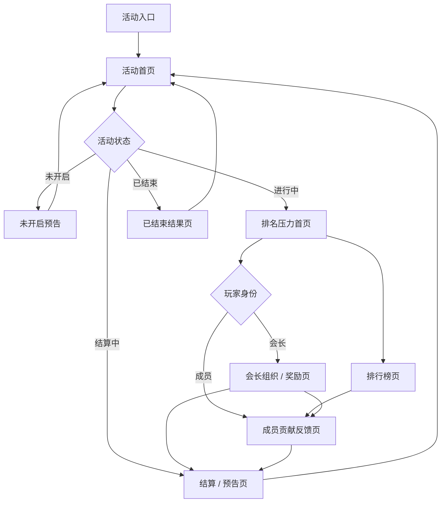

# FF-军团冲刺UE线框图-软PVP版

## 一、需求目的

军团冲刺用于承接首周前几日的军团软 PVP 积分竞争。页面需要让成员看到个人参与如何进入成员贡献、军团积分和排名变化，也让会长围绕当前名次、前后差距和成员响应组织冲榜，并在阶段结束前给出结算预告。

## 二、需求概述

### 2.1 页面范围

- 活动入口 / 首页
- 排行榜页
- 会长组织 / 奖励页
- 成员贡献反馈页
- 结算 / 预告页

### 2.2 首页信息优先级

首页首屏按以下顺序组织信息：

1. 当前名次
2. 与前一名 / 后一名差距
3. 倒计时 / 剩余时间
4. 会长奖励露出
5. 组织 / 参与 CTA

计分公式、奖励明细和数值阈值均使用 `[待定]` 占位，不在 UE 线框图中锁定。

### 2.3 状态表现

| 状态 | 页面表现 |
|---|---|
| 未开启 | 展示活动预告、开启倒计时、奖励占位和进入入口。 |
| 进行中 | 展示当前名次、积分差距、名次变化、成员贡献反馈和组织 / 参与入口。 |
| 结算中 | 展示结算中状态、排名结果占位、奖励占位和后续预告。 |
| 已结束 | 展示最终排名、贡献回顾、奖励占位和下一阶段预告。 |

### 2.4 功能边界

军团冲刺只承接首周军团积分竞争、成员贡献展示、会长组织和结算预告。长期 GVG、军团等级、军团科技、治理、惩罚和权限系统仍按各自系统规则处理，活动页不改变这些系统的规则。

## 三、页面流



## 四、页面线框

### 4.1 活动入口 / 首页

首页承担排名压力中枢。玩家进入后优先看到军团当前名次、与前后名次差距、剩余时间和奖励露出，再根据身份进入组织或参与动作。

```text
+------------------------------------------------+
| 活动入口卡                                     |
| 军团冲刺        状态：[未开启/进行中/结算中]   |
| 当前军团名次：[待定]                           |
| 剩余时间：[待定]                               |
| [进入活动]                                     |
+------------------------------------------------+
```

```text
+------------------------------------------------+
| 军团冲刺首页                         [状态]    |
+------------------------------------------------+
| 当前名次                                      |
| 第 [待定] 名                                  |
| 名次变化：[上升/下降/持平/待定]               |
+------------------------------------------------+
| 与前一名差距：[待定]                          |
| 与后一名差距：[待定]                          |
+------------------------------------------------+
| 剩余时间：[待定]                              |
+------------------------------------------------+
| 会长奖励露出                                  |
| 奖励内容：[待定]                              |
| 达成条件 / 结算关系：[待定]                   |
+------------------------------------------------+
| 会长视角 CTA： [发送号召] [查看成员响应]       |
| 成员视角 CTA： [参与活动] [查看我的贡献]       |
+------------------------------------------------+
```

会长视角重点露出组织动作和成员响应入口；成员视角重点露出参与入口和个人贡献反馈入口。

### 4.2 排行榜页

排行榜用于放大军团之间的软 PVP 压力。列表核心信息为名次、军团积分、名次变化、与相邻名次差距。

```text
+------------------------------------------------+
| 排行榜                              [返回]     |
+------------------------------------------------+
| 我的军团                                      |
| 当前名次：[待定]                              |
| 军团积分：[待定]                              |
| 距上一名：[待定]    领先后一名：[待定]        |
+------------------------------------------------+
| 名次 | 军团名称 | 军团积分 | 名次变化 | 差距  |
|  1   | [待定]   | [待定]   | [待定]   | --    |
|  2   | [待定]   | [待定]   | [待定]   | [待定] |
|  3   | 我的军团 | [待定]   | [待定]   | [待定] |
| ...                                            |
+------------------------------------------------+
| 会长视角： [发送提醒] [查看贡献概览]           |
| 成员视角： [参与活动] [查看我的贡献]           |
+------------------------------------------------+
```

排行榜不展示计分公式。积分、差距和排名变化只作为竞争反馈信息呈现，具体数值口径为 `[待定]`。

### 4.3 会长组织 / 奖励页

会长页用于把排名压力转成组织动作。页面集中展示会长奖励卡、冲榜目标、成员贡献概览、号召 / 提醒入口和成员响应情况。

```text
+------------------------------------------------+
| 会长组织 / 奖励页                    [返回]    |
+------------------------------------------------+
| 会长奖励卡                                    |
| 奖励内容：[待定]                              |
| 奖励条件：[待定]                              |
+------------------------------------------------+
| 冲榜目标                                      |
| 当前名次：[待定]                              |
| 目标名次：[待定]                              |
| 目标差距：[待定]                              |
+------------------------------------------------+
| 成员贡献概览                                  |
| 已参与成员：[待定]                            |
| 今日贡献合计：[待定]                          |
| 关键贡献成员：[待定]                          |
+------------------------------------------------+
| 发送号召 / 提醒                               |
| [发送号召]   [发送提醒]                       |
+------------------------------------------------+
| 成员响应                                      |
| 已响应：[待定]    未响应：[待定]              |
+------------------------------------------------+
```

成员进入该页时不显示发送号召和发送提醒操作，只显示会长奖励露出、当前号召信息、个人响应状态和参与入口。

```text
+------------------------------------------------+
| 军团冲刺奖励 / 号召                  [返回]    |
+------------------------------------------------+
| 会长奖励露出                                  |
| 奖励内容：[待定]                              |
+------------------------------------------------+
| 会长号召                                      |
| 号召内容：[待定]                              |
| 我的响应状态：[待定]                          |
+------------------------------------------------+
| [参与活动]   [查看我的贡献]                   |
+------------------------------------------------+
```

### 4.4 成员贡献反馈页

成员贡献反馈页用于让成员确认自己的参与已经计入军团竞争，并看到贡献对军团积分和排名压力的影响。

```text
+------------------------------------------------+
| 我的贡献                            [返回]     |
+------------------------------------------------+
| 我的贡献                                      |
| 今日贡献：[待定]                              |
| 累计贡献：[待定]                              |
+------------------------------------------------+
| 已计入记录                                    |
| 时间       | 行为来源 | 贡献 | 计入状态        |
| [待定]     | [待定]   | [待定] | 已计入         |
| [待定]     | [待定]   | [待定] | 已计入         |
+------------------------------------------------+
| 对军团竞争的影响                              |
| 计入军团积分：[待定]                          |
| 对排名影响：[待定]                            |
| 与前后名次差距变化：[待定]                    |
+------------------------------------------------+
| 成员参与奖励占位                              |
| 奖励内容：[待定]                              |
| 领取 / 发放状态：[待定]                       |
+------------------------------------------------+
| [继续参与]   [查看排行榜]                     |
+------------------------------------------------+
```

会长查看成员贡献时，页面以成员贡献概览和成员响应状态为主，不进入惩罚、权限调整或治理操作。

```text
+------------------------------------------------+
| 成员贡献概览                        [返回]     |
+------------------------------------------------+
| 成员名称 | 贡献 | 已计入记录 | 响应状态        |
| [待定]   | [待定] | [待定]   | [待定]          |
| [待定]   | [待定] | [待定]   | [待定]          |
| [待定]   | [待定] | [待定]   | [待定]          |
+------------------------------------------------+
| [发送提醒]   [返回组织页]                     |
+------------------------------------------------+
```

### 4.5 结算 / 预告页

结算 / 预告页用于在活动进入结算中或已结束状态时收束竞争结果，并露出后续预告。奖励明细、发放规则和数值阈值均保持 `[待定]`。

```text
+------------------------------------------------+
| 军团冲刺结算 / 预告                 [状态]     |
+------------------------------------------------+
| 结算状态                                      |
| 当前状态：[结算中/已结束]                     |
| 结算时间：[待定]                              |
+------------------------------------------------+
| 军团结果                                      |
| 最终名次：[待定]                              |
| 军团积分：[待定]                              |
| 名次变化：[待定]                              |
+------------------------------------------------+
| 成员贡献回顾                                  |
| 我的贡献：[待定]                              |
| 已计入记录：[待定]                            |
+------------------------------------------------+
| 奖励占位                                      |
| 会长奖励：[待定]                              |
| 成员参与奖励：[待定]                          |
+------------------------------------------------+
| 后续预告                                      |
| 下一阶段内容：[待定]                          |
+------------------------------------------------+
| [返回首页]   [查看排行榜]                     |
+------------------------------------------------+
```

会长视角补充成员响应和贡献概览入口；成员视角补充个人贡献结果和成员参与奖励占位。

## 五、待定项

- 计分公式：[待定]
- 军团积分数值口径：[待定]
- 奖励明细：[待定]
- 会长奖励条件：[待定]
- 成员参与奖励条件：[待定]
- 排名目标和差距阈值：[待定]
