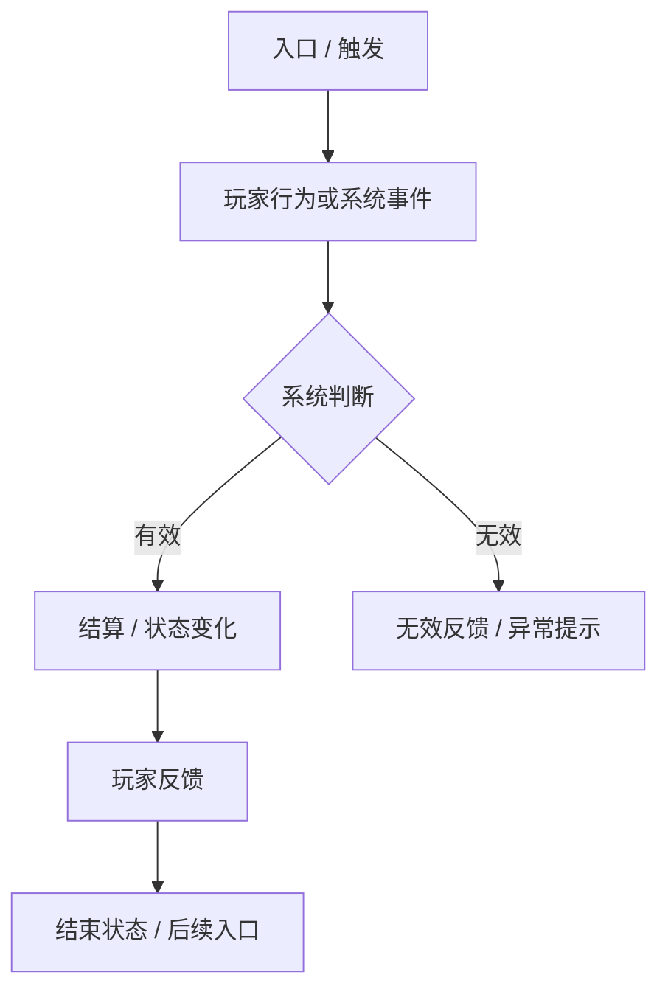

# 玩法 / 系统 GDD 公共模板草案

> 适用标准：`reference/部门标准/策划/gdd/GDD写作标准.md`
>
> 使用范围：玩法、系统、活动、阶段目标类 GDD。
>
> 不适用范围：纯数值表、纯 UE 稿、项目立项稿。

---

## 使用前规则：模块拆分逻辑

这部分用于作者写作前判断，不进入正式 GDD 正文。

### 一、什么可以拆成主体模块

一个主体模块必须至少能独立回答以下问题：

| 问题 | 判断口径 |
|---|---|
| 入口 / 触发 | 玩家从哪里进入，或系统由什么事件触发 |
| 行为 / 事件 | 玩家做了什么，或系统处理了什么事件 |
| 判断 | 系统根据什么条件判断有效、无效、成功、失败或分支 |
| 结果 | 资源、进度、状态、归属、奖励或关系发生什么变化 |
| 反馈 | 玩家看到什么提示、展示、奖励、状态或异常反馈 |
| 边界 | 什么情况不生效，失败后如何表现 |

不能同时回答以上问题的内容，不拆成主体模块。

### 二、什么不能拆成主体模块

以下内容只能挂靠到所属主体模块，或放到后续附属章节：

| 内容类型 | 处理方式 |
|---|---|
| 积分来源、分数维度、贡献类型 | 放入对应模块的规则与结算，或放入附属规则 |
| 状态枚举、成员类型、阶段类型 | 写进对应模块的状态变化或边界 |
| 配置项、内容项、奖励表 | 放到配置项或内容配置区，并标注所属模块 |
| UI 页面、按钮、弹窗 | 放到 UE 交互，除非它本身承载完整功能流程 |
| 指标、验收口径 | 放到验证指标 |
| 待定问题 | 放到待定项，不能支撑主体结构 |

### 三、模块拆分顺序

主体模块按玩家和系统实际发生顺序排列：

1. 入口与开启：玩家如何看到或进入功能。
2. 核心参与：玩家主要操作或系统主要处理事件。
3. 规则判断：系统如何判断有效、无效、成功、失败或分支。
4. 结算与状态变化：资源、进度、奖励、关系或归属如何变化。
5. 反馈与展示：玩家如何理解结果，以及下一步去哪里。
6. 管理或辅助功能：管理者操作、推荐、标记、提醒等。

如果两个模块只有参数不同、流程相同，应合并成一个模块，通过规则或配置体现差异。

---

# [功能名称] GDD

> 适用标准：`reference/部门标准/策划/gdd/GDD写作标准.md`

---

## 一、需求目的

- [目标状态 1：解决什么问题，或让什么状态发生变化]
- [目标状态 2：承接哪个前置系统 / 玩法 / 阶段]
- [目标状态 3：影响哪个后续系统 / 玩法 / 阶段]

> 只写目标状态和可验证结果，不写实现手段，不写作者推导过程。

---

## 二、需求概述

[2-3 句话说明：这个功能是什么、覆盖范围是什么、主要限制是什么。]

不在本 GDD 范围：

- [不展开内容 1]
- [不展开内容 2]

---

## 三、整体流程

[插入飞书脑图、流程图或 Mermaid 流程图。流程必须展示入口、主要行为、系统判断、状态变化、玩家反馈和结束状态。]

---

## 四、功能设计

### 4.1 [主体模块 A：按功能流程命名]

#### 功能说明

[本模块解决什么问题，玩家或系统在这里完成什么事情。]

#### 触发条件

| 条件 | 说明 |
|---|---|
| [条件 1] |  |
| [条件 2] |  |

#### 操作与响应

| 步骤 | 玩家操作 / 系统事件 | 系统判断 | 系统响应 | 玩家反馈 |
|---|---|---|---|---|
| 1 |  |  |  |  |

#### 规则与结算

| 规则项 | 触发条件 | 判断方式 | 结算结果 | 状态变化 | 玩家反馈 |
|---|---|---|---|---|---|
|  |  |  |  |  |  |

#### 边界与异常

| 场景 | 处理口径 | 玩家反馈 |
|---|---|---|
|  |  |  |

### 4.2 [主体模块 B：按功能流程命名]

[同 4.1 结构。]

---

## 五、UE 交互

| 界面 / 入口 | 展示内容 | 可操作项 | 状态变化 | 异常提示 |
|---|---|---|---|---|
|  |  |  |  |  |

> 只写与功能逻辑强绑定的入口、按钮、弹窗、页面流转。纯视觉表现不在本节展开。

---

## 六、附属规则与配置

### 6.1 附属规则

| 归属模块 | 规则项 | 触发条件 | 判断方式 | 结果 | 玩家反馈 |
|---|---|---|---|---|---|
|  |  |  |  |  |  |

> 本节只放跨多个主体模块复用的规则。只属于单个模块的规则，必须写回对应 4.x 模块。

### 6.2 配置项

| 配置项 | 所属模块 | 生效范围 | 默认值 | 可配置范围 | 说明 |
|---|---|---|---|---|---|
|  |  | 全局 / 单期 / 单实例 / 其他 |  |  |  |

### 6.3 内容配置区（可选）

| 内容项 | 所属模块 | 参数 | 说明 |
|---|---|---|---|
|  |  |  |  |

> 内容配置区只能在功能描述完成后出现，不能替代功能规则。

---

## 七、待定项

| 待定项 | 所属模块 | 待定原因 | 后续确认方式 |
|---|---|---|---|
|  |  |  |  |

> 待定项只能放需要数值、测试、外部系统或排期确认的内容。主功能是否成立不能放进待定项。

---

## 八、验证指标

| 验证目标 | 指标 | 观察口径 |
|---|---|---|
| 玩家能找到入口 |  |  |
| 玩家能完成核心操作 |  |  |
| 规则结算符合预期 |  |  |
| 异常边界可被正确处理 |  |  |

---

## 自检清单

- [ ] 需求目的只写目标状态和可验证结果，没有写实现手段。
- [ ] 需求概述说明了功能是什么、覆盖范围和主要限制。
- [ ] 整体流程展示了入口、主要行为、系统判断、状态变化、玩家反馈和结束状态。
- [ ] 主体模块按功能流程拆分，没有按积分来源、状态枚举、配置项、页面或指标拆分。
- [ ] 每个主体模块都写清触发、判断、结算、状态变化、反馈和异常。
- [ ] 附属规则能追溯到所属模块，没有变成独立规则清单。
- [ ] 配置项和内容配置区都标注了所属模块。
- [ ] 待定项没有承载主功能骨架。
