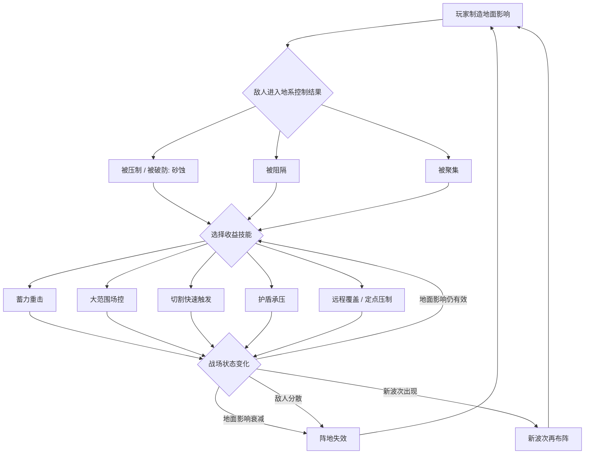

# 代号HYPER：地系武器技能重梳理方向稿

> 文档定位：方向验证稿，不作为正式 GDD。
> 来源参考：`/Users/mt/Downloads/地系武器技能设计_v0.2.md`

---

## 一、需求目的

- 重定地系武器技能的设计目标，使地系从单个技能表现回到清晰的战斗定位。
- 建立“阵地控场 + 厚重蓄势”的地系主轴，让玩家通过改变战场、压制敌人、再释放高收益技能形成稳定战斗节奏。
- 明确五类地系武器在同一循环中的职责分工，避免各武器技能目标分散。
- 保留去主角位移的表现约束，使地系战斗重点落在地面影响、敌人状态变化和重击收益上。

---

## 二、需求概述

地系武器技能重梳理的方向为：玩家先制造地面影响，使敌人进入被压制、被聚集、被阻隔或被破防状态，再选择蓄力重击、大范围场控、切割触发或护盾承压获得收益。

本稿只确认方向验证所需的目标、循环、功能点、状态与武器职责。砂蚀完整规则、地面影响叠加关系、蓄势打断 / 取消 / 提前释放、敌人类型抗性、五类武器组合链路示例、位移边界和 UE 状态反馈，均不在本稿内定稿。

---

## 三、设计约束

后续地系武器技能方案必须先满足以下约束，再进入具体技能拆分：

1. 每个方案只能有 1 个核心表现特点。
2. 核心特点必须是玩家能看到或理解的动作、状态变化或反馈结果，不能只写“增伤、控制、生存、爆发”这类抽象收益。
3. 强化只能沿核心特点加深，可以从范围、频率、层数、触发条件、反馈结果中选择，不允许横向新增第二个卖点。
4. 辅助效果可以存在，但必须服务核心特点；解释不了服务关系就删掉。
5. 删掉所有数值后，这个技能仍然要有记忆点。

---

## 四、功能概述

### 4.1 Mermaid 流程图

### 4.2 建立地面影响

玩家使用地系武器技能后，战场上生成地面影响。地面影响是后续压制、聚集、阻隔、砂蚀收益和重击收益的前置承载状态。

地面影响不要求每个技能都具备群体伤害能力。群体刷怪的成立方式是整套技能组合形成链路：先改变敌人所处战场，再由后续技能完成重击、清场、触发或承压收益。

地面影响存在衰减。当地面影响衰减、敌人离开控制结果或新波次出现时，玩家需要重新进入布阵阶段。

### 4.3 施加砂蚀并形成压制收益

砂蚀是地系核心状态，表示敌人已经被地系压制或破防。砂蚀不作为 buff 数量驱动的核心机制，而是作为敌人状态，用于承接后续重击、地形、聚怪等收益。

当敌人处于砂蚀状态时，后续地系技能可以围绕该状态获得更高收益。砂蚀收益类型仍属于方向验证保留项，本稿只确认砂蚀的核心定位，不确认完整规则。

### 4.4 生成阻隔与聚怪

地系技能可以通过地面影响形成阻隔或聚怪结果，使敌人移动、站位或受击状态发生变化。

阻隔用于让敌人被战场结构限制，服务于阵地控场和后续输出窗口。聚怪用于让分散敌人被收束，服务于切割触发、范围场控或重击清场。Boss / 精英敌人对聚怪和阻隔的抗性表达尚未确认，正式 GDD 需要补足敌人类型有效性边界。

### 4.5 进入蓄势窗口并释放高收益技能

地系重击收益建立在“先控场，再蓄势，再释放”的节奏上。玩家在敌人被压制、被聚集、被阻隔或被砂蚀后，进入蓄势窗口，并选择蓄力重击、大范围场控或其他高收益技能完成清场、破防处决或战斗压制。

蓄势窗口用于表达地系的厚重感。蓄势打断、取消、提前释放等具体规则未在本稿定稿，需在正式 GDD 中确认。

### 4.6 使用切割快速触发收益

双刀方向承担快速收束和触发收益。当地面影响、砂蚀、聚怪等前置状态已经形成时，切割类技能用于快速触发地系收益，补足地系循环中的节奏推进能力。

切割快速触发不改变地系主轴。它服务于“布阵后触发收益”，而不是把地系改为纯高速连击体系。

### 4.7 使用护盾承压维持阵地

剑盾方向承担阵地建立和护盾承压。玩家先立住阵地，再通过承压能力维持自身在阵地中的战斗位置，使后续地面影响、阻隔、砂蚀和重击收益能够继续成立。

承压状态用于表达玩家正在利用护盾承担敌人压力。该状态服务于阵地维持，不替代砂蚀、聚怪或重击收益。

### 4.8 远程覆盖与定点压制

弓箭方向承担远程覆盖和定点压制。当地面影响需要补充、远处敌人需要被压制，或玩家需要在不移动主角位置的情况下继续影响战场时，弓箭技能用于远距离补阵和定点压制。

该方向保持去主角位移约束，使弓箭的职责落在覆盖与压制，而不是让玩家通过位移重新获得站位优势。

### 4.9 地形改变与大范围场控

法杖方向承担地形改变和大范围场控。法杖技能用于改变战场结构，使敌人进入更适合地系后续收益的状态。

法杖的重点不是单次伤害表现，而是通过地形改变扩大地系阵地控场的影响范围，并承接后续重击、清场或持续压制。

### 4.10 阵地失效与新波次再布阵

当地面影响衰减、敌人分散、阻隔 / 聚怪结果失效，或新波次出现时，当前阵地进入失效状态。玩家需要再次制造地面影响，重新让敌人进入被压制、被聚集、被阻隔或被破防状态，再进入下一轮收益选择。

该循环确保地系战斗不是一次性爆发，而是围绕“布阵 -> 压制 -> 收益 -> 再布阵”重复推进。

---

## 五、武器职责重做方向

### 5.1 剑盾：阵地建立 / 护盾承压

剑盾围绕“先立住阵地，再承受压力”重做。剑盾技能应承担地面影响建立、承压维持和阵地保护职责，使玩家能够在敌人压力下维持地系循环。

### 5.2 刀：蓄力重击 / 破防处决

刀围绕“等敌人被压制后重击”重做。刀技能应在敌人被砂蚀、被聚集、被阻隔或处于蓄势窗口后获得收益，承担蓄力重击、破防处决和清场职责。

### 5.3 双刀：聚怪 / 切割 / 快速触发

双刀围绕“快速收束和触发收益”重做。双刀技能应服务于聚怪形成、切割快速触发和前置状态收益兑现，使地系循环具备更快的触发段落。

### 5.4 弓箭：远程覆盖 / 定点压制

弓箭围绕“远距离补阵和定点压制”重做。弓箭技能应在远距离制造或补充地面影响，对关键目标形成压制，帮助玩家在不依赖主角位移的前提下延续地系控制。

### 5.5 法杖：地形改变 / 大范围场控

法杖围绕“改变战场结构”重做。法杖技能应承担地形改变、大范围场控和阵地范围扩展职责，使敌人更容易进入被压制、被阻隔、被聚集或被破防状态。
