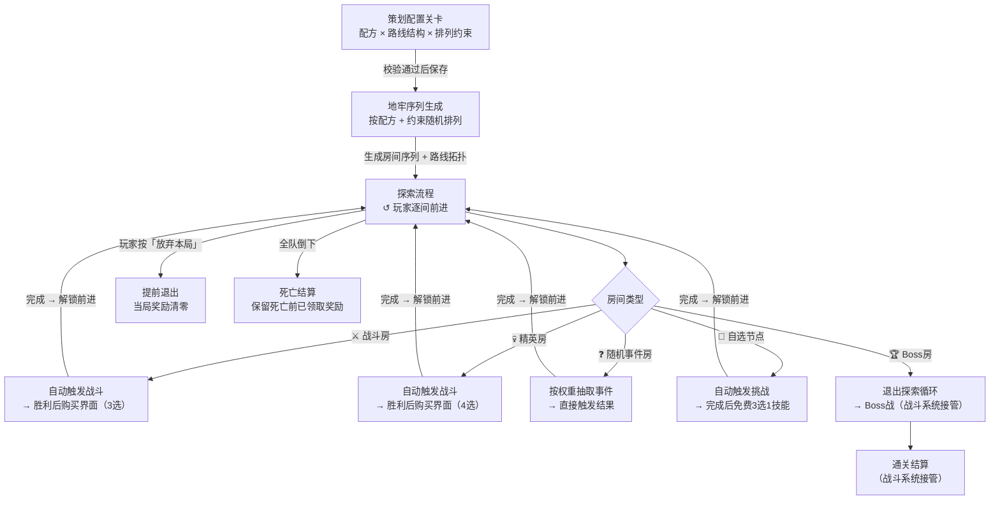

# 关卡设计

---

## 一、需求目的

- 建立局内 Build 积累节奏感：通过控制奖励节点（战斗房 / 精英房 / 自选节点）在序列中的分布，保证玩家始终感受到下一次强化机会临近
- 防止节奏断裂和单调：通过排列约束控制同类房间的连续数量和事件分布，避免出现大段战斗堆积或奖励集中
- 提供有意义的路线决策：在分叉结构中为各路线设定差异化的风险/回报定位，让选路成为真实的策略选择而非被迫默认

---

## 二、需求概述

关卡设计系统为每次进入地牢生成一条由不同类型房间组成的探索序列，玩家逐间前进至 Boss 房结束本局。策划通过**配方**（各类型房间数量）、**路线结构**（线性 / 分叉 / 混合）和**排列约束**（节奏控制开关）三个维度配置每一关；系统按配方和约束随机生成序列，保证每局有差异但节奏可控。

---

## 三、功能概述

### 3.1 流程图

### 3.2 探索主循环

玩家从进入地牢后依序经历各房间，每间完成事件后选择出口，循环直至进入 Boss 房、全队倒下或主动退出。

**操作流程**

1. 局外大厅按「进入地牢」→ 系统读取关卡配置，执行地牢序列生成，自动进入第一间
2. 进入房间 → 按房间类型触发对应事件（见 3.3）→ 事件完成后解锁「前进」
3. 线性路线：展示下一间类型图标，玩家点「前进」；分叉节点：展示两条路线各自下一间，玩家点击选路
4. 重复 2–3，直到触发以下任一出口：进入 Boss 房 / 全队宠物倒下 / 玩家主动退出

**规则/边界**

- 若玩家按「放弃本局」（任意时刻可触发）→ 弹出确认弹窗；确认后当局奖励清零，返回大厅；取消则继续
- 若全队宠物倒下 → 跳过当前奖励交互，保留死亡前已领取奖励，返回大厅展示死亡结算
- 若进入 Boss 房 → 退出探索循环，将最终 Build 传递给战斗系统

---

### 3.3 房间类型

各类型房间在玩家进入时触发对应行为；战斗类委托战斗系统接管，本系统负责战斗结束后的奖励流程。

#### ⚔️ 战斗房

进入自动触发战斗，胜利后展示付费购买界面（3 选项）。

**操作流程**

1. 进入 → 传入战斗系统：敌人配置 → 返回胜利 / 失败
2. 若战斗中离线 → 重连后从当前战斗起点重新开始，已获得奖励保留
3. 胜利 → 从购买池均匀随机无放回抽取 3 个物品，展示货币购买界面
4. 玩家点击物品消耗货币购买，或点「跳过」→ 解锁「前进」
5. 若购买界面时离线 → 重连后恢复购买界面，购买完成前不允许前进
6. 失败（全队宠物倒下）→ 进入死亡结算，跳过购买界面

**配置项**

| 配置项 | 默认值 | 可配置范围 | 说明 |
|---|---|---|---|
| 购买池引用 ID | 战斗房标准池 | 任一购买池 ID | 池内可展示物品数量须 ≥ 展示数量 |
| 单次展示数量 | 3 | 1–6 | 支持配置 |

**规则/边界**

- 若货币不足，对应选项灰化，不阻断「跳过」和其余选项
- 若池内物品不足展示数量，展示全部可用物品（兜底）

---

#### 💀 精英房

高难度战斗，胜利后展示高品质购买界面（4 选项）。

**操作流程**

1. 进入 → 传入战斗系统：精英敌人配置 → 返回胜利 / 失败
2. 若战斗中离线 → 重连后从当前战斗起点重新开始，已获得奖励保留
3. 胜利 → 从精英高品质购买池均匀随机无放回抽取 4 个物品，展示货币购买界面
4. 玩家点击物品消耗货币购买，或点「跳过」→ 解锁「前进」
5. 若购买界面时离线 → 重连后恢复购买界面，购买完成前不允许前进
6. 失败（全队宠物倒下）→ 进入死亡结算，跳过购买界面

**配置项**

| 配置项 | 默认值 | 可配置范围 | 说明 |
|---|---|---|---|
| 购买池引用 ID | 精英房高品质池 | 任一购买池 ID | 池内可展示物品数量须 ≥ 展示数量 |
| 单次展示数量 | 4 | 1–6 | 支持配置 |

**规则/边界**

- 若货币不足，对应选项灰化，不阻断「跳过」和其余选项
- 若池内物品不足展示数量，展示全部可用物品（兜底）

---

#### ❓ 随机事件房

无战斗，系统按权重自动抽取事件并直接触发结果。

**操作流程**

1. 进入 → 筛选当前层级可触发的事件条目
2. 按权重比例随机抽取 1 个事件（Weight Proportional Random，单次独立，本局内同类可重复触发）
3. 展示事件结果卡（奖励直接呈现，无需玩家选择）
4. 玩家点「确认」关闭 → 解锁「前进」；无失败路径

**配置项**

| 配置项 | 说明 |
|---|---|
| 事件条目列表 | 每条含：事件类型 ID、触发权重（≥1）、适用层级（全局 / 指定楼层区间）；由内容团队配置 |

**规则/边界**

- 若当前层级无可触发条目（配置缺失）→ 展示默认材料奖励，记录日志
- 权重为 0 的条目不计入抽取

---

#### 🎁 自选节点

进入自动触发挑战，完成后免费 3 选 1 技能（不消耗货币）。

**操作流程**

1. 进入 → 传入战斗系统：自选挑战配置 → 返回完成 / 失败
2. 完成 → 从当前局可用技能列表过滤已持有技能，均匀随机无放回抽取 3 个
3. 展示免费 3 选 1 界面；玩家选择 1 项 → 技能加入持有列表 → 解锁「前进」
4. 失败（全队宠物倒下）→ 进入死亡结算，不展示选择界面

**配置项**

| 配置项 | 默认值 | 可配置范围 | 说明 |
|---|---|---|---|
| 展示选项数量 | 3 | 1–5 | 支持配置 |
| 排除已持有技能 | 开启 | 开启 / 关闭 | 支持配置 |

**规则/边界**

- 若过滤后可选技能不足展示数量，展示全部可选技能（不填充重复项）

---

#### 🏆 Boss 房

探索循环终点，进入后立即将最终 Build 传递给战斗系统，无玩家确认步骤。

**操作流程**

1. 进入 → 探索循环退出 → 传入战斗系统：Boss 配置 + 最终 Build
2. 通关 → 战斗系统负责结算；若结算时离线 → 重连后恢复结算界面，结算发放完成前本局不计结束
3. 若通关结算发奖失败 → 重试 1 次；仍失败则标记待补发，下次登录优先发放，记录日志
4. 失败（全队宠物倒下）→ 保留死亡前奖励，返回大厅

**规则/边界**

- Boss 战中「放弃本局」仍可用，触发提前退出流程（当局奖励清零）

---

### 3.4 地牢生成规则

策划在关卡编辑器中配置关卡参数；玩家每次进入地牢时系统执行生成，输出一条满足约束的房间序列和路线拓扑。

#### 配置输入

策划通过三类参数定义每关：

**房间配方**：各类型房间的数量组合

| 配置项 | 默认值 | 说明 |
|---|---|---|
| 战斗房数量 | 6 | 支持配置 |
| 精英房数量 | 1 | 支持配置 |
| 随机事件房数量 | 2 | 支持配置 |
| 自选节点数量 | 1 | 整关合计 ≥ 1 |
| Boss 房数量 | 1 | 恰好为 1 |

**路线结构**：线性 / 分叉 / 混合；分叉/混合时每段独立定义配方

**排列约束**：五类约束开关，控制生成时的节奏规则（见生成过程）

**配置保存校验**：
- 若 Boss 房数量 ≠ 1 → 阻断保存
- 若整关自选节点合计 = 0 → 阻断保存
- 若任意段长度 = 0（分叉/混合）→ 阻断保存

#### 生成过程

玩家进入地牢时触发，每次执行：

1. **初始化房间池**：按配方创建各类型房间对象（战斗房 × N，精英房 × N，…）
2. **随机打乱**：对房间池执行 Fisher-Yates 算法，得到随机排列
3. **约束检查**（约束随机模式）：按优先级从高到低逐一检查所有启用的约束

   | 优先级 | 约束 | 判断规则 |
   |---|---|---|
   | 1（最高）| Boss 锚定 | Boss 房是否排在段末尾 |
   | 2 | 早期保护 | 段内所有精英房的位置是否均在段总长度前 N%（默认 40%）之后 |
   | 3 | 自选位置 | Boss 房前 N 间（默认 2 间）内是否有至少 1 个自选节点 |
   | 4 | 事件分布 | 段内事件房是否做到前半段至少 1 间、后半段至少 1 间 |
   | 5（最低）| 连续上限 | 序列中是否存在超过 2 间同类型房间连续相邻 |

4. **宽松重试**（若有约束失败）：
   - 第 1 次：对当前优先级最低的失败约束宽松一步（连续上限：2→3；早期保护：阈值 ×0.5；事件分布：仅前半段有 1 间；自选位置：保护范围 −1）
   - 第 2 次：关闭该约束，对剩余约束重新随机检查
   - 第 3 次仍失败 → 停止生成，提示策划检查配方，记录日志

5. **纯随机模式**（仅用于测试，所有约束关闭）：房间池打乱后直接输出，跳过步骤 3–4

6. **分叉/混合地牢**：各段分别独立执行步骤 1–5，各段约束检查互不影响；生成完毕后在分叉点插入选路节点，汇入后段

7. **输出**：最终房间序列 + 路线拓扑（含选路节点位置），传递给探索流程

---

## 四、待确认

| 事项 | 待定原因 |
|---|---|
| 购买池具体选项设计（词条 / 临时技能 / 材料） | 战斗系统未定稿，奖励内容待对齐 |
| 货币掉落量与商品价格平衡 | 需数值测试后定 |
| 随机事件池事件类型列表 | 内容团队尚未交付 |
| 后期关卡配方中自选节点数量 | 待关卡数值测试验证 |
| Boss 锚定以外约束的默认开启建议 | 待体验测试验证 |
