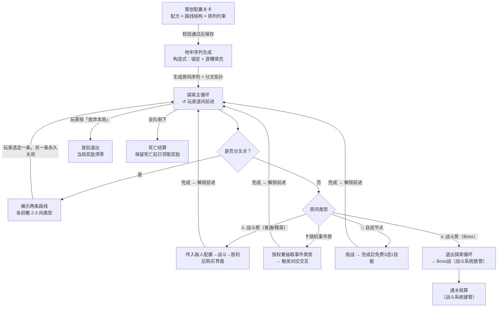

# 关卡设计

---

## 一、需求目的

- 建立局内 Build 积累节奏感：通过控制奖励节点（战斗房 / 精英房 / 自选节点）在序列中的分布，保证玩家始终感受到下一次强化机会临近
- 防止节奏断裂和单调：通过排列约束控制同类房间的连续数量和事件分布，避免出现大段战斗堆积或奖励集中
- 提供有意义的路线决策：在关键分叉点设置差异化风险/回报的两条路线，配合前瞻信息，让选路成为真实的策略取舍而非被迫默认

---

## 二、需求概述

关卡设计系统为每次进入地牢生成一条由不同类型房间组成的探索序列，玩家逐间前进至 Boss 房结束本局。地牢以**线性主体**推进，在关键节点分出**两条短路**供玩家选择，两路差异化风险/回报、等长、选后不可回头、末端汇合回主线。策划通过**房间配方**（各类型数量）、**路线结构**（分叉点位置与各路构成）和**排列约束**（节奏控制）三个维度配置每关；系统按构造式生成保证每局有差异但节奏可控。

---

## 三、功能概述

### 3.1 流程图

### 3.2 探索主循环

玩家从进入地牢后依序经历各房间，每间完成后前进；遇分叉点时选路（见 3.4），循环直至 Boss 房通关、全队倒下或主动退出。

> **结构说明**：单局地牢 = 一串房间（以"间"为单位）推进到 Boss 房为一关，无嵌套楼层；地牢深度通过不同关卡配置（更长序列、更强敌人配置）体现，不在单局内嵌套多层。

**操作流程**

1. 局外大厅按「进入地牢」→ 系统读取关卡配置，执行地牢序列生成，自动进入第一间
2. 进入房间 → 按房间类型触发对应交互（见 3.3）
3. **房间完成判定**（各类型不同）：战斗房 = 战斗胜利且结算界面关闭；事件房 = 事件交互结算完成；自选节点 = 选定技能 → 满足即解锁「前进」
4. 若下一步是分叉点 → 进入选路流程（见 3.4）；否则展示下一间类型图标，玩家点「前进」进入下一间
5. 重复 2–4，直到触发任一出口：Boss 房通关 / 全队宠物倒下 / 玩家主动退出

**规则/边界**

- 若玩家按「放弃本局」（任意时刻可触发）→ 弹出确认弹窗；确认后当局奖励清零，返回大厅；取消则继续
- 若全队宠物倒下 → 跳过当前奖励交互，保留死亡前已领取奖励，返回大厅展示死亡结算
- 若进入 Boss 房 → 退出探索循环，将最终 Build 传递给战斗系统

---

### 3.3 房间类型

各类型房间在玩家进入时触发对应行为；战斗类委托战斗系统接管，本系统负责战斗结束后的奖励流程。

#### ⚔️ 战斗房（含普通 / 精英 / Boss 子类型）

进入自动触发战斗，战斗系统返回胜负，胜利后按子类型结算。三个子类型**房间逻辑一致**——都是"进入 → 传入敌人配置 → 战斗系统返回胜/负 → 胜利后结算"——仅敌人配置、结算形式和是否为终点不同，用**子类型标识**区分。下文 3.4 / 3.5 的配方与路线语境中，"战斗房"指普通子类型，"精英房""Boss 房"指对应子类型。

**操作流程**

1. 进入 → 传入战斗系统：本房间的**敌人配置 ID**（结构与刷怪逻辑见《敌人配置与波次设计》）→ 战斗系统执行战斗 → 返回胜利 / 失败
2. 若战斗中离线 → 重连后从当前战斗起点重新开始，已获得奖励保留
3. **胜利** → 按子类型结算（见子类型表）→ 结算界面关闭后解锁「前进」
4. 若结算界面（购买 / 通关）时离线 → 重连后恢复对应界面，结算完成前不允许前进
5. **失败**（全队宠物倒下）→ 进入死亡结算，跳过结算界面
6. **完成判定**：战斗系统返回「胜利」且结算界面关闭 → 本房间完成；Boss 子类型通关结算完成 → 本局结束

**子类型**

| 子类型 | 敌人配置 | 胜利后结算 | 是否终点 |
|---|---|---|---|
| 普通 | 普通敌人配置 | 货币购买界面（默认 3 选） | 否 |
| 精英 | 精英敌人配置 | 高品质货币购买界面（默认 4 选） | 否 |
| Boss | Boss 配置 + 最终 Build | 通关结算（战斗系统接管），完成后返回大厅 | 是：进入即退出探索循环 |

**配置项**

| 配置项 | 生效范围 | 默认值 | 可配置范围 | 说明 |
|---|---|---|---|---|
| 子类型 | 实例 | 普通 | 普通 / 精英 / Boss | 房间子类型标识 |
| 敌人配置 ID | 实例 | 按子类型默认 | 任一敌人配置 ID | 见《敌人配置与波次设计》 |
| 购买池引用 ID | 实例 | 普通=标准池 / 精英=高品质池 | 任一购买池 ID | Boss 子类型无购买界面 |
| 购买展示数量 | 实例 | 普通 3 / 精英 4 | 1–6 | Boss 子类型无 |

> 购买界面的购买 / 刷新 / 关闭逻辑见《商店系统设计》——与事件房商店**共用底层购买系统**（货币 / 商品池 / 无放回抽取 / 结算），战斗房只是其"战斗奖励"场景配置。

**规则/边界**

- 完成判定与胜负标准的精确定义见《敌人配置与波次设计》（胜利 = 清空所有波次，失败 = 全队宠物倒下）
- 若货币不足 → 对应购买选项灰化，不阻断「跳过」和其余选项
- 若购买池物品不足展示数量 → 展示全部可用物品（兜底）
- Boss 子类型：进入即退出探索循环并传入最终 Build；通关结算离线 → 重连后恢复结算界面，结算发放完成前本局不计结束（发奖失败重试、补发队列等技术兜底属开发实现范畴，见开发文档）
- Boss 战中「放弃本局」仍可用，触发提前退出流程（当局奖励清零）

---

#### ❓ 随机事件房

无固定战斗，作为"母房型"——进入时系统按权重抽取一类事件，事件类型决定交互结构。事件房承载本作"遇宠"惊喜和风险抉择，是节奏调节和题材表达节点。

**总流程**

1. 进入 → 从当前层级可用的事件类型中，按权重比例随机抽取 1 类（Weight Proportional Random）
2. 按抽中的事件类型走对应的独立操作流程（见下方"各类事件操作流程"）
3. 玩家完成该类交互 → 解锁「前进」

**事件类型**（概览）

| 事件类 | 触发交互 | 有无选择 | 代价 | 结算 / 归属 |
|---|---|---|---|---|
| 遇宠（题材主打） | 遇到一只可捕宠物 | 有（捕捉 / 战斗 / 放走） | 消耗捕获资源，或需先打至虚弱 | 传入**捉宠系统**处理捕捉，返回成功入仓 / 失败转战斗或逃脱 |
| 风险抉择 | 展示赌博 / 献祭场景 | 有（多选项） | 失 HP / 失资源 / 加负面 | 多分支互斥结局；可做"再赌一次、风险递增" |
| 即时增益 | 直接给予奖励 | 无 | 无 | 直接结算（回血 / 材料 / 临时 Buff），作低风险调节器 |
| 商店交易 | 展示商店界面 | 有（买 / 不买 / 刷新） | 花货币 | 委托**《商店系统设计》**：商品池、购买、刷新、关闭逻辑见该文档（"主动消费"场景配置） |
| 养成抉择 | 展示宠物成长 / 解锁选择 | 有 | 视分支 | 影响宠物成长线，具体效果委托养成系统 |

**各类事件操作流程**（每类交互结构不同，独立定义）

*遇宠*

1. 抽中遇宠 → 展示一只可捕宠物，提供「捕捉 / 战斗 / 放走」选项
2. 选「捕捉」→ 委托捉宠系统（传入：宠物 ID + 当前捕获资源；返回：成功入仓 / 失败）→ 成功则宠物入仓，失败转入战斗或逃脱
3. 选「战斗」→ 转入战斗（打至虚弱后可再尝试捕捉）；选「放走」→ 直接解锁前进
4. 异常：捉宠系统未就绪 → 本类降权或兜底即时增益（见规则/边界）

*风险抉择*

1. 抽中风险抉择 → 展示赌博 / 献祭场景，列出多个选项（各标注代价与潜在回报）
2. 玩家选一项 → 按该选项结算（失 HP / 失资源 / 加负面，换取对应回报）
3. 部分事件支持「再赌一次」（风险递增）→ 玩家可继续或收手
4. 结算完成 → 解锁前进

*即时增益*

1. 抽中即时增益 → 直接展示奖励结果卡（回血 / 材料 / 临时 Buff），无选择
2. 玩家点「确认」→ 奖励入账 → 解锁前进

*商店交易*

1. 抽中商店 → 委托商店系统（传入：事件房商店场景配置；返回：购买结果），展示商店界面
2. 购买 / 刷新 / 离开逻辑见《商店系统设计》
3. 玩家离开商店 → 解锁前进
4. 异常：商店系统未就绪 → 本类不启用（权重置 0）

*养成抉择*

1. 抽中养成抉择 → 展示宠物成长 / 解锁选择，列出多个分支
2. 玩家选一项 → 委托养成系统（传入：选择项；返回：成长结果）→ 应用效果
3. 结算完成 → 解锁前进
4. 异常：养成系统未定稿，接口字段待定（见待确认）

**配置项**

| 配置项 | 生效范围 | 默认值 | 说明 |
|---|---|---|---|
| 事件类型权重表 | 实例 | — | 每类事件的基础权重（≥0，0=不启用）；遇宠类建议最高权重 |
| 自适应保底 | 全局 | 开启 | 某类久未触发则权重递增，触发后重置回基础值 |
| 适用层级 | 实例 | 全部楼层 | 该权重表作用范围：全部楼层 / 指定楼层区间 |

**规则/边界**

- 若抽中类型无可用内容条目（配置缺失或委托系统未就绪）→ 降权重抽，仍无则兜底即时增益
- 若遇宠类触发但队伍和仓库均已满 → 该类降权或本次跳过，避免无效遇宠
- 不连续两次抽中商店交易类（上一间为商店则本次该类权重置 0）
- 权重为 0 的类型不计入抽取
- 若事件交互过程中离线（选择界面 / 商店界面）→ 重连后恢复当前事件状态，结算完成前不解锁「前进」
- 若遇宠事件委托捉宠系统期间离线 → 由捉宠系统处理重连，返回捕捉结果后本系统据此结算

> 各事件类的**具体内容条目**（遇宠的宠物池、风险抉择的事件文案、养成抉择的分支）由对应系统或内容团队交付；本系统只定义事件类型的触发框架和交互结构。

---

#### 🎁 自选节点

进入自动触发挑战，完成后免费 3 选 1 技能（不消耗货币）。

**操作流程**

1. 进入 → 传入战斗系统：自选挑战配置 → 返回完成 / 失败
2. 若挑战中离线 → 重连后从挑战起点重新开始，已获得奖励保留
3. 完成 → 从当前局可用技能列表过滤已持有技能，均匀随机无放回抽取 3 个
4. 展示免费 3 选 1 界面；玩家选择 1 项 → 技能加入持有列表 → 解锁「前进」
5. 若 3 选 1 选择界面时离线 → 重连后恢复选择界面，选择完成前不允许前进
6. 失败（全队宠物倒下）→ 进入死亡结算，不展示选择界面

**配置项**

| 配置项 | 生效范围 | 默认值 | 可配置范围 | 说明 |
|---|---|---|---|---|
| 展示选项数量 | 实例 | 3 | 1–5 | 支持配置 |
| 排除已持有技能 | 全局 | 开启 | 开启 / 关闭 | 支持配置 |

**规则/边界**

- 若过滤后可选技能不足展示数量，展示全部可选技能（不填充重复项）

---

### 3.4 路线结构与选路

地牢以线性主体推进，在关键节点分出两条等长短路供玩家选择。两路通过房间构成差异化风险/回报，玩家凭前瞻信息做取舍，选定后另一条永久关闭，短路末端汇合回主线。这是"提供有意义路线决策"这一需求目的的落地模块。

**操作流程**

1. 玩家在主线推进至分叉点 → 系统展示两条路线入口，每条标注**前瞻信息**：该路线未来 2–3 间的房间类型图标（不剧透更远）
2. 玩家点击一条路线 → 进入该路第一间，另一条路线永久关闭
3. 沿所选短路逐间前进，每间正常触发房间事件
4. 短路末端 → 两路汇合回主线同一节点，继续主线推进直至下一分叉点或 Boss

**路线类型**（策划给每条分叉路指定一种，通过房间构成体现风险/回报取向）

| 路线类型 | 房间构成倾向 | 风险/回报定位 |
|---|---|---|
| 安全线 | 战斗房为主 | 低风险，稳定基础收益 |
| 精英线 | 含精英房 | 高风险，高品质购买回报 |
| 事件线 | 含随机事件房 | 不确定收益，承载遇宠机会 |
| Build 线 | 含自选节点 | 确定性技能强化 |
| 混合线 | 多类型组合 | 均衡 |

**路线配对约束**

随机生成或策划配置两路时必须满足以下约束，防止出现"一边明显更优"使选路失效。

每种路线类型的关键房间规则：

| 路线类型 | 必含 | 禁止包含 |
|---|---|---|
| 安全线 | 仅战斗房 | 精英房 / 自选节点 |
| 精英线 | ≥1 精英房 | — |
| 事件线 | ≥1 随机事件房 | — |
| Build 线 | ≥1 自选节点 | 精英房 |
| 混合线 | ≥2 种房间类型 | 单一类型独占 |

配对禁止清单（违反则配置保存时阻断）：
- 两路类型必须不同
- 至多一路为安全线（禁止两路都是纯安全线，否则两路无差异、选路失效）；安全线的吸引点是"低风险"本身，不要求奖励吸引点
- 禁止"严格占优"配对：一路在风险不高于另一路的前提下，覆盖其全部奖励点
- 含精英房的高风险路，其购买池品质必须 ≥ 同分叉的低风险路，禁止"高风险低回报"

**配置项**

| 配置项 | 生效范围 | 默认值 | 可配置范围 | 说明 |
|---|---|---|---|---|
| 分叉点数量 | 实例 | 1 | 0–2（每关） | 支持配置 |
| 分叉点位置 | 实例 | 主线中段 | 主线第 N 间后 | 支持配置 |
| 各分叉路长度 | 实例 | 3 | 2–4 间 | 两路必须等长 |
| 两路路线类型 | 实例 | 安全线 / 精英线 | 从路线类型库各选一种 | 两路类型必须不同且通过配对约束 |
| 前瞻深度 | 实例 | 2 | 2–3 间 | 玩家可预见的未来房间数 |
| 随机分叉 | 实例 | 关闭 | 开启 / 关闭 | 开启时系统随机选分叉位置和两路类型 |

**规则/边界**

- 若两条分叉路长度不等 → 配置保存时阻断（保证选路是构成取舍而非长短取舍）
- 若两路指定了相同的路线类型 → 配置保存时阻断（分叉必须有差异）
- 若两路配对违反「路线配对约束」 → 配置保存时阻断并提示具体冲突
- 若玩家选定一条路线 → 另一条永久关闭，本局不可回头、不可横向切换
- 分叉路末端必须汇合回主线，不得各自通向不同 Boss
- 若开启随机分叉 → 系统在主线候选位置随机选分叉点，从路线类型库随机抽取两个类型分配给两路；抽取结果必须通过「路线配对约束」校验，未通过则重抽，保证两路形成有意义取舍而非一边占优

---

### 3.5 地牢生成规则

策划在关卡编辑器中配置关卡参数；系统在**配置保存时**校验配方与约束能否生成合法序列（保证有解），玩家进入地牢时执行**构造式生成**，输出满足全部约束的房间序列和分叉拓扑。配方与约束的冲突在保存阶段暴露，不留到运行时。

#### 配置输入

| 参数 | 内容 |
|---|---|
| 房间配方 | 各类型房间数量（战斗 6 / 精英 1 / 事件 2 / 自选 1 / Boss 1，均支持配置） |
| 路线结构 | 分叉点配置（见 3.4） |
| 排列约束 | 下方五类约束的开关与阈值 |

#### 合法序列约束

生成结果必须满足以下约束，违反即非法。约束以"禁止条件"定义——明确哪些情况不允许出现：

| 约束 | 禁止条件（不允许出现） | 默认 | 可关闭 |
|---|---|---|---|
| 连续上限 | 任一类型连续出现 > 2 间 | 开启 | 是 |
| 早期保护 | 精英房出现在段前 40% 位置内 | 开启，阈值 40% | 是 |
| 事件分布 | 事件房 ≥ 2 间时全部集中在前半段或后半段（须前后各 ≥ 1） | 开启 | 是 |
| Boss 锚定 | Boss 房出现在非段末位 | 开启 | 否 |
| 自选位置 | Boss 前 N 间（默认 2）内没有自选节点 | 开启，N=2 | 是 |

#### 配置保存校验

保存时执行两层校验，任一不通过即阻断保存并提示具体冲突：

**1. 基础校验**
- Boss 房数量 ≠ 1 → 阻断
- 整关自选节点合计 = 0 → 阻断
- 分叉两路长度不等 / 类型相同 / 配对违反路线配对约束（见 3.4）→ 阻断

**2. 可满足性校验**（保证"配方 + 启用约束"存在合法排列，避免运行时无解）

对每条启用的约束推导配方可行域，任一越界即冲突：

| 约束 | 配方可行域（不满足则冲突） |
|---|---|
| 连续上限 | 任一类型数量 ≤ 2 ×（其余类型房间总数 + 1） |
| 早期保护 | 精英房数量 ≤ 段后 60% 的槽位数 |
| 事件分布 | 启用时事件房数量 ≥ 2，且段长足以前后各容纳 1 间 |
| 自选位置 | 自选节点数量 ≥ 1，且 Boss 前 N 间有非锚定可用槽 |

> 可满足性校验把配方与约束的冲突在策划保存配置时暴露（例：12 间的段放 9 个战斗房，连续上限必然被违反 → 保存即报错），而不是等玩家进关时才发现。

#### 生成过程（构造式）

配置已通过可满足性校验、保证有解。玩家进入地牢时按以下步骤构造序列：

1. **建立槽位序列**：按主线长度 + 分叉结构建立空槽位（分叉段为两条并列子序列）
2. **锚定固定位**：Boss 房 → 主线末位；自选节点 → Boss 前保护区（默认前 2 间）预留至少 1 个槽
3. **逐槽填充**：对每个空槽，从配方剩余房间按加权随机选类型，放入前用约束过滤候选，仅保留不违反任何禁止条件的类型
4. **局部回溯**：若某槽过滤后无合法候选（贪心走入局部死路）→ 回溯到上一槽改选其他类型；因配置已保证有解，回溯必然找到合法序列。**运行时不允许放置违反约束的房间兜底**
5. **分叉段处理**：两条分叉短路各自独立执行步骤 1–4，保证等长；填充完成后在分叉点接入，末端汇合回主线
6. **纯随机模式**（仅用于测试，关闭所有约束）：逐槽填充跳过约束过滤，直接加权随机放置
7. **输出**：房间序列 + 分叉拓扑（含分叉点位置和各路构成），传递给探索主循环

> **为什么这样设计**：约束以"禁止条件"声明，可满足性在配置保存时校验保证有解，运行时构造保证满足全部约束、不破规则（局部死路用回溯而非塞房间）。配方与约束的冲突在策划侧暴露，运行时行为确定可复现。参考 Slay the Spire 类肉鸽"拓扑构造 + 类型逐节点约束"的成熟做法。

---

## 四、待确认

| 事项 | 待定原因 |
|---|---|
| 敌人配置 ID 结构、刷怪逻辑、胜负判定 | 见《敌人配置与波次设计》（本批次新建） |
| 购买池构成、定价、刷新、关闭逻辑 | 见《商店系统设计》（本批次新建） |
| 遇宠事件与捉宠系统的接口细节（传入/返回字段） | 捉宠系统未定稿 |
| 养成抉择类事件的分支效果 | 养成系统未定稿 |
| 各事件类型权重默认值 | 待体验测试验证遇宠/风险/增益的频率配比 |
| 后期关卡配方与分叉点数量 | 待关卡数值测试验证 |
| 排列约束的默认开启建议 | 待体验测试验证 |
