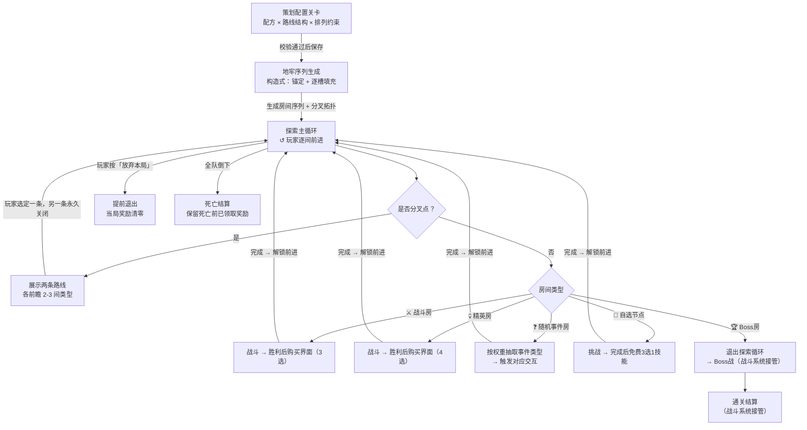

# 关卡设计

---

## 一、需求目的

- 建立局内 Build 积累节奏感：通过控制奖励节点（战斗房 / 精英房 / 自选节点）在序列中的分布，保证玩家始终感受到下一次强化机会临近
- 防止节奏断裂和单调：通过排列约束控制同类房间的连续数量和事件分布，避免出现大段战斗堆积或奖励集中
- 提供有意义的路线决策：在关键分叉点设置差异化风险/回报的两条路线，配合前瞻信息，让选路成为真实的策略取舍而非被迫默认

---

## 二、需求概述

关卡设计系统为每次进入地牢生成一条由不同类型房间组成的探索序列，玩家逐间前进至 Boss 房结束本局。地牢以**线性主体**推进，在关键节点分出**两条短路**供玩家选择，两路差异化风险/回报、等长、选后不可回头、末端汇合回主线。策划通过**房间配方**（各类型数量）、**路线结构**（分叉点位置与各路构成）和**排列约束**（节奏控制）三个维度配置每关；系统按构造式生成保证每局有差异但节奏可控。

---

## 三、功能概述

### 3.1 流程图

### 3.2 探索主循环

玩家从进入地牢后依序经历各房间，每间完成事件后前进；遇分叉点时选路（见 3.4），循环直至进入 Boss 房、全队倒下或主动退出。

**操作流程**

1. 局外大厅按「进入地牢」→ 系统读取关卡配置，执行地牢序列生成，自动进入第一间
2. 进入房间 → 按房间类型触发对应事件（见 3.3）→ 事件完成后解锁「前进」
3. 若下一步是分叉点 → 进入选路流程（见 3.4）；否则展示下一间类型图标，玩家点「前进」
4. 重复 2–3，直到触发以下任一出口：进入 Boss 房 / 全队宠物倒下 / 玩家主动退出

**规则/边界**

- 若玩家按「放弃本局」（任意时刻可触发）→ 弹出确认弹窗；确认后当局奖励清零，返回大厅；取消则继续
- 若全队宠物倒下 → 跳过当前奖励交互，保留死亡前已领取奖励，返回大厅展示死亡结算
- 若进入 Boss 房 → 退出探索循环，将最终 Build 传递给战斗系统

---

### 3.3 房间类型

各类型房间在玩家进入时触发对应行为；战斗类委托战斗系统接管，本系统负责战斗结束后的奖励流程。

#### ⚔️ 战斗房

进入自动触发战斗，胜利后展示付费购买界面（3 选项）。

**操作流程**

1. 进入 → 传入战斗系统：敌人配置 → 返回胜利 / 失败
2. 若战斗中离线 → 重连后从当前战斗起点重新开始，已获得奖励保留
3. 胜利 → 从购买池均匀随机无放回抽取 3 个物品，展示货币购买界面
4. 玩家点击物品消耗货币购买，或点「跳过」→ 解锁「前进」
5. 若购买界面时离线 → 重连后恢复购买界面，购买完成前不允许前进
6. 失败（全队宠物倒下）→ 进入死亡结算，跳过购买界面

**配置项**

| 配置项 | 默认值 | 可配置范围 | 说明 |
|---|---|---|---|
| 购买池引用 ID | 战斗房标准池 | 任一购买池 ID | 池内可展示物品数量须 ≥ 展示数量 |
| 单次展示数量 | 3 | 1–6 | 支持配置 |

**规则/边界**

- 若货币不足，对应选项灰化，不阻断「跳过」和其余选项
- 若池内物品不足展示数量，展示全部可用物品（兜底）

---

#### 💀 精英房

高难度战斗，胜利后展示高品质购买界面（4 选项）。

**操作流程**

1. 进入 → 传入战斗系统：精英敌人配置 → 返回胜利 / 失败
2. 若战斗中离线 → 重连后从当前战斗起点重新开始，已获得奖励保留
3. 胜利 → 从精英高品质购买池均匀随机无放回抽取 4 个物品，展示货币购买界面
4. 玩家点击物品消耗货币购买，或点「跳过」→ 解锁「前进」
5. 若购买界面时离线 → 重连后恢复购买界面，购买完成前不允许前进
6. 失败（全队宠物倒下）→ 进入死亡结算，跳过购买界面

**配置项**

| 配置项 | 默认值 | 可配置范围 | 说明 |
|---|---|---|---|
| 购买池引用 ID | 精英房高品质池 | 任一购买池 ID | 池内可展示物品数量须 ≥ 展示数量 |
| 单次展示数量 | 4 | 1–6 | 支持配置 |

**规则/边界**

- 若货币不足，对应选项灰化，不阻断「跳过」和其余选项
- 若池内物品不足展示数量，展示全部可用物品（兜底）

---

#### ❓ 随机事件房

无固定战斗，作为"母房型"——进入时系统按权重抽取一类事件，事件类型决定交互结构。事件房承载本作"遇宠"惊喜和风险抉择，是节奏调节和题材表达节点。

**操作流程**

1. 进入 → 从当前层级可用的事件类型中，按权重比例随机抽取 1 类（Weight Proportional Random）
2. 按抽中的事件类型展示对应交互（见下方事件类型表）
3. 玩家完成交互（有选择的做出选择，无选择的直接结算）→ 解锁「前进」

**事件类型**

| 事件类 | 触发交互 | 有无选择 | 代价 | 结算 / 归属 |
|---|---|---|---|---|
| 遇宠（题材主打） | 遇到一只可捕宠物 | 有（捕捉 / 战斗 / 放走） | 消耗捕获资源，或需先打至虚弱 | 传入**捉宠系统**处理捕捉，返回成功入仓 / 失败转战斗或逃脱 |
| 风险抉择 | 展示赌博 / 献祭场景 | 有（多选项） | 失 HP / 失资源 / 加负面 | 多分支互斥结局；可做"再赌一次、风险递增" |
| 即时增益 | 直接给予奖励 | 无 | 无 | 直接结算（回血 / 材料 / 临时 Buff），作低风险调节器 |
| 商店交易 | 展示小型购买界面 | 有（买 / 不买） | 花货币 | 若项目设独立商店系统则委托之；否则本类不启用 |
| 养成抉择 | 展示宠物成长 / 解锁选择 | 有 | 视分支 | 影响宠物成长线，具体效果委托养成系统 |

**配置项**

| 配置项 | 默认值 | 说明 |
|---|---|---|
| 事件类型权重表 | — | 每类事件的基础权重（≥0，0=不启用）；遇宠类建议最高权重 |
| 自适应保底 | 开启 | 某类久未触发则权重递增，触发后重置回基础值 |
| 适用层级 | 全局 | 全局 / 指定楼层区间 |

**规则/边界**

- 若抽中类型无可用内容条目（配置缺失或委托系统未就绪）→ 降权重抽，仍无则兜底即时增益，记录日志
- 若遇宠类触发但队伍和仓库均已满 → 该类降权或本次跳过，避免无效遇宠
- 不连续两次抽中商店交易类（上一间为商店则本次该类权重置 0）
- 权重为 0 的类型不计入抽取
- 若事件交互过程中离线（选择界面 / 商店界面）→ 重连后恢复当前事件状态，结算完成前不解锁「前进」
- 若遇宠事件委托捉宠系统期间离线 → 由捉宠系统处理重连，返回捕捉结果后本系统据此结算，保证不重复发奖

> 各事件类的**具体内容条目**（遇宠的宠物池、风险抉择的事件文案、养成抉择的分支）由对应系统或内容团队交付；本系统只定义事件类型的触发框架和交互结构。

---

#### 🎁 自选节点

进入自动触发挑战，完成后免费 3 选 1 技能（不消耗货币）。

**操作流程**

1. 进入 → 传入战斗系统：自选挑战配置 → 返回完成 / 失败
2. 若挑战中离线 → 重连后从挑战起点重新开始，已获得奖励保留
3. 完成 → 从当前局可用技能列表过滤已持有技能，均匀随机无放回抽取 3 个
4. 展示免费 3 选 1 界面；玩家选择 1 项 → 技能加入持有列表 → 解锁「前进」
5. 若 3 选 1 选择界面时离线 → 重连后恢复选择界面，选择完成前不允许前进
6. 失败（全队宠物倒下）→ 进入死亡结算，不展示选择界面

**配置项**

| 配置项 | 默认值 | 可配置范围 | 说明 |
|---|---|---|---|
| 展示选项数量 | 3 | 1–5 | 支持配置 |
| 排除已持有技能 | 开启 | 开启 / 关闭 | 支持配置 |

**规则/边界**

- 若过滤后可选技能不足展示数量，展示全部可选技能（不填充重复项）

---

#### 🏆 Boss 房

探索循环终点，进入后立即将最终 Build 传递给战斗系统，无玩家确认步骤。

**操作流程**

1. 进入 → 探索循环退出 → 传入战斗系统：Boss 配置 + 最终 Build
2. 通关 → 战斗系统负责结算；若结算时离线 → 重连后恢复结算界面，结算发放完成前本局不计结束
3. 若通关结算发奖失败 → 重试 1 次；仍失败则标记待补发，下次登录优先发放，记录日志
4. 失败（全队宠物倒下）→ 保留死亡前奖励，返回大厅

**规则/边界**

- Boss 战中「放弃本局」仍可用，触发提前退出流程（当局奖励清零）

---

### 3.4 路线结构与选路

地牢以线性主体推进，在关键节点分出两条等长短路供玩家选择。两路通过房间构成差异化风险/回报，玩家凭前瞻信息做取舍，选定后另一条永久关闭，短路末端汇合回主线。这是"提供有意义路线决策"这一需求目的的落地模块。

**操作流程**

1. 玩家在主线推进至分叉点 → 系统展示两条路线入口，每条标注**前瞻信息**：该路线未来 2–3 间的房间类型图标（不剧透更远）
2. 玩家点击一条路线 → 进入该路第一间，另一条路线永久关闭
3. 沿所选短路逐间前进，每间正常触发房间事件
4. 短路末端 → 两路汇合回主线同一节点，继续主线推进直至下一分叉点或 Boss

**路线类型**（策划给每条分叉路指定一种，通过房间构成体现风险/回报取向）

| 路线类型 | 房间构成倾向 | 风险/回报定位 |
|---|---|---|
| 安全线 | 战斗房为主 | 低风险，稳定基础收益 |
| 精英线 | 含精英房 | 高风险，高品质购买回报 |
| 事件线 | 含随机事件房 | 不确定收益，承载遇宠机会 |
| Build 线 | 含自选节点 | 确定性技能强化 |
| 混合线 | 多类型组合 | 均衡 |

**配置项**

| 配置项 | 默认值 | 可配置范围 | 说明 |
|---|---|---|---|
| 分叉点数量 | 1 | 0–2（每关） | 支持配置 |
| 分叉点位置 | 主线中段 | 主线第 N 间后 | 支持配置 |
| 各分叉路长度 | 3 | 2–4 间 | 两路必须等长 |
| 两路路线类型 | 安全线 / 精英线 | 从路线类型库各选一种 | 两路类型必须不同 |
| 前瞻深度 | 2 | 2–3 间 | 玩家可预见的未来房间数 |
| 随机分叉 | 关闭 | 开启 / 关闭 | 开启时系统随机选分叉位置和两路类型 |

**规则/边界**

- 若两条分叉路长度不等 → 配置保存时阻断（保证选路是构成取舍而非长短取舍）
- 若两路指定了相同的路线类型 → 配置保存时阻断（分叉必须有差异）
- 若玩家选定一条路线 → 另一条永久关闭，本局不可回头、不可横向切换
- 分叉路末端必须汇合回主线，不得各自通向不同 Boss
- 若开启随机分叉 → 系统在主线候选位置随机选分叉点，从路线类型库随机抽取两个不同类型分配给两路，保证差异化

---

### 3.5 地牢生成规则

策划在关卡编辑器中配置关卡参数；玩家每次进入地牢时系统执行**构造式生成**——按规则逐槽放置房间，单次通过无需全局重试，输出一条满足节奏约束的房间序列和分叉拓扑。

#### 配置输入

| 参数 | 内容 | 校验 |
|---|---|---|
| 房间配方 | 各类型房间数量（战斗 6 / 精英 1 / 事件 2 / 自选 1 / Boss 1，均支持配置） | Boss 恰好 1；自选合计 ≥ 1 |
| 路线结构 | 分叉点配置（见 3.4） | 分叉两路等长且类型不同 |
| 排列约束 | 五类节奏约束开关（见下） | — |

**配置保存校验**：Boss ≠ 1 / 自选合计 = 0 / 分叉两路不等长 → 阻断保存并提示修正。

#### 生成过程（构造式）

玩家进入地牢时触发，按以下步骤逐槽构造序列，单次通过：

1. **建立槽位序列**：按主线长度 + 分叉结构建立空槽位序列（分叉段为两条并列子序列）
2. **锚定固定位**（先放不参与随机的房间）：
   - Boss 房 → 主线末位
   - 自选节点 → Boss 前保护区（默认前 2 间内）预留至少 1 个槽
3. **逐槽填充**（对每个剩余空槽，从配方剩余房间中按加权随机选类型，放入前用**局部约束过滤候选**）：

   | 约束 | 填充时的过滤规则 |
   |---|---|
   | 连续上限 | 若当前槽前 2 间已是同类型，候选池排除该类型 |
   | 早期保护 | 精英房仅当当前槽位置 ≥ 段总长 N%（默认 40%）时才进入候选 |
   | 事件分布 | 事件房按"前半段 / 后半段各分配名额"放置，超额则从候选排除 |
   | Boss 锚定 | Boss 已在步骤 2 锚定末位，不参与逐槽填充 |
   | 自选位置 | 自选保护槽已在步骤 2 预留，普通槽正常填充 |

4. **分叉段处理**：两条分叉短路各自独立执行步骤 1–3，保证等长；填充完成后在分叉点接入，末端汇合回主线
5. **候选排空兜底**：若某槽经约束过滤后无合法候选类型（配方与约束冲突）→ 放入剩余数量最多的类型，记录日志（此类冲突应在配置保存校验阶段尽量提前拦截）
6. **纯随机模式**（仅用于测试，关闭所有约束）：逐槽填充时跳过约束过滤，直接加权随机放置
7. **输出**：房间序列 + 分叉拓扑（含分叉点位置和各路构成），传递给探索主循环

> **为什么用构造式而非"随机打乱+全局检查+重试"**：逐槽放置时即时满足约束，单次通过，行为确定可预测、可复现，避免试错式重试在极端配方下退化或卡死。参考 Slay the Spire 类肉鸽的成熟生成做法（拓扑构造 + 类型逐节点局部约束）。

---

## 四、待确认

| 事项 | 待定原因 |
|---|---|
| 购买池具体选项设计（词条 / 临时技能 / 材料） | 战斗系统未定稿，奖励内容待对齐 |
| 货币掉落量与商品价格平衡 | 需数值测试后定 |
| 遇宠事件与捉宠系统的接口细节（传入/返回字段） | 捉宠系统未定稿 |
| 事件房是否启用商店交易类 | 取决于是否设独立商店系统 |
| 养成抉择类事件的分支效果 | 养成系统未定稿 |
| 各事件类型权重默认值 | 待体验测试验证遇宠/风险/增益的频率配比 |
| 后期关卡配方与分叉点数量 | 待关卡数值测试验证 |
| 排列约束的默认开启建议 | 待体验测试验证 |
