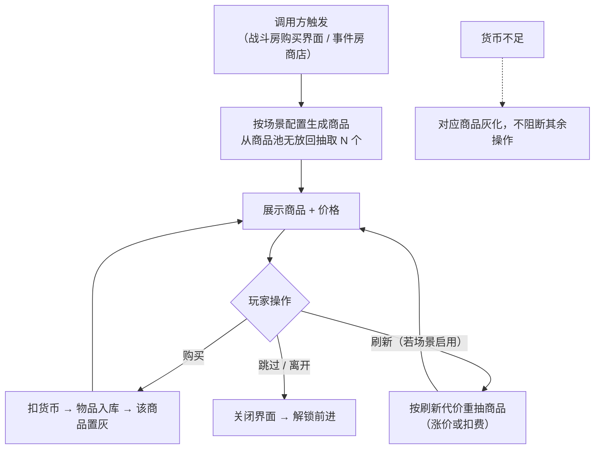

# 商店系统设计

> 本文档定义统一的"购买引擎"，被两个场景共用：《关卡设计》战斗房胜利后的**购买界面**（战斗奖励场景）和随机事件房的**商店事件**（主动消费场景）。两个场景共用底层引擎（货币 / 商品池 / 无放回抽取 / 结算），差异仅在场景配置。

---

## 一、需求目的

- 为局内消费提供统一底层机制，让"战斗奖励选择"和"主动消费商店"两个场景复用同一套购买引擎，避免重复造两套逻辑
- 用货币约束让每次购买有机会成本，推动玩家在"立即买"和"留货币等更优选项"之间权衡
- 通过商品池和定价配置，支撑 Build 构筑的资源取舍深度

---

## 二、需求概述

商店系统是一套统一的购买引擎：维护局内货币账户、商品池、无放回随机抽取和购买结算。两个调用场景——战斗房**购买界面**（战斗胜利后必给的奖励选择，3–4 选）和事件房**商店事件**（主动消费，可含刷新等服务）——共用这套引擎，差异由场景配置驱动（商品数、是否启用刷新、是否启用特殊服务），不写两套代码。被《关卡设计》战斗房和事件房调用。

---

## 三、功能概述

### 3.1 流程图

### 3.2 购买引擎（共用层）

两个场景共用的底层机制：货币账户、商品池、抽取、结算。只定义一次。

**操作流程**

1. 调用方传入场景配置（商品池 ID、展示数量、是否启用刷新、是否启用特殊服务）
2. 从商品池**均匀随机无放回**抽取指定数量商品
3. 展示商品和价格
4. 玩家购买 → 校验货币 → 扣费 → 物品入库 → 该商品置灰（不再可买）
5. 玩家跳过/离开 → 关闭界面，解锁前进

**配置项**

| 配置项 | 默认值 | 可配置范围 | 说明 |
|---|---|---|---|
| 商品池 ID | — | 任一商品池 | 见 3.4 商品池 |
| 展示数量 | 3 | 1–6 | 单次展示商品数 |
| 是否启用刷新 | 否 | 是 / 否 | 场景开关，事件房可开（见 3.5） |
| 是否启用特殊服务 | 否 | 是 / 否 | 场景开关，事件房可开（见 3.5） |
| 货币类型 | 局内货币 | 局内货币 | 出地牢清零，局内有效 |

**规则/边界**

- 若货币不足 → 对应商品灰化，不阻断「跳过」「刷新」和其余商品
- 若商品池可用商品不足展示数量 → 展示全部可用（兜底）
- 购买后商品置灰（保留视觉占位），不从列表消失
- 抽取为无放回，单次展示的商品互不重复

### 3.3 场景配置（差异层）

两个场景通过配置区分，不是两套逻辑。

| 场景 | 触发 | 商品数 | 刷新 | 特殊服务 |
|---|---|---|---|---|
| 战斗房购买界面 | 战斗胜利后自动 | 普通 3 / 精英 4 | 否 | 无 |
| 事件房商店 | 事件房抽中商店类 | 可配置（默认 4） | 可启用（见 3.5） | 可挂载移除/治疗等 |

两场景均为货币购买、可不买离开；差异在商品数和是否启用刷新/特殊服务。

**规则/边界**

- 战斗房购买界面定位"战斗奖励选择"：从奖励商品池抽取，玩家可买可跳过，无刷新和特殊服务
- 事件房商店定位"主动消费"：可启用刷新和特殊服务（如放生/洗练）
- 两场景调用同一购买引擎（3.2），仅配置不同

### 3.4 商品池

策划定义商品池，按稀有度抽取和定价。

**配置项**

| 配置项 | 默认值 | 可配置范围 | 说明 |
|---|---|---|---|
| 商品条目 | — | 商品 ID + 稀有度 + 基础价 | 由内容团队/对应系统提供 |
| 稀有度档 | 普通/稀有/史诗 | — | 决定抽取权重和定价 |
| 定价规则 | 按稀有度三档 | — | 可叠加进度微涨系数 |

**规则/边界**

- 价格按稀有度分档（普通 < 稀有 < 史诗），可随关卡进度微涨
- 商品具体内容（词条/临时技能/材料/宠物道具）由对应系统或内容团队交付，本文档定义池结构和抽取/定价机制

### 3.5 刷新与特殊服务（仅事件房商店）

事件房商店可启用的进阶功能。

**配置项**

| 配置项 | 默认值 | 可配置范围 | 说明 |
|---|---|---|---|
| 刷新方式 | 不启用 | 不启用 / 付费刷新 / 免费但涨价 | 推荐"免费但涨价"给爽感防滥用 |
| 刷新涨价系数 | 1.4 | ≥1 | 每刷新一次商品价格 × 系数 |
| 刷新次数上限 | 3 | 0–5 | 单次商店刷新上限 |
| 特殊服务 | 无 | 移除 / 治疗 / 放生 等 | 抓宠养成可类比"放生/洗练"作消费点 |

**规则/边界**

- 刷新方式若选"免费但涨价"→ 每刷新重抽全部商品，价格按系数累涨，达次数上限后刷新按钮置灰
- 特殊服务（如移除某持有项）单次商店限定使用次数，价格可随使用累涨
- 战斗房购买界面不启用本节功能

---

## 四、待确认

| 事项 | 待定原因 |
|---|---|
| 商品池具体内容条目（词条/技能/材料/道具） | 战斗系统与养成系统未定稿，内容待对齐 |
| 各稀有度定价数值与进度涨幅 | 待数值测试平衡 |
| 局内货币的掉落量与产出节奏 | 待经济数值测试 |
| 事件房商店是否启用刷新、用哪种刷新方式 | 待体验测试验证 |
| 特殊服务（放生/洗练）的具体效果 | 取决于捉宠/养成系统设计 |
| 战斗房购买界面与事件房商店的商品池是否独立 | 待内容规划确认 |
