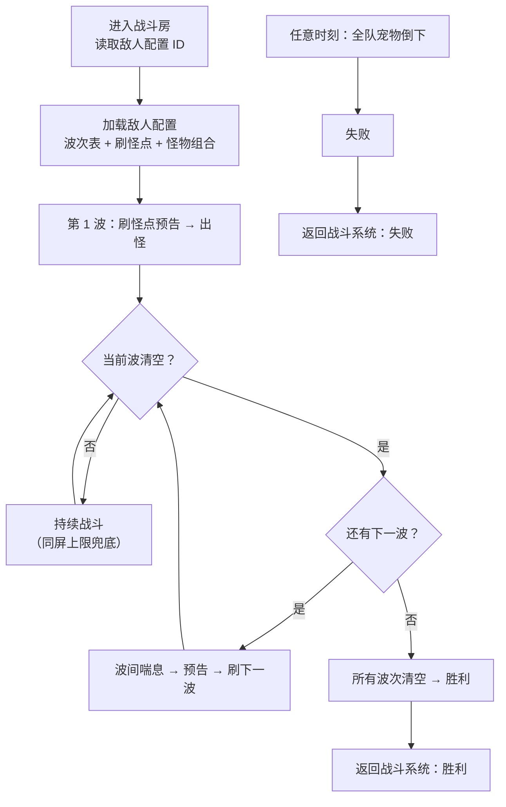

# 敌人配置与波次设计

> 被《关卡设计》战斗房（含普通/精英/Boss 子类型）按"敌人配置 ID"引用。怪物本身的属性/技能/AI 属《战斗系统设计》，本文档只定义"一场房间战斗如何配置敌人和刷怪节奏，以及胜负如何判定"。

---

## 一、需求目的

- 让关卡每场战斗有可配置的刷怪节奏和难度梯度，支撑"Build 积累节奏感"和即时战斗体验
- 明确战斗胜负判定标准，让关卡系统和战斗系统对"何时算通过一个战斗房"有一致、可判定的定义（避免现状中胜负条件不清晰）
- 用敌人配置参数区分普通/精英/Boss，三者复用同一套战斗与刷怪逻辑（呼应关卡战斗房的子类型合并）

---

## 二、需求概述

本文档定义一场房间战斗的敌人配置和刷怪机制：采用**清波制**——清完当前波刷下一波，全部波次清空即胜利；敌人从**预置刷怪点**按预告节奏刷出（非边缘随机包围）；胜利 = 清空所有波次，失败 = 全队宠物倒下。普通/精英/Boss 通过敌人配置参数区分，共用同一战斗逻辑。被《关卡设计》战斗房调用（传入敌人配置 ID，返回胜/负）。

---

## 三、功能概述

### 3.1 流程图

### 3.2 敌人配置

策划为每场战斗定义一份敌人配置，《关卡设计》战斗房按配置 ID 引用；子类型决定难度档与奖励档。

**操作流程**

1. 策划创建敌人配置：指定子类型、波次表、刷怪点集合、同屏上限，分配唯一配置 ID
2. 《关卡设计》战斗房按配置 ID 引用本配置
3. 玩家进入战斗房 → 战斗系统按 ID 加载配置 → 执行波次刷怪（见 3.3）

**配置项**

| 配置项 | 默认值 | 可配置范围 | 说明 |
|---|---|---|---|
| 配置 ID | — | 唯一字符串 | 关卡战斗房引用此 ID |
| 子类型 | 普通 | 普通 / 精英 / Boss | 与关卡战斗房子类型对应 |
| 波次表 | — | 1–N 波 | 见 3.3 |
| 刷怪点集合 | — | 房间预置点位列表 | 见 3.4 |
| 同屏存活上限 | 20 | 10–40 | 移动端性能兜底 |

**规则/边界**

- 普通/精英/Boss 共用同一战斗与刷怪逻辑，仅波次组合、怪物强度和数量不同
- 怪物的属性/技能/AI 见《战斗系统设计》，本配置只引用怪物 ID + 数量 + 刷怪点分配
- 接口边界：本文档接口 = 敌人配置 ID（输入）+ 胜/负（输出）；Boss 子类型场景下，关卡额外传入的"最终 Build"由战斗系统消费（用于 Boss 战玩家战力），不经本文档处理

### 3.3 波次机制

采用清波制：清空当前波的全部敌人后才刷下一波，全部波次清空即判胜。

**操作流程**

1. 加载波次表 → 进入第 1 波
2. 按本波的刷怪点分配和预告节奏刷出本波敌人
3. 玩家宠物队伍战斗，清空本波全部敌人
4. **波间喘息**（短暂安全间隔，期间不刷怪）→ 预告下一波 → 刷下一波
5. 重复 2–4，直到所有波次清空 → 返回胜利

**配置项**

| 配置项 | 默认值 | 可配置范围 | 说明 |
|---|---|---|---|
| 波数 | 2 | 1–5 | 单场战斗波次数（轻量局建议 2–3） |
| 单波怪物组合 | — | 怪物 ID + 数量 + 刷怪点分配 | 每波独立定义 |
| 波间喘息时长 | 1.5s | 0–3s | 清波到下一波的安全间隔 |
| 难度递增 | 关闭 | 开启 / 关闭 | 开启时后续波强度/数量递增 |

**规则/边界**

- 若同屏存活敌人达到上限 → 暂停刷出本波剩余敌人，待场上减少后补刷（防卡顿）
- 波间喘息期间不刷怪，给玩家技能冷却和宠物调位窗口；以此从机制上消解"留最后一只怪等冷却"的 exploit
- 精英子类型：波次组合含精英怪，强度高于普通；Boss 子类型：含 Boss 怪（多阶段战斗机制见《战斗系统设计》）

### 3.4 刷怪点与节奏

敌人从房间预置刷怪点按预告节奏刷出，不采用边缘随机包围（更可控、避免挫败组合）。

**操作流程**

1. 策划在房间布局中预置刷怪点（坐标 / 法阵位置）
2. 每次出怪前，在对应刷怪点亮**预告**（警示圈 / 传送门）
3. 预告时长后，在该点刷出敌人

**配置项**

| 配置项 | 默认值 | 可配置范围 | 说明 |
|---|---|---|---|
| 刷怪点 | — | 房间预置点位 | 策划手动布置，固定不随机 |
| 预告时长 | 1s | 0.5–2s | 预告亮起到出怪的提前量 |

**规则/边界**

- 每次出怪必须先预告，给玩家和宠物反应窗口（即时战公平性）
- 刷怪点固定，不随玩家位置动态包围

### 3.5 胜负判定

明确战斗胜负标准，以离散事件判定，返回给关卡战斗房。

**操作流程（判定流程）**

1. 战斗系统在战斗中实时检测战场状态
2. 当前波敌人全部清空 → 推进下一波（见 3.3）
3. 所有波次清空 → 判定胜利，向关卡战斗房返回「胜利」
4. 任意时刻全队宠物 HP 归零 → 判定失败，返回「失败」

**规则/边界**

- **胜利**：清空所有波次的全部敌人 → 返回「胜利」
- **失败**：全队宠物 HP 归零（全队倒下）→ 返回「失败」
- Boss 子类型：清空 Boss（含多阶段则全阶段结束，阶段机制见《战斗系统设计》）即通关
- 判定为离散事件（全清 / 全队倒下），弱网下不易误判；HP 归零的技术检测由《战斗系统开发规格》Frame Loop 负责，本文档定义判定语义
- 离线/重连的房间级状态恢复见《关卡设计》战斗房（本文档只定义判定语义，不持有房间生命周期）

---

## 四、待确认

| 事项 | 待定原因 |
|---|---|
| 各子类型具体波数、单波怪量、强度数值 | 待体验测试与数值平衡 |
| 怪物种类、技能、属性 | 见《战斗系统设计》怪物表，待补 |
| 同屏存活上限精确值 | 待微信小游戏性能测试 |
| Boss 多阶段的阶段划分与触发 | 取决于《战斗系统设计》Boss 机制 |
| 预告时长 / 波间喘息时长的手感 | 待即时战斗手感测试 |
| 难度递增的递增曲线 | 待数值测试 |
